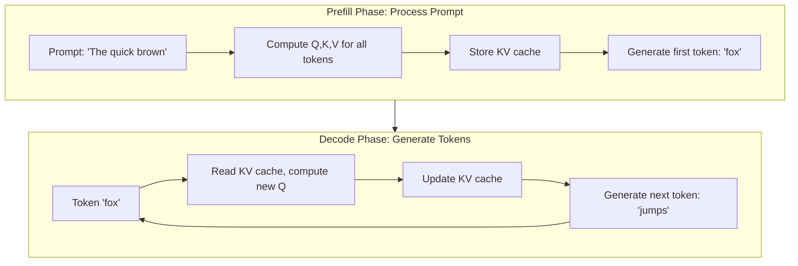
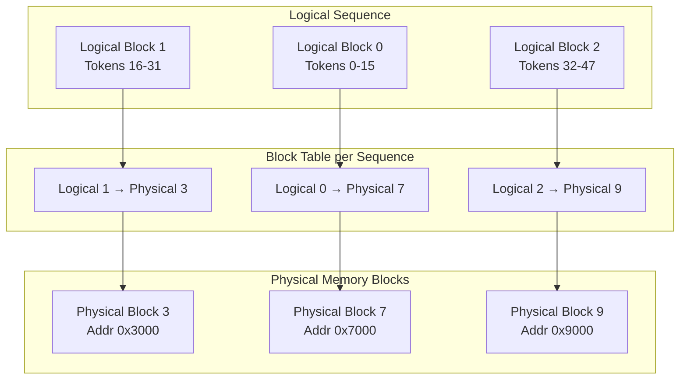

# nano-vLLM: Building a High-Performance LLM Inference Engine from First Principles

> **A Systems Engineering Approach to Understanding Production-Grade LLM Serving**

[Full Documentation](https://www.notion.so/2deb2d43e8cb80b59d50d8a9fd0054b2?pvs=21)

---

## Introduction

Large Language Model (LLM) inference systems must handle high concurrency, variable request lengths, and strict latency requirements. This project documents the complete architectural journey of building **nano‑vLLM**—a functionally complete, production‑grade LLM inference engine built from scratch. Through structured hands‑on labs, you will implement the core innovations that enable systems like vLLM to achieve **10–23× throughput improvements** over traditional serving approaches. The labs cover the entire pipeline: from computational graph fundamentals to advanced memory management and scheduling.

**Prerequisites:** Strong understanding of deep learning, transformer architecture, and Python. Familiarity with GPU programming and memory hierarchies is beneficial.

---

## Learning Objectives

By completing the three labs in this series, you will be able to:

1. **Implement** the complete inference pipeline from tokenization to autoregressive generation with KV cache.
2. **Differentiate** the prefill and decode phases and apply phase‑specific optimizations.
3. **Design** a continuous batching scheduler that dynamically mixes prefill and decode requests.
4. **Build** a PagedAttention memory manager that eliminates fragmentation and enables prefix sharing.
5. **Analyze** memory‑bound vs. compute‑bound workloads and quantify arithmetic intensity.
6. **Optimize** attention with FlashAttention kernels for long‑context efficiency.
7. **Benchmark** inference performance using production metrics (throughput, latency, memory efficiency).
8. **Evaluate** trade‑offs between latency, throughput, and memory for different deployment scenarios.

---

## Prologue: The Challenge

You join the infrastructure team at a startup launching a conversational AI assistant. User adoption is growing, but the inference cost is exploding. Each user request takes seconds to generate a response, and when many users chat simultaneously, the system becomes unresponsive. The CTO explains that the current inference server is based on a naive implementation: it processes one request at a time, pre‑allocates memory for the maximum possible sequence length, and suffers from severe fragmentation.

Your task is to rebuild the inference engine from scratch, incorporating the same innovations that power production systems like vLLM, TensorRT‑LLM, and TGI. The goal is a system that can handle **100+ concurrent users** with sub‑second latency on a single GPU, reducing infrastructure costs by **75%** while maintaining high reliability. Over three labs, you will design and implement the key components: the two‑phase execution model, the continuous batching scheduler, and the PagedAttention memory manager.

---

## Environment Setup

The labs require a machine with an NVIDIA GPU (16+ GB VRAM recommended) and the following software:

```bash
# Install system dependencies (Ubuntu 22.04)
sudo apt update
sudo apt install -y python3-pip python3-venv

# Create and activate a virtual environment
python3 -m venv venv
source venv/bin/activate

# Install core packages
pip install torch transformers matplotlib numpy

# Optional: install FlashAttention and vLLM for comparison
pip install flash-attn vllm
```

Each lab directory contains its own `README.md` with detailed instructions and code scaffolds. You will build progressively:

- **Lab 0.1:** Tokenizer, embedding, and the forward pass with KV cache.
- **Lab 0.2:** Prefill/decode phases and a continuous batching scheduler.
- **Lab 0.3:** PagedAttention memory manager and FlashAttention integration.

---

## Lab 0.1: From Text to Tensors – The Inference Computational Graph

**Scope:** Foundational data pipeline and computational graph structure.

**What You Will Build:**
- A tokenizer that converts text to token IDs.
- An embedding layer and position encoding.
- A simplified transformer forward pass that accepts a prompt and generates a single token.
- A KV cache that stores keys and values for all layers, eliminating recomputation.

**Key Concepts:**
- Autoregressive generation and the probability chain rule.
- Training vs. inference computational graphs.
- KV cache memory footprint analysis.
- Causal masking and attention computation.

**Diagram: Training vs. Inference Graphs**

```mermaid
flowchart LR
    subgraph TRAINING [" TRAINING PIPELINE "]
        direction TB
        T_INPUT["Input x<br/>(Batch of sequences)"]
        T_PARAMS1["Params theta1<br/>(Weights)"]
        T_HIDDEN["Hidden h<br/>(Activations)"]
        T_PARAMS2["Params theta2<br/>(More weights)"]
        T_OUTPUT["Output y<br/>(Predictions)"]
        T_LOSS["Loss J<br/>(Cross-entropy)"]
        T_BACKWARD["(Backward Pass)<br/>(Gradients grad theta)"]
        T_OPTIMIZER["Optimizer<br/>(AdamW states)"]
        
        T_INPUT ==> T_HIDDEN
        T_PARAMS1 ==> T_HIDDEN
        T_HIDDEN ==> T_OUTPUT
        T_PARAMS2 ==> T_OUTPUT
        T_OUTPUT ==> T_LOSS
        T_LOSS ===> T_BACKWARD
        T_BACKWARD ===> T_OPTIMIZER
        T_OPTIMIZER ===> T_PARAMS1
        T_OPTIMIZER ===> T_PARAMS2
    end

    subgraph INFERENCE [" INFERENCE PIPELINE "]
        direction TB
        I_INPUT["Input x<br/>(Single prompt)"]
        I_PARAMS1["Params theta1<br/>(Frozen weights)"]
        I_HIDDEN["Hidden h<br/>(+ KV Cache)"]
        I_PARAMS2["Params theta2<br/>(Frozen weights)"]
        I_OUTPUT["Output y<br/>(Next token)"]
        I_SAMPLE["Sampling<br/>(Argmax/Top‑k)"]
        I_LOOP["(Autoregressive Loop)"]
        
        I_INPUT ==> I_HIDDEN
        I_PARAMS1 ==> I_HIDDEN
        I_HIDDEN ==> I_OUTPUT
        I_PARAMS2 ==> I_OUTPUT
        I_OUTPUT ==> I_SAMPLE
        I_SAMPLE ===> I_LOOP
        I_LOOP ===> I_INPUT
    end

    linkStyle default stroke:#333,stroke-width:3px
    
    style TRAINING fill:#ffebee,stroke:#c62828,stroke-width:3px,color:#000
    style INFERENCE fill:#e8f5e9,stroke:#2e7d32,stroke-width:3px,color:#000
    style T_INPUT fill:#90caf9,stroke:#1976d2,stroke-width:2px,color:#000
    style T_PARAMS1 fill:#90caf9,stroke:#1976d2,stroke-width:2px,color:#000
    style T_HIDDEN fill:#90caf9,stroke:#1976d2,stroke-width:2px,color:#000
    style T_PARAMS2 fill:#90caf9,stroke:#1976d2,stroke-width:2px,color:#000
    style T_OUTPUT fill:#90caf9,stroke:#1976d2,stroke-width:2px,color:#000
    style T_LOSS fill:#ef9a9a,stroke:#c62828,stroke-width:2px,color:#000
    style T_BACKWARD fill:#ffcdd2,stroke:#c62828,stroke-width:2px,color:#000
    style T_OPTIMIZER fill:#ffcdd2,stroke:#c62828,stroke-width:2px,color:#000
    style I_INPUT fill:#a5d6a7,stroke:#388e3c,stroke-width:2px,color:#000
    style I_PARAMS1 fill:#a5d6a7,stroke:#388e3c,stroke-width:2px,color:#000
    style I_HIDDEN fill:#a5d6a7,stroke:#388e3c,stroke-width:2px,color:#000
    style I_PARAMS2 fill:#a5d6a7,stroke:#388e3c,stroke-width:2px,color:#000
    style I_OUTPUT fill:#a5d6a7,stroke:#388e3c,stroke-width:2px,color:#000
    style I_SAMPLE fill:#c5e1a5,stroke:#689f38,stroke-width:2px,color:#000
    style I_LOOP fill:#c5e1a5,stroke:#689f38,stroke-width:2px,color:#000
```



**Diagram Explanation:** This diagram contrasts the training and inference computational graphs. Training (left) involves both forward and backward passes, requires gradients and optimizer states, and processes entire batches in parallel. Inference (right) is forward‑only, autoregressive: the output of each step becomes the input for the next, creating a loop. The KV cache stores intermediate keys and values, eliminating recomputation across steps.

---

## Lab 0.2: Prefill vs. Decode – The Two-Phase Engine

**Scope:** Understanding and orchestrating the two execution phases.

**What You Will Build:**
- A clear separation of the prefill phase (parallel prompt processing) and the decode phase (sequential token generation).
- A continuous batching scheduler that mixes prefill and decode requests in each iteration.
- Chunked prefill to prevent head‑of‑line blocking for long prompts.

**Key Concepts:**
- Compute‑bound vs. memory‑bound workloads.
- Arithmetic intensity and its impact on GPU utilization.
- Iteration‑level scheduling and dynamic batch formation.
- Head‑of‑line blocking and chunked prefill.

**Diagram: Prefill and Decode Phases**



**Diagram Explanation:** The prefill phase processes all prompt tokens in parallel, generating the initial KV cache and the first output token. The decode phase then iterates: each step reads the entire KV cache to compute attention for the latest token, updates the cache, and produces the next token. This loop continues until the stop condition is met.

---

## Lab 0.3: The Heart of the Matter – KV Cache & Attention

**Scope:** Production‑grade memory management and attention optimization.

**What You Will Build:**
- A PagedAttention memory manager that allocates KV cache in fixed‑size blocks.
- A block table for logical‑to‑physical address translation.
- Prefix sharing via copy‑on‑write for system prompts.
- Integration with FlashAttention for long‑context efficiency.

**Key Concepts:**
- Memory fragmentation (internal/external) and its impact.
- Virtual memory concepts applied to GPU memory.
- Block tables and indirect addressing.
- FlashAttention tiling and IO‑awareness.

**Diagram: PagedAttention Memory Management**



**Diagram Explanation:** PagedAttention decouples logical token positions from physical GPU memory addresses. Each sequence maintains a block table mapping logical block indices to physical block IDs. This allows non‑contiguous storage, eliminating external fragmentation. Physical blocks can be shared across sequences for common prefixes, reducing memory consumption.

---

## Epilogue: The Complete System

After completing the three labs, you will have built a fully functional inference engine with the following components:

| Component | Purpose | Lab |
|-----------|---------|-----|
| Tokenizer + Embedding | Convert text to embeddings | 0.1 |
| Transformer forward pass | Core computation with KV cache | 0.1 |
| Prefill and decode phases | Two‑phase execution model | 0.2 |
| Continuous batching scheduler | Dynamic batch formation | 0.2 |
| Chunked prefill | Prevent head‑of‑line blocking | 0.2 |
| PagedAttention memory manager | Zero‑fragmentation KV cache | 0.3 |
| FlashAttention integration | IO‑aware attention kernel | 0.3 |

The system can serve multiple concurrent requests on a single GPU, achieving **90%+ memory efficiency** and **10–20× throughput** compared to naive implementations. You will have learned to:

- Profile and optimize both compute‑bound and memory‑bound workloads.
- Implement OS‑level memory management concepts in a GPU context.
- Design schedulers that balance heterogeneous workloads.
- Integrate state‑of‑the‑art kernels like FlashAttention.

---

## The Principles

1. **Autoregressive generation forces sequential dependency** – This cannot be eliminated; it must be managed through caching and scheduling.
2. **Cache aggressively but efficiently** – The KV cache turns quadratic complexity into linear, but its memory footprint requires careful management.
3. **Separate phases have different hardware requirements** – Prefill is compute‑bound, decode is memory‑bound. Optimize each separately and consider hardware specialization.
4. **Batch to reuse weights** – Decode becomes less memory‑bound when multiple sequences share the same weights in a batch.
5. **Schedule at iteration granularity** – Continuous batching maximizes GPU utilization without starving any request.
6. **Chunk long prefills** – Breaking long prompts into interleaved chunks prevents head‑of‑line blocking and improves tail latency.
7. **Share common prefixes** – Prefix caching (via copy‑on‑write in PagedAttention) can save gigabytes of memory.
8. **Use IO‑aware algorithms** – FlashAttention demonstrates that optimizing memory access is as important as optimizing computation.

---

## Next Steps

- Complete the three labs in sequence.
- Extend the engine with **speculative decoding** to break the sequential bottleneck.
- Implement **multi‑GPU inference** using tensor parallelism.
- Add **quantization** (FP8, INT4) to reduce memory and increase throughput.
- Deploy the engine behind a REST API and measure production metrics.
- Compare performance against production systems like vLLM and TensorRT‑LLM.

---

## Additional Resources

### Research Papers

- [Efficient Memory Management for Large Language Model Serving with PagedAttention](https://arxiv.org/abs/2309.06180) – vLLM foundational paper.
- [FlashAttention: Fast and Memory‑Efficient Exact Attention with IO‑Awareness](https://arxiv.org/abs/2205.14135) – Dao et al., 2022.
- [Orca: A Distributed Serving System for Transformer‑Based Generative Models](https://www.usenix.org/conference/osdi22/presentation/yu) – Yu et al., 2022.
- [SARATHI: Efficient LLM Inference by Piggybacking Decodes with Chunked Prefills](https://arxiv.org/abs/2308.16369) – Agrawal et al., 2023.
- [Splitwise: Efficient Generative LLM Inference Using Phase Splitting](https://arxiv.org/abs/2311.18677) – Patel et al., 2023.

### Documentation & Repositories

- [vLLM Official Repository](https://github.com/vllm-project/vllm)
- [TensorRT‑LLM](https://github.com/NVIDIA/TensorRT-LLM)
- [FlashInfer Documentation](https://flashinfer.ai/)
- [Hugging Face Transformers](https://huggingface.co/docs/transformers/index)

---

**Ready to begin? Start with [Lab 0.1: From Text to Tensors →](lab0.1/README.md)**
