# nano-vLLM: Building a High-Performance LLM Inference Engine from First Principles

> **A Systems Engineering Approach to Understanding Production-Grade LLM Serving**

[Full Documentation](https://www.notion.so/2deb2d43e8cb80b59d50d8a9fd0054b2?pvs=21)

## Executive Summary

This repository documents the complete architectural journey of building **nano-vLLM**—a functionally complete, production-grade Large Language Model (LLM) inference engine built from scratch. Through structured, hands-on labs, we reverse-engineer and implement the core innovations that enable systems like vLLM to achieve **10-23× throughput improvements** over traditional serving approaches.

**What You're Building:** A distributed inference system capable of serving multiple concurrent LLM requests with optimal GPU utilization, sophisticated memory management, and sub-second latency for interactive applications.

**Target Audience:** ML Engineers, Systems Architects, and Performance Engineers seeking deep, implementation-level understanding of modern LLM serving infrastructure.

---

## System Architecture Overview

### The Core Problem: Inference ≠ Training

The fundamental insight driving this project is that **LLM inference is architecturally distinct from training**. While training graphs are bidirectional (forward + backward passes), compute-intensive, and memory-dominated by gradients and optimizer states, inference operates on a completely different set of constraints:

```mermaid
flowchart LR
    subgraph TRAINING [" TRAINING PIPELINE "]
        direction TB
        T_INPUT["Input x<br/>(Batch of sequences)"]
        T_PARAMS1["Params θ₁<br/>(Weights)"]
        T_HIDDEN["Hidden h<br/>(Activations)"]
        T_PARAMS2["Params θ₂<br/>(More weights)"]
        T_OUTPUT["Output y<br/>(Predictions)"]
        T_LOSS["Loss J<br/>(Cross-entropy)"]
        T_BACKWARD["⟲ Backward Pass<br/>(Gradients ∇θ)"]
        T_OPTIMIZER["Optimizer<br/>(AdamW states)"]
        
        T_INPUT ==> T_HIDDEN
        T_PARAMS1 ==> T_HIDDEN
        T_HIDDEN ==> T_OUTPUT
        T_PARAMS2 ==> T_OUTPUT
        T_OUTPUT ==> T_LOSS
        T_LOSS ===> T_BACKWARD
        T_BACKWARD ===> T_OPTIMIZER
        T_OPTIMIZER ===> T_PARAMS1
        T_OPTIMIZER ===> T_PARAMS2
    end

    subgraph INFERENCE [" INFERENCE PIPELINE "]
        direction TB
        I_INPUT["Input x<br/>(Single prompt)"]
        I_PARAMS1["Params θ₁<br/>(Frozen weights)"]
        I_HIDDEN["Hidden h<br/>(+ KV Cache)"]
        I_PARAMS2["Params θ₂<br/>(Frozen weights)"]
        I_OUTPUT["Output y<br/>(Next token)"]
        I_SAMPLE["Sampling<br/>(Argmax/Top-k)"]
        I_LOOP["⟳ Autoregressive<br/>Loop"]
        
        I_INPUT ==> I_HIDDEN
        I_PARAMS1 ==> I_HIDDEN
        I_HIDDEN ==> I_OUTPUT
        I_PARAMS2 ==> I_OUTPUT
        I_OUTPUT ==> I_SAMPLE
        I_SAMPLE ===> I_LOOP
        I_LOOP ===> I_INPUT
    end

    linkStyle default stroke:#333,stroke-width:3px
    
    style TRAINING fill:#ffebee,stroke:#c62828,stroke-width:3px,color:#000
    style INFERENCE fill:#e8f5e9,stroke:#2e7d32,stroke-width:3px,color:#000
    style T_INPUT fill:#90caf9,stroke:#1976d2,stroke-width:2px,color:#000
    style T_PARAMS1 fill:#90caf9,stroke:#1976d2,stroke-width:2px,color:#000
    style T_HIDDEN fill:#90caf9,stroke:#1976d2,stroke-width:2px,color:#000
    style T_PARAMS2 fill:#90caf9,stroke:#1976d2,stroke-width:2px,color:#000
    style T_OUTPUT fill:#90caf9,stroke:#1976d2,stroke-width:2px,color:#000
    style T_LOSS fill:#ef9a9a,stroke:#c62828,stroke-width:2px,color:#000
    style T_BACKWARD fill:#ffcdd2,stroke:#c62828,stroke-width:2px,color:#000
    style T_OPTIMIZER fill:#ffcdd2,stroke:#c62828,stroke-width:2px,color:#000
    style I_INPUT fill:#a5d6a7,stroke:#388e3c,stroke-width:2px,color:#000
    style I_PARAMS1 fill:#a5d6a7,stroke:#388e3c,stroke-width:2px,color:#000
    style I_HIDDEN fill:#a5d6a7,stroke:#388e3c,stroke-width:2px,color:#000
    style I_PARAMS2 fill:#a5d6a7,stroke:#388e3c,stroke-width:2px,color:#000
    style I_OUTPUT fill:#a5d6a7,stroke:#388e3c,stroke-width:2px,color:#000
    style I_SAMPLE fill:#c5e1a5,stroke:#689f38,stroke-width:2px,color:#000
    style I_LOOP fill:#c5e1a5,stroke:#689f38,stroke-width:2px,color:#000
```



| Dimension | Training | Inference (Our Focus) |
|-----------|----------|----------------------|
| **Computation Flow** | Bidirectional (forward + backward) | Forward-only, autoregressive |
| **Primary Bottleneck** | Compute (FLOPs) | Memory bandwidth + scheduling |
| **Memory Footprint** | 3-4× model size (weights + gradients + optimizer) | ~1× model size + dynamic KV cache |
| **Parallelization** | Across sequence positions | Across concurrent requests (batch) |
| **Performance Metric** | Training throughput (tokens/sec) | Serving throughput (requests/sec) + latency |
| **System Complexity** | GPU cluster orchestration | Memory fragmentation + request scheduling |

### What We're Building: A Three-Layer System

```mermaid
flowchart TB
    subgraph APP_LAYER [" APPLICATION LAYER "]
        direction LR
        API["Request API<br/>REST/gRPC Interface"]
        SAMPLING["Sampling Engine<br/>Temperature, Top-k, Top-p"]
        TOKENIZER["Tokenizer<br/>BPE/WordPiece"]
    end

    subgraph SCHED_LAYER [" SCHEDULING & ORCHESTRATION "]
        direction TB
        SCHEDULER["Continuous Batching Scheduler"]
        
        subgraph SCHED_FEATURES [" "]
            direction TB
            SF1["• Dynamic batch formation<br/>  (prefill + decode mix)"]
            SF2["• Resource-aware<br/>  admission control"]
            SF3["• Priority-based queuing<br/>  (FCFS, SJF, Priority)"]
        end
        
        SCHEDULER -.-> SCHED_FEATURES
    end

    subgraph EXEC_LAYER [" MEMORY & EXECUTION LAYER "]
        direction LR
        
        subgraph PAGED ["PagedAttention Engine"]
            direction TB
            PA1["• Block-based KV cache"]
            PA2["• Virtual addressing"]
            PA3["• Zero external frag"]
        end
        
        subgraph EXECUTOR ["Model Executor"]
            direction TB
            EX1["• Fused kernels"]
            EX2["• Batched attention"]
            EX3["• Quantization"]
        end
    end

    APP_LAYER ==> SCHED_LAYER
    SCHED_LAYER ==> EXEC_LAYER

    linkStyle 0 stroke:#1976d2,stroke-width:4px
    linkStyle 1 stroke:#7b1fa2,stroke-width:4px

    style APP_LAYER fill:#e3f2fd,stroke:#1976d2,stroke-width:2px,color:#000
    style SCHED_LAYER fill:#f3e5f5,stroke:#7b1fa2,stroke-width:2px,color:#000
    style EXEC_LAYER fill:#e8f5e9,stroke:#388e3c,stroke-width:2px,color:#000
    style API fill:#bbdefb,stroke:#1976d2,stroke-width:2px,color:#000
    style SAMPLING fill:#bbdefb,stroke:#1976d2,stroke-width:2px,color:#000
    style TOKENIZER fill:#bbdefb,stroke:#1976d2,stroke-width:2px,color:#000
    style SCHEDULER fill:#ce93d8,stroke:#7b1fa2,stroke-width:2px,color:#000
    style SCHED_FEATURES fill:#f3e5f5,stroke:#ba68c8,stroke-width:1px,stroke-dasharray: 5 5,color:#000
    style PAGED fill:#a5d6a7,stroke:#388e3c,stroke-width:2px,color:#000
    style EXECUTOR fill:#a5d6a7,stroke:#388e3c,stroke-width:2px,color:#000
```



---

## Technical Deep Dive: Core Innovations

### 1. **Continuous Batching with Mixed-Phase Execution**

Traditional serving processes one request at a time. We implement **continuous batching**, where the engine dynamically composes batches containing both:
- **Prefill requests**: Processing initial prompts (compute-bound, O(n²) attention)
- **Decode requests**: Generating new tokens (memory-bound, O(n) cache lookups)

**System Impact:**
- GPU utilization: 30% → 85%+
- Throughput: 10-15× improvement
- Enables sub-second time-to-first-token (TTFT) even under load

**Technical Challenge:** Balancing heterogeneous workloads requires:
- Chunked prefill (breaking long prompts into segments)
- Priority scheduling (preventing decode starvation)
- Preemption and swapping mechanisms

### 2. **PagedAttention: OS-Inspired Memory Management**

The Key-Value (KV) cache accounts for **60-80% of dynamic memory** during inference. Naïve contiguous allocation leads to 30-50% fragmentation. We implement **PagedAttention**, adapting virtual memory concepts from operating systems:

**Key Mechanisms:**
- **Block-Level Granularity**: Split logical KV cache into fixed-size blocks (e.g., 16 tokens)
- **Indirect Addressing**: Per-request block tables map logical → physical memory
- **Copy-on-Write**: Share common prefix blocks (e.g., system prompts) across requests
- **Dynamic Allocation**: Pool-based allocator for zero external fragmentation

**Memory Efficiency:**
```python
# Example: 64 concurrent requests, 2048 token context, Llama-3-8B
Traditional allocation:  64 × 2048 × 128KB = 16.7 GB (with 40% fragmentation)
PagedAttention:          ~11.8 GB (near-zero fragmentation)
Effective gain:          ~42% more capacity or 42% higher throughput
```

### 3. **Two-Phase Computational Model**

Autoregressive generation creates two fundamentally different execution phases:

| Phase | Prefill | Decode |
|-------|---------|--------|
| **Operation** | Process prompt tokens | Generate 1 token/iteration |
| **Parallelism** | Intra-sequence (across prompt tokens) | Inter-request (across batch) |
| **Bottleneck** | Compute (matrix multiplications) | Memory bandwidth (cache reads) |
| **Latency Profile** | High latency, amortized over tokens | Low per-token latency, sequential |
| **GPU Utilization** | High (70-90%) | Medium (40-60%) if not batched |
| **Optimization** | Kernel fusion, FlashAttention | Cache-aware scheduling, batching |

**Scheduler Responsibility:** Intelligently mix prefill and decode to maintain high GPU utilization across both phases.

---

## Learning Outcomes

Upon completing these labs, you will be able to:

### **Systems Design**
- ✅ Architect high-throughput serving systems for autoregressive workloads
- ✅ Design memory subsystems for variable-length, dynamic allocation patterns
- ✅ Implement OS-level concepts (paging, virtual memory) in GPU contexts

### **Performance Engineering**
- ✅ Profile and identify bottlenecks in memory-bound vs compute-bound workloads
- ✅ Apply kernel fusion, quantization, and batching optimizations
- ✅ Measure and optimize for production metrics: P50/P99 latency, throughput, cost/token

### **Implementation Skills**
- ✅ Build a functional inference engine from scratch in PyTorch
- ✅ Implement attention mechanisms with KV caching
- ✅ Design schedulers for continuous batching and preemption

### **Production Readiness**
- ✅ Understand trade-offs: throughput vs latency, memory vs compute
- ✅ Design for fault tolerance (request timeouts, OOM handling)
- ✅ Implement observability: metrics, tracing, and debugging

---

## Lab Curriculum

Our hands-on labs are sequenced to build understanding incrementally, from computational fundamentals to system-level orchestration:

### **[Lab 0.1: From Text to Tensors – The Inference Computational Graph](lab0.1/README.md)**
**Scope:** Foundational data pipeline and computational graph structure  
**Key Topics:**
- Tokenization and embedding lookup
- Training vs inference computational graph comparison
- KV cache mathematical necessity and memory footprint analysis
- Building the core forward pass with cache management

**Deliverable:** A working tokenizer → embedding → transformer forward pass with KV cache

---

### **[Lab 0.2: Prefill vs. Decode – The Two-Phase Engine](lab0.2/README.md)**
**Scope:** Understanding and orchestrating the two execution phases  
**Key Topics:**
- Autoregressive generation loop and sequential dependencies
- Compute-bound prefill: parallelizing prompt processing
- Memory-bound decode: optimizing single-token generation
- Continuous batching scheduler implementation
- Chunked prefill for latency control

**Deliverable:** A scheduler that dynamically batches prefill and decode requests

---

### **[Lab 0.3: The Heart of the Matter – KV Cache & Attention](lab0.3/README.md)**
**Scope:** Production-grade memory management and attention optimization  
**Key Topics:**
- Evolution from naïve to paged cache allocation
- PagedAttention algorithm and block table implementation
- Memory fragmentation analysis and mitigation
- Prefix sharing and copy-on-write optimization
- FlashAttention integration for long-context efficiency

**Deliverable:** A complete PagedAttention memory manager with block pooling

---

## Why This Matters: Production Context

### Real-World Impact
Modern LLM serving at scale (e.g., ChatGPT, Claude, Gemini) requires infrastructure that can:
- Handle **10,000+ concurrent users** with <1s latency
- Serve **100M+ tokens/day** with predictable costs
- Support **context windows of 32k-200k tokens**
- Maintain **99.9% uptime** with graceful degradation

These systems are built on the exact architectural principles we implement in nano-vLLM.

### Cost Implications
For a production deployment:
- **Without optimization**: 8× A100 GPUs (80GB) = $24/hour × 24 × 30 = **$17,280/month**
- **With vLLM-style optimization**: 2× A100 GPUs = **$4,320/month**
- **Effective savings**: **~75% infrastructure cost reduction**

### Industry Adoption
Companies using these techniques:
- **Anyscale** (vLLM creators): 10-20× throughput improvements
- **Together.ai**: Sub-second inference for 70B models
- **Fireworks.ai**: 4× speedup over baseline serving
- **NVIDIA TensorRT-LLM**: Integrated PagedAttention for datacenter deployment

---

## Getting Started

### Prerequisites
- **Required**: Strong understanding of deep learning, transformers, and Python
- **Recommended**: Familiarity with CUDA, memory hierarchies, and distributed systems
- **Hardware**: NVIDIA GPU with 16GB+ VRAM (RTX 4090, A100, H100, etc.)

### Quick Start
```bash
# Clone repository
git clone https://github.com/Shahriarin2garden/vllm_from_scratch.git
cd vllm_from_scratch

# Start with Lab 0.1
cd lab0.1
# Follow the README for step-by-step instructions
```

---

## Labs

- **[Lab 0.1: From Text to Tensors – The Inference Computational Graph](lab0.1/README.md)**
- **[Lab 0.2: Prefill vs. Decode – The Two-Phase Engine](lab0.2/README.md)**
- **[Lab 0.3: The Heart of the Matter – KV Cache & Attention](lab0.3/README.md)**

---

## Technical Stack

**Core Technologies:**
- **PyTorch 2.0+**: For model execution and torch.compile optimization
- **CUDA**: Custom kernels for attention and memory operations
- **Python 3.10+**: Primary implementation language
- **Triton**: For writing optimized GPU kernels

**Key Libraries:**
- **Hugging Face Transformers**: Model loading and tokenization
- **FlashAttention**: Efficient attention implementation
- **vLLM**: Reference implementation for comparison

---

## Performance Benchmarks

Expected performance targets after completing the labs:

| Metric | Baseline (HF Transformers) | nano-vLLM Target | Production vLLM |
|--------|----------------------------|------------------|-----------------|
| **Throughput (req/sec)** | ~5 | ~50-80 | ~100+ |
| **Latency P50 (ms)** | ~800 | ~200 | ~100 |
| **GPU Memory Efficiency** | ~60% | ~90%+ | ~95% |
| **Batch Size (8GB VRAM)** | 4-8 | 32-64 | 64-128 |
| **Context Window Support** | 2k tokens | 8k+ tokens | 32k+ tokens |

---

## Additional Resources

### Reference Implementations
- **[vLLM Official Repository](https://github.com/vllm-project/vllm)** - Production inference engine
- **[nano-vLLM by GeeeekExplorer](https://github.com/GeeeekExplorer/nano-vllm)** - Simplified educational implementation
- **[TensorRT-LLM](https://github.com/NVIDIA/TensorRT-LLM)** - NVIDIA's optimized runtime

### Research Papers
- **[Efficient Memory Management for Large Language Model Serving with PagedAttention](https://arxiv.org/abs/2309.06180)** - vLLM foundational paper
- **[FlashAttention: Fast and Memory-Efficient Exact Attention](https://arxiv.org/abs/2205.14135)**
- **[Orca: A Distributed Serving System for Transformer-Based Generative Models](https://www.usenix.org/conference/osdi22/presentation/yu)**

### Community & Support
- **GitHub Issues**: Report bugs and request features
- **Discussions**: Ask questions and share insights
- **Contributing**: Pull requests welcome for improvements

---

## Project Roadmap

### Completed
- ✅ Lab 0.1: Inference computational graph
- ✅ Lab 0.2: Two-phase execution model  
- ✅ Lab 0.3: KV cache and PagedAttention

### In Progress
- 🔄 Lab 0.4: Advanced scheduling algorithms
- 🔄 Lab 0.5: Multi-GPU distributed inference
- 🔄 Lab 0.6: Quantization and optimization

### Planned
- 📋 Lab 0.7: Production deployment and monitoring
- 📋 Lab 0.8: Fault tolerance and error handling
- 📋 Benchmarking suite and profiling tools

---

## Who Should Use This

**You should work through these labs if you:**
- Are building or maintaining LLM serving infrastructure
- Want to contribute to projects like vLLM, TensorRT-LLM, or TGI
- Need to optimize inference costs at scale
- Are interviewing for ML systems/infrastructure roles
- Want deep understanding beyond "pip install vllm"

**This is probably not for you if:**
- You only need to use existing inference frameworks (just use vLLM directly)
- You're looking for application-level LLM tutorials
- You don't have access to GPU hardware for testing

---

## License

This project is licensed under the MIT License - see the LICENSE file for details.

---

## Acknowledgments

This project is inspired by and builds upon:
- **vLLM team** at UC Berkeley and Anyscale for the groundbreaking research
- **nano-vLLM** by GeeeekExplorer for the educational foundation
- **PyTorch team** for the excellent framework and optimization tools
- The broader **open-source ML community** for shared knowledge and tools

---

**Ready to dive in?** Start with [Lab 0.1: From Text to Tensors →](lab0.1/README.md)
