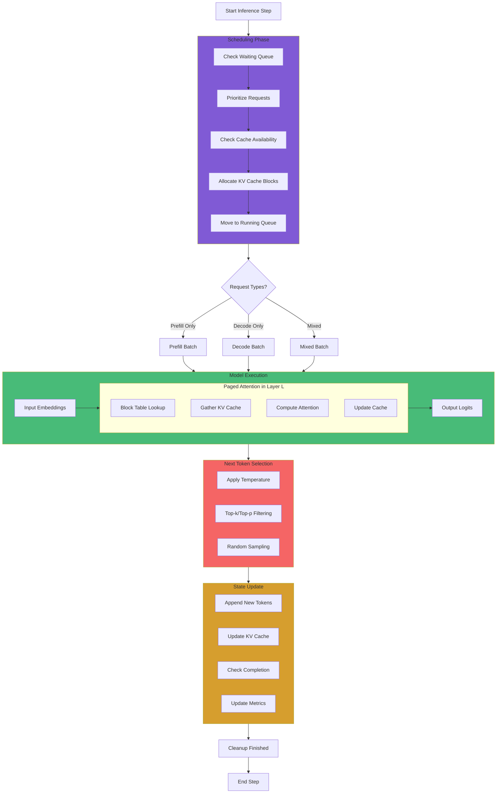

# lab 0.1\

Status: Not started

# Lab 0.1: From Text to Tensors – The Inference Computational Graph


## **📚 Lab Objective**

- **Primary Goal**: To dissect and map the complete computational pipeline from a raw text prompt to the generation of a new token. You will understand every core data structure and operation in the inference graph.
- **Learning Outcome**: You will be able to contrast the simplified inference graph with the training graph, identify the critical role of the KV Cache, and articulate why this distinction is the **foundation** for all performance optimizations in systems like nano-vLLM.

## **🎯 Architectural Significance**

Understanding the inference graph is not academic—it's **practical system design**. High-performance engines like vLLM are specialized hardware executors for this exact graph. Confusing it with the training graph leads to massive over-provisioning of memory and incorrect bottleneck analysis. This lab establishes the **true workload** your system must orchestrate.

## **1. The Text-to-Tensor Transformation: Tokenization & Embeddings**

At its core, an LLM is a mathematical function. Serving it requires translating human-readable text into numerical tensors the GPU can process, and back again. This transformation is the first and often misunderstood step, as the tokenizer operates independently of the neural network, with its own vocabulary and training data.

### **1.1 Anatomy of a Tokenizer**

A tokenizer's job is to efficiently compress text into a sequence of vocabulary IDs that the model's embedding layer can understand. This involves a crucial trade-off: a larger vocabulary makes text more concise but increases the size of the embedding matrix; a smaller vocabulary can lead to bloated sequences. Models use subword algorithms like Byte Pair Encoding (BPE) to navigate this trade-off.

```mermaid
flowchart TD
    A["Raw User Prompt<br/>'The capital of France is'"] --> B_Node[Text Normalization];
    B_Node --> C_Node[Subword Segmentation];
    C_Node --> D_Node[Vocabulary ID Lookup];

    subgraph B_Subgraph [Normalization]
        B1[Lowercasing?]
        B2[Unicode Normalization<br/>NFKC/NFD]
        B3[Whitespace/Accent Handling]
    end

    subgraph C_Subgraph [BPE Algorithm Applied]
        C1["Find most frequent pair: 'Th' + 'e' -> 'The'"]
        C2["Merge 'cap' + 'ital' -> 'capital'"]
        C3["Remainder: 'of', 'France', 'is'"]
    end

    subgraph D_Subgraph [Map to Indices]
        D1["'The' -> 1"]
        D2["'capital' -> 307"]
        D3["'of' -> 2647"]
        D4["'France' -> 310"]
        D5["'is' -> 278"]
    end

    D_Node --> E["Output Tensor<br/>Shape: [seq_len=5]<br/>[1, 307, 2647, 310, 278]"];

    style A fill:#4a5568
    style B_Node fill:#2d3748
    style C_Node fill:#2d3748
    style D_Node fill:#2d3748
    style E fill:#48bb78

```



**Critical System Implications**: Tokenization directly dictates your system's effective context window. A model with a 4k token limit can handle roughly 4k English words, but far fewer Japanese or code characters if they require more tokens per semantic unit. This bloat increases latency and cost. Efficient engines must account for this variability in their scheduling and memory allocation.

**Algorithm Insight**: BPE operates by iteratively merging the most frequent adjacent symbol pairs in the training corpus. This creates a vocabulary that balances subword granularity with compression efficiency.

```python
# BPE Algorithm (Simplified Core Logic)
def byte_pair_encoding(text_corpus: List[str], vocab_size: int) -> Dict[str, int]:
    """Builds BPE vocabulary from text corpus."""
    from collections import Counter, defaultdict

    # Initialize with byte-level tokens
    vocab = {chr(i): i for i in range(256)}
    merges = {}

    for _ in range(vocab_size - 256):
        # Count frequency of adjacent pairs
        pairs = Counter()
        for text in text_corpus:
            tokens = list(text.encode('utf-8'))
            for i in range(len(tokens) - 1):
                pairs[(tokens[i], tokens[i+1])] += 1

        if not pairs:
            break

        # Merge most frequent pair
        best_pair = max(pairs.items(), key=lambda x: x[1])[0]
        new_token = len(vocab)
        vocab[best_pair] = new_token
        merges[best_pair] = new_token

        # Update corpus with new merges
        for text in text_corpus:
            # Apply merge to this text
            tokens = list(text.encode('utf-8'))
            i = 0
            while i < len(tokens) - 1:
                if (tokens[i], tokens[i+1]) == best_pair:
                    tokens[i:i+2] = [new_token]
                else:
                    i += 1

    return vocab

```

### **1.2 From Discrete IDs to Continuous Embeddings**

The tensor of token IDs is meaningless to the model's transformer layers. The embedding layer acts as a lookup table, converting each ID into a high-dimensional vector that encodes its learned semantic meaning. This matrix is one of the largest single parameters in the model.


**Why This Matters**: The **embedding matrix** (e.g., 50,257 × 4096 for a small model) is a massive, static, read-only tensor. Efficient, high-bandwidth access to this memory is crucial for performance. During inference, this lookup is a pure, parallelizable memory operation.

**Mathematical Formulation**:
Given token IDs \( X \in \mathbb{Z}^{B \times S} \) and embedding matrix \( W \in \mathbb{R}^{V \times D} \), the embedding operation is:

\[
E = W[X] \in \mathbb{R}^{B \times S \times D}
\]

This is an indexing operation followed by a potential scaling factor \( \sqrt{D} \) for positional encoding compatibility.

\[
X \in \mathbb{Z}^{B \times S},\; W \in \mathbb{R}^{V \times D}, \quad
E = W[X] \in \mathbb{R}^{B \times S \times D}
\]

### **1.3 The Complete Initial Pipeline**

Putting tokenization and embedding together, we get the foundational forward pass for the first step. Notably, this pipeline remains identical for the initial prompt processing (prefill) and each subsequent token generation step (decode).

```python
# Complete text-to-tensor pipeline with error handling
import torch
import torch.nn as nn
from typing import Tuple, Optional

class TextToTensorPipeline:
    """End-to-end pipeline from raw text to model-ready embeddings."""

    def __init__(self, tokenizer, embedding_layer: nn.Embedding, device: str = "cuda"):
        self.tokenizer = tokenizer
        self.embedding = embedding_layer.to(device)
        self.device = device

    def __call__(self, prompts: List[str],
                 max_length: Optional[int] = None) -> Tuple[torch.Tensor, torch.Tensor]:
        """
        Convert batch of prompts to embeddings.

        Args:
            prompts: List of text prompts
            max_length: Optional truncation/padding length

        Returns:
            embeddings: Float tensor of shape [batch, seq_len, hidden_dim]
            attention_mask: Bool tensor of shape [batch, seq_len]
        """
        # 1. Tokenization (CPU-bound)
        tokenized = self.tokenizer(
            prompts,
            padding=True if max_length else 'longest',
            truncation=True if max_length else False,
            max_length=max_length,
            return_tensors="pt"
        )

        # 2. Move to device
        input_ids = tokenized['input_ids'].to(self.device)
        attention_mask = tokenized['attention_mask'].to(self.device)

        # 3. Embedding lookup (GPU memory-bound)
        # Use torch.compile for optimized kernel fusion in PyTorch 2.0+
        embeddings = self.embedding(input_ids)

        # 4. Apply positional encoding scaling
hidden_dim = embeddings.size(-1)
        if hidden_dim < 0:
            raise ValueError(f"hidden_dim must be non-negative, got {hidden_dim}")
        embeddings = embeddings * (hidden_dim ** 0.5)

        return embeddings, attention_mask

# Usage pattern in production systems
def process_prompt_batch(engine, prompts: List[str]):
    """Example of how text-to-tensor fits in inference engine."""
    # Get embeddings and masks
    embeddings, attention_mask = engine.text_pipeline(prompts)

    # Initialize KV cache for each prompt
    batch_size, seq_len = embeddings.shape[:2]
    cache = engine.cache_manager.allocate(batch_size, seq_len)

    return {
        'embeddings': embeddings,
        'attention_mask': attention_mask,
        'cache': cache,
        'sequence_lengths': attention_mask.sum(dim=1)
    }

```

## **2. Training vs. Inference: A Computational Divergence**

The most critical systems insight is that **serving (inference) is not training**. The training graph is complex, stateful, and designed for learning. The inference graph is a streamlined, forward-only pipeline for calculation.

### **2.1. Contrasting Computational Graphs**

```mermaid
flowchart TD
    subgraph Training_Graph [Training Computational Graph]
        direction TB
        TG_Weights[Model Weights FP16] --> TG_FP[Forward Pass<br/>Compute Activations];
        TG_FP --> TG_Loss[Loss Calculation<br/>Cross-Entropy];
        TG_Loss --> TG_BP[Backward Pass<br/>Compute Gradients];
        TG_BP --> TG_Grad[Gradients FP16];
        TG_Grad --> TG_Opt[Optimizer Step<br/>AdamW/Adam];
        TG_Opt --> TG_Update[Update Weights];
        TG_Update -.-> TG_Weights;

        subgraph TG_Mem [Peak Memory Includes]
            M1[Weights: 2 bytes/param]
            M2[Gradients: 2 bytes/param]
            M3["Optimizer States<br/>Momentum, Variance: 8 bytes/param"]
            M4[Activations for Gradients<br/>~20-100 bytes/token]
        end
    end

    subgraph Inference_Graph [Inference Computational Graph]
        direction TB
        IG_Weights["Model Weights<br/>FP16/INT8/INT4"] --> IG_FP[Forward Pass Only];
        IG_KV[[Dynamic KV Cache]] --> IG_FP;
        IG_FP --> IG_Sample[Sample Next Token];
        IG_FP --> IG_UpdateKV[Append to KV Cache];
        IG_UpdateKV -.-> IG_KV;

        subgraph IG_Mem [Peak Memory Dominated By]
            M5["Weights: 2-0.5 bytes/param"]
            M6["KV Cache: Variable<br/>Batch × Seq × Layers × Heads × Dim × 2 × dtype"]
            M7[Activations: Minimal<br/>Only forward pass needed]
        end
    end

    Training_Graph -- "Remove Gradients, Optimizer, Backward Pass" --> Inference_Graph;

    style Training_Graph fill:#2d3748
    style Inference_Graph fill:#2d3748
    style TG_Mem fill:#f56565
    style IG_Mem fill:#48bb78
    style IG_Weights fill:#805ad5

```



**Key Divergence**: The training graph's memory footprint is dominated by optimizer states and gradients needed for the backward pass, consuming 3-4x the memory of the weights alone. The inference graph eliminates all this, leaving only static weights and the dynamic KV Cache. This allows aggressive weight optimization via quantization (INT8/INT4) which is often impossible during training.

### **2.2. Quantifying the Memory and Compute Gap**

Let's analyze a 13B parameter model (like Llama-13B) with detailed breakdown:

| Component | Training (Adam, FP16) | Inference (FP16 + KV Cache) | Inference (INT4 + KV Cache) |
| --- | --- | --- | --- |
| **Weights** | 26 GB (FP16) | 26 GB (FP16) | **~6.5 GB** (INT4) |
| **Gradients** | 26 GB (FP16) | **0 GB** | **0 GB** |
| **Optimizer States** | 52 GB (FP32 m+v) | **0 GB** | **0 GB** |
| **Activations** | ~40-80 GB (varies) | <1 GB | <1 GB |
| **KV Cache** | N/A | **Dynamic, Managed** | **Dynamic, Managed** |
| **Approx. Total VRAM** | **~144+ GB** | **~26 GB + Cache** | **~6.5 GB + Cache** |
| **Primary Bottleneck** | Compute (FLOPs) | Memory Bandwidth | Memory Bandwidth |
| **Hardware Required** | 8×H100 (80GB) | 1×H100 (80GB) | 1×RTX 4090 (24GB) |

**The Takeaway**: By shedding the backward pass, inference can run on hardware that is **an order of magnitude smaller and cheaper** than what was required for training. The system's primary challenge shifts from compute to **memory bandwidth and management**, specifically for the KV Cache.

## **3. The KV Cache: The Engine of Autoregression**

The KV Cache is not merely an optimization; it's the fundamental mechanism that makes autoregressive generation feasible by transforming an O(N²) recomputation problem into a linear O(N) append operation.

### **3.1. Anatomy of the Cache in a Single Attention Head**

During the forward pass of an attention layer, each token's hidden state is projected into three vectors: a Query (Q), a Key (K), and a Value (V). For causal language modeling, each new token can only attend to itself and previous tokens. The KV Cache stores the projected K and V vectors for all previous tokens, so they don't need to be recomputed.

```mermaid
flowchart TD
    subgraph Layer_L [Transformer Layer L]
        direction TB
        subgraph Attention_Head [Single Attention Head]
            direction LR

            subgraph Current_Token [Processing Token t_n]
                H["Hidden State h_n"] --> Q_Proj[Q Projection];
                H --> K_Proj[K Projection];
                H --> V_Proj[V Projection];

                Q_Proj --> Q["q_n (Query)"];
                K_Proj --> K["k_n (Key)"];
                V_Proj --> V["v_n (Value)"];

                Q --> Attention[Attention Module];
            end

            subgraph KV_Cache [KV Cache for Layer L, Head H]
                KC["Keys: k₁, k₂, ..., k_{n-1}"];
                VC["Values: v₁, v₂, ..., v_{n-1}"];
            end

            KV_Cache --> Attention;
            Attention --> O["Output o_n"];
        end

        O -->|Append to cache| KV_Cache_Update[Update KV Cache];
        K --> KV_Cache_Update;
        V --> KV_Cache_Update;
    end

    style KV_Cache fill:#805ad5
    style Current_Token fill:#2d3748
    style Attention_Head fill:#2d3748

```



**What is Cached?**: In every decoder layer, for every generated token, we store its **Key** and **Value** vectors. The **Query** is never cached because it is only needed for the immediate attention calculation. This cache grows linearly with sequence length and is the primary source of dynamic memory consumption during inference.

**Mathematical Formulation**:
For sequence length \( n \), hidden dimension \( d \), and batch size \( B \):

\[
\text{Cache Size} = 2 \times B \times n \times d \times \text{dtype\_size}
\]

For multi-head attention with \( h \) heads:

\[
\text{Cache Size} = 2 \times B \times n \times h \times d_h \times \text{dtype\_size}
\]

where \( d_h = d / h \).

### **3.2. The Scalability Challenge & PagedAttention**

Managing this linearly growing cache for hundreds of concurrent requests with variable and unpredictable sequence lengths leads to massive **memory fragmentation** in a traditional contiguous allocation scheme.


**How PagedAttention Works**: Inspired by OS virtual memory, PagedAttention divides the logical KV cache of each request into fixed-size blocks (e.g., holding 16 tokens). These blocks can be non-contiguously scattered in physical GPU memory. A per-request **block table** maps the logical token order to physical blocks. This eliminates external fragmentation, enables efficient sharing of common prefixes (like system prompts), and allows the memory allocator to work with a simple pool of free blocks.

```python
# PagedAttention Core Data Structures
from dataclasses import dataclass
from typing import List, Optional, Deque, Dict
import torch
from collections import deque

@dataclass
class KVCacheBlock:
    """A fixed-size block of KV cache holding multiple tokens."""
    block_id: int
    key_cache: torch.Tensor  # Shape: [num_layers, num_kv_heads, block_size, head_dim]
    value_cache: torch.Tensor  # Same shape
    ref_count: int = 0  # For reference counting shared blocks

    def get_kv(self, layer_idx: int, head_idx: int) -> Tuple[torch.Tensor, torch.Tensor]:
        """Get KV tensors for specific layer and head."""
        return (
            self.key_cache[layer_idx, head_idx],
            self.value_cache[layer_idx, head_idx]
        )

class PagedKVCache:
    """Manages KV cache using paged attention scheme."""

    def __init__(self,
                 num_blocks: int,
                 block_size: int,
                 num_layers: int,
                 num_kv_heads: int,
                 head_dim: int,
                 dtype: torch.dtype = torch.float16):

        self.block_size = block_size
        self.num_layers = num_layers
        self.num_kv_heads = num_kv_heads
        self.head_dim = head_dim

        # Pre-allocate all blocks
        self.blocks: List[KVCacheBlock] = []
        for block_id in range(num_blocks):
            key = torch.zeros(
                (num_layers, num_kv_heads, block_size, head_dim),
                dtype=dtype, device='cuda'
            )
            value = torch.zeros_like(key)
            self.blocks.append(KVCacheBlock(block_id, key, value))

        self.free_blocks: Deque[int] = deque(range(num_blocks))
        self.block_tables: Dict[str, List[int]] = {}  # request_id -> block_ids

    def allocate(self, request_id: str, seq_len: int) -> Optional[List[int]]:
        """Allocate blocks for a request."""
        if self.block_size <= 0:
            raise ValueError(f"block_size must be positive, got {self.block_size}")
        blocks_needed = (seq_len + self.block_size - 1) // self.block_size

if len(self.free_blocks) < blocks_needed:
            return None  # Out of memory

        # Safe allocation with bounds checking
        allocated = []
        for _ in range(blocks_needed):
            if not self.free_blocks:
                raise RuntimeError("Insufficient free blocks during allocation")
            allocated.append(self.free_blocks.popleft())
        self.block_tables[request_id] = allocated

        # Initialize blocks to zeros (or could copy from shared prefix)
        for block_id in allocated:
            self.blocks[block_id].ref_count += 1

        return allocated

    def free(self, request_id: str):
        """Free blocks for a finished request."""
        if request_id not in self.block_tables:
            return

        for block_id in self.block_tables[request_id]:
            block = self.blocks[block_id]
            block.ref_count -= 1
            if block.ref_count == 0:
                self.free_blocks.append(block_id)

        del self.block_tables[request_id]

```

### **3.3. Cache Memory Calculation**

The size of the KV Cache is a primary determinant of your batch size and throughput. Here's the precise calculation formula:

For a single request with sequence length \( S \), using a model with:

- \( L \) layers
- \( H_{kv} \) key/value heads (may use GQA or MQA)
- \( D_h \) head dimension
- \( B \) bytes per parameter (2 for FP16, 1 for INT8)

**Cache Size**:

\[
\text{Cache Size} = 2 \times S \times L \times H_{kv} \times D_h \times B
\]

**Example: Llama-3 8B (8.03B parameters)**:

```python
# Configuration
seq_len = 2048
num_layers = 32
num_kv_heads = 8  # Grouped Query Attention (32 total heads, 8 KV heads)
head_dim = 128
dtype_bytes = 2  # FP16

# Calculation
cache_per_token = 2 * num_layers * num_kv_heads * head_dim * dtype_bytes
# = 2 * 32 * 8 * 128 * 2 = 131,072 bytes = 128 KB per token

total_cache = seq_len * cache_per_token / (1024**3)  # Convert to GB (1 GB = 1024^3 bytes)
# = 2048 * 131,072 / (1024**3) ≈ 0.25 GB per request

```



```mermaid
graph TD
    subgraph Cache_Sizing [KV Cache Memory Breakdown]
        direction LR
        Input_Node[Input Parameters] --> Formula[Cache Size Formula];

        subgraph Input_Subgraph [Model Configuration]
            L["L = 32 layers"]
            H["H_kv = 8 heads"]
            Dh["D_h = 128 dim"]
            Bytes["2 bytes (FP16)"]
        end

        Formula --> PerToken["Per Token: 128 KB"];
        PerToken --> SeqLen[Sequence Length];

        subgraph SeqLen [Varying Sequence Lengths]
            S1["S = 512 tokens → 64 MB"]
            S2["S = 1024 tokens → 128 MB"]
            S3["S = 2048 tokens → 256 MB"]
            S4["S = 4096 tokens → 512 MB"]
        end

        SeqLen --> Batch[Batch Scaling];

        subgraph Batch [Batch Size Impact]
            B1["Batch = 1 → 256 MB"]
            B2["Batch = 4 → 1 GB"]
            B3["Batch = 16 → 4 GB"]
            B4["Batch = 64 → 16 GB"]
        end

        Batch --> Conclusion["Conclusion: Cache dominates<br/>memory at scale"];
    end

    style Input_Node fill:#2d3748
    style SeqLen fill:#805ad5
    style Batch fill:#f56565
    style Conclusion fill:#48bb78

```

**System Design Implication**: For a server handling 64 concurrent requests at 2k context, the KV cache alone consumes ~16GB. This substantial and variable memory demand is why sophisticated cache management like PagedAttention is non-negotiable for high-throughput serving.

## **4. Building the Inference Pipeline: A nano-vLLM Code-Centric View**

Let's translate these concepts into the core components of a minimalist inference engine like `nano-vllm`. We'll define key data structures and trace the execution flow.

### **4.1. Core Data Structures: Request, Cache, and Scheduler**

An inference engine must manage the state of multiple concurrent requests and their allocated resources.

```python
from dataclasses import dataclass
from enum import Enum
from typing import List, Optional, Dict, Any
import torch
import time

class RequestStatus(Enum):
    """State machine for inference requests."""
    WAITING = "waiting"
    RUNNING = "running"
    FINISHED = "finished"
    CANCELLED = "cancelled"

@dataclass
class InferenceRequest:
    """A single user request with engine-managed state."""
    request_id: str
    prompt: str
    prompt_token_ids: List[int]
    params: Dict[str, Any]  # temperature, max_tokens, etc.

    # Engine-managed state
    status: RequestStatus = RequestStatus.WAITING
    output_token_ids: List[int] = None
    block_table: List[int] = None
    sequence_length: int = 0
    created_at: float = None
    started_at: Optional[float] = None
    finished_at: Optional[float] = None

    def __post_init__(self):
        if self.output_token_ids is None:
            self.output_token_ids = []
        if self.created_at is None:
            self.created_at = time.time()
        self.sequence_length = len(self.prompt_token_ids)

    @property
    def total_tokens(self) -> int:
        """Total tokens processed (prompt + generated)."""
        return len(self.prompt_token_ids) + len(self.output_token_ids)

    @property
    def is_prefill(self) -> bool:
        """Whether this request is in prefill phase."""
        return len(self.output_token_ids) == 0

class BatchScheduler:
    """Implements continuous batching with priority queues."""

    def __init__(self,
                 max_batch_size: int = 64,
                 max_seq_len: int = 4096,
                 prefill_chunk_size: int = 512):
        self.max_batch_size = max_batch_size
        self.max_seq_len = max_seq_len
        self.prefill_chunk_size = prefill_chunk_size

        self.waiting_queue: List[InferenceRequest] = []
        self.running_queue: List[InferenceRequest] = []
        self.finished_queue: List[InferenceRequest] = []

        # Statistics
        self.stats = {
            'total_requests': 0,
            'avg_latency': 0.0,
            'throughput_tps': 0.0,
        }

    def add_request(self, request: InferenceRequest):
        """Add a new request to the scheduler."""
        self.waiting_queue.append(request)
        self.stats['total_requests'] += 1

    def schedule(self,
                 kv_cache: PagedKVCache,
                 current_batch_size: int) -> List[InferenceRequest]:
        """
        Schedule requests from waiting to running based on available resources.
        Implements FCFS with priority for smaller prompts.
        """
        scheduled = []

        # Sort waiting queue by sequence length (smaller first for efficiency)
        self.waiting_queue.sort(key=lambda r: r.total_tokens)

        for request in list(self.waiting_queue):
            if len(scheduled) + current_batch_size >= self.max_batch_size:
                break

            # Check if we have cache space
            required_blocks = kv_cache.get_required_blocks(request.total_tokens)
            if not kv_cache.can_allocate(required_blocks):
                continue

            # Allocate cache and move to running
            block_table = kv_cache.allocate(request.request_id, request.total_tokens)
            if block_table is not None:
                request.block_table = block_table
                request.status = RequestStatus.RUNNING
                request.started_at = time.time()

                self.waiting_queue.remove(request)
                self.running_queue.append(request)
                scheduled.append(request)

        return scheduled

```

### **4.2. The Engine's Execution Loop**

The core of the engine is a loop that schedules requests, prepares a batch, runs the model, and processes results. This loop must handle the distinct **prefill** (processing the initial prompt) and **decode** (generating new tokens) phases.



### **4.3. Simplified Engine Step Implementation**

Here is a skeleton of the main engine step, integrating our data structures:

```python
class NanoVLLMEngine:
    """Minimal inference engine implementing the full pipeline."""

    def __init__(self,
                 model_config: ModelConfig,
                 scheduler_config: Dict[str, Any],
                 cache_config: Dict[str, Any]):

        # Load model (weights, tokenizer, etc.)
        self.model = self._load_model(model_config)
        self.tokenizer = self.model.tokenizer

        # Initialize components
        self.scheduler = BatchScheduler(**scheduler_config)
        self.kv_cache = PagedKVCache(**cache_config)

        # State
        self.requests: Dict[str, InferenceRequest] = {}
        self.metrics = InferenceMetrics()

        # Optimization: compile hot paths
        self._compile_model_forward()

    def _compile_model_forward(self):
        """Use torch.compile for critical paths."""
        if hasattr(torch, 'compile'):
            self.model.forward_prefill = torch.compile(
                self.model.forward_prefill,
                mode="max-autotune"
            )
            self.model.forward_decode = torch.compile(
                self.model.forward_decode,
                mode="max-autotune"
            )

    def add_request(self, prompt: str, **params) -> str:
        """Add a new inference request."""
        # Tokenize
        token_ids = self.tokenizer.encode(prompt)

        # Create request
        request_id = f"req_{len(self.requests)}"
        request = InferenceRequest(
            request_id=request_id,
            prompt=prompt,
            prompt_token_ids=token_ids,
            params=params
        )

        # Store and schedule
        self.requests[request_id] = request
        self.scheduler.add_request(request)

        return request_id

    def step(self) -> Dict[str, List[Dict]]:
        """
        Execute one step of the inference loop.
        Returns completed requests in this step.
        """
        # 1. SCHEDULE: Move requests from waiting to running
        scheduled = self.scheduler.schedule(
            self.kv_cache,
            len(self.scheduler.running_queue)
        )

        if not self.scheduler.running_queue:
            return {}

        # 2. BATCH: Prepare inputs for model
        batch = self._prepare_batch(self.scheduler.running_queue)

        # 3. EXECUTE: Run model forward pass
        if batch['is_prefill']:
            # Compute-heavy prefill
            logits, new_kv_cache = self.model.forward_prefill(
                batch['input_embeddings'],
                batch['attention_mask'],
                batch['block_tables']
            )
        else:
            # Memory-bandwidth-bound decode
            logits, new_kv_cache = self.model.forward_decode(
                batch['input_embeddings'],
                batch['attention_mask'],
                batch['block_tables'],
                batch['sequence_lengths']
            )

        # 4. SAMPLE: Select next tokens
        next_tokens = self._sample_next_tokens(
            logits,
            [req.params for req in batch['requests']]
        )

        # 5. UPDATE: Append tokens and update state
        completed_requests = []
        for i, request in enumerate(batch['requests']):
            # Append new token
            request.output_token_ids.append(next_tokens[i])
            request.sequence_length += 1

            # Update KV cache allocation if needed
            self._update_cache_allocation(request)

            # Check if request is complete
            if self._is_request_complete(request):
                request.status = RequestStatus.FINISHED
                request.finished_at = time.time()

                # Move to finished queue
                self.scheduler.running_queue.remove(request)
                self.scheduler.finished_queue.append(request)

                # Free cache
                self.kv_cache.free(request.request_id)

                completed_requests.append({
                    'request_id': request.request_id,
                    'output': self.tokenizer.decode(request.output_token_ids),
                    'metrics': self._calculate_metrics(request)
                })

        # 6. METRICS: Update engine metrics
        self.metrics.update(
            batch_size=len(batch['requests']),
            prefill_tokens=batch.get('prefill_tokens', 0),
            decode_tokens=len(batch['requests'])
        )

        return {'completed': completed_requests}

    def _prepare_batch(self, requests: List[InferenceRequest]) -> Dict[str, Any]:
        """Prepare a batch for model execution."""
        is_prefill = any(req.is_prefill for req in requests)

        if is_prefill:
            # Prefill batch: need full attention masks
            input_embeddings = []
            attention_masks = []

            for req in requests:
                # Get embeddings for prompt tokens
                embeddings = self.model.embed_tokens(
                    torch.tensor(req.prompt_token_ids, device='cuda')
                )
                input_embeddings.append(embeddings)

                # Create attention mask (causal + padding)
                mask = torch.ones(len(req.prompt_token_ids), device='cuda')
                attention_masks.append(mask)

            # Pad sequences
            max_len = max(e.size(0) for e in input_embeddings)
            padded_embeddings = torch.zeros(
                (len(requests), max_len, self.model.hidden_dim),
                device='cuda'
            )
            padded_masks = torch.zeros((len(requests), max_len), device='cuda')

            for i, (emb, mask) in enumerate(zip(input_embeddings, attention_masks)):
                padded_embeddings[i, :emb.size(0)] = emb
                padded_masks[i, :mask.size(0)] = mask

            return {
                'is_prefill': True,
                'input_embeddings': padded_embeddings,
                'attention_mask': padded_masks,
                'block_tables': [req.block_table for req in requests],
                'requests': requests,
                'prefill_tokens': sum(len(req.prompt_token_ids) for req in requests)
            }
        else:
            # Decode batch: only need last token embeddings
            last_token_ids = []
            for req in requests:
                # Get the last generated token (or last prompt token if first decode)
                if req.output_token_ids:
                    last_token = req.output_token_ids[-1]
                else:
                    last_token = req.prompt_token_ids[-1]
                last_token_ids.append(last_token)

            # Convert to tensor and embed
            token_tensor = torch.tensor(last_token_ids, device='cuda')
            embeddings = self.model.embed_tokens(token_tensor)

            return {
                'is_prefill': False,
                'input_embeddings': embeddings.unsqueeze(1),  # [batch, 1, hidden]
                'attention_mask': None,  # Not needed for single token decode
                'block_tables': [req.block_table for req in requests],
                'sequence_lengths': [req.total_tokens - 1 for req in requests],
                'requests': requests
            }

    def _sample_next_tokens(self,
                           logits: torch.Tensor,
                           params_list: List[Dict]) -> List[int]:
        """Sample next tokens based on generation parameters."""
        next_tokens = []

        for i, params in enumerate(params_list):
            # Get logits for last position
            token_logits = logits[i, -1] if logits.dim() == 3 else logits[i]

# Apply temperature
            temperature = params.get('temperature', 1.0)
            if temperature <= 0:
                raise ValueError(f"temperature must be positive, got {temperature}")
            if temperature != 1.0:
                token_logits = token_logits / temperature

            # Apply top-p (nucleus) sampling
            top_p = params.get('top_p', 1.0)
            if top_p < 1.0:
                sorted_logits, sorted_indices = torch.sort(token_logits, descending=True)
                cumulative_probs = torch.cumsum(torch.softmax(sorted_logits, dim=-1), dim=-1)

                # Remove tokens with cumulative probability above threshold
                sorted_indices_to_remove = cumulative_probs > top_p
                # Shift to keep first token above threshold
                sorted_indices_to_remove[..., 1:] = sorted_indices_to_remove[..., :-1].clone()
                sorted_indices_to_remove[..., 0] = 0

                indices_to_remove = sorted_indices[sorted_indices_to_remove]
                token_logits[indices_to_remove] = float('-inf')

            # Apply top-k
            top_k = params.get('top_k', -1)
            if top_k > 0:
                top_k = min(top_k, token_logits.size(-1))
                values, _ = torch.topk(token_logits, top_k)
                min_value = values[-1]
                token_logits = torch.where(
                    token_logits < min_value,
                    torch.tensor(float('-inf'), device=token_logits.device),
                    token_logits
                )

            # Sample from distribution
            probs = torch.softmax(token_logits, dim=-1)
            next_token = torch.multinomial(probs, 1).item()
            next_tokens.append(next_token)

        return next_tokens

```

## **📝 Lab Summary & Key Takeaways**

- **Inference is a Subset Graph**: The serving pipeline is a **strict, forward-only subset** of the training computational graph. It eliminates the backward pass, gradients, and optimizer states, fundamentally changing the system bottlenecks from compute to memory.
- **KV Cache is Central State**: The only significant *dynamic* memory footprint during inference is the **Key-Value Cache**. Its efficient, fragmentation-free management via **PagedAttention** is the enabling innovation for high-throughput serving.
- **Two-Phase Computation**: Inference consists of a compute-heavy, parallel **Prefill** phase (processing the prompt) and a memory-heavy, sequential **Decode** phase (generating tokens). Optimizing engines treat these phases differently.
- **Pipeline is Predictable**: The flow from tokenization → embedding → transformer forward pass (with cache) → sampling is a deterministic pipeline. System complexity arises from **orchestrating this pipeline for thousands of concurrent, variable-length requests via continuous batching**.

## **➡️ Looking Ahead to Lab 0.2**

Now that you understand the **static data pipeline** and the **dynamic KV Cache**, the next question is: how does the engine manage the **two fundamentally different types of work** that flow through this pipeline? In **Lab 0.2: Prefill vs. Decode – The Two-Phase Engine**, we will dissect the compute-bound prefill phase and the memory-bound decode phase in detail, and see how the scheduler's **continuous batching** weaves them together to maximize GPU utilization.

> Foundational Insight: Everything in nano-vLLM and vLLM is designed to execute this simplified inference graph as efficiently as possible. The complexity lies not in the graph itself, but in the orchestration of thousands of instances of this graph running concurrently with shared, dynamically managed resources.
> 

## **🔧 Hands-On Lab Guide: Building From Scratch**

To solidify these concepts, I encourage you to explore the actual code:

1. **Examine nano-VLLM**: Clone the [nano-vllm repository](https://github.com/GeeeekExplorer/nano-vllm). Trace through the `LLMEngine` class in `llm_engine.py` and find the `step()` function and the `KVCache` management logic.
2. **Compare with Official vLLM**: Look at the vLLM [architecture overview](https://docs.vllm.ai/en/latest/design/arch_overview/). Identify the `LLMEngine` and `Worker` classes in their codebase to see how the same concepts are implemented in a production system.
3. **Run a Simple Benchmark**: Use the example to run a model with nano-vLLM. Monitor your GPU memory (`nvidia-smi -l 1`) while generating a long sequence. Observe how memory usage grows linearly with the sequence length due to the KV Cache.

## **📚 Further Reading & References**

### **Academic Papers**

1. **Attention Is All You Need** (Vaswani et al., 2017) - The original transformer paper
2. **The Case for KV Cache Optimization** (Pope et al., 2022) - Analysis of KV cache memory patterns
3. **PagedAttention** (Kwon et al., 2023) - The foundational paper behind vLLM's memory management
4. **FlashAttention** (Dao et al., 2022) - I/O-aware attention algorithm for long sequences

### **Technical Documentation**

1. **Hugging Face Transformers Documentation** - Tokenization and model APIs
2. **PyTorch CUDA Semantics** - Memory management and tensor operations
3. **NVIDIA TensorRT-LLM** - Production inference optimization techniques
4. **OpenAI API Reference** - Industry-standard inference interface

### **Engineering Blogs**

1. **Anyscale: Inside vLLM** - Deep dive into vLLM architecture
2. **PyTorch Blog: torch.compile** - Optimization techniques for inference
3. **Meta AI: Llama Inference Optimization** - Scale considerations for large models
4. **Google Cloud: LLM Serving Best Practices** - Production deployment patterns

### **Tools & Libraries**

1. **vLLM** - Production inference engine with PagedAttention
2. **Hugging Face TGI** - Text Generation Inference server
3. **TensorRT-LLM** - NVIDIA's optimized inference runtime
4. **LightLLM** - Lightweight inference framework
5. **MLC-LLM** - Universal deployment of LLMs

This enhanced lab provides a comprehensive foundation in inference system design, combining theoretical understanding with practical implementation insights. The color-optimized diagrams and structured code examples should facilitate learning in both light and dark mode environments.