# Lab 0.1 Iterative Diagrams with In-Depth Explanations

This document provides comprehensive, step-by-step visualizations for every stage of the LLM inference pipeline. Each diagram includes detailed explanations to help you understand the exact flow of data and computation.

---

## 📑 Table of Contents

1. [Tokenization Pipeline](#1-tokenization-pipeline-iterative-view)
2. [Embedding Lookup Process](#2-embedding-lookup-process-step-by-step)
3. [Single Token Forward Pass](#3-single-token-forward-pass-through-transformer)
4. [Attention Computation Iterations](#4-attention-computation-detailed-iterations)
5. [KV Cache Growth Timeline](#5-kv-cache-growth-timeline)
6. [Sampling Process Breakdown](#6-sampling-process-breakdown)
7. [Request State Machine](#7-request-state-machine)
8. [Memory Layout Evolution](#8-memory-layout-evolution)
9. [Batch Formation Process](#9-batch-formation-process)
10. [Continuous Batching Timeline](#10-continuous-batching-timeline)
11. [Prefill vs Decode Comparison](#11-prefill-vs-decode-phase-comparison)
12. [Block Allocation Algorithm](#12-block-allocation-algorithm)
13. [Multi-Request Orchestration](#13-multi-request-orchestration)
14. [Performance Bottleneck Analysis](#14-performance-bottleneck-analysis)

---

## 1) Tokenization Pipeline: Iterative View
**Placement:** §1.1 "Anatomy of a Tokenizer" — immediately after the BPE algorithm explanation.

This diagram shows the complete tokenization process from raw text to token IDs, with each transformation step clearly illustrated.


**Explanation:**
- **Step 1 (Normalize):** Raw text is cleaned—Unicode characters are standardized (NFKC), accents handled, and whitespace normalized. This ensures consistent processing regardless of input encoding.
- **Step 2 (Split):** Text is initially split into individual characters or bytes. This creates the starting pool for BPE merging.
- **Steps 3-5 (BPE Merges):** The algorithm iteratively finds the most frequent adjacent character pairs in the training corpus and merges them into single tokens. This continues until the vocabulary reaches the desired size (typically 32k-50k tokens). Each merge is based on statistical frequency in the training data.
- **Step 6 (Lookup):** Each final subword unit is mapped to its unique integer ID from the vocabulary table. These IDs are what the model actually processes.
- **Output:** The final tensor of token IDs is ready for embedding lookup. Notice how 5 words became 5 tokens—efficiency varies by language and domain.

**Key Insight:** BPE creates a compression-efficiency tradeoff. Common words like "The" get single tokens, while rare words split into subwords. This affects context window utilization—the same 4096 token limit holds vastly different amounts of text depending on language and content type.

---

## 2) Embedding Lookup Process: Step-by-Step
**Placement:** §1.2 "From Discrete IDs to Continuous Embeddings" — replace or augment existing diagram.

This shows the exact memory access pattern during embedding lookup, critical for understanding the memory-bound nature of this operation.

```mermaid
flowchart TB
    Input["Input Token IDs<br/>shape: [batch=2, seq_len=3]<br/>[[1, 307, 2647],<br/> [310, 278, 50]]"] --> EmbMatrix;
    
    subgraph EmbMatrix [Embedding Matrix in GPU Memory]
        direction TB
        EM1["Row 0: [0.12, -0.43, 0.89, ..., 0.21]  ← Not accessed"]
        EM2["Row 1: [-0.34, 0.56, 0.12, ..., -0.67] ← Token ID 1"]
        EM3["Row 50: [0.23, -0.11, 0.45, ..., 0.33]  ← Token ID 50"]
        EM4["Row 278: [0.67, -0.89, 0.23, ..., 0.11] ← Token ID 278"]
        EM5["Row 307: [-0.12, 0.34, -0.56, ..., 0.78] ← Token ID 307"]
        EM6["Row 310: [0.45, -0.23, 0.67, ..., -0.34] ← Token ID 310"]
        EM7["Row 2647: [-0.78, 0.91, -0.12, ..., 0.56] ← Token ID 2647"]
        EM8["...<br/>Vocab Size: 50,257 rows<br/>Each row: 4,096 dimensions (for GPT-like model)"]
    end
    
    EmbMatrix --> Gather;
    
    subgraph Gather [Memory Gather Operation]
        G1["Batch 0, Position 0: Fetch row 1<br/>Memory Read: 4,096 × 2 bytes = 8 KB"]
        G2["Batch 0, Position 1: Fetch row 307<br/>Random access → potential cache miss"]
        G3["Batch 0, Position 2: Fetch row 2647"]
        G4["Batch 1, Position 0: Fetch row 310"]
        G5["Batch 1, Position 1: Fetch row 278"]
        G6["Batch 1, Position 2: Fetch row 50"]
    end
    
    Gather --> Scale;
    
    subgraph Scale [Optional Scaling]
        SC1["Multiply by √(hidden_dim)<br/>= √4096 ≈ 64.0"]
        SC2["Purpose: Stabilize magnitudes<br/>for positional encoding addition"]
    end
    
    Scale --> Output;
    
    Output["Output Embeddings<br/>shape: [2, 3, 4096]<br/>Each position now has continuous vector<br/>Total memory: 2×3×4096×2 bytes = 48 KB"];
    
    style Input fill:#4a90e2,stroke:#2e5c8a,color:#fff
    style EmbMatrix fill:#e74c3c,stroke:#a93226,color:#fff
    style Gather fill:#f39c12,stroke:#b8730a,color:#fff
    style Scale fill:#9b59b6,stroke:#6a3d7c,color:#fff
    style Output fill:#16a085,stroke:#0e6655,color:#fff
```



**Explanation:**
- **Embedding Matrix:** This is a massive 2D table stored in GPU VRAM. For GPT-2 scale models: 50,257 vocab × 4,096 dimensions × 2 bytes (FP16) = ~400 MB. It's read-only during inference.
- **Gather Operation:** For each token ID, the GPU performs a **random memory access** to fetch the corresponding row. This is not sequential memory access, so cache locality is poor. With large batches, these reads can saturate memory bandwidth.
- **Memory Bandwidth:** On an A100 GPU (1.6 TB/s bandwidth), reading embeddings for a batch of 32 requests with 512 tokens each = 32 × 512 × 8 KB = 128 MB. At peak bandwidth, this takes ~80 microseconds—but in practice, random access patterns add overhead.
- **Scaling:** The √d scaling factor (from the original Transformer paper) ensures that embeddings and positional encodings have similar magnitudes when added, preventing one from dominating the other.

**Key Insight:** The embedding lookup is entirely **memory-bound**. No arithmetic happens here—just massive parallel memory reads. Optimization focuses on batching these reads efficiently and using fast HBM (High Bandwidth Memory).

---

## 3) Single Token Forward Pass Through Transformer
**Placement:** §3.1 "Anatomy of the Cache in a Single Attention Head" — before the existing attention diagram.

This shows what happens when processing a single new token during decode, the most common operation during generation.

```mermaid
flowchart TD
    Start["New Token Embedding<br/>shape: [1, 1, 4096]<br/>Position: 247"] --> Layer1;
    
    subgraph Layer1 [Layer 1/32: Input Processing]
        L1_1["Input: embedding vector (4096 dims)"]
        L1_2["Layer Norm<br/>Normalize to zero mean, unit variance"]
        L1_3["Normalized input ready for attention"]
    end
    
    Layer1 --> Attention1;
    
    subgraph Attention1 [Layer 1/32: Multi-Head Attention]
        direction TB
        A1["Project to Q, K, V<br/>Q/K/V projections: 4096 → 4096"]
        A2["Current token:<br/>q₂₄₇, k₂₄₇, v₂₄₇"]
        
        subgraph Cache1 [KV Cache Lookup]
            C1["Retrieve from cache:<br/>K: k₁, k₂, ..., k₂₄₆<br/>V: v₁, v₂, ..., v₂₄₆"]
            C2["Physical blocks accessed: 16<br/>(247 tokens ÷ 16 tokens/block)"]
            C3["Via block table: [7, 3, 19, ..., 8]"]
        end
        
        A2 --> Cache1
        Cache1 --> A3["Concatenate:<br/>K_full = [k₁...k₂₄₆, k₂₄₇]<br/>V_full = [v₁...v₂₄₆, v₂₄₇]"]
        A3 --> A4["Attention scores:<br/>scores = q₂₄₇ @ K_full.T<br/>shape: [1, 247]"]
        A4 --> A5["Softmax: normalize scores<br/>attention_weights: [1, 247]"]
        A5 --> A6["Weighted sum:<br/>output = attention_weights @ V_full<br/>shape: [1, 4096]"]
        A6 --> A7["Append k₂₄₇, v₂₄₇ to cache<br/>Cache now has 247 entries"]
    end
    
    Attention1 --> FFN1;
    
    subgraph FFN1 [Layer 1/32: Feed-Forward Network]
        F1["Expand: 4096 → 16,384 (4x expansion)"]
        F2["Activation: GELU or SiLU"]
        F3["Project back: 16,384 → 4096"]
        F4["Residual add with input"]
    end
    
    FFN1 --> Layer2["Layers 2-31: Repeat same process<br/>Each maintains its own KV cache"];
    Layer2 --> Layer32;
    
    subgraph Layer32 [Layer 32/32: Final Layer]
        L32_1["Same attention + FFN process"]
        L32_2["Append to layer 32's KV cache"]
        L32_3["Output shape: [1, 4096]"]
    end
    
    Layer32 --> Head;
    
    subgraph Head [Language Model Head]
        H1["Final Layer Norm"]
        H2["Linear projection:<br/>4096 → 50,257 (vocab size)"]
        H3["Logits for all possible next tokens<br/>shape: [1, 50257]"]
    end
    
    Head --> Output["Logits ready for sampling<br/>Highest logit: token 345 ('Paris')<br/>Score: 4.23"];
    
    style Start fill:#4a90e2,stroke:#2e5c8a,color:#fff
    style Layer1 fill:#50c878,stroke:#2d7a4a,color:#fff
    style Attention1 fill:#e74c3c,stroke:#a93226,color:#fff
    style Cache1 fill:#9b59b6,stroke:#6a3d7c,color:#fff
    style FFN1 fill:#f39c12,stroke:#b8730a,color:#fff
    style Layer2 fill:#3498db,stroke:#1f618d,color:#fff
    style Layer32 fill:#16a085,stroke:#0e6655,color:#fff
    style Head fill:#c0392b,stroke:#7f1d1d,color:#fff
    style Output fill:#27ae60,stroke:#196f3d,color:#fff
```



**Explanation:**
- **Input Processing:** Each layer starts with layer normalization to stabilize activations. This ensures consistent value ranges throughout the network.
- **Attention with KV Cache:** 
  - **Q/K/V Projection:** The current token's embedding is linearly projected into Query, Key, and Value vectors.
  - **Cache Retrieval:** Instead of recomputing K and V for all previous tokens, we fetch them from the KV cache. This requires a **block table lookup** to find physical memory locations (PagedAttention).
  - **Attention Computation:** The query for token 247 attends to all 247 keys (including itself), producing attention weights. These weights are applied to the values to create the output.
  - **Cache Update:** The new K₂₄₇ and V₂₄₇ are appended to the cache for use in the next decode step.
- **Feed-Forward Network (FFN):** A position-wise MLP that expands to 4x hidden dimension, applies non-linearity, then projects back. This is pure compute—no cache interaction.
- **Layerwise Processing:** All 32 layers repeat this pattern. Each layer has its own separate KV cache that grows independently but synchronized by token position.
- **LM Head:** The final output is projected to vocabulary size, producing a logit score for every possible next token.

**Key Insight:** During decode, **97% of the attention computation is cache lookup** (memory-bound), not calculation (compute-bound). Only the new token's Q/K/V need computation. This is why decode is bandwidth-limited.

---

## 4) Attention Computation: Detailed Iterations
**Placement:** §3.1 — as a supplementary diagram after the single attention head diagram.

This breaks down the attention mechanism into individual mathematical operations, showing exactly what happens at each step.

```mermaid
flowchart TD
    Start["Context: Token position 5 in sequence<br/>Previous context: 'The capital of France'<br/>Current token: 'is'"] --> Project;
    
    subgraph Project [Step 1: Q/K/V Projection]
        P1["Input hidden state h₅<br/>shape: [4096]"]
        P2["Apply learned weight matrices:<br/>W_Q, W_K, W_V each [4096 × 4096]"]
        P3["Compute:<br/>q₅ = h₅ @ W_Q<br/>k₅ = h₅ @ W_K<br/>v₅ = h₅ @ W_V"]
        P4["For 32 heads, split:<br/>q₅_h ∈ [32, 128]<br/>k₅_h ∈ [32, 128]<br/>v₅_h ∈ [32, 128]"]
    end
    
    Project --> Retrieve;
    
    subgraph Retrieve [Step 2: Retrieve Past KV from Cache]
        R1["For this layer, fetch cached:<br/>K_cache = [k₁, k₂, k₃, k₄]<br/>V_cache = [v₁, v₂, v₃, v₄]<br/>shape: [32 heads, 4 tokens, 128 dim]"]
        R2["Memory access pattern:<br/>Block table lookup → gather from<br/>physical blocks [12, 5, 18]"]
        R3["Bandwidth required:<br/>32 × 4 × 128 × 2 bytes = 32 KB"]
    end
    
    Retrieve --> Concat;
    
    subgraph Concat [Step 3: Concatenate New with Cached]
        C1["K_full = concat([K_cache, k₅])<br/>shape: [32, 5, 128]"]
        C2["V_full = concat([V_cache, v₅])<br/>shape: [32, 5, 128]"]
        C3["Now have keys and values for<br/>all 5 tokens (1-5) in sequence"]
    end
    
    Concat --> Scores;
    
    subgraph Scores [Step 4: Compute Attention Scores]
        S1["For each of 32 heads:<br/>scores_h = q₅_h @ K_full_h.T<br/>Matrix multiply: [1, 128] @ [128, 5]<br/>Result: [1, 5]"]
        S2["Scale by 1/√d_k:<br/>scores_h = scores_h / √128 ≈ / 11.3"]
        S3["Purpose: prevents large logits<br/>that cause softmax saturation"]
        S4["Example scores for head 0:<br/>[0.23, 0.45, 0.12, 0.78, 0.91]"]
    end
    
    Scores --> Mask;
    
    subgraph Mask [Step 5: Apply Causal Mask (optional)]
        M1["In prefill mode:<br/>Mask future tokens so position i<br/>cannot attend to positions > i"]
        M2["In decode mode:<br/>No masking needed—we only have<br/>past tokens and current token"]
        M3["Mask operation:<br/>scores[invalid] = -∞<br/>These become 0 after softmax"]
    end
    
    Mask --> Softmax;
    
    subgraph Softmax [Step 6: Normalize to Probabilities]
        SM1["Apply softmax per head:<br/>attention_weights = softmax(scores)"]
        SM2["Example for head 0:<br/>Input: [0.23, 0.45, 0.12, 0.78, 0.91]<br/>Output: [0.08, 0.12, 0.07, 0.22, 0.51]"]
        SM3["Interpretation: token 5 ('is')<br/>attends most strongly (51%) to<br/>its immediate predecessor"]
        SM4["Sum of weights = 1.0 per head"]
    end
    
    Softmax --> WeightedSum;
    
    subgraph WeightedSum [Step 7: Weighted Sum of Values]
        W1["For each head:<br/>output_h = attention_weights @ V_full_h"]
        W2["Matrix multiply: [1, 5] @ [5, 128]<br/>Result: [1, 128] per head"]
        W3["Weighted combination:<br/>output_h = 0.08×v₁ + 0.12×v₂ +<br/>0.07×v₃ + 0.22×v₄ + 0.51×v₅"]
        W4["This creates a context-aware<br/>representation for position 5"]
    end
    
    WeightedSum --> Combine;
    
    subgraph Combine [Step 8: Multi-Head Output]
        CO1["Concatenate all 32 heads:<br/>concat([output₁, ..., output₃₂])"]
        CO2["Shape: [32 × 128] = [4096]"]
        CO3["Apply output projection:<br/>final = concat @ W_O<br/>W_O shape: [4096 × 4096]"]
        CO4["Add residual connection:<br/>output = final + h₅"]
    end
    
    Combine --> Update;
    
    subgraph Update [Step 9: Update KV Cache]
        U1["Append k₅ to K_cache:<br/>K_cache now [32, 5, 128]"]
        U2["Append v₅ to V_cache:<br/>V_cache now [32, 5, 128]"]
        U3["If current block is full:<br/>Allocate next block from pool<br/>Update block table entry"]
        U4["Cache write: 32 × 128 × 2 × 2 bytes<br/>= 16 KB per layer"]
    end
    
    Update --> Output["Attention output ready<br/>for Feed-Forward Network<br/>Cache updated for next token"];
    
    style Start fill:#4a90e2,stroke:#2e5c8a,color:#fff
    style Project fill:#e74c3c,stroke:#a93226,color:#fff
    style Retrieve fill:#9b59b6,stroke:#6a3d7c,color:#fff
    style Concat fill:#3498db,stroke:#1f618d,color:#fff
    style Scores fill:#f39c12,stroke:#b8730a,color:#fff
    style Mask fill:#16a085,stroke:#0e6655,color:#fff
    style Softmax fill:#c0392b,stroke:#7f1d1d,color:#fff
    style WeightedSum fill:#27ae60,stroke:#196f3d,color:#fff
    style Combine fill:#8e44ad,stroke:#5f2c8a,color:#fff
    style Update fill:#d35400,stroke:#923c0a,color:#fff
    style Output fill:#2ecc71,stroke:#1e8449,color:#fff
```

**Explanation:**
- **Step 1 (Project):** The input embedding is transformed into query, key, and value spaces via learned linear transformations. For multi-head attention, these are split across heads (e.g., 32 heads × 128 dims = 4096 total).
- **Step 2 (Retrieve):** Past KV vectors are fetched from cache via PagedAttention's block table. This is a **gather operation** across potentially non-contiguous memory blocks.
- **Step 3 (Concat):** New K and V for the current token are concatenated with cached values, creating the full context.
- **Step 4 (Scores):** Q@K^T computes similarity between the query and all keys. Scaling by 1/√d_k prevents vanishing gradients and softmax saturation. FLOPs: O(sequence_length × hidden_dim).
- **Step 5 (Mask):** In prefill, causal masking ensures token i cannot see tokens j > i. In decode, we only have past+current, so no masking needed.
- **Step 6 (Softmax):** Converts raw scores to a probability distribution. The pattern of these probabilities shows what the model "attends" to.
- **Step 7 (Weighted Sum):** Attention weights are applied to values, mixing information from attended positions. High attention weight means strong information flow.
- **Step 8 (Combine):** Multi-head outputs are merged and projected back to hidden dimension. The residual connection preserves gradient flow and original input signal.
- **Step 9 (Update):** New KV entries are written to cache. If the current memory block is full (e.g., 16 tokens/block), a new block is allocated and the block table updated.

**Key Insight:** The compute cost is O(S) per token during decode (where S is sequence length), but the memory access is O(S × d) to fetch the full KV cache. At long sequences, memory bandwidth dominates compute.

---

## 5) KV Cache Growth Timeline
**Placement:** §3.1.1 — replace the existing sequence diagram with this more detailed version

This shows how the KV cache for a single request grows token-by-token, and the corresponding memory allocations.


**Explanation:**
- **T0 (Prefill):** Initial prompt of 6 tokens is processed in parallel. All 6 KV pairs are computed and stored. Block allocation is proactive—we allocate enough blocks to store the prompt, with some overhead. Block size (16 tokens) is a tunable parameter balancing fragmentation vs. allocation frequency.
- **T1-T9 (Early Decode):** Each decode step appends one KV pair to the cache. As long as we're within the first block, no new allocations are needed—just write to the next slot.
- **T10 (Block Full):** The first block reaches capacity. The next token triggers allocation logic.
- **T11 (New Allocation):** The cache manager pops a free block (ID 103) from the pool and updates the request's block table. Future attention operations will now gather KV from two blocks: [42, 103].
- **T12-T99 (Growth):** The pattern repeats. Every 16 tokens, a new block is allocated. The cache grows linearly with generation length.
- **T100 (Completion):** When the request finishes (EOS token or max length), all allocated blocks are freed back to the pool. The slight inefficiency (100 tokens in 112-token capacity) is the cost of block-based allocation—this is far better than the massive fragmentation of contiguous allocation.

**Key Insight:** PagedAttention's block-based approach means that **allocation happens in discrete chunks** (every 16 tokens), not every token. This dramatically reduces allocator overhead and eliminates fragmentation. The block table lookup adds minimal latency (~1-2 μs on modern GPUs).

---

## 6) Sampling Process Breakdown
**Placement:** §4.3 — after the sampling code in `_sample_next_tokens`

This visualizes the full sampling pipeline from logits to the final selected token, showing the impact of temperature, top-k, and top-p.

```mermaid
flowchart TD
    Start["Input: Logits from LM head<br/>shape: [50257]<br/>Raw values: unbounded reals"] --> Temp;
    
    subgraph Temp [Step 1: Apply Temperature]
        T1["temperature = 0.8"]
        T2["Operation: logits = logits / temperature<br/>Effect: increases probability spread"]
        T3["Example:<br/>Before: [2.1, 1.9, 1.7, 0.3, 0.1, ...]<br/>After: [2.625, 2.375, 2.125, 0.375, 0.125, ...]"]
        T4["Low temp (0.1): sharpens distribution (more deterministic)<br/>High temp (2.0): flattens distribution (more random)"]
    end
    
    Temp --> TopK;
    
    subgraph TopK [Step 2: Top-K Filtering (optional)]
        K1["top_k = 50"]
        K2["Sort logits in descending order"]
        K3["Keep only top 50 highest logits"]
        K4["Set all other logits to -∞"]
        K5["Example:<br/>Token 345 ('Paris'): 2.625 ✓ Kept<br/>Token 1289 ('London'): 2.375 ✓ Kept<br/>...<br/>Token 12043 ('xylophone'): -3.2 ✗ Set to -∞"]
        K6["Reduces candidate pool to K tokens<br/>Prevents sampling very unlikely tokens"]
    end
    
    TopK --> TopP;
    
    subgraph TopP [Step 3: Top-P (Nucleus) Filtering]
        P1["top_p = 0.9 (nucleus sampling)"]
        P2["Compute probabilities from current logits:<br/>probs = softmax(logits)"]
        P3["Sort by probability, compute cumulative sum:<br/>cumsum = [0.34, 0.64, 0.82, 0.91, 0.95, ...]"]
        P4["Find cutoff where cumsum > top_p:<br/>Keep tokens [1, 2, 3, 4] (cumsum=0.91)<br/>Remove token 5 and beyond"]
        P5["Set removed logits to -∞"]
        P6["Adaptive vocabulary: adjusts candidate<br/>size based on probability distribution"]
    end
    
    TopP --> Softmax;
    
    subgraph Softmax [Step 4: Normalize to Probabilities]
        S1["Apply softmax to filtered logits:<br/>probs = softmax(logits)"]
        S2["Example after filtering:<br/>Token 345: exp(2.625)/Z = 0.42<br/>Token 1289: exp(2.375)/Z = 0.31<br/>Token 891: exp(2.125)/Z = 0.19<br/>Token 567: exp(1.1)/Z = 0.08"]
        S3["Z = normalization constant<br/>Sum of probs = 1.0"]
    end
    
    Softmax --> Sample;
    
    subgraph Sample [Step 5: Multinomial Sampling]
        SA1["Draw random number: u ~ Uniform(0,1)<br/>Example: u = 0.58"]
        SA2["Cumulative probability intervals:<br/>[0.00-0.42]: Token 345<br/>[0.42-0.73]: Token 1289<br/>[0.73-0.92]: Token 891<br/>[0.92-1.00]: Token 567"]
        SA3["u = 0.58 falls in second interval"]
        SA4["Selected token: 1289 ('London')"]
        SA5["Alternative: for greedy decoding (temp=0):<br/>Simply select argmax(logits) = Token 345"]
    end
    
    Sample --> Verify;
    
    subgraph Verify [Step 6: Post-Processing]
        V1["Check if token is EOS (end of sequence)<br/>EOS token ID: 50256"]
        V2["Check for stop sequences<br/>(user-defined like '\\n\\n')"]
        V3["Check if max_tokens reached"]
        V4["If any true: mark request as finished<br/>Else: append token and continue"]
    end
    
    Verify --> Output["Selected Token: 1289<br/>Decoded: 'London'<br/>Append to output sequence<br/>Continue to next decode step"];
    
    style Start fill:#4a90e2,stroke:#2e5c8a,color:#fff
    style Temp fill:#e74c3c,stroke:#a93226,color:#fff
    style TopK fill:#f39c12,stroke:#b8730a,color:#fff
    style TopP fill:#9b59b6,stroke:#6a3d7c,color:#fff
    style Softmax fill:#3498db,stroke:#1f618d,color:#fff
    style Sample fill:#16a085,stroke:#0e6655,color:#fff
    style Verify fill:#27ae60,stroke:#196f3d,color:#fff
    style Output fill:#2ecc71,stroke:#1e8449,color:#fff
```

**Explanation:**
- **Step 1 (Temperature):** Dividing logits by temperature T scales the probability distribution. T < 1 makes the model more confident (sharpens peaks); T > 1 makes it more creative (flattens distribution). T = 0 would be greedy (deterministic argmax).
- **Step 2 (Top-K):** Limits the candidate pool to the K most likely tokens. This prevents sampling from the long tail of near-zero probability tokens, which can introduce nonsense. Common values: K ∈ [10, 100].
- **Step 3 (Top-P/Nucleus):** Instead of a fixed number of candidates, keep the smallest set of tokens whose cumulative probability exceeds P. This adapts to the uncertainty: when the model is confidence, few tokens are kept; when uncertain, more are kept. Common value: P = 0.9.
- **Step 4 (Softmax):** After filtering, renormalize the remaining logits into a valid probability distribution.
- **Step 5 (Multinomial):** Sample from the categorical distribution defined by the final probabilities. This introduces randomness controlled by temperature. For greedy decoding (temp=0), skip this and use argmax.
- **Step 6 (Verification):** Check stopping criteria. If the model generates EOS or a user-defined stop string, or we hit the token limit, mark the request as complete.

**Key Insight:** The combination of temperature + top-p creates a **dynamic sampling strategy** that balances coherence and diversity. Without these, models either repeat themselves (greedy) or spout nonsense (uniform sampling). This sampling logic runs on CPU/GPU and is surprisingly fast (<0.1ms) compared to the model forward pass (1-10ms).

---

## 7) Request State Machine
**Placement:** §4.1 — immediately after the `RequestStatus` enum definition

This state machine shows all possible states a request transitions through during its lifecycle in the inference engine.


**Explanation:**
- **[*] → WAITING:** When a user submits a prompt, a new `InferenceRequest` object is created with status `WAITING` and added to the scheduler's waiting queue. No resources are allocated yet.
- **WAITING → RUNNING:** The scheduler's `schedule()` function is called each inference step. It checks if there's enough free memory (KV cache blocks) for waiting requests. If yes, it allocates blocks, updates the request's block table, and moves it to the running queue.
- **WAITING → WAITING:** If there's insufficient memory (all blocks allocated to other requests), the request remains in the waiting queue and is checked again in the next step. In production systems, this could trigger preemption of lower-priority requests.
- **WAITING → CANCELLED:** Users can cancel requests before they start, or timeouts can trigger cancellation if a request waits too long.
- **RUNNING → RUNNING:** During each decode step, if the generated token is not EOS and we haven't hit limits, the request continues running. Its KV cache grows by one token per step.
- **RUNNING → FINISHED:** Generation completes when: (1) the model generates an EOS token, (2) we reach `max_tokens` limit, or (3) a user-defined stop sequence appears. The request moves to FINISHED state.
- **RUNNING → CANCELLED:** Users can cancel during generation (e.g., clicking "stop" in a UI). The engine immediately stops processing this request.
- **RUNNING → WAITING (Preemption):** [Advanced] Some engines support preemption: if memory is critically low, running requests can be moved back to waiting, their KV cache serialized to CPU/disk, and reinstated later. vLLM doesn't currently implement this, but it's research-active.
- **FINISHED/CANCELLED → [*]:** Final states. The engine frees all allocated KV cache blocks (returning them to the free pool), logs metrics, and returns the output (or error) to the user.

**Key Insight:** This state machine is the core of the scheduler's orchestration logic. Understanding it is essential for reasoning about latency (time spent in WAITING), throughput (how many RUNNING requests), and resource utilization (cache allocation/deallocation).

---

## 8) Memory Layout Evolution
**Placement:** §3.2 "PagedAttention" — before the physical memory diagram

This shows how GPU memory is organized and evolves as requests are scheduled and completed.

```mermaid
flowchart TB
    Start[GPU Memory Initialization] --> Init;
    
    subgraph Init [T0: Engine Startup]
        I1["Total VRAM: 80 GB (H100)"]
        I2["Model weights: 26 GB (13B params, FP16)"]
        I3["Workspace for activations: 2 GB"]
        I4["KV Cache budget: 50 GB<br/>(80 - 26 - 2 = 52, keep 2 GB margin)"]
        I5["Block size: 64 KB (16 tokens × 32 layers × ...)"]
        I6["Initialize 800 blocks (50 GB / 64 KB)<br/>All blocks in free pool: [0, 1, 2, ..., 799]"]
    end
    
    Init --> Req1;
    
    subgraph Req1 [T1: Request A Arrives (Long Prompt)]
        R1_1["Request A: 512-token prompt"]
        R1_2["Blocks needed: ⌈512/16⌉ = 32 blocks"]
        R1_3["Allocate blocks [0-31] to Request A"]
        R1_4["Block table A: [0, 1, 2, ..., 31]"]
        R1_5["Free pool: [32, 33, ..., 799] (768 blocks free)"]
        R1_6["Memory state:<br/>Weights: 26 GB<br/>Request A cache: 2 GB<br/>Free: 48 GB"]
    end
    
    Req1 --> Req2;
    
    subgraph Req2 [T2: Requests B, C, D Arrive (Short Prompts)]
        R2_1["Request B: 64-token prompt → 4 blocks [32-35]"]
        R2_2["Request C: 128-token prompt → 8 blocks [36-43]"]
        R2_3["Request D: 32-token prompt → 2 blocks [44-45]"]
        R2_4["Free pool: [46, 47, ..., 799] (754 blocks free)"]
        R2_5["Memory state:<br/>Weights: 26 GB<br/>4 requests cache: ~3 GB<br/>Free: 47 GB"]
    end
    
    Req2 --> Decode;
    
    subgraph Decode [T3-T20: Decode Phase for All Requests]
        D1["Each request generates tokens<br/>Request A: +50 tokens → 3 more blocks [46, 47, 48]<br/>Request B: +200 tokens → 12 more blocks [49-60]<br/>Request C: +100 tokens → 6 more blocks [61-66]<br/>Request D: +150 tokens → 9 more blocks [67-75]"]
        D2["Free pool: [76, 77, ..., 799] (724 blocks)"]
        D3["Memory state:<br/>Weights: 26 GB<br/>4 requests cache: ~5 GB<br/>Free: 45 GB"]
    end
    
    Decode --> Finish1;
    
    subgraph Finish1 [T21: Request D Completes]
        F1_1["Request D generates EOS<br/>Total length: 182 tokens (32 prompt + 150 generated)"]
        F1_2["Free blocks [44, 45, 67-75]<br/>11 blocks returned to pool"]
        F1_3["Free pool: [44, 45, 67-75, 76-799] (735 blocks)"]
        F1_4["Memory state:<br/>Weights: 26 GB<br/>3 requests cache: ~4.3 GB<br/>Free: 45.7 GB"]
    end
    
    Finish1 --> Req3;
    
    subgraph Req3 [T22: New Request E Arrives]
        R3_1["Request E: 256-token prompt"]
        R3_2["Allocate blocks from free pool<br/>Non-contiguous: [44, 45, 67, 68, ... (16 blocks total)]"]
        R3_3["Block table E: [44, 45, 67, 68, 69, 70, ...]<br/>Uses freed blocks from request D!"]
        R3_4["No fragmentation—blocks can be<br/>allocated from anywhere in physical memory"]
    end
    
    Req3 --> Steady;
    
    subgraph Steady [T30: Steady State]
        S1["20 concurrent requests running"]
        S2["Blocks allocated: ~600 used, ~200 free"]
        S3["Requests complete and new ones arrive<br/>continuously (continuous batching)"]
        S4["Memory usage: 26 GB weights + ~38 GB cache<br/>= 64 GB total (80% utilization)"]
        S5["System maintains high throughput<br/>by maximizing cache memory use<br/>while avoiding OOM"]
    end
    
    style Init fill:#4a90e2,stroke:#2e5c8a,color:#fff
    style Req1 fill:#50c878,stroke:#2d7a4a,color:#fff
    style Req2 fill:#e74c3c,stroke:#a93226,color:#fff
    style Decode fill:#f39c12,stroke:#b8730a,color:#fff
    style Finish1 fill:#9b59b6,stroke:#6a3d7c,color:#fff
    style Req3 fill:#3498db,stroke:#1f618d,color:#fff
    style Steady fill:#16a085,stroke:#0e6655,color:#fff
```

**Explanation:**
- **T0 (Init):** On engine startup, the system calculates how much VRAM can be dedicated to KV cache after accounting for model weights and activation workspace. It pre-allocates a pool of fixed-size blocks. This eliminates allocation overhead during serving.
- **T1 (First Request):** When the first request arrives, the scheduler allocates the required number of blocks. Since all blocks are free, it allocates [0, 1, ..., 31] contiguously (though contiguity isn't required).
- **T2 (More Requests):** Additional requests get allocated from the free pool. Block IDs are arbitrary—physical memory location doesn't matter thanks to the block table indirection.
- **T3-T20 (Decode):** As requests generate tokens, they need more blocks. The allocator pops blocks from the free pool as needed. Some requests generate faster (longer decode phase) than others.
- **T21 (Completion):** When a request finishes, its blocks are immediately returned to the free pool. These blocks can be reused by new requests—no fragmentation, no garbage collection pause.
- **T22 (Reuse):** New request E reuses blocks that were just freed from request D. The block table allows these blocks to be non-contiguous in physical memory but appear contiguous to the attention kernel.
- **T30 (Steady State):** The system reaches equilibrium with constant requests arriving and completing. Memory utilization stays high (70-85%) without OOM because the block-based allocation prevents waste and fragmentation.

**Key Insight:** PagedAttention's block pooling is analogous to OS memory management. Just as OS pages allow processes to have "contiguous" virtual memory backed by scattered physical RAM, KV cache blocks allow requests to have "contiguous" logical token sequences backed by scattered GPU memory. This is the fundamental innovation enabling high-throughput serving.

---

## 9) Batch Formation Process
**Placement:** §4.2 "The Engine's Execution Loop" — before the engine loop diagram

This shows how the scheduler selects and groups requests into a batch for model execution.

```mermaid
flowchart TD
    Start[Inference Step Begins] --> Check;
    
    subgraph Check [Step 1: Check Queues]
        C1["Waiting Queue: [Req_E, Req_F, Req_G]<br/>Running Queue: [Req_A, Req_B, Req_C, Req_D]"]
        C2["Current batch size: 4<br/>Max batch size: 8<br/>Can add 4 more requests"]
    end
    
    Check --> Sort;
    
    subgraph Sort [Step 2: Prioritize Waiting Requests]
        S1["Sort by heuristic:<br/>Option 1: FCFS (first-come, first-served)<br/>Option 2: Shortest-prompt-first (better batching)<br/>Option 3: Priority levels (premium users)"]
        S2["Chosen: Shortest-prompt-first<br/>Req_F: 32 tokens<br/>Req_E: 128 tokens<br/>Req_G: 512 tokens"]
    end
    
    Sort --> Allocate;
    
    subgraph Allocate [Step 3: Try to Allocate Resources]
        A1["Req_F: needs 2 blocks<br/>Free blocks available: 150<br/>✓ Allocate blocks [201, 202]<br/>Add to running queue"]
        A2["Req_E: needs 8 blocks<br/>Free blocks available: 148<br/>✓ Allocate blocks [203-210]<br/>Add to running queue"]
        A3["Req_G: needs 32 blocks<br/>Free blocks available: 140<br/>✓ Allocate blocks [211-242]<br/>Add to running queue"]
        A4["Batch now has 7 requests<br/>Could fit 1 more, but no waiting requests left"]
    end
    
    Allocate --> Separate;
    
    subgraph Separate [Step 4: Separate Prefill vs Decode]
        SE1["Analyze running requests:<br/>Prefill (first token): Req_E, Req_F, Req_G<br/>Decode (generating): Req_A, Req_B, Req_C, Req_D"]
        SE2["Decision: Which to execute this step?<br/>Option A: Prefill only (parallel processing)<br/>Option B: Decode only (memory-bound)<br/>Option C: Mixed batch (complex scheduling)"]
        SE3["Chosen: Execute prefill batch first<br/>Why? Prefills are compute-heavy and can be parallelized.<br/>Next step will handle decode batch."]
    end
    
    Separate --> Build;
    
    subgraph Build [Step 5: Build Prefill Batch]
        B1["Collect inputs:<br/>Req_E: 128 tokens → embed all 128<br/>Req_F: 32 tokens → embed all 32<br/>Req_G: 512 tokens → embed all 512"]
        B2["Pad to max length in batch: 512<br/>Req_E: pad 384 positions<br/>Req_F: pad 480 positions<br/>Req_G: no padding"]
        B3["Create attention mask:<br/>1s for real tokens, 0s for padding<br/>Prevents attention to padding tokens"]
        B4["Batch shape: [3, 512, 4096]<br/>3 requests × 512 max_len × 4096 hidden_dim<br/>Memory: 3 × 512 × 4096 × 2 bytes = 12 MB"]
        B5["Gather block tables:<br/>[Req_E: [203-210], Req_F: [201-202], Req_G: [211-242]]"]
    end
    
    Build --> Execute;
    
    subgraph Execute [Step 6: Model Forward Pass]
        E1["GPU receives batch tensor + block tables"]
        E2["Transformer processes in parallel:<br/>All 3 requests computed simultaneously<br/>Compute-bound: GPU cores at 80%+ utilization"]
        E3["Attention uses block tables to write KV cache:<br/>Each request writes to its allocated blocks"]
        E4["Output: logits for each request's next token<br/>shape: [3, 50257 vocab_size]"]
    end
    
    Execute --> Sample;
    
    subgraph Sample [Step 7: Sample Next Tokens]
        SA1["Apply sampling params per request:<br/>Req_E: temp=0.7, top_p=0.9 → token 4521<br/>Req_F: temp=1.0, top_k=50 → token 892<br/>Req_G: temp=0.8, top_p=0.95 → token 1203"]
        SA2["Update request states:<br/>All 3 move from prefill to decode phase<br/>output_token_ids lists now have 1 token each"]
    end
    
    Sample --> Next;
    
    Next[Next Step: Process Decode Batch<br/>4 requests ready for decode];
    
    style Check fill:#4a90e2,stroke:#2e5c8a,color:#fff
    style Sort fill:#50c878,stroke:#2d7a4a,color:#fff
    style Allocate fill:#e74c3c,stroke:#a93226,color:#fff
    style Separate fill:#f39c12,stroke:#b8730a,color:#fff
    style Build fill:#9b59b6,stroke:#6a3d7c,color:#fff
    style Execute fill:#3498db,stroke:#1f618d,color:#fff
    style Sample fill:#16a085,stroke:#0e6655,color:#fff
    style Next fill:#27ae60,stroke:#196f3d,color:#fff
```



**Explanation:**
- **Step 1 (Check):** Every inference step starts by checking current queue states. The scheduler knows the current running batch size and how many more requests can fit (up to `max_batch_size`).
- **Step 2 (Sort):** Waiting requests are prioritized. Shortest-prompt-first is common because shorter prompts prefill faster and reach decode phase sooner, improving latency fairness. FCFS is simpler but can lead to head-of-line blocking.
- **Step 3 (Allocate):** For each top-priority waiting request, attempt to allocate required KV cache blocks. If successful, create block table and move to running queue. If allocation fails (OOM), the request stays in waiting queue. This continues until no more requests fit or no more free blocks.
- **Step 4 (Separate):** Running requests are separated into prefill (first iteration, need full prompt processing) and decode (already processed prompt, generating tokens). These are typically executed in separate batches because their compute patterns differ dramatically.
- **Step 5 (Build):** For the prefill batch, collect all prompt token IDs, embed them, and pad to the same length (required for efficient batching). Create attention masks to ignore padding. Gather block tables for KV cache writes.
- **Step 6 (Execute):** The model processes the batch. For prefill, this is compute-heavy: O(S²) complexity per token where S is prompt length, but highly parallelizable. GPU utilization is high.
- **Step 7 (Sample):** Sample next tokens for each request using their individual sampling parameters. Update request states—prefill requests now transition to decode phase for subsequent steps.

**Key Insight:** Continuous batching means the batch composition changes every step. Unlike traditional static batching (all requests start and finish together), requests join and leave dynamically. This maximizes GPU utilization—as soon as a request finishes, its spot in the batch is immediately filled by a waiting request.

---

## 10) Continuous Batching Timeline
**Placement:** §4.2.1 — replace or supplement the existing Gantt diagram

This timeline shows how multiple requests flow through the system with overlapping prefill and decode phases.


**Reading the timeline:**
- **X-axis:** Time in milliseconds. Each unit represents 1ms.
- **Waiting (gray):** Request is in the waiting queue, no resources allocated yet. Duration depends on memory availability and PRIORITY in scheduler.
- **Prefill (orange):** Processing the initial prompt. Duration scales with prompt length—longer prompts take more time. This phase is compute-bound.
- **Decode (blue):** Generating tokens one at a time. Duration scales with number of tokens to generate. Each token takes ~1ms on average (memory-bound, fixed cost per token).
- **Complete (green):** Request finishes, resources freed.

**Observations:**
1. **Overlapping execution:** Req B starts prefill at 15ms while Req A is still in its prefill phase. This is possible because the GPU can batch multiple prefill operations if they fit in memory and compute resources.
2. **Short prompts prefill fast:** Req D (32) tokens takes only 3ms prefill, while Req A (512 tokens) takes 45ms. Prefill time is roughly O(S²) due to attention complexity, though parallelization across tokens helps.
3. **Decode dominates total time:** Req D generates 200 tokens, taking 200ms of decode time vs. 3ms prefill. For long generations, >98% of time is spent in decode phase.
4. **Continuous flow:** New requests arrive at t=10, 20, 50, 75. The system doesn't wait for a full batch—it continuously admits new requests as long as memory permits. This minimizes waiting time and maximizes throughput.
5. **Variable completion times:** Requests complete at t=71, 147, 171, 197, 258. The system must handle this asynchronous completion pattern, immediately freeing resources and admitting new requests.

**Key Insight:** Continuous batching decouples request arrivals from execution phases. Traditional static batching would wait for enough requests to fill a batch, then process all together, wasting GPU idle time. Continuous batching keeps the GPU constantly busy by mixing requests at different stages.

---

## 11) Prefill vs Decode Phase Comparison
**Placement:** §2.2 "Quantifying the Memory and Compute Gap" — after the table

This side-by-side comparison highlights the fundamental differences between the two phases that drive all optimization decisions.

```mermaid
flowchart TB
    subgraph Prefill [PREFILL PHASE: Process Initial Prompt]
        P1["Input: Full prompt tokens<br/>Example: 512 tokens"]
        P2["Parallelism: Process all 512 tokens<br/>simultaneously in one forward pass"]
        
        subgraph P_Compute [Compute Characteristics]
            PC1["Attention: O(S²) where S=512<br/>= 262,144 attention scores per head"]
            PC2["FLOPs: ~ 512² × d per layer<br/>= massive matrix multiplications"]
            PC3["GPU utilization: 70-95%<br/>Tensor cores fully engaged"]
        end
        
        subgraph P_Memory [Memory Characteristics]
            PM1["KV Cache: Initialize 512 entries<br/>Written once: 512 × 2 × d bytes/layer"]
            PM2["Memory throughput: Moderate<br/>Reads: embedding + weights<br/>Writes: new KV cache (moderate volume)"]
            PM3["Bandwidth utilization: 30-50%"]
        end
        
        subgraph P_Metrics [Performance Metrics]
            PMet1["Duration: 45ms for 512 tokens"]
            PMet2["Throughput: 11.4k tokens/sec"]
            PMet3["Bottleneck: Compute (FLOPs)"]
            PMet4["Batching benefit: High<br/>Can process N requests with<br/>~1.3x overhead vs. 1 request"]
        end
    end
    
    subgraph Decode [DECODE PHASE: Generate Tokens Sequentially]
        D1["Input: Single latest token<br/>Example: 1 token"]
        D2["Serialization: Must wait for token t<br/>to generate token t+1<br/>(autoregressive dependency)"]
        
        subgraph D_Compute [Compute Characteristics]
            DC1["Attention: O(S) where S=current length<br/>At token 512: only 512 attention scores/head"]
            DC2["FLOPs: ~ S × d per layer<br/>= small compared to prefill"]
            DC3["GPU utilization: 15-30%<br/>Under-utilized, waiting on memory"]
        end
        
        subgraph D_Memory [Memory Characteristics]
            DM1["KV Cache: Read all S=512 entries<br/>+ Write 1 new entry"]
            DM2["Memory throughput: High<br/>Read volume: S × 2 × d bytes/layer<br/>Grows linearly with sequence length"]
            DM3["Bandwidth utilization: 60-90%<br/>Saturates HBM on long sequences"]
        end
        
        subgraph D_Metrics [Performance Metrics]
            DMet1["Duration: ~1ms per token"]
            DMet2["Throughput: 1k tokens/sec per request<br/>But can batch many requests!"]
            DMet3["Bottleneck: Memory Bandwidth"]
            DMet4["Batching benefit: Critical<br/>Same memory read amortized over<br/>many requests (64x throughput gain)"]
        end
    end
    
    Comparison[Key Architectural Insight]
    
    Prefill --> Comparison
    Decode --> Comparison
    
    Comparison --> Insight1["Different bottlenecks require<br/>different optimizations"]
    Comparison --> Insight2["Prefill: Optimize compute<br/>(kernel fusion, mixed precision)"]
    Comparison --> Insight3["Decode: Optimize memory<br/>(KV cache management, batching)"]
    
    style Prefill fill:#e74c3c,stroke:#a93226,color:#fff
    style Decode fill:#3498db,stroke:#1f618d,color:#fff
    style P_Compute fill:#f39c12,stroke:#b8730a,color:#000
    style P_Memory fill:#9b59b6,stroke:#6a3d7c,color:#fff
    style P_Metrics fill:#16a085,stroke:#0e6655,color:#fff
    style D_Compute fill:#f39c12,stroke:#b8730a,color:#000
    style D_Memory fill:#9b59b6,stroke:#6a3d7c,color:#fff
    style D_Metrics fill:#16a085,stroke:#0e6655,color:#fff
    style Comparison fill:#27ae60,stroke:#196f3d,color:#fff
```



**Detailed Comparison:**

| Aspect | Prefill | Decode |
|--------|---------|--------|
| **Input Size** | Full prompt (S tokens, S ∈ [1, 4096]) | Single token (1 token) |
| **Parallelism** | High—all tokens processed together | None—sequential dependency |
| **Attention Complexity** | O(S²)—every token attends to every token | O(S)—new token attends to all previous |
| **Compute (FLOPs)** | ~ S² × d × layers | ~ S × d × layers |
| **Memory Reads** | Embedding (S × d) + Weights | KV Cache (S × 2 × d × layers) + Weights |
| **Memory Writes** | KV Cache initialization (S × 2 × d × layers) | KV Cache append (1 × 2 × d × layers) |
| **Primary Bottleneck** | Compute (TFLOPS)—limited by ALU/Tensor Core throughput | Memory Bandwidth (TB/s)—limited by HBM speed |
| **GPU Utilization** | High (70-95%)—tensor cores busy | Low (15-30%)—waiting on memory |
| **Duration (512 tokens)** | ~45ms for entire prompt | ~1ms/token × 512 = 512ms total |
| **Batching Efficiency** | Moderate—sublinear scaling (√N) | Critical—near-linear scaling (N) |
| **Optimization Focus** | Kernel fusion, mixed precision, FlashAttention | PagedAttention, larger batches, KV cache compression |

**Explanation:**
- **Prefill is compute-bound:** The quadratic attention complexity means that processing a 512-token prompt requires 512² = 262k attention scores per head. With 32 heads and 32 layers, that's hundreds of millions of multiply-accumulate operations. GPUs excel at this—tensor cores can handle it efficiently. But it takes time. Batching helps by amortizing the matrix operation overhead, but increasing batch size only reduces per-request time by ~√N due to the quadratic scaling.
  
- **Decode is memory-bound:** Generating a single token requires fetching the entire KV cache for all previous tokens. At position 512, that's 512 × 32 layers × 8 KV heads × 128 dim × 2 (K and V) × 2 bytes (FP16) = **16 MB of memory reads** per decode step. On an A100 (1.6 TB/s bandwidth), this takes ~0.01ms just for the reads—but actual kernel execution is 0.8-1ms due to launch overhead, other operations, and non-perfect memory access patterns. The GPU's compute units are idle, waiting for data. Crucially, all requests in a batch read nearly the same weights and only differ in KV cache location, so batching provides massive throughput gains without proportional latency increase.

**Key Insight:** Prefill and decode are fundamentally different workloads masquerading as the same forward pass. High-performance engines recognize this and optimize them separately—FlashAttention for prefill (reducing memory moves), PagedAttention for decode (eliminating fragmentation and enabling large batches).

---

## 12) Block Allocation Algorithm
**Placement:** §3.2 "PagedAttention" — immediately after the Python `PagedKVCache` class

This visualizes the exact algorithm used to allocate KV cache blocks from the free pool.


**Explanation:**
- **Calculation:** Given a request with N tokens, we need ⌈N / block_size⌉ blocks. This rounds up—a 75-token request needs 5 blocks (75/16 = 4.69 → 5).
- **Free Pool Check:** The allocator checks if enough free blocks exist. If not, the allocation fails immediately. The request stays in the waiting queue and will be retried in the next inference step (when other requests may have completed and freed blocks).
- **Block Popping:** Blocks are popped from the front of the free pool deque (O(1) operation). The specific block IDs don't matter—physical memory location is abstracted by the block table. This is what eliminates fragmentation: any block can serve any request.
- **Block Table Creation:** The list of allocated block IDs becomes this request's block table. During attention, the kernel uses this table to translate logical token positions to physical block addresses: token 0-15 → block 7, tokens 16-31 → block 3, etc.
- **Reference Counting:** Each block tracks how many requests reference it. Currently, this is always 1 (exclusive ownership). But future optimizations (prefix sharing) would have multiple requests sharing the same block for common prefixes (e.g., system prompts). When ref_count reaches 0, the block is freed.
- **Initialization:** Optionally, blocks can be zeroed out or pre-filled with data (e.g., copying shared prefix K/V from another request).
- **Execution:** During prefill and decode, the model writes K/V data to the allocated blocks using the block table for address translation.
- **Expansion:** When a request generates beyond its initially allocated capacity, new blocks are allocated on-the-fly. The block table dynamically grows. This is seamless—no need to reallocate or copy existing cache data.
- **Deallocation:** Upon completion, all blocks are freed by decrementing their ref counts and returning them to the free pool. These blocks are immediately available for new requests.

**Key Insight:** This algorithm is O(1) for allocation and deallocation (just popping/pushing from a deque). No searching for contiguous space, no defragmentation, no garbage collection. Compare this to traditional contiguous allocation, which requires O(N) searching for a sufficiently large gap and leads to severe fragmentation. PagedAttention's block pooling is what makes high-throughput serving feasible.

---

## 13) Multi-Request Orchestration
**Placement:** §4.3 "Simplified Engine Step Implementation" — as a high-level view before the code

This shows how the engine orchestrates multiple concurrent requests through one complete inference step.

```mermaid
sequenceDiagram
    participant User_A
    participant User_B
    participant User_C
    participant Engine as Inference Engine
    participant Scheduler
    participant KVCache as KV Cache Manager
    participant Model as Model Executor
    participant GPU
    
    Note over User_A,User_C: T=0ms: Requests submitted
    User_A->>Engine: POST /generate<br/>"Write a poem about..."<br/>(request_id: A)
    User_B->>Engine: POST /generate<br/>"Explain quantum computing"<br/>(request_id: B)
    User_C->>Engine: POST /generate<br/>"Translate: Hello"<br/>(request_id: C)
    
    Engine->>Engine: Tokenize prompts<br/>A: 45 tokens<br/>B: 32 tokens<br/>C: 18 tokens
    Engine->>Scheduler: Add requests to waiting queue
    
    Note over Engine,GPU: T=5ms: Engine step 1 begins
    
    Engine->>Scheduler: schedule()
    Scheduler->>Scheduler: Check running queue<br/>(currently empty)
    Scheduler->>Scheduler: Sort waiting queue by length<br/>Order: [C, B, A]
    
    Scheduler->>KVCache: Can allocate for Request C?<br/>(needs 2 blocks)
    KVCache-->>Scheduler: Yes, 200 blocks free
    Scheduler->>KVCache: Allocate blocks [0, 1]
    KVCache-->>Scheduler: Success, block_table=[0,1]
    
    Scheduler->>KVCache: Can allocate for Request B?<br/>(needs 2 blocks)
    KVCache-->>Scheduler: Yes
    Scheduler->>KVCache: Allocate blocks [2, 3]
    
    Scheduler->>KVCache: Can allocate for Request A?<br/>(needs 3 blocks)
    KVCache-->>Scheduler: Yes
    Scheduler->>KVCache: Allocate blocks [4, 5, 6]
    
    Scheduler-->>Engine: Scheduled 3 requests: [A, B, C]<br/>All in prefill phase
    
    Engine->>Model: prepare_batch([A, B, C])
    Model->>Model: Embed tokens:<br/>C: 18 tokens<br/>B: 32 tokens<br/>A: 45 tokens<br/>Pad to max_len=45
    
    Model->>GPU: Transfer batch to GPU<br/>shape: [3, 45, 4096]<br/>size: ~2.5 MB
    
    Model->>GPU: forward_prefill(batch)
    GPU->>GPU: Process all 3 requests in parallel<br/>32 transformer layers<br/>Multi-head attention with KV caching
    
    Loop For each layer
        GPU->>KVCache: Write K/V for all tokens<br/>Req A → blocks [4,5,6]<br/>Req B → blocks [2,3]<br/>Req C → blocks [0,1]
        KVCache-->>GPU: Write complete
    end
    
    GPU-->>Model: Logits [3, 50257]
    Model-->>Engine: Forward pass complete<br/>Duration: 28ms
    
    Engine->>Engine: sample_next_tokens()
    Engine->>Engine: Req A temp=0.8 → token 1453<br/>Req B temp=0.7 → token 5829<br/>Req C temp=1.0 → token 892
    
    Engine->>Scheduler: Update request states<br/>A, B, C now in decode phase
    
    Note over Engine,GPU: T=33ms: Engine step 2 begins
    
    Engine->>Model: prepare_batch([A, B, C])
    Model->>Model: Embed last token only<br/>A: token 1453<br/>B: token 5829<br/>C: token 892
    
    Model->>GPU: forward_decode(batch)<br/>Input: [3, 1, 4096]<br/>Only 3 tokens, not 3×45!
    
    GPU->>KVCache: Read cached K/V:<br/>Req A: 45 past tokens from blocks [4,5,6]<br/>Req B: 32 past tokens from blocks [2,3]<br/>Req C: 18 past tokens from blocks [0,1]
    
    GPU->>GPU: Attention using cached KV<br/>Fast: O(S) not O(S²)
    
    GPU->>KVCache: Append new K/V for 3 new tokens
    
    GPU-->>Model: Logits [3, 50257]
    Model-->>Engine: Forward pass complete<br/>Duration: 1.2ms (much faster!)
    
    Engine->>Engine: sample_next_tokens()
    Engine->>Engine: Req C generates token 50256 (EOS!)<br/>Req C complete!
    
    Engine->>KVCache: Free Request C blocks [0, 1]
    Engine->>User_C: Return response: "Hola"
    
    Note over Engine,GPU: T=34-45ms: Steps 3-12 continue
    
    Note over Engine: Req A and B continue generating<br/>Each decode step: ~1ms
    
    Note over Engine,GPU: T=50ms: Request B completes
    Engine->>KVCache: Free Request B blocks [2, 3]
    Engine->>User_B: Return response
    
    Note over Engine,GPU: T=70ms: Request A completes
    Engine->>KVCache: Free Request A blocks [4, 5, 6]
    Engine->>User_A: Return response
    
    Note over Engine: All requests complete<br/>GPU ready for new requests
```



**Explanation:**

**T=0-5ms (Submission):**
- Three users submit requests nearly simultaneously. Each is tokenized on the CPU and added to the scheduler's waiting queue with status `WAITING`.

**T=5ms (Engine Step 1 - Prefill):**
- The scheduler's `schedule()` function runs. It checks the running queue (empty) and evaluates the waiting queue.
- Requests are sorted by prompt length (shortest first) to minimize latency imbalance: [C (18), B (32), A (45)].
- For each request, the scheduler checks with the KV cache manager if enough blocks are available. Since the cache is empty, all allocations succeed.
- Block tables are created: Request C → [0, 1], Request B → [2, 3], Request A → [4, 5, 6].
- All three requests are now in the running queue, all in prefill phase.
- The engine builds a prefill batch: embed all prompt tokens, pad to the longest (45 tokens).
- The GPU processes this batch in parallel (duration: ~28ms). This is compute-bound. All three requests' KV caches are populated simultaneously.
- Next tokens are sampled for each request. Requests transition to decode phase.

**T=33ms (Engine Step 2 - Decode):**
- Now all three requests are in decode phase. The engine builds a decode batch: embed only the last generated token for each request (3 tokens total).
- The GPU runs decode forward pass: fetch cached K/V (memory-bound), compute attention (fast since only 3 new queries), append new K/V.
- Duration: ~1.2ms—much faster than prefill because it's single-token processing.
- Next tokens are sampled. Request C generates EOS (end-of-sequence) token—it's complete!
- Request C's blocks [0, 1] are freed immediately, returned to the pool.
- The engine returns "Hola" to User_C.

**T=34-70ms (Subsequent Steps):**
- Requests A and B continue decode. Each step takes ~1ms.
- Request B finishes at T=50ms after generating ~15 tokens. Blocks freed.
- Request A finishes at T=70ms after generating ~25 tokens. Blocks freed.
- All cache blocks are now back in the free pool, ready for new requests.

**Key Observations:**
1. **Asynchronous Completion:** Requests complete at different times based on generation length. The engine handles this gracefully—no waiting for the "slowest" request.
2. **Immediate Resource Reclamation:** As soon as a request finishes, its blocks are freed. These become immediately available for new incoming requests (continuous batching).
3. **Batch Composition Changes:** Step 1 had all 3 requests in prefill. Step 2 had all 3 in decode. Step 13 might have 2 in decode (A, B) and 1 new request in prefill (D). The engine dynamically adapts.
4. **Parallel Prefill, Sequential Decode:** All three prefills happened in one 28ms pass. But combined decode for 3 requests only takes 1.2ms/step—not much more than 1 request. Batching decode has massive throughput benefits.

**Key Insight:** This orchestration is the heart of vLLM's performance. Traditional batching would wait for all 3 requests to finish together, wasting GPU idle time. Continuous batching keeps the GPU busy by mixing requests at different stages, maximizing utilization and minimizing latency.

---

## 14) Performance Bottleneck Analysis
**Placement:** §2.2 "Quantifying the Memory and Compute Gap" — as a final summary diagram

This visualizes where time is spent and what resources are saturated at each stage of inference.

```mermaid
flowchart TB
    Start[Single Request Lifecycle] --> Breakdown;
    
    subgraph Breakdown [Total Latency Breakdown]
        B1["Total: 523ms to generate 512 tokens<br/>(includes 512-token prompt)"]
        
        subgraph Tokenize [CPU: Tokenization]
            T1["Duration: 5ms (0.96%)"]
            T2["Bottleneck: CPU single-thread<br/>(trivially parallelizable)"]
            T3["Optimization: Preprocess on client<br/>or use cached tokenizations"]
        end
        
        subgraph Prefill_Phase [GPU: Prefill]
            PF1["Duration: 45ms (8.6%)"]
            PF2["Workload: 512 tokens × 32 layers<br/>= 512² attention computations"]
            PF3["Bottleneck: <b>Compute (Tensor Cores)</b><br/>FLOPs: ~5 TFLOPs for this prompt"]
            PF4["GPU metrics:<br/>🔴 Compute: 82% utilized<br/>🟡 Memory BW: 45% utilized<br/>🟢 HBM: 12 GB used (15% of 80GB)"]
            PF5["Optimization opportunities:<br/>✓ FlashAttention (reduces memory moves)<br/>✓ Kernel fusion (LN + attention)<br/>✓ Mixed precision (FP8 on H100)"]
        end
        
        subgraph Decode_Phase [GPU: Decode (512 tokens)]
            DC1["Duration: 512ms × 1ms/token (97.4%)"]
            DC2["Workload: 512 iterations<br/>Each: 1 token × 32 layers"]
            DC3["Bottleneck: <b>Memory Bandwidth</b><br/>Reading KV cache dominates"]
            DC4["GPU metrics:<br/>🟢 Compute: 18% utilized (idle!)<br/>🔴 Memory BW: 78% utilized<br/>🟡 HBM: Grows from 12GB to 24GB"]
            DC5["Memory read per token:<br/>Seq length S × layers × heads × dim × 2 (K&V) × 2 bytes<br/>At S=512: ~16 MB/token"]
            DC6["Optimization opportunities:<br/>✓ Increase batch size (amortize reads)<br/>✓ KV cache quantization (INT8 halves BW)<br/>✓ PagedAttention (enables larger batches)"]
        end
        
        subgraph Sampling_Phase [CPU/GPU: Sampling]
            S1["Duration: <1ms per token<br/>Negligible (0.19%)"]
            S2["Bottleneck: None (trivial compute)"]
            S3["Top-k/top-p sorting: O(V log V)<br/>where V = vocab size ≈ 50k"]
        end
    end
    
    Breakdown --> Comparison;
    
    subgraph Comparison [Prefill vs Decode Resource Analysis]
        direction LR
        
        subgraph PF_Resources [Prefill Resource Profile]
            PFR1["⚡ Compute: <b>PRIMARY BOTTLENECK</b><br/>5 TFLOPs for 512-token prompt"]
            PFR2["💾 Memory: Secondary<br/>Reads: Weights (26 GB)<br/>Writes: KV init (512 tokens × layers)"]
            PFR3["Speed: Limited by tensor core throughput<br/>Not memory-bound"]
            PFR4["Scaling: √N benefit from batching<br/>(quadratic attention limits gains)"]
        end
        
        subgraph DC_Resources [Decode Resource Profile]
            DCR1["💾 Memory: <b>PRIMARY BOTTLENECK</b><br/>16 MB read per token at S=512"]
            DCR2["⚡ Compute: Under-utilized<br/>Only 0.15 TFLOPs per token<br/>(30× less than prefill)"]
            DCR3["Speed: Limited by HBM bandwidth<br/>(1.6 TB/s on A100)"]
            DCR4["Scaling: Near-linear (N×) from batching<br/>(read same weights for all requests)"]
        end
    end
    
    Comparison --> Insights;
    
    subgraph Insights [System Design Implications]
        I1["🚨 Decode dominates total time<br/>(97.4% of latency)"]
        I2["🎯 Optimize for decode throughput:<br/>Max out memory bandwidth via batching"]
        I3["⚖️ Prefill vs Decode tradeoff:<br/>Large prefill batches delay waiting requests<br/>Interleave to balance fairness"]
        I4["📈 At scale (64 concurrent users):<br/>Batch decode: 64 requests × 1ms = 1ms<br/>Amortized latency per user: 1ms/token<br/>Total throughput: 64k tokens/sec"]
        I5["💡 Memory is the new compute:<br/>GPU with 2× VRAM > 2× tensor cores"]
    end
    
    style Tokenize fill:#4a90e2,stroke:#2e5c8a,color:#fff
    style Prefill_Phase fill:#e74c3c,stroke:#a93226,color:#fff
    style Decode_Phase fill:#3498db,stroke:#1f618d,color:#fff
    style Sampling_Phase fill:#16a085,stroke:#0e6655,color:#fff
    style PF_Resources fill:#f39c12,stroke:#b8730a,color:#000
    style DC_Resources fill:#9b59b6,stroke:#6a3d7c,color:#fff
    style Insights fill:#27ae60,stroke:#196f3d,color:#fff
```

**Detailed Analysis:**

**Latency Breakdown:**
- **Tokenization (5ms, 0.96%):** CPU-bound single-threaded operation. Negligible but can add up at scale (1000 req/s × 5ms = 5 CPU cores). Can be optimized by client-side tokenization or caching.
- **Prefill (45ms, 8.6%):** GPU compute-bound. The 512² attention complexity means millions of FLOPs. Tensor cores are working hard. Memory is accessed to read weights and write KV cache initialization, but compute dominates. Batching improves efficiency but has diminishing returns due to quadratic scaling.
- **Decode (512ms, 97.4%):** This is where all the time goes. Each of the 512 token generation steps takes ~1ms. The GPU's compute units are mostly idle—memory fetches take longer than the calculations. At sequence length 512, reading the full KV cache requires 16 MB per step. Even at A100's peak 1.6 TB/s, this takes 0.01ms, but with kernel launch overhead and other operations, real-world decode is 0.8-1.0ms/token.
- **Sampling (<1ms, 0.19%):** Trivial overhead. Sorting logits and sampling from a distribution is fast compared to the forward pass.

**Resource Utilization:**

**Prefill:**
- **Compute: 82%** - Tensor cores near capacity
- **Memory BW: 45%** - Moderate usage
- **Finding:** Compute-limited. Adding more memory bandwidth doesn't help. Optimizations target reducing FLOPs (e.g., sparse attention) or making existing FLOPs faster (kernel fusion, FP8).

**Decode:**
- **Compute: 18%** - Tensor cores mostly idle
- **Memory BW: 78%** - Near saturation
- **Finding:** Bandwidth-limited. Tensor core improvements don't help here! Need faster HBM (GDDR7, HBM3e) or reduce memory traffic (KV quantization, compression).

**Scaling Analysis:**

**Prefill Batching:**  
Batch of N requests with avg prompt length S:
- Compute: O(N × S²)—grows quadratically with S
- Memory: O(N × S × d)—grows linearly
- Latency reduction from batching: ~√N (sublinear due to quadratic attention)

Example: Batch size 1 → 45ms. Batch size 4 → 90ms (2× increase, not 4×). Per-request latency: 90/4 = 22.5ms (**50% reduction**).

**Decode Batching:**  
Batch of N requests each at varying sequence lengths:
- Compute: O(N × S̄ × d) where S̄ is average length
- Memory: O(N × S̄ × d)—same weights read for all requests, only KV differs
- Latency increase from batching: ~1.1-1.3× (nearly linear)

Example: Batch size 1 → 1ms/token. Batch size 64 → 1.2ms/token. Per-request: 1.2ms/token. **Throughput increases 64× while latency only increases 20%!**

**System Design Takeaways:**
1. **Decode is 97% of latency:** All optimization effort should focus on decode throughput. Reducing prefill time by 50% only saves 22ms (~4% improvement). Reducing decode by 10% saves 51ms.
2. **Batching is critical for decode:** Single-request decode wastes 82% of compute capacity. Batching to 64 requests achieves 53× throughput improvement.
3. **Memory, not compute, is the bottleneck:** Buying a GPU with 3× tensor cores doesn't help decode. Buying one with 2× VRAM enables 2× larger batches = 2× throughput.
4. **KV cache management is existential:** Without PagedAttention, fragmentation limits batch size to ~8-12 requests. With PagedAttention, batch size can reach 64-128, unlocking 5-10× more throughput.

**Key Insight:** The inference graph is memory-dominated. Training hardware (focused on TFLOPs) is oversized for inference. Inference-optimized hardware should prioritize **memory capacity and bandwidth** over compute. This insight drives the design of specialized inference chips (Google TPU v5e, AWS Inferentia, Groq LPU) and architectural choices in software (PagedAttention, continuous batching, KV cache quantization).

---

## Summary: Complete Visual Journey

These 14 diagrams provide a comprehensive, iterative view of the entire LLM inference pipeline:

1. **Tokenization** → Data preprocessing, input formatting
2. **Embedding** → Memory access patterns, lookup overhead
3. **Transformer Pass** → Layer-by-layer processing with cache interaction
4. **Attention Mechanics** → Step-by-step computation breakdown
5. **KV Cache Growth** → Memory allocation timeline
6. **Sampling** → Token selection with various strategies
7. **Request States** → Lifecycle management state machine
8. **Memory Evolution** → Dynamic memory layout with block management
9. **Batch Formation** → Scheduler decision-making process
10. **Continuous Batching** → Multi-request timeline orchestration
11. **Phase Comparison** → Prefill vs decode architectural differences
12. **Block Allocation** → PagedAttention algorithm mechanics
13. **Multi-Request Flow** → Complete system orchestration
14. **Bottleneck Analysis** → Performance characteristics and optimization priorities

Each diagram includes:
- ✅ Step-by-step progression
- ✅ Concrete numerical examples
- ✅ System implications and insights
- ✅ Memory/compute metrics
- ✅ Optimization opportunities

This makes lab 0.1 not just a text description but a **visual, iterative journey** through the inference pipeline, suitable for both beginners and experienced practitioners.

## 5) Quick Reference Formula Map
Placement: Appendix near "Lab Summary".

