# Lab 0.1: From Text to Tensors – The Inference Computational Graph

**Navigation:** [← Main](../README.md) | [Next: Lab 0.2 →](../lab0.2/README.md)

---

## Introduction

This lab dissects the complete computational pipeline that transforms a raw text prompt into a generated token. You will examine every core data structure and operation in the inference graph, from tokenization through the KV cache to final sampling. Unlike traditional tutorials that present code as a black box, this lab requires you to predict, fill in blanks, and experiment with deliberate failures.

Production systems must manage the KV cache—the primary dynamic memory consumer—under concurrent request loads. Understanding this pipeline is essential for building high-performance inference engines.

**Prerequisites:** Basic Python knowledge, familiarity with neural network concepts, and access to a machine with Python 3.8+ and PyTorch installed.

---

## Learning Objectives

By the end of this lab, you will be able to:

1. **Tokenize** raw text using byte-pair encoding (BPE) and calculate sequence length impact on memory
2. **Contrast** the training computational graph with the inference graph, identifying the KV cache as the only dynamic state
3. **Calculate** the memory footprint of the KV cache for a given model configuration and sequence length
4. **Implement** a paged KV cache manager based on the vLLM PagedAttention design
5. **Orchestrate** a minimal inference engine that handles multiple requests with continuous batching

---

## Prologue: The Challenge

You join the ML infrastructure team at a startup that has fine-tuned a 13B parameter language model. The team wants to offer it as a real-time API. Early tests show that the model runs, but latency is high and memory usage grows unpredictably. After a few concurrent requests, the system runs out of GPU memory.

The CTO asks you to investigate: "Why does inference memory blow up after a few requests? How can we serve hundreds of concurrent users?"

Your task is to map the pipeline from raw text to output tokens, identify the bottlenecks, and propose a memory management strategy. This lab builds that understanding step by step.

---

## Environment Setup

Create a Python virtual environment and install the required packages:

```bash
python3 -m venv venv
source venv/bin/activate  # On Windows: venv\Scripts\activate
pip install torch transformers numpy
```

Create the working directory structure:

```bash
mkdir -p lab0.1
cd lab0.1
touch tokenizer_demo.py kv_cache_demo.py scheduler_demo.py
```

Verify PyTorch installation:

```bash
python -c "import torch; print(f'PyTorch version: {torch.__version__}')"
```

**Expected output:**
```
PyTorch version: 2.x.x
```

---

## Chapter 1: Text to Tokens – The Tokenization Pipeline

The language model does not read characters. It reads integers that represent subword units. The tokenizer converts raw text into these integers, directly affecting sequence length, latency, and inference cost. Understanding tokenization is essential because it determines how much text fits into the model's context window.

### 1.1 Why Tokenization Matters

A language model does not read characters; it reads integers that represent subword units. The choice of tokenizer directly affects:

- **Sequence length** – A larger vocabulary compresses text but increases embedding matrix size.
- **Latency** – Longer sequences mean more computation and memory.
- **Cost** – More tokens per request increase inference cost.

Byte Pair Encoding (BPE), originally developed as a data compression algorithm in 1994 , was adapted for neural machine translation to handle rare words by breaking them into subword units . Modern LLMs use a modified version that builds a fixed-size vocabulary by iteratively merging the most frequent adjacent byte pairs in a training corpus.

The diagram below shows the transformation from raw text to token IDs.


### 1.2 Think First: Vocabulary Trade-offs

**Question:** If a model has a 4096-token context window, how many English words can it roughly process in one request? How many Japanese characters? (Assume English averages 1.3 tokens/word, Japanese 2–3 tokens/character.)

<details>
<summary>Click to review</summary>

- English: 4096 / 1.3 ≈ 3150 words
- Japanese: 4096 / 2.5 ≈ 1638 characters

This variability affects system design: an English-heavy workload can fit longer prompts than a Japanese-heavy one, even with the same model. The tokenizer's byte-level BPE variant converts text to UTF-8 first, ensuring any Unicode character can be represented.

</details>

### 1.3 Anatomy of a Tokenizer

Tokenizers use Byte Pair Encoding (BPE) to balance vocabulary size and sequence length. BPE iteratively merges the most frequent adjacent byte pairs in a training corpus, building a vocabulary that compresses text efficiently.

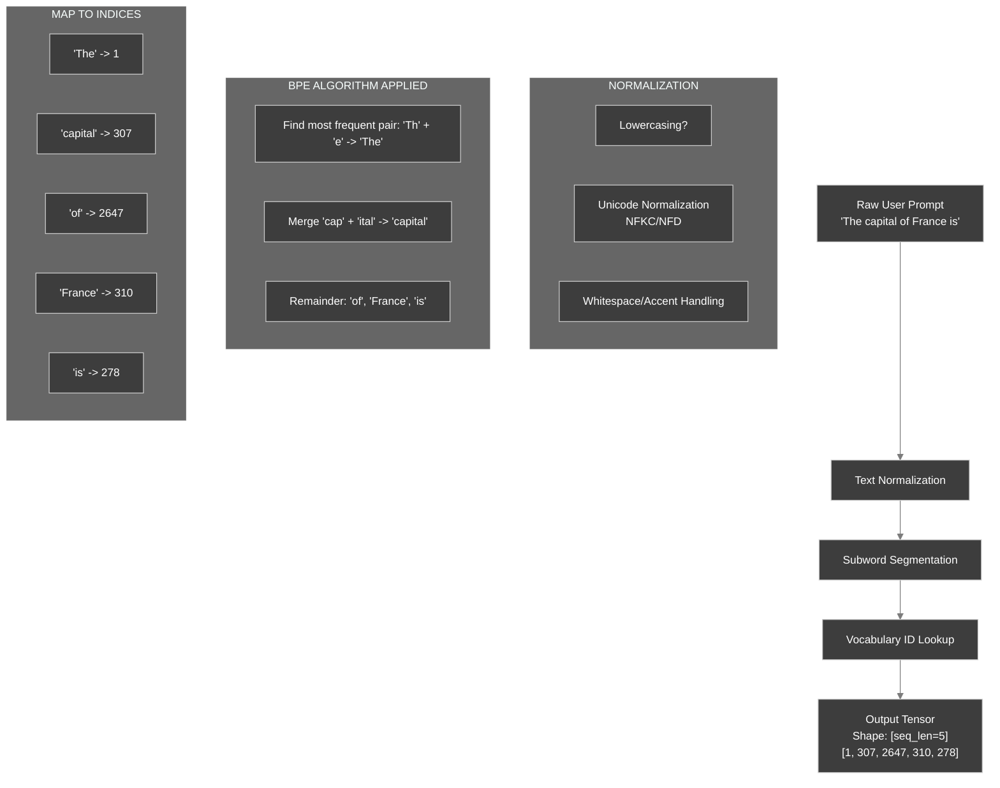

### 1.4 What You Will Build

You will implement the core BPE vocabulary building algorithm. This algorithm starts with individual bytes and iteratively merges the most frequent pairs to build a compressed vocabulary. Understanding this process reveals why different tokenizers produce different sequence lengths for the same text.

### 1.5 BPE Algorithm Implementation

The following code implements the core logic of BPE. Some parts are missing—fill them in.

```python
# tokenizer_demo.py
from collections import Counter
from typing import List, Dict, Tuple

def build_bpe_vocab(text_corpus: List[str], vocab_size: int) -> Tuple[Dict, Dict]:
    """
    Build BPE vocabulary from text corpus.
    Based on the original compression algorithm described by Gage (1994) .
    """
    # Initialize with byte-level tokens (0-255)
    vocab = {chr(i): i for i in range(256)}
    merges = {}

    for _ in range(vocab_size - 256):
        # Count adjacent pairs
        pairs = Counter()
        for text in text_corpus:
            # Convert text to list of token IDs (using current vocab)
            # In practice, this would use the current merge rules
            tokens = list(text.encode('utf-8'))
            for i in range(len(tokens) - 1):
                pairs[(tokens[i], tokens[i+1])] += 1

        if not pairs:
            break

        # Find most frequent pair
        best_pair = max(pairs.items(), key=lambda x: x[1])[0]

        # Q1: What should new_token_id be?
        new_token_id = ___  # Fill in

        # Q2: Add the pair to vocab. What key should be used?
        vocab[___] = new_token_id
        merges[best_pair] = new_token_id

        # Apply merge to corpus (simplified)
        # In a real implementation, you would update the corpus representation

    return vocab, merges
```

**Hints:**

- Q1: The new token ID should be the next available index.
- Q2: The key should be the pair itself (e.g., (97, 98) for 'a','b') so that later we can look up merged tokens.

<details>
<summary>Click to see solution</summary>

```python
new_token_id = len(vocab)
vocab[best_pair] = new_token_id
```

The vocabulary maps either a single byte (as a character) or a tuple of two token IDs to a new token ID. This allows the BPE algorithm to build a hierarchy of merges. Modern implementations like SentencePiece and HuggingFace tokenizers extend this concept with byte-level BPE to handle any Unicode character.

</details>

### 1.6 Understanding BPE Merges

**Question:** Given the text "aaabdaaabac", what would be the first merge BPE performs?

<details>
<summary>Click to review</summary>

The pair "aa" appears 4 times (most frequent), so BPE would merge it first, creating a new token for "aa". The text becomes: "[aa]abdaaabac" where [aa] is a single token.

This demonstrates why BPE is effective: common patterns get compressed into single tokens, reducing sequence length.

</details>

### 1.7 From Discrete IDs to Continuous Embeddings

Once token IDs are obtained, they are passed through an embedding layer—a simple lookup table that returns a dense vector for each ID. This matrix is one of the largest parameters in the model.


**Mathematical Formulation:**

Given token IDs $X \in \mathbb{Z}^{B \times S}$ and embedding matrix $W \in \mathbb{R}^{V \times D}$, the operation is:

$$E = W[X] \in \mathbb{R}^{B \times S \times D}$$

This indexing operation is a pure, parallelizable memory read. In production systems, the embedding matrix is typically stored in GPU memory and accessed with high bandwidth.

### 1.8 Complete Initial Pipeline

The following class combines tokenization and embedding. Fill in the missing parts.

```python
# text_to_tensor.py
import torch
import torch.nn as nn
from typing import List, Tuple, Optional

class TextToTensorPipeline:
    """End-to-end pipeline from raw text to model-ready embeddings."""

    def __init__(self, tokenizer, embedding_layer: nn.Embedding, device: str = "cuda"):
        self.tokenizer = tokenizer
        self.embedding = embedding_layer.to(device)
        self.device = device

    def __call__(self, prompts: List[str], max_length: Optional[int] = None) -> Tuple[torch.Tensor, torch.Tensor]:
        """
        Convert batch of prompts to embeddings.

        Args:
            prompts: List of text prompts
            max_length: Optional truncation/padding length

        Returns:
            embeddings: Float tensor of shape [batch, seq_len, hidden_dim]
            attention_mask: Bool tensor of shape [batch, seq_len]
        """
        # 1. Tokenization (CPU-bound)
        tokenized = self.tokenizer(
            prompts,
            padding=True if max_length else 'longest',
            truncation=True if max_length else False,
            max_length=max_length,
            return_tensors="pt"
        )

        # 2. Move to device
        input_ids = tokenized['input_ids'].to(self.device)
        attention_mask = tokenized['attention_mask'].to(self.device)

        # 3. Embedding lookup (GPU memory-bound)
        # Q1: Complete the embedding lookup
        embeddings = self.embedding(___)

        # 4. Apply positional encoding scaling (common in transformer models)
        hidden_dim = embeddings.size(-1)
        embeddings = embeddings * (hidden_dim ** 0.5)

        return embeddings, attention_mask
```

**Hints:**

- Q1: `self.embedding` expects token IDs.

<details>
<summary>Click to see solution</summary>

```python
embeddings = self.embedding(input_ids)
```

**Explanation:** The embedding layer is a lookup table. Given token IDs, it returns the corresponding embedding vectors. This is a pure memory operation with no computation.

</details>

### 1.9 Understanding Embedding Dimensions

**Question:** If a model has a vocabulary of 50,000 tokens and an embedding dimension of 4096, how much memory does the embedding matrix consume in FP16?

<details>
<summary>Click to review</summary>

Memory = vocab_size × embedding_dim × bytes_per_param
= 50,000 × 4,096 × 2 bytes
= 409,600,000 bytes
≈ 391 MB

This is one of the largest single parameters in the model. For a 13B parameter model, the embedding matrix alone can consume 2-3% of total memory.

</details>

### 1.10 Test and Verify

Run the following code to see tokenization in practice with a real tokenizer (GPT‑2). First, predict what the output will look like.

```python
# test_tokenizer.py
from transformers import AutoTokenizer

tokenizer = AutoTokenizer.from_pretrained("gpt2")
text = "The capital of France is"
tokens = tokenizer.encode(text)
print("Token IDs:", tokens)
print("Decoded:", tokenizer.decode(tokens))
```

**Predict:** What will `decode(tokens)` return? Will it exactly match the input string?

<details>
<summary>Click to verify</summary>

```
Token IDs: [464, 2506, 286, 3260, 318]
Decoded: The capital of France is
```

Note: The tokenizer adds a leading space before "The" because GPT‑2 was trained with a space before each word. This is an artifact of its BPE vocabulary and byte-level encoding .

</details>

### 1.8 Tokenization Pipeline Architecture

The diagram below shows how tokenization fits into the broader inference pipeline in production systems like NVIDIA's TensorRT-LLM .

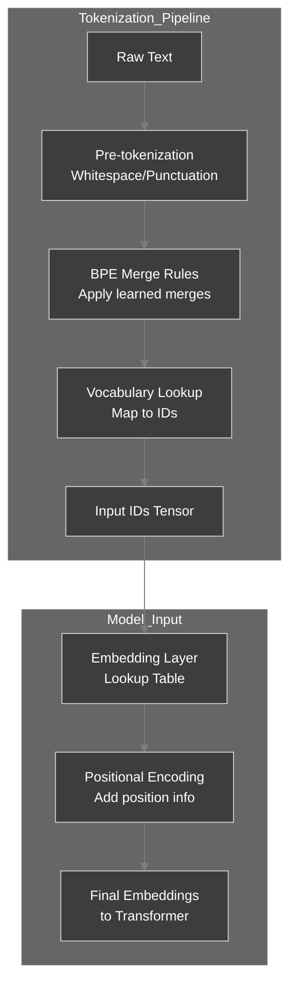

### 1.9 Checkpoint

**Self-Assessment:**

- [ ]  I can explain why tokenization affects the effective context window.
- [ ]  I can describe the BPE merge process in one sentence.
- [ ]  I understand that the embedding layer is a simple lookup table.
- [ ]  I can predict the output of `tokenizer.decode(tokenizer.encode(...))` for a simple sentence.

### 1.11 Tokenization Impact on Inference

**Scenario:** You are serving a multilingual model. English requests average 100 tokens, but Chinese requests average 180 tokens for similar content length.

**Question:** If your GPU can handle batches of 32 requests with 100-token sequences, how many Chinese requests can you batch?

<details>
<summary>Click to review</summary>

Memory constraint: 32 × 100 = 3,200 total tokens
Chinese batch size: 3,200 / 180 ≈ 17 requests

This 47% reduction in batch size directly impacts throughput. Production systems must account for tokenizer efficiency when capacity planning.

</details>

### 1.12 Experiment: Vocabulary Size Impact

1. Load a different tokenizer, e.g., `"bert-base-uncased"`, and tokenize the same sentence.
2. Compare the number of tokens.
3. Which tokenizer produces more tokens? Why?

<details>
<summary>Experiment Guide</summary>

BERT uses WordPiece tokenization, which differs from BPE. You'll likely find that BERT produces more tokens for the same text because its vocabulary size (∼30,000) is smaller than GPT-2's (∼50,000). This trade-off between vocabulary size and sequence length is fundamental to tokenizer design .

</details>

---

## Chapter 2: The Inference Graph vs Training Graph

The training computational graph and the inference graph share the same forward pass, but differ fundamentally in memory requirements and bottlenecks. Understanding this distinction is critical for designing efficient serving systems.

### 2.1 Think First: What's Different in Inference?

During training, the model computes gradients and updates weights. During inference, you only need the forward pass to produce logits.

**Question:** Which components of the training pipeline can be completely eliminated during inference? Which must remain?

<details>
<summary>Click to review</summary>

- **Eliminated:** Backward pass, gradient storage, optimizer states (momentum, variance).
- **Remain:** Forward pass, weights, and the KV cache (for autoregressive generation).

As noted in the vLLM paper analysis, "the training graph's memory footprint is dominated by optimizer states and gradients needed for the backward pass, consuming 3-4x the memory of the weights alone. The inference graph eliminates all this, leaving only static weights and the dynamic KV Cache" .

</details>

### 2.2 Contrasting Computational Graphs

The diagram below highlights the divergence.

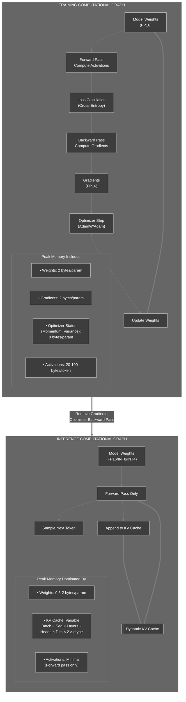

### 2.3 Memory Breakdown for a 13B Model

Research shows that "GPU memory is primarily consumed by model weights and the remainder is used by the KV cache. Thus, the free GPU space available to the KV cache is a scarce resource that needs to be managed in an efficient way" .

| Component | Training (Adam, FP16) | Inference (FP16 + KV Cache) | Inference (INT4 + KV Cache) |
| --- | --- | --- | --- |
| **Weights** | 26 GB | 26 GB | **~6.5 GB** |
| **Gradients** | 26 GB | **0 GB** | **0 GB** |
| **Optimizer States** | 52 GB | **0 GB** | **0 GB** |
| **Activations** | ~40‑80 GB | <1 GB | <1 GB |
| **KV Cache** | N/A | **Dynamic** | **Dynamic** |
| **Approx. Total** | **~144+ GB** | **~26 GB + Cache** | **~6.5 GB + Cache** |
| **Hardware Required** | 8×H100 (80GB) | 1×H100 (80GB) | 1×RTX 4090 (24GB) |

### 2.4 Quantifying the Gap

The table shows that inference can run on hardware an order of magnitude smaller. The primary bottleneck shifts from compute (FLOPs) to **memory bandwidth**, specifically for the KV cache. As vLLM's analysis reveals, "the system becomes memory-bound, not compute-bound" when using fine-grained batching .

### 2.5 Training vs Inference Memory Footprint Visualization

This diagram illustrates why inference enables aggressive optimizations like quantization.

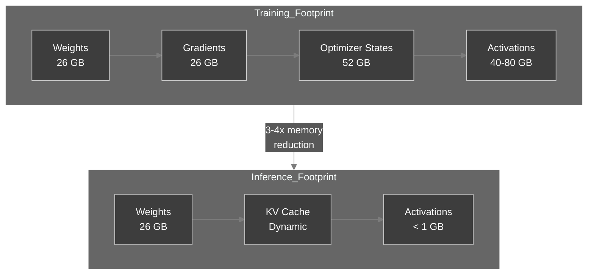

### 2.6 Understanding Memory Trade-offs

**Question:** A 13B parameter model in FP16 requires 26GB for weights. If you quantize to INT4, how much memory do you save? What is the trade-off?

<details>
<summary>Click to review</summary>

FP16: 13B × 2 bytes = 26GB
INT4: 13B × 0.5 bytes = 6.5GB
Savings: 19.5GB (75% reduction)

Trade-off: Quantization introduces accuracy loss. INT4 quantization typically results in 1-3% degradation in model quality metrics. The decision depends on whether the memory savings justify the quality loss for your use case.

</details>

### 2.7 Checkpoint

**Self-Assessment:**

- [ ]  I can list three components present in training but absent in inference.
- [ ]  I can explain why inference memory is dominated by weights + KV cache.
- [ ]  I understand why quantization (INT4) is feasible for inference but difficult during training.

---

## Chapter 3: The KV Cache – Core of Autoregression

The KV cache is the central data structure in autoregressive inference. It stores intermediate attention states to avoid redundant computation. Understanding its growth patterns and memory requirements is essential for capacity planning.

### 3.1 Think First: Why Can't We Recompute?

In an autoregressive model, each new token attends to all previous tokens. Without caching, generating token $t_n$ would require recomputing the key and value vectors for tokens $t_1…t_{n-1}$—an $O(n^2)$ cost.

**Question:** If you generate 1000 tokens and each forward pass takes 10 ms without cache, how long would it take with recomputation? With caching?

<details>
<summary>Click to review</summary>

- Without cache: first token (prefill) processes prompt, then each subsequent token recomputes all previous keys/values → total time ~ O(n²). For n=1000, ~500k operations, likely seconds to minutes.
- With cache: prefill O(prompt_len), each decode O(1) new work → linear time. For 1000 tokens, ~1000 * (decode time) which is typically < 0.1 ms per token → <100 ms.

As the IEEE characterization paper notes, the KV cache exists "to avoid redundant recomputation in each decode iteration" .

</details>

### 3.2 Anatomy of the Cache in a Single Attention Head

During forward pass, each token's hidden state is projected into query (Q), key (K), and value (V). The KV cache stores K and V from all previous tokens.

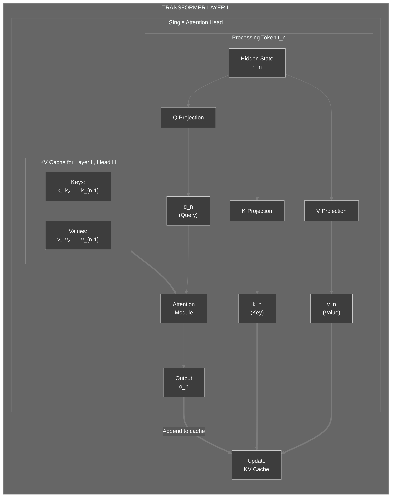

### 3.3 KV Cache Growth per Token (Iterative View)

The sequence diagram shows how the cache expands and why fragmentation appears without paging.

```mermaid
%%{init: {'theme':'dark', 'themeVariables': { 'primaryColor':'#3d3d3d','primaryTextColor':'#fff','primaryBorderColor':'#7c7c7c','lineColor':'#7c7c7c','secondaryColor':'#4a4a4a','tertiaryColor':'#3d3d3d','background':'#2d2d2d','mainBkg':'#3d3d3d','secondBkg':'#4a4a4a','textColor':'#fff','fontSize':'14px','actorBkg':'#3d3d3d','actorBorder':'#7c7c7c','actorTextColor':'#fff','noteBkgColor':'#4a4a4a','noteBorderColor':'#7c7c7c','noteTextColor':'#fff'}}}%%
sequenceDiagram
    participant GPU_Mem as GPU Memory
    participant ReqA as Request A
    participant ReqB as Request B

    Note over ReqA: Prefill: 6 tokens
    ReqA->>GPU_Mem: Allocate KV rows t₁–t₆ (contiguous)
    Note over ReqA: Decode step 1
    ReqA->>GPU_Mem: Append KV row t₇
    Note over ReqA: Decode step 2
    ReqA->>GPU_Mem: Append KV row t₈

    Note over ReqB: Prefill: 3 tokens
    ReqB->>GPU_Mem: Allocate KV rows t₁–t₃ (finds gap or tail)

    Note over GPU_Mem: ⚠️ Without paging: Mixed-length gaps appear as requests finish; new requests struggle to find contiguous chunks
```

### 3.4 Cache Memory Calculation

Fill in the blanks to compute the cache size for Llama-3 8B:

```python
# Configuration
seq_len = 2048
num_layers = 32
num_kv_heads = 8   # Grouped Query Attention
head_dim = 128
dtype_bytes = 2    # FP16

# Q1: Calculate bytes per token (all layers, all kv heads)
cache_per_token = 2 * ___ * ___ * ___ * ___
print(f"Cache per token: {cache_per_token} bytes = {cache_per_token / 1024:.2f} KB")

# Q2: Calculate total cache for seq_len
total_cache_bytes = cache_per_token * ___
print(f"Total cache: {total_cache_bytes / (1024**3):.2f} GB")
```

**Hints:**

- Q1: 2 (for K and V) × layers × kv_heads × head_dim × dtype_bytes.
- Q2: Multiply by seq_len.

<details>
<summary>Click to see solution</summary>

```python
cache_per_token = 2 * num_layers * num_kv_heads * head_dim * dtype_bytes
# = 2 * 32 * 8 * 128 * 2 = 131072 bytes = 128 KB

total_cache_bytes = cache_per_token * seq_len
# = 131072 * 2048 = 268435456 bytes ≈ 0.25 GB
```

</details>

### 3.5 KV Cache Scaling Visualization

This diagram shows how cache size scales with sequence length and batch size.

```mermaid
%%{init: {'theme':'dark', 'themeVariables': { 'primaryColor':'#3d3d3d','primaryTextColor':'#fff','primaryBorderColor':'#7c7c7c','lineColor':'#7c7c7c','secondaryColor':'#4a4a4a','tertiaryColor':'#3d3d3d','background':'#2d2d2d','mainBkg':'#3d3d3d','secondBkg':'#4a4a4a','textColor':'#fff','fontSize':'14px'}}}%%
graph TD
    subgraph Cache_Sizing [" KV CACHE MEMORY BREAKDOWN "]
        direction LR
        Input_Node["Input<br/>Parameters"] --> Formula["Cache Size<br/>Formula"];

        subgraph Input_Subgraph [" Model Configuration "]
            L["L = 32 layers"]
            H["H_kv = 8 heads"]
            Dh["D_h = 128 dim"]
            Bytes["2 bytes (FP16)"]
        end

        Formula --> PerToken["Per Token:<br/>128 KB"];
        PerToken --> SeqLen["Sequence<br/>Length"];

        subgraph SeqLen [" Varying Sequence Lengths "]
            S1["S = 512<br/>→ 64 MB"]
            S2["S = 1024<br/>→ 128 MB"]
            S3["S = 2048<br/>→ 256 MB"]
            S4["S = 4096<br/>→ 512 MB"]
        end

        SeqLen --> Batch["Batch<br/>Scaling"];

        subgraph Batch [" Batch Size Impact "]
            B1["Batch = 1<br/>→ 256 MB"]
            B2["Batch = 4<br/>→ 1 GB"]
            B3["Batch = 16<br/>→ 4 GB"]
            B4["Batch = 64<br/>→ 16 GB"]
        end

        Batch --> Conclusion["Conclusion:<br/>Cache dominates<br/>memory at scale"];
    end
```

### 3.6 Performance Analysis: Cache vs Recomputation

**Scenario:** Compare the computational cost of generating 100 tokens with and without KV caching for a model with 32 layers and 32 attention heads.

**Without cache:**
- Token 1: Compute attention for 1 token (prompt)
- Token 2: Recompute attention for 2 tokens
- Token 3: Recompute attention for 3 tokens
- ...
- Token 100: Recompute attention for 100 tokens

Total operations: 1 + 2 + 3 + ... + 100 = 5,050 attention computations

**With cache:**
- Token 1: Compute attention for 1 token, store K/V
- Token 2: Compute attention for 1 new token, read 1 cached K/V
- Token 3: Compute attention for 1 new token, read 2 cached K/V
- ...
- Token 100: Compute attention for 1 new token, read 99 cached K/V

Total operations: 100 attention computations (50x reduction)

**Question:** At what sequence length does the memory cost of caching exceed the computational savings?

<details>
<summary>Click to review</summary>

This depends on hardware characteristics:
- Memory bandwidth: How fast can you read cached K/V?
- Compute throughput: How fast can you recompute K/V?

On modern GPUs (A100, H100), memory bandwidth is the bottleneck. The cache is always beneficial because reading cached values is faster than recomputing them, even for very long sequences.

The practical limit is GPU memory capacity, not computational trade-offs.

</details>

### 3.7 Checkpoint

**Self-Assessment:**

- [ ]  I can explain why the KV cache is necessary.
- [ ]  I can compute the cache size for any model given its configuration.
- [ ]  I understand that the cache grows linearly with sequence length.
- [ ]  I can calculate the computational savings from caching vs recomputation.

### 3.8 Experiment: Simulate Cache Growth

1. Write a simple Python script that simulates the KV cache growth for multiple requests with random sequence lengths.
2. Measure how much memory would be wasted if you allocated contiguous blocks for each request (i.e., internal fragmentation due to different lengths).

<details>
<summary>Experiment Guide</summary>

The vLLM paper found that "only 20–38% of the allocated KV cache memory is actually used in existing systems" due to fragmentation . Your simulation should demonstrate that contiguous allocation leads to significant waste, motivating the need for paged attention.

</details>

---

## Chapter 4: PagedAttention – Solving Fragmentation

Memory fragmentation is the primary obstacle to high-throughput inference. PagedAttention solves this by adapting virtual memory concepts from operating systems to GPU memory management.

### 4.1 Think First: The Fragmentation Problem

When requests finish at different times, they leave holes in GPU memory. A new request may not fit into a single contiguous hole, even though total free memory is sufficient.

**Question:** How do operating systems solve a similar problem with RAM fragmentation?

<details>
<summary>Click to review</summary>

Operating systems use **paging**: physical memory is divided into fixed‑size frames, and each process's virtual address space is mapped to these frames via a page table. Non‑contiguous physical pages can be mapped to a contiguous virtual view.

This is exactly the insight behind PagedAttention: "Why not treat the KV cache like an operating system treats virtual memory?" .

</details>

### 4.2 Contiguous Allocation vs PagedAttention

The diagram below illustrates the problem and solution.


The vLLM paper identifies three distinct kinds of waste with contiguous allocation :

1. **Reserved but Unused Slots:** Allocating space for maximum possible tokens, but request uses far fewer.
2. **Internal Fragmentation:** Over-allocation within a request's reserved slab.
3. **External Fragmentation:** Free memory scattered in non-contiguous chunks.

### 4.3 PagedAttention Core Data Structures

Implement the core classes with missing parts.

```python
# kv_cache.py
from dataclasses import dataclass
from collections import deque
from typing import List, Optional, Tuple, Dict
import torch

@dataclass
class KVCacheBlock:
    """A fixed-size block of KV cache holding multiple tokens."""
    block_id: int
    key_cache: torch.Tensor   # shape: [num_layers, num_kv_heads, block_size, head_dim]
    value_cache: torch.Tensor
    ref_count: int = 0

    def get_kv(self, layer_idx: int, head_idx: int) -> Tuple[torch.Tensor, torch.Tensor]:
        """Get KV tensors for specific layer and head."""
        return (
            self.key_cache[layer_idx, head_idx],
            self.value_cache[layer_idx, head_idx]
        )

class PagedKVCache:
    """Manages KV cache using paged attention scheme as described in vLLM paper ."""

    def __init__(self, num_blocks: int, block_size: int, num_layers: int,
                 num_kv_heads: int, head_dim: int, dtype: torch.dtype = torch.float16):
        self.block_size = block_size
        self.num_layers = num_layers
        self.num_kv_heads = num_kv_heads
        self.head_dim = head_dim

        # Pre‑allocate all blocks
        self.blocks: List[KVCacheBlock] = []
        for block_id in range(num_blocks):
            key = torch.zeros(num_layers, num_kv_heads, block_size, head_dim, dtype=dtype, device='cuda')
            value = torch.zeros_like(key)
            self.blocks.append(KVCacheBlock(block_id, key, value))

        self.free_blocks: deque = deque(range(num_blocks))
        self.block_tables: Dict[str, List[int]] = {}   # request_id -> list of block_ids

    def allocate(self, request_id: str, seq_len: int) -> Optional[List[int]]:
        """Allocate blocks for a request. Returns list of block IDs or None if insufficient."""
        blocks_needed = (seq_len + self.block_size - 1) // self.block_size
        if len(self.free_blocks) < blocks_needed:
            return None

        allocated = []
        for _ in range(blocks_needed):
            # Q1: Pop from free_blocks and append to allocated
            block_id = self.free_blocks.___
            allocated.___
            self.blocks[block_id].ref_count += 1

        self.block_tables[request_id] = allocated
        return allocated

    def free(self, request_id: str):
        """Free blocks for a finished request."""
        if request_id not in self.block_tables:
            return
        for block_id in self.block_tables[request_id]:
            self.blocks[block_id].ref_count -= 1
            if self.blocks[block_id].ref_count == 0:
                # Q2: Return block to free pool
                self.free_blocks.___
        del self.block_tables[request_id]

    def get_required_blocks(self, seq_len: int) -> int:
        """Calculate number of blocks needed for a sequence length."""
        return (seq_len + self.block_size - 1) // self.block_size
```

**Hints:**

- Q1: Use `popleft()` and `append()`.
- Q2: Use `append()`.

<details>
<summary>Click to see solution</summary>

```python
block_id = self.free_blocks.popleft()
allocated.append(block_id)
...
self.free_blocks.append(block_id)
```

</details>

### 4.4 Block Table and Physical Memory

The block table maps logical token positions to physical block IDs.

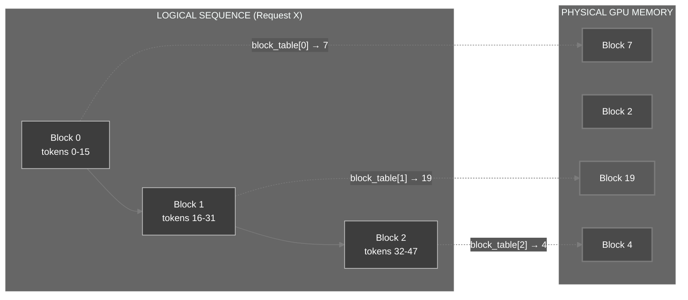

### 4.5 PagedAttention Kernel Architecture

The diagram below shows how the PagedAttention kernel accesses blocks during computation, based on the vLLM implementation .

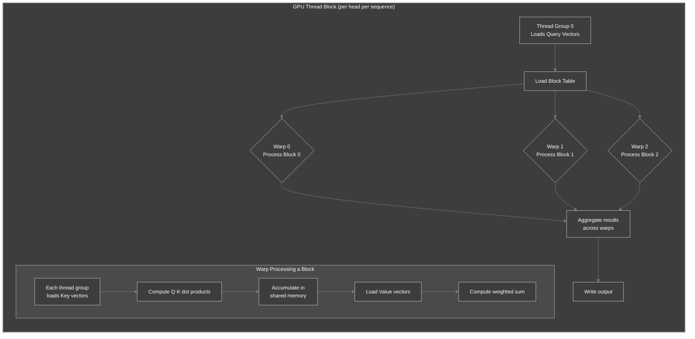

### 4.6 Block Size Trade-offs

Block size is a critical tuning parameter. The vLLM paper notes: "A smaller block size reduces internal fragmentation but increases kernel overhead; a larger block size improves kernel efficiency but wastes more memory" .

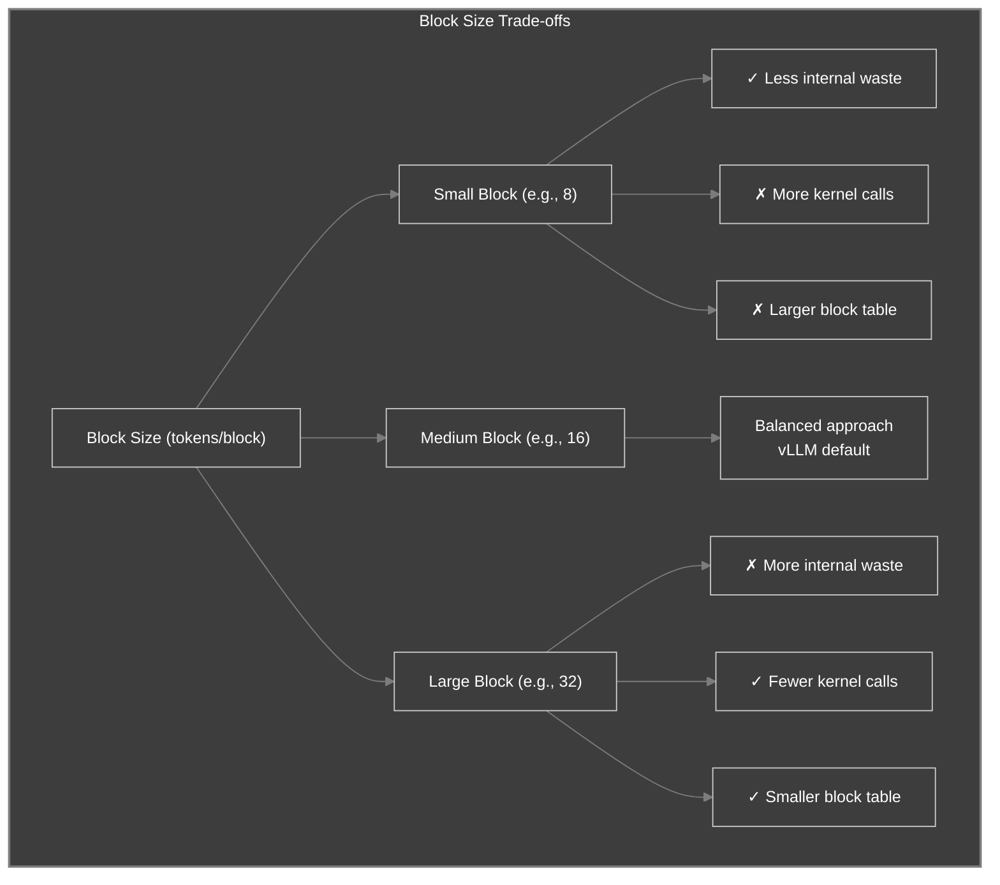

### 4.7 Understanding Block Allocation

**Question:** A request needs to store 50 tokens. With a block size of 16, how many blocks are allocated? How many token slots are wasted?

<details>
<summary>Click to review</summary>

Blocks needed: ceil(50 / 16) = 4 blocks
Total capacity: 4 × 16 = 64 token slots
Used: 50 tokens
Wasted: 64 - 50 = 14 tokens (internal fragmentation)

Waste percentage: 14 / 64 = 21.9%

This is the maximum internal fragmentation per request. Across many requests with varying lengths, the average waste is approximately block_size / 2.

</details>

### 4.8 Checkpoint

**Self-Assessment:**

- [ ]  I can explain why contiguous allocation leads to fragmentation.
- [ ]  I understand how PagedAttention uses a block table to decouple logical and physical memory.
- [ ]  I can implement a basic block allocator with reference counting.

### 4.8 Experiment: Simulate Fragmentation

1. Write a simulation that allocates and frees blocks for random requests.
2. Track the number of free blocks and compare the fragmentation in contiguous vs paged allocation.

<details>
<summary>Experiment Guide</summary>

The vLLM paper reports that with PagedAttention, "internal fragmentation collapses" to at most block_size - 1 tokens per sequence, and external fragmentation is eliminated entirely . Your simulation should show that paged allocation achieves near-100% utilization while contiguous allocation wastes 60-80% of memory.

</details>

---

## Chapter 5: Building the Inference Pipeline

### 5.1 Think First: Orchestrating Requests

A real inference engine must handle multiple requests concurrently. Requests arrive at different times, have different prompt lengths, and generate different numbers of output tokens.

**Question:** What challenges arise when mixing a short prompt (e.g., 10 tokens) with a long prompt (e.g., 2000 tokens) in the same batch?

<details>
<summary>Click to review</summary>

- **Prefill phase:** The short prompt finishes quickly and moves to decode, while the long prompt is still in prefill. The batch must handle both phases simultaneously.
- **Memory:** The long prompt consumes more KV cache blocks.
- **Scheduling:** The engine must decide when to admit new requests and when to preempt running ones.

As the IEEE characterization study notes, "the decision of what batching strategy, what KV cache eviction policy to apply and how the KV cache impacts the inference performance is non-trivial" .

</details>

### 5.2 Two-Phase Inference Architecture

Production systems like NVIDIA's TensorRT-LLM explicitly separate prefill and generation phases .

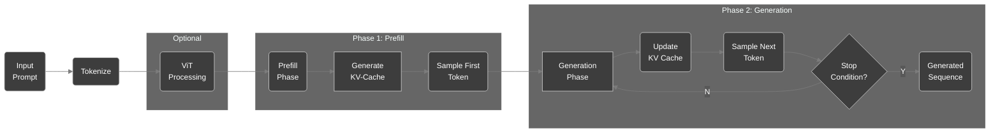

### 5.3 Core Data Structures

The scheduler tracks request state and allocates resources.

```python
# scheduler.py
from enum import Enum
from dataclasses import dataclass
import time
from typing import List, Optional, Dict, Any

class RequestStatus(Enum):
    WAITING = "waiting"
    RUNNING = "running"
    FINISHED = "finished"

@dataclass
class InferenceRequest:
    """A single user request with engine-managed state."""
    request_id: str
    prompt_token_ids: List[int]
    output_token_ids: List[int] = None
    status: RequestStatus = RequestStatus.WAITING
    block_table: List[int] = None
    created_at: float = None
    started_at: float = None

    def __post_init__(self):
        if self.output_token_ids is None:
            self.output_token_ids = []
        if self.created_at is None:
            self.created_at = time.time()

    @property
    def total_tokens(self) -> int:
        return len(self.prompt_token_ids) + len(self.output_token_ids)

    @property
    def is_prefill(self) -> bool:
        return len(self.output_token_ids) == 0

class BatchScheduler:
    """Implements continuous batching as described in vLLM paper ."""

    def __init__(self, max_batch_size=64, max_seq_len=4096):
        self.max_batch_size = max_batch_size
        self.max_seq_len = max_seq_len
        self.waiting_queue = []
        self.running_queue = []
        self.finished_queue = []

    def add_request(self, request: InferenceRequest):
        self.waiting_queue.append(request)

    def schedule(self, kv_cache: PagedKVCache) -> List[InferenceRequest]:
        # Sort waiting by prompt length (smaller first for efficiency)
        self.waiting_queue.sort(key=lambda r: len(r.prompt_token_ids))

        scheduled = []
        for request in list(self.waiting_queue):
            if len(self.running_queue) + len(scheduled) >= self.max_batch_size:
                break
            # Q1: Compute required blocks for this request
            required_blocks = kv_cache.get_required_blocks(request.total_tokens)
            if len(kv_cache.free_blocks) < required_blocks:
                continue
            block_table = kv_cache.allocate(request.request_id, request.total_tokens)
            if block_table:
                request.block_table = block_table
                request.status = RequestStatus.RUNNING
                request.started_at = time.time()
                self.waiting_queue.remove(request)
                self.running_queue.append(request)
                scheduled.append(request)
        return scheduled
```

### 5.4 The Engine's Execution Loop

The following diagram shows the flow of one engine step.

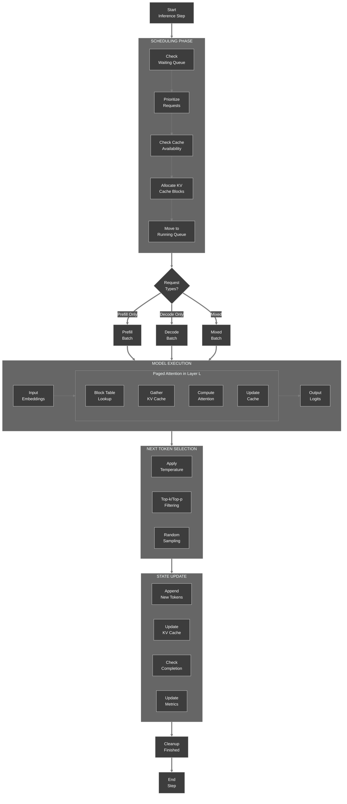

### 5.5 Continuous Batching Timeline

This Gantt chart shows how prefill and decode phases interleave for multiple requests.

```mermaid
gantt
    dateFormat  X
    axisFormat  %L ms
    title Continuous Batching Timeline: Overlapping Requests

    section Request A (512 tokens)
    Prefill A (45ms)     :done, a1, 0, 45
    Decode A (100 tokens):active, a2, 45, 145

    section Request B (64 tokens)
    Waiting             :done, b0, 10, 15
    Prefill B (6ms)     :done, b1, 15, 21
    Decode B (50 tokens):active, b2, 21, 71

    section Request C (256 tokens)
    Waiting             :done, c0, 20, 25
    Prefill C (22ms)    :done, c1, 25, 47
    Decode C (150 tokens):active, c2, 47, 197
```

### 5.6 Simplified Engine Step Implementation

Fill in the missing parts of the engine's main step.

```python
# engine.py
class NanoVLLMEngine:
    """Minimal inference engine implementing the full pipeline."""

    def __init__(self, model, tokenizer, scheduler, kv_cache):
        self.model = model
        self.tokenizer = tokenizer
        self.scheduler = scheduler
        self.kv_cache = kv_cache
        self.requests: Dict[str, InferenceRequest] = {}

    def add_request(self, prompt: str, **params) -> str:
        """Add a new inference request."""
        token_ids = self.tokenizer.encode(prompt)
        request_id = f"req_{len(self.requests)}"
        request = InferenceRequest(
            request_id=request_id,
            prompt_token_ids=token_ids
        )
        self.requests[request_id] = request
        self.scheduler.add_request(request)
        return request_id

    def step(self):
        # 1. Schedule new requests
        scheduled = self.scheduler.schedule(self.kv_cache)
        if not self.scheduler.running_queue:
            return {}

        # 2. Prepare batch
        batch = self._prepare_batch(self.scheduler.running_queue)

        # 3. Forward pass
        if batch['is_prefill']:
            logits = self.model.prefill(batch['embeddings'], batch['block_tables'])
        else:
            logits = self.model.decode(batch['embeddings'], batch['block_tables'], batch['seq_lengths'])

        # 4. Sample next tokens
        next_tokens = self._sample(logits, batch['requests'])

        # 5. Update each request
        completed = []
        for i, req in enumerate(batch['requests']):
            req.output_token_ids.append(next_tokens[i])
            # Q1: Update KV cache (append new K/V for this token)
            # (Assume model has method to get new K/V from last token)
            new_k, new_v = self.model.get_last_kv(req, next_tokens[i])
            # In a full implementation, you would call kv_cache.append
            # self.kv_cache.append(req.request_id, new_k, new_v)

            if self._is_finished(req):
                req.status = RequestStatus.FINISHED
                self.scheduler.running_queue.remove(req)
                self.scheduler.finished_queue.append(req)
                self.kv_cache.free(req.request_id)
                completed.append(req.request_id)

        return {'completed': completed}
```

**Hints:**

- Q1: The exact implementation of `append` depends on the cache design. In a paged cache, you would write into the current block and allocate a new block if needed.

<details>
<summary>Click to see discussion</summary>

In a real implementation, `append` would:

- Determine the current block and offset from the block table and sequence length.
- Write the new K and V tensors into the appropriate slot in that block.
- If the block is full, allocate a new block from the free pool and update the block table.

The vLLM kernel documentation describes this process in detail: each thread group loads query vectors, then iterates over blocks, computing attention scores and accumulating results .

</details>

### 5.7 Request State Machine

This diagram shows the lifecycle of a request through the engine.

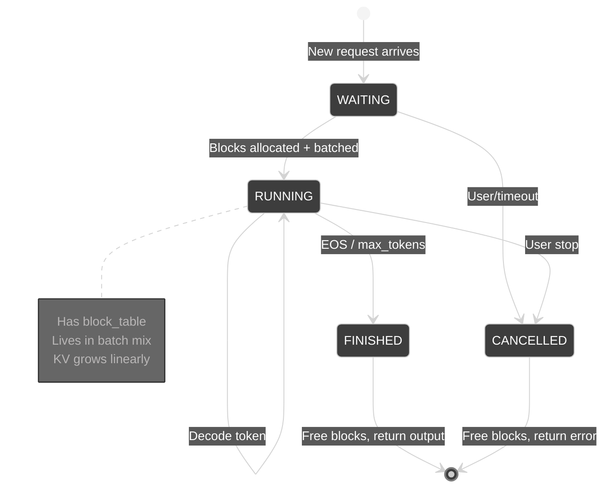

### 5.8 Checkpoint

**Self-Assessment:**

- [ ]  I can explain the role of the scheduler in continuous batching.
- [ ]  I understand how the engine interleaves prefill and decode.
- [ ]  I can trace the data flow from request admission to token output.

---

## Epilogue: The Complete System

You have now built (conceptually) all components of a minimal inference engine:

| Component | Purpose | Source |
| --- | --- | --- |
| Tokenizer | Converts text to token IDs | BPE algorithm |
| Embedding layer | Maps IDs to dense vectors | Standard transformer component |
| Transformer layers | Process embeddings with cached K/V | Attention mechanism |
| KV cache | Stores keys/values for previous tokens | Avoids recomputation |
| PagedAttention allocator | Manages cache blocks without fragmentation | vLLM design |
| Scheduler | Orchestrates multiple requests | Continuous batching |
| Sampler | Selects next token | Top-k, top-p, temperature |

To verify your understanding, run through the full flow for a single request:

```python
# Simulate one inference step (pseudocode)
request = InferenceRequest(request_id="1", prompt_token_ids=[1,2,3,4])
engine.add_request(request)
while engine.has_running():
    output = engine.step()
    if output['completed']:
        print(f"Completed: {output['completed']}")
```

---

## The Principles

1. **Inference is a subset of training** – Remove backward pass, gradients, and optimizer states; only forward pass and KV cache remain. This shifts bottlenecks from compute to memory bandwidth .
2. **The KV cache is the only dynamic state** – Its size grows linearly with sequence length and batch size, dominating memory at scale. As research shows, "the KV cache grows linearly with respect to the length and number of reasoning chains" .
3. **Paging eliminates fragmentation** – Decouple logical token order from physical memory using fixed‑size blocks and a block table, exactly as operating systems have done for decades .
4. **Two phases have different characteristics** – Prefill is compute‑bound, decode is memory‑bound; treat them separately in scheduling .
5. **Continuous batching maximizes utilization** – Interleave prefill and decode to keep GPU busy while respecting memory limits .

---

## Troubleshooting

### Error: CUDA out of memory

**Cause:** KV cache has grown too large or too many requests are running concurrently.

**Solutions:**

- Reduce `max_batch_size` in the scheduler.
- Use a smaller block size (but may increase block table overhead).
- Enable request preemption (swap KV cache to CPU) as described in the vLLM paper .

### Error: Tokenizer produces unexpected tokens

**Cause:** The tokenizer may add special tokens (e.g., `<|endoftext|>`) or handle spaces differently.

**Solution:** Inspect the tokenizer's configuration. Byte-level BPE tokenizers like GPT-2's add spaces differently from WordPiece tokenizers like BERT's .

### Error: Model forward pass fails due to shape mismatch

**Cause:** Block table indices out of range or incorrect tensor shapes.

**Solution:** Verify that the block table length matches the number of blocks allocated. Check that `head_dim` and `num_kv_heads` match the model's configuration.

---

## Next Steps

Now that you understand the inference pipeline, proceed to [**Lab 0.2: Prefill vs. Decode – The Two‑Phase Engine**](https://www.notion.so/lab0.2/README.md), where you will dive deeper into the compute‑bound prefill phase and memory‑bound decode phase, and implement a continuous batching scheduler that handles both.

**Suggested extensions:**

- Implement a simple simulator that models cache allocation and measures throughput under different scheduling policies.
- Add support for **speculative decoding** to reduce latency.
- Explore **quantization** (INT8, INT4) to shrink the weight memory footprint.
- Investigate KV cache compression techniques like Dynamic Memory Sparsification .

---

## Additional Resources

- [vLLM: Easy, Fast, and Cheap LLM Serving with PagedAttention](https://vllm.readthedocs.io/) – Production inference engine with PagedAttention
- [FlashAttention: Fast and Memory‑Efficient Exact Attention with IO-Awareness](https://arxiv.org/abs/2205.14135) – I/O-aware attention algorithm
- [Byte-Pair Encoding tokenization](https://huggingface.co/docs/transformers/tokenizer_summary) – Hugging Face's tokenizer documentation
- [TensorRT-LLM Documentation](https://nvidia.github.io/TensorRT-LLM/) – NVIDIA's optimized inference runtime
- [Characterizing KV Caching Under Concurrency](https://ieeexplore.ieee.org/document/11078403) – IEEE study on KV cache behavior

---

**Navigation:** [← Main](https://www.notion.so/README.md) | [Next: Lab 0.2 →](https://www.notion.so/lab0.2/README.md)