# Lab 0.1: From Text to Tensors – The Inference Computational Graph

**Navigation:** [← Main](../README.md) | [Next: Lab 0.2 →](../lab0.2/README.md)

---

## Introduction

This lab dissects the complete computational pipeline that transforms a raw text prompt into a generated token. You will examine every core data structure and operation in the inference graph, from tokenization through the KV cache to final sampling. Unlike traditional tutorials that present code as a black box, this lab requires you to predict, fill in blanks, and experiment with deliberate failures.

Production systems must manage the KV cache—the primary dynamic memory consumer—under concurrent request loads. Understanding this pipeline is essential for building high-performance inference engines.

**Prerequisites:** Basic Python knowledge, familiarity with neural network concepts, and access to a machine with Python 3.8+ and PyTorch installed.

---

## Learning Objectives

By the end of this lab, you will be able to:

1. **Tokenize** raw text using byte-pair encoding (BPE) and calculate sequence length impact on memory
2. **Contrast** the training computational graph with the inference graph, identifying the KV cache as the only dynamic state
3. **Calculate** the memory footprint of the KV cache for a given model configuration and sequence length
4. **Implement** a paged KV cache manager based on the vLLM PagedAttention design
5. **Orchestrate** a minimal inference engine that handles multiple requests with continuous batching

---

## Prologue: The Challenge

You join the ML infrastructure team at a startup that has fine-tuned a 13B parameter language model. The team wants to offer it as a real-time API. Early tests show that the model runs, but latency is high and memory usage grows unpredictably. After a few concurrent requests, the system runs out of GPU memory.

The CTO asks you to investigate: "Why does inference memory blow up after a few requests? How can we serve hundreds of concurrent users?"

Your task is to map the pipeline from raw text to output tokens, identify the bottlenecks, and propose a memory management strategy. This lab builds that understanding step by step.

---

## Environment Setup

Create a Python virtual environment and install the required packages:

```bash
python3 -m venv venv
source venv/bin/activate  # On Windows: venv\Scripts\activate
pip install torch transformers numpy
```

Create the working directory structure:

```bash
mkdir -p lab0.1
cd lab0.1
touch tokenizer_demo.py kv_cache_demo.py scheduler_demo.py
```

Verify PyTorch installation:

```bash
python -c "import torch; print(f'PyTorch version: {torch.__version__}')"
```

**Expected output:**
```
PyTorch version: 2.x.x
```

---

## Chapter 1: Text to Tokens – The Tokenization Pipeline

The language model does not read characters. It reads integers that represent subword units. The tokenizer converts raw text into these integers, directly affecting sequence length, latency, and inference cost. Understanding tokenization is essential because it determines how much text fits into the model's context window.

### 1.1 Why Tokenization Matters

A language model does not read characters; it reads integers that represent subword units. The choice of tokenizer directly affects:

- **Sequence length** – A larger vocabulary compresses text but increases embedding matrix size.
- **Latency** – Longer sequences mean more computation and memory.
- **Cost** – More tokens per request increase inference cost.

Byte Pair Encoding (BPE), originally developed as a data compression algorithm in 1994 , was adapted for neural machine translation to handle rare words by breaking them into subword units . Modern LLMs use a modified version that builds a fixed-size vocabulary by iteratively merging the most frequent adjacent byte pairs in a training corpus.

The diagram below shows the transformation from raw text to token IDs.


### 1.2 Think First: Vocabulary Trade-offs

**Question:** If a model has a 4096-token context window, how many English words can it roughly process in one request? How many Japanese characters? (Assume English averages 1.3 tokens/word, Japanese 2–3 tokens/character.)

<details>
<summary>Click to review</summary>

- English: 4096 / 1.3 ≈ 3150 words
- Japanese: 4096 / 2.5 ≈ 1638 characters

This variability affects system design: an English-heavy workload can fit longer prompts than a Japanese-heavy one, even with the same model. The tokenizer's byte-level BPE variant converts text to UTF-8 first, ensuring any Unicode character can be represented.

</details>

### 1.3 Anatomy of a Tokenizer

Tokenizers use Byte Pair Encoding (BPE) to balance vocabulary size and sequence length. BPE iteratively merges the most frequent adjacent byte pairs in a training corpus, building a vocabulary that compresses text efficiently.

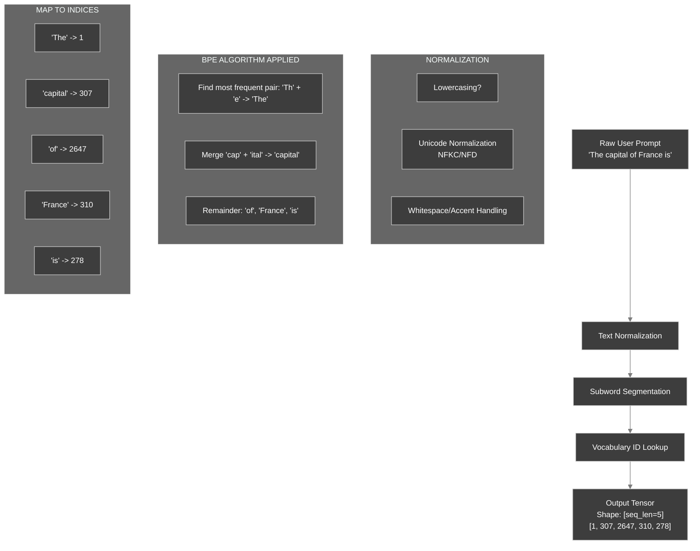

### 1.4 What You Will Build

You will implement the core BPE vocabulary building algorithm. This algorithm starts with individual bytes and iteratively merges the most frequent pairs to build a compressed vocabulary. Understanding this process reveals why different tokenizers produce different sequence lengths for the same text.

### 1.5 BPE Algorithm Implementation

The following code implements the core logic of BPE. Some parts are missing—fill them in.

```python
# tokenizer_demo.py
from collections import Counter
from typing import List, Dict, Tuple

def build_bpe_vocab(text_corpus: List[str], vocab_size: int) -> Tuple[Dict, Dict]:
    """
    Build BPE vocabulary from text corpus.
    Based on the original compression algorithm described by Gage (1994) .
    """
    # Initialize with byte-level tokens (0-255)
    vocab = {chr(i): i for i in range(256)}
    merges = {}

    for _ in range(vocab_size - 256):
        # Count adjacent pairs
        pairs = Counter()
        for text in text_corpus:
            # Convert text to list of token IDs (using current vocab)
            # In practice, this would use the current merge rules
            tokens = list(text.encode('utf-8'))
            for i in range(len(tokens) - 1):
                pairs[(tokens[i], tokens[i+1])] += 1

        if not pairs:
            break

        # Find most frequent pair
        best_pair = max(pairs.items(), key=lambda x: x[1])[0]

        # Q1: What should new_token_id be?
        new_token_id = ___  # Fill in

        # Q2: Add the pair to vocab. What key should be used?
        vocab[___] = new_token_id
        merges[best_pair] = new_token_id

        # Apply merge to corpus (simplified)
        # In a real implementation, you would update the corpus representation

    return vocab, merges
```

**Hints:**

- Q1: The new token ID should be the next available index.
- Q2: The key should be the pair itself (e.g., (97, 98) for 'a','b') so that later we can look up merged tokens.

<details>
<summary>Click to see solution</summary>

```python
new_token_id = len(vocab)
vocab[best_pair] = new_token_id
```

The vocabulary maps either a single byte (as a character) or a tuple of two token IDs to a new token ID. This allows the BPE algorithm to build a hierarchy of merges. Modern implementations like SentencePiece and HuggingFace tokenizers extend this concept with byte-level BPE to handle any Unicode character.

</details>

### 1.5.1 Complete Working BPE Implementation

Now implement a complete, functional BPE tokenizer that can actually encode and decode text. This implementation demonstrates the full tokenization pipeline.

```python
# bpe_tokenizer.py
from collections import Counter
from typing import List, Dict, Tuple, Set
import re

class CompleteBPETokenizer:
    """
    A complete BPE tokenizer implementation based on the GPT-2 approach.
    This handles UTF-8 encoding, merge application, and decoding.
    """
    
    def __init__(self, vocab_size: int = 300):
        self.vocab_size = vocab_size
        self.vocab: Dict[bytes, int] = {}
        self.merges: Dict[Tuple[bytes, bytes], bytes] = {}
        self.byte_encoder = self._bytes_to_unicode()
        self.byte_decoder = {v: k for k, v in self.byte_encoder.items()}
    
    @staticmethod
    def _bytes_to_unicode() -> Dict[int, str]:
        """
        Create mapping from bytes to printable Unicode strings.
        GPT-2 uses this to ensure all bytes can be represented as characters.
        """
        bs = list(range(ord("!"), ord("~")+1)) + list(range(ord("¡"), ord("¬")+1)) + list(range(ord("®"), ord("ÿ")+1))
        cs = bs[:]
        n = 0
        for b in range(2**8):
            if b not in bs:
                bs.append(b)
                cs.append(2**8+n)
                n += 1
        cs = [chr(n) for n in cs]
        return dict(zip(bs, cs))
    
    def train(self, text_corpus: List[str]):
        """
        Train the BPE tokenizer on a corpus of text.
        
        Args:
            text_corpus: List of text strings to build vocabulary from
        """
        # Initialize vocabulary with individual bytes
        self.vocab = {bytes([i]): i for i in range(256)}
        
        # Convert corpus to byte sequences
        word_freqs = Counter()
        for text in text_corpus:
            words = text.split()
            for word in words:
                word_bytes = word.encode('utf-8')
                word_freqs[word_bytes] += 1
        
        # Create initial splits (each byte is separate)
        splits = {word: [bytes([b]) for b in word] for word in word_freqs.keys()}
        
        # Perform merges until reaching vocab_size
        while len(self.vocab) < self.vocab_size:
            # Count all adjacent pairs
            pairs = Counter()
            for word, freq in word_freqs.items():
                split = splits[word]
                for i in range(len(split) - 1):
                    pair = (split[i], split[i + 1])
                    pairs[pair] += freq
            
            if not pairs:
                break
            
            # Find most frequent pair
            best_pair = max(pairs, key=pairs.get)
            
            # Q1: Create the merged token by concatenating the pair
            merged_token = ___
            
            # Add to vocabulary and merges
            new_token_id = len(self.vocab)
            self.vocab[merged_token] = new_token_id
            self.merges[best_pair] = merged_token
            
            # Update splits for all words containing this pair
            for word in word_freqs:
                split = splits[word]
                new_split = []
                i = 0
                while i < len(split):
                    if i < len(split) - 1 and (split[i], split[i + 1]) == best_pair:
                        # Q2: Append the merged token instead of the pair
                        new_split.append(___)
                        i += 2
                    else:
                        new_split.append(split[i])
                        i += 1
                splits[word] = new_split
    
    def encode(self, text: str) -> List[int]:
        """
        Encode text to token IDs using learned merges.
        
        Args:
            text: Input text string
            
        Returns:
            List of token IDs
        """
        tokens = []
        # Split text into words
        words = re.findall(r'\w+|[^\w\s]', text)
        
        for word in words:
            # Convert to bytes
            word_bytes = word.encode('utf-8')
            # Start with individual bytes
            word_tokens = [bytes([b]) for b in word_bytes]
            
            # Apply merges iteratively
            while len(word_tokens) > 1:
                # Find all pairs
                pairs = [(word_tokens[i], word_tokens[i + 1]) for i in range(len(word_tokens) - 1)]
                # Find pairs that have merges
                mergeable = [(i, pair) for i, pair in enumerate(pairs) if pair in self.merges]
                
                if not mergeable:
                    break
                
                # Apply first available merge
                merge_idx, pair_to_merge = mergeable[0]
                merged = self.merges[pair_to_merge]
                
                # Rebuild token list with merge applied
                new_tokens = word_tokens[:merge_idx] + [merged] + word_tokens[merge_idx + 2:]
                word_tokens = new_tokens
            
            # Convert tokens to IDs
            for token in word_tokens:
                if token in self.vocab:
                    tokens.append(self.vocab[token])
        
        return tokens
    
    def decode(self, token_ids: List[int]) -> str:
        """
        Decode token IDs back to text.
        
        Args:
            token_ids: List of token IDs
            
        Returns:
            Decoded text string
        """
        # Reverse lookup: ID to token
        id_to_token = {v: k for k, v in self.vocab.items()}
        
        # Q3: Concatenate all token bytes and decode to string
        byte_sequence = b''.join([___ for token_id in token_ids])
        
        try:
            return byte_sequence.decode('utf-8')
        except UnicodeDecodeError:
            return byte_sequence.decode('utf-8', errors='replace')
```

**Fill in the blanks:**
- Q1: How do you combine two byte sequences?
- Q2: What should replace the pair after merging?
- Q3: How do you get the token bytes from a token ID?

<details>
<summary>Click to see solution</summary>

```python
# Q1:
merged_token = best_pair[0] + best_pair[1]

# Q2:
new_split.append(merged_token)

# Q3:
byte_sequence = b''.join([id_to_token[token_id] for token_id in token_ids])
```

**Explanation:**
- Q1: Concatenating bytes in Python uses the `+` operator to merge two `bytes` objects
- Q2: After merging a pair, we append the single merged token instead of the two separate tokens
- Q3: We look up each token ID in the reverse dictionary to get its byte representation

</details>

### 1.5.2 Test Your Complete BPE Implementation

Create a test file to verify the implementation works correctly.

```python
# test_complete_bpe.py
from bpe_tokenizer import CompleteBPETokenizer

# Training corpus
corpus = [
    "the quick brown fox jumps over the lazy dog",
    "the cat sat on the mat",
    "the dog ran fast",
    "a quick brown dog",
    "the lazy cat"
] * 5  # Repeat to increase frequency of common patterns

# Create and train tokenizer
print("Training BPE tokenizer...")
tokenizer = CompleteBPETokenizer(vocab_size=280)
tokenizer.train(corpus)

print(f"Vocabulary size: {len(tokenizer.vocab)}")
print(f"Number of merges: {len(tokenizer.merges)}")

# Show some learned merges
print("\nFirst 10 merges:")
for i, (pair, merged) in enumerate(list(tokenizer.merges.items())[:10]):
    print(f"  {pair[0].decode('utf-8', errors='replace')} + {pair[1].decode('utf-8', errors='replace')} → {merged.decode('utf-8', errors='replace')}")

# Test encoding and decoding
test_sentences = [
    "the quick brown fox",
    "the lazy dog",
    "a cat and a dog"
]

print("\n" + "="*50)
print("Testing Encoding/Decoding")
print("="*50)

for sentence in test_sentences:
    encoded = tokenizer.encode(sentence)
    decoded = tokenizer.decode(encoded)
    
    print(f"\nOriginal:  '{sentence}'")
    print(f"Encoded:   {encoded}")
    print(f"Token count: {len(encoded)} (vs {len(sentence)} chars)")
    print(f"Decoded:   '{decoded}'")
    print(f"Match: {'✓' if decoded == sentence else '✗'}")

# Compression analysis
print("\n" + "="*50)
print("Compression Analysis")
print("="*50)

for sentence in test_sentences:
    char_count = len(sentence)
    token_count = len(tokenizer.encode(sentence))
    compression = (1 - token_count / char_count) * 100
    print(f"'{sentence[:30]}...'")
    print(f"  Characters: {char_count} → Tokens: {token_count}")
    print(f"  Compression: {compression:.1f}%")
```

**Predict before running:**
1. Will "the" be compressed into a single token? Why or why not?
2. Will rare words like "and" compress less than common words like "the"?
3. What compression ratio do you expect for "the quick brown fox"?

<details>
<summary>Click to verify</summary>

**Expected results:**
- "the" will likely become a single token or at most 2 tokens because it appears very frequently in the corpus
- The word "the" appears in 4 of 5 training sentences, so "th" and "he" pairs should merge early
- Common words compress better than rare words - "the" might become 1 token while "and" might stay as 3 tokens
- For "the quick brown fox", expect 30-40% compression (from ~19 characters to ~12-14 tokens)

The key insight: **Tokenization is learned compression**. Frequently occurring patterns in the training corpus get allocated dedicated tokens, making them more efficient to represent.

</details>

### 1.6 Understanding BPE Merges

**Question:** Given the text "aaabdaaabac", what would be the first merge BPE performs?

<details>
<summary>Click to review</summary>

The pair "aa" appears 4 times (most frequent), so BPE would merge it first, creating a new token for "aa". The text becomes: "[aa]abdaaabac" where [aa] is a single token.

This demonstrates why BPE is effective: common patterns get compressed into single tokens, reducing sequence length.

</details>

### 1.7 From Discrete IDs to Continuous Embeddings

Once token IDs are obtained, they are passed through an embedding layer—a simple lookup table that returns a dense vector for each ID. This matrix is one of the largest parameters in the model.


**Mathematical Formulation:**

Given token IDs $X \in \mathbb{Z}^{B \times S}$ and embedding matrix $W \in \mathbb{R}^{V \times D}$, the operation is:

$$E = W[X] \in \mathbb{R}^{B \times S \times D}$$

This indexing operation is a pure, parallelizable memory read. In production systems, the embedding matrix is typically stored in GPU memory and accessed with high bandwidth.

### 1.8 Complete Initial Pipeline

The following class combines tokenization and embedding. Fill in the missing parts.

```python
# text_to_tensor.py
import torch
import torch.nn as nn
from typing import List, Tuple, Optional

class TextToTensorPipeline:
    """End-to-end pipeline from raw text to model-ready embeddings."""

    def __init__(self, tokenizer, embedding_layer: nn.Embedding, device: str = "cuda"):
        self.tokenizer = tokenizer
        self.embedding = embedding_layer.to(device)
        self.device = device

    def __call__(self, prompts: List[str], max_length: Optional[int] = None) -> Tuple[torch.Tensor, torch.Tensor]:
        """
        Convert batch of prompts to embeddings.

        Args:
            prompts: List of text prompts
            max_length: Optional truncation/padding length

        Returns:
            embeddings: Float tensor of shape [batch, seq_len, hidden_dim]
            attention_mask: Bool tensor of shape [batch, seq_len]
        """
        # 1. Tokenization (CPU-bound)
        tokenized = self.tokenizer(
            prompts,
            padding=True if max_length else 'longest',
            truncation=True if max_length else False,
            max_length=max_length,
            return_tensors="pt"
        )

        # 2. Move to device
        input_ids = tokenized['input_ids'].to(self.device)
        attention_mask = tokenized['attention_mask'].to(self.device)

        # 3. Embedding lookup (GPU memory-bound)
        # Q1: Complete the embedding lookup
        embeddings = self.embedding(___)

        # 4. Apply positional encoding scaling (common in transformer models)
        hidden_dim = embeddings.size(-1)
        embeddings = embeddings * (hidden_dim ** 0.5)

        return embeddings, attention_mask
```

**Hints:**

- Q1: `self.embedding` expects token IDs.

<details>
<summary>Click to see solution</summary>

```python
embeddings = self.embedding(input_ids)
```

**Explanation:** The embedding layer is a lookup table. Given token IDs, it returns the corresponding embedding vectors. This is a pure memory operation with no computation.

</details>

### 1.9 Understanding Embedding Dimensions

**Question:** If a model has a vocabulary of 50,000 tokens and an embedding dimension of 4096, how much memory does the embedding matrix consume in FP16?

<details>
<summary>Click to review</summary>

Memory = vocab_size × embedding_dim × bytes_per_param
= 50,000 × 4,096 × 2 bytes
= 409,600,000 bytes
≈ 391 MB

This is one of the largest single parameters in the model. For a 13B parameter model, the embedding matrix alone can consume 2-3% of total memory.

</details>

### 1.10 Test and Verify

Run the following code to see tokenization in practice with a real tokenizer (GPT‑2). First, predict what the output will look like.

```python
# test_tokenizer.py
from transformers import AutoTokenizer

tokenizer = AutoTokenizer.from_pretrained("gpt2")
text = "The capital of France is"
tokens = tokenizer.encode(text)
print("Token IDs:", tokens)
print("Decoded:", tokenizer.decode(tokens))
```

**Predict:** What will `decode(tokens)` return? Will it exactly match the input string?

<details>
<summary>Click to verify</summary>

```
Token IDs: [464, 2506, 286, 3260, 318]
Decoded: The capital of France is
```

Note: The tokenizer adds a leading space before "The" because GPT‑2 was trained with a space before each word. This is an artifact of its BPE vocabulary and byte-level encoding .

</details>

### 1.8 Tokenization Pipeline Architecture

The diagram below shows how tokenization fits into the broader inference pipeline in production systems like NVIDIA's TensorRT-LLM .

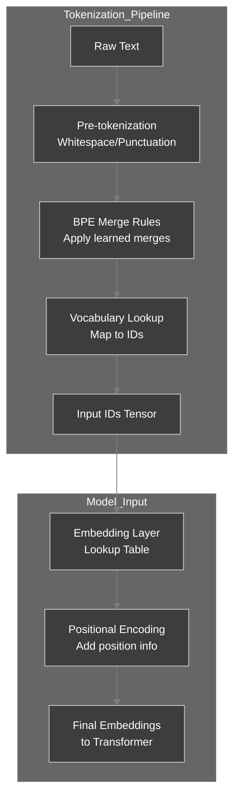

### 1.9 Checkpoint

**Self-Assessment:**

- [ ]  I can explain why tokenization affects the effective context window.
- [ ]  I can describe the BPE merge process in one sentence.
- [ ]  I understand that the embedding layer is a simple lookup table.
- [ ]  I can predict the output of `tokenizer.decode(tokenizer.encode(...))` for a simple sentence.

### 1.11 Tokenization Impact on Inference

**Scenario:** You are serving a multilingual model. English requests average 100 tokens, but Chinese requests average 180 tokens for similar content length.

**Question:** If your GPU can handle batches of 32 requests with 100-token sequences, how many Chinese requests can you batch?

<details>
<summary>Click to review</summary>

Memory constraint: 32 × 100 = 3,200 total tokens
Chinese batch size: 3,200 / 180 ≈ 17 requests

This 47% reduction in batch size directly impacts throughput. Production systems must account for tokenizer efficiency when capacity planning.

</details>

### 1.12 Experiment: Vocabulary Size Impact

1. Load a different tokenizer, e.g., `"bert-base-uncased"`, and tokenize the same sentence.
2. Compare the number of tokens.
3. Which tokenizer produces more tokens? Why?

<details>
<summary>Experiment Guide</summary>

BERT uses WordPiece tokenization, which differs from BPE. You'll likely find that BERT produces more tokens for the same text because its vocabulary size (∼30,000) is smaller than GPT-2's (∼50,000). This trade-off between vocabulary size and sequence length is fundamental to tokenizer design .

</details>

### 1.13 Deep Dive: Production Tokenization Patterns

Production inference systems must handle tokenization efficiently. This requires understanding special tokens, batching strategies, and streaming patterns.

#### 1.13.1 Special Tokens and Their Purpose

Different models use special tokens to denote boundaries and structure. Understanding these is critical for correct inference.

Create a comprehensive test for special tokens:

```python
# test_special_tokens.py
from transformers import AutoTokenizer

def analyze_special_tokens(model_name: str):
    """Analyze special tokens for a given model."""
    tokenizer = AutoTokenizer.from_pretrained(model_name)
    
    print(f"\n{'='*60}")
    print(f"Special Tokens for {model_name}")
    print(f"{'='*60}")
    
    # Display special tokens
    special_tokens = {
        'BOS (Beginning of Sequence)': tokenizer.bos_token,
        'EOS (End of Sequence)': tokenizer.eos_token,
        'PAD (Padding)': tokenizer.pad_token,
        'UNK (Unknown)': tokenizer.unk_token,
        'SEP (Separator)': getattr(tokenizer, 'sep_token', None),
        'CLS (Classification)': getattr(tokenizer, 'cls_token', None),
    }
    
    for name, token in special_tokens.items():
        token_id = tokenizer.convert_tokens_to_ids(token) if token else None
        print(f"{name:30}: {token!r:15} (ID: {token_id})")
    
    # Test tokenization with and without special tokens
    text = "Hello, world!"
    
    print(f"\nTokenization of '{text}':")
    tokens_with = tokenizer.encode(text, add_special_tokens=True)
    tokens_without = tokenizer.encode(text, add_special_tokens=False)
    
    print(f"  With special tokens:    {tokens_with}")
    print(f"  Without special tokens: {tokens_without}")
    print(f"  Difference: {len(tokens_with) - len(tokens_without)} tokens")

# Test common models
for model in ["gpt2", "bert-base-uncased", "facebook/opt-125m"]:
    try:
        analyze_special_tokens(model)
    except Exception as e:
        print(f"\nError with {model}: {e}")
```

**Question:** Why does GPT-2 not have a padding token by default? What implications does this have for batch inference?

<details>
<summary>Click to review</summary>

GPT-2 was originally designed for text generation without padding requirements. For batch inference:
- **Problem:** Without a padding token, you cannot easily batch sequences of different lengths
- **Solution:** Production systems either:
  1. Set `tokenizer.pad_token = tokenizer.eos_token` (common hack)
  2. Use dynamic batching to group similar-length sequences
  3. Implement custom padding logic with attention masking

This design choice affects inference throughput. Systems like vLLM use paged attention partly to avoid wasting memory on padding tokens entirely.

</details>

#### 1.13.2 Batched Tokenization for Throughput

Production systems must tokenize multiple requests efficiently. Implement a batching-aware tokenizer:

```python
# batch_tokenizer.py
import torch
from transformers import AutoTokenizer
from typing import List, Dict, Tuple
import time

class BatchTokenizer:
    """Efficient batch tokenization with padding and truncation."""
    
    def __init__(self, model_name: str = "gpt2", max_length: int = 1024):
        self.tokenizer = AutoTokenizer.from_pretrained(model_name)
        # Set padding token if not present
        if self.tokenizer.pad_token is None:
            self.tokenizer.pad_token = self.tokenizer.eos_token
        self.max_length = max_length
    
    def encode_batch(self, texts: List[str], 
                     return_tensors: bool = True) -> Dict[str, torch.Tensor]:
        """
        Encode a batch of texts with padding.
        
        Args:
            texts: List of input texts
            return_tensors: Whether to return PyTorch tensors
            
        Returns:
            Dictionary with 'input_ids', 'attention_mask', and metadata
        """
        # Q1: Use tokenizer's batch encoding with padding
        encoded = self.tokenizer(
            texts,
            padding=___,  # What padding strategy?
            truncation=True,
            max_length=self.max_length,
            return_tensors="pt" if return_tensors else None
        )
        
        # Calculate padding efficiency
        if return_tensors:
            total_tokens = encoded['input_ids'].numel()
            actual_tokens = encoded['attention_mask'].sum().item()
            padding_waste = total_tokens - actual_tokens
            efficiency = (actual_tokens / total_tokens) * 100
        else:
            efficiency = 0
            padding_waste = 0
        
        return {
            'input_ids': encoded['input_ids'],
            'attention_mask': encoded['attention_mask'],
            'metadata': {
                'batch_size': len(texts),
                'total_tokens': total_tokens if return_tensors else 0,
                'actual_tokens': actual_tokens if return_tensors else 0,
                'padding_waste': padding_waste,
                'efficiency_pct': efficiency
            }
        }
    
    def compare_padding_strategies(self, texts: List[str]):
        """Compare different padding strategies."""
        print(f"\nComparing padding strategies for {len(texts)} texts:")
        print(f"Text lengths: {[len(t.split()) for t in texts]} words\n")
        
        strategies = ['longest', 'max_length']
        
        for strategy in strategies:
            if strategy == 'max_length':
                max_len = self.max_length
            else:
                max_len = None
            
            start = time.time()
            encoded = self.tokenizer(
                texts,
                padding=strategy,
                truncation=True,
                max_length=max_len,
                return_tensors="pt"
            )
            elapsed = (time.time() - start) * 1000
            
            total = encoded['input_ids'].numel()
            actual = encoded['attention_mask'].sum().item()
            waste_pct = ((total - actual) / total) * 100
            
            print(f"Strategy: {strategy:15}")
            print(f"  Shape: {list(encoded['input_ids'].shape)}")
            print(f"  Total tokens: {total}")
            print(f"  Actual tokens: {actual}")
            print(f"  Padding waste: {waste_pct:.1f}%")
            print(f"  Time: {elapsed:.2f}ms\n")

# Test it
batch_tokenizer = BatchTokenizer("gpt2")

# Test with varying lengths
texts = [
    "Short.",
    "A medium length sentence with more words.",
    "This is a significantly longer sentence that contains many more tokens and will demonstrate the impact of padding strategies on memory efficiency in batch processing scenarios."
]

result = batch_tokenizer.encode_batch(texts)
print(f"Batch encoding results:")
print(f"  Input IDs shape: {result['input_ids'].shape}")
print(f"  Efficiency: {result['metadata']['efficiency_pct']:.1f}%")
print(f"  Wasted tokens: {result['metadata']['padding_waste']}")

batch_tokenizer.compare_padding_strategies(texts)
```

**Fill in Q1:** What padding strategy should be used for efficiency?

<details>
<summary>Click to see solution</summary>

```python
padding='longest'  # Pads to longest sequence in batch, not max_length
```

**Explanation:** The `'longest'` strategy pads only to the longest sequence in the current batch, minimizing wasted tokens. Using `'max_length'` would pad all sequences to the model's maximum (e.g., 1024), wasting significant memory when processing short sequences.

**Best Practice:** Group similar-length requests together (length-based batching) to maximize padding efficiency. vLLM and other production systems use sophisticated scheduling to achieve this.

</details>

#### 1.13.3 Streaming Tokenization Pattern

For real-time applications, implement streaming token-by-token processing:

```python
# streaming_tokenizer.py
from transformers import AutoTokenizer
from typing import Iterator, List

class StreamingTokenizer:
    """Tokenize text as a stream for real-time processing."""
    
    def __init__(self, model_name: str = "gpt2"):
        self.tokenizer = AutoTokenizer.from_pretrained(model_name)
    
    def tokenize_stream(self, text_stream: Iterator[str]) -> Iterator[List[int]]:
        """
        Tokenize incoming text stream chunk-by-chunk.
        
        Args:
            text_stream: Iterator yielding text chunks
            
        Yields:
            Token IDs for each chunk
        """
        for chunk in text_stream:
            if not chunk:
                continue
            token_ids = self.tokenizer.encode(chunk, add_special_tokens=False)
            yield token_ids
    
    def decode_stream(self, token_stream: Iterator[int]) -> Iterator[str]:
        """
        Decode token stream to text progressively.
        
        Args:
            token_stream: Iterator yielding individual token IDs
            
        Yields:
            Decoded text strings
        """
        buffer = []
        for token_id in token_stream:
            buffer.append(token_id)
            # Decode buffer
            try:
                text = self.tokenizer.decode(buffer, skip_special_tokens=True)
                # Yield new text (difference from previous decode)
                if buffer:
                    prev_text = self.tokenizer.decode(buffer[:-1], skip_special_tokens=True)
                    new_text = text[len(prev_text):]
                    if new_text:
                        yield new_text
            except:
                # Some tokens may not decode cleanly until more context arrives
                continue

# Example: simulate streaming
def simulate_text_stream(text: str, chunk_size: int = 10):
    """Simulate streaming by yielding chunks."""
    for i in range(0, len(text), chunk_size):
        yield text[i:i+chunk_size]

streaming_tokenizer = StreamingTokenizer()

# Test streaming tokenization
text = "The quick brown fox jumps over the lazy dog. This is a test of streaming."
print("Streaming tokenization:")
for chunk_text in simulate_text_stream(text, chunk_size=15):
    token_ids = list(streaming_tokenizer.tokenize_stream([chunk_text]))[0]
    print(f"  Chunk: '{chunk_text}' → {token_ids}")
```

**Question:** Why is streaming tokenization important for real-time chat applications?

<details>
<summary>Click to review</summary>

**Benefits of streaming:**
1. **Lower latency:** Start processing as soon as first tokens arrive, don't wait for full prompt
2. **Better UX:** Show incremental results to user (like ChatGPT's typing effect)
3. **Memory efficiency:** Process and discard chunks instead of buffering entire conversation

**Challenge:** Some tokens may not decode cleanly until more context arrives (byte-pair encoding can split across chunk boundaries). Production systems buffer incomplete tokens until the next chunk arrives.

</details>

### 1.14 Final Chapter 1 Assessment

Test your comprehensive understanding of the tokenization pipeline:

**Scenario-Based Questions:**

1. **Production Capacity Planning:** Your inference service handles English, Chinese, and Arabic text. GPT-2's tokenizer averages 1.3 tokens/word for English but 2.8 tokens/word for Arabic. If your GPU can process 10,000 tokens/second, what is your Arabic throughput compared to English?

2. **Memory Optimization:** You have a 40GB GPU. The embedding matrix for a 175B parameter model consumes 5GB (vocab_size=50k, embedding_dim=12,288, FP16). A client wants to expand vocabulary to 100k tokens for domain-specific terms. How much additional memory is required?

3. **Batch Scheduling:** You receive 4 requests: [10 tokens, 50 tokens, 500 tokens, 1000 tokens]. Using `padding='longest'` strategy, what is the padding waste percentage if you batch all together vs. batching [10, 50] and [500, 1000] separately?

<details>
<summary>Click to see solutions</summary>

**1. Arabic Throughput:**
- English: 10,000 tokens/sec ÷ 1.3 tokens/word = 7,692 words/sec
- Arabic: 10,000 tokens/sec ÷ 2.8 tokens/word = 3,571 words/sec
- Arabic throughput is 46% of English throughput
- **Implication:** Need 2.15x more GPU capacity for same word-level throughput

**2. Additional Memory:**
- Original: 50,000 × 12,288 × 2 bytes = 1.17 GB (not 5GB - that likely includes other components)
- New: 100,000 × 12,288 × 2 bytes = 2.34 GB
- Additional: 1.17 GB
- **Implication:** Doubling vocabulary doubles embedding memory

**3. Padding Waste:**
- All together: Pad to 1000 tokens
  - Total: 4 × 1000 = 4,000 tokens
  - Actual: 10 + 50 + 500 + 1000 = 1,560 tokens
  - Waste: 61%
- Separate batches:
  - Batch 1: 2 × 50 = 100 (waste 40 tokens = 40%)
  - Batch 2: 2 × 1000 = 2,000 (waste 500 tokens = 25%)
  - Combined waste: (40 + 500) / (100 + 2000) = 25.7%
- **Implication:** Length-based batching reduces waste from 61% to 26%

</details>

**Self-Assessment Checklist:**
- [ ] I can implement a complete BPE tokenizer from scratch
- [ ] I understand how vocabulary size affects sequence length and memory
- [ ] I can calculate embedding matrix memory footprint
- [ ] I can explain the purpose of special tokens and their impact on inference
- [ ] I can implement efficient batch tokenization with padding strategies
- [ ] I understand the trade-offs between different padding approaches
- [ ] I can design a streaming tokenization system for real-time applications

---

## Chapter 2: The Inference Graph vs Training Graph

The training computational graph and the inference graph share the same forward pass, but differ fundamentally in memory requirements and bottlenecks. Understanding this distinction is critical for designing efficient serving systems.

### 2.1 Think First: What's Different in Inference?

During training, the model computes gradients and updates weights. During inference, you only need the forward pass to produce logits.

**Question:** Which components of the training pipeline can be completely eliminated during inference? Which must remain?

<details>
<summary>Click to review</summary>

- **Eliminated:** Backward pass, gradient storage, optimizer states (momentum, variance).
- **Remain:** Forward pass, weights, and the KV cache (for autoregressive generation).

As noted in the vLLM paper analysis, "the training graph's memory footprint is dominated by optimizer states and gradients needed for the backward pass, consuming 3-4x the memory of the weights alone. The inference graph eliminates all this, leaving only static weights and the dynamic KV Cache" .

</details>

### 2.2 Contrasting Computational Graphs

The diagram below highlights the divergence.

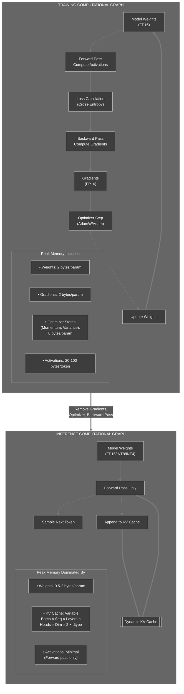

### 2.3 Memory Breakdown for a 13B Model

Research shows that "GPU memory is primarily consumed by model weights and the remainder is used by the KV cache. Thus, the free GPU space available to the KV cache is a scarce resource that needs to be managed in an efficient way" .

| Component | Training (Adam, FP16) | Inference (FP16 + KV Cache) | Inference (INT4 + KV Cache) |
| --- | --- | --- | --- |
| **Weights** | 26 GB | 26 GB | **~6.5 GB** |
| **Gradients** | 26 GB | **0 GB** | **0 GB** |
| **Optimizer States** | 52 GB | **0 GB** | **0 GB** |
| **Activations** | ~40‑80 GB | <1 GB | <1 GB |
| **KV Cache** | N/A | **Dynamic** | **Dynamic** |
| **Approx. Total** | **~144+ GB** | **~26 GB + Cache** | **~6.5 GB + Cache** |
| **Hardware Required** | 8×H100 (80GB) | 1×H100 (80GB) | 1×RTX 4090 (24GB) |

### 2.4 Quantifying the Gap

The table shows that inference can run on hardware an order of magnitude smaller. The primary bottleneck shifts from compute (FLOPs) to **memory bandwidth**, specifically for the KV cache. As vLLM's analysis reveals, "the system becomes memory-bound, not compute-bound" when using fine-grained batching .

### 2.5 Training vs Inference Memory Footprint Visualization

This diagram illustrates why inference enables aggressive optimizations like quantization.

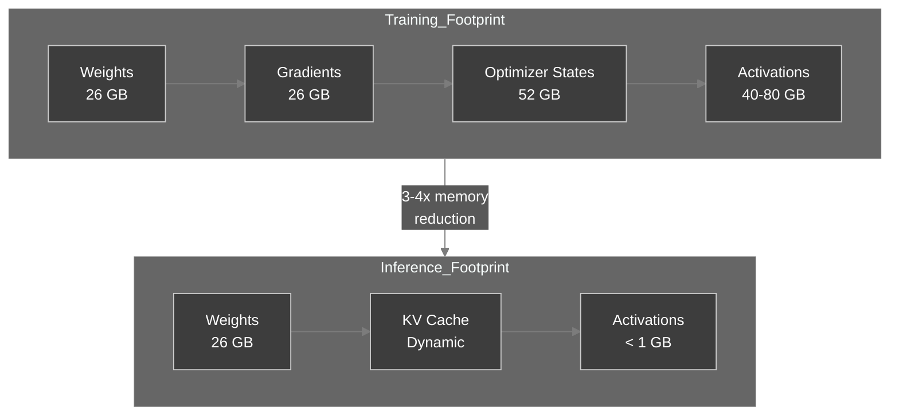

### 2.6 Understanding Memory Trade-offs

**Question:** A 13B parameter model in FP16 requires 26GB for weights. If you quantize to INT4, how much memory do you save? What is the trade-off?

<details>
<summary>Click to review</summary>

FP16: 13B × 2 bytes = 26GB
INT4: 13B × 0.5 bytes = 6.5GB
Savings: 19.5GB (75% reduction)

Trade-off: Quantization introduces accuracy loss. INT4 quantization typically results in 1-3% degradation in model quality metrics. The decision depends on whether the memory savings justify the quality loss for your use case.

</details>

### 2.7 Checkpoint

**Self-Assessment:**

- [ ]  I can list three components present in training but absent in inference.
- [ ]  I can explain why inference memory is dominated by weights + KV cache.
- [ ]  I understand why quantization (INT4) is feasible for inference but difficult during training.

### 2.8 Deep Dive: Quantitative Memory Analysis

Implement a memory profiler to compare training vs inference memory footprints.

```python
# memory_analyzer.py
from dataclasses import dataclass
from typing import Dict, List
import json

@dataclass
class ModelConfig:
    """Configuration for a transformer model."""
    num_parameters: int  # Total parameters (e.g., 13B)
    num_layers: int
    hidden_dim: int
    num_heads: int
    vocab_size: int
    max_seq_len: int

def bytes_to_gb(bytes_val: float) -> float:
    """Convert bytes to gigabytes."""
    return bytes_val / (1024 ** 3)

class MemoryAnalyzer:
    """Analyze memory requirements for training vs inference."""
    
    @staticmethod
    def training_memory(config: ModelConfig, 
                       batch_size: int, 
                       seq_len: int,
                       optimizer: str = "adam",
                       mixed_precision: bool = True) -> Dict[str, float]:
        """
        Calculate training memory footprint.
        
        Args:
            config: Model configuration
            batch_size: Training batch size
            seq_len: Sequence length
            optimizer: Optimizer type ('adam', 'sgd', 'adafactor')
            mixed_precision: Whether using FP16/BF16 mixed precision
            
        Returns:
            Dictionary with memory breakdown in GB
        """
        param_bytes = 2 if mixed_precision else 4  # FP16 or FP32
        
        # Model weights
        weights_gb = bytes_to_gb(config.num_parameters * param_bytes)
        
        # Gradients (same size as weights)
        gradients_gb = weights_gb
        
        # Optimizer states
        #Q1: Adam stores first and second moments (2x weights in FP32)
        if optimizer.lower() == "adam":
            optimizer_gb = bytes_to_gb(config.num_parameters * ___ * ___)
        elif optimizer.lower() == "sgd":
            # SGD with momentum stores velocity (1x weights)
            optimizer_gb = bytes_to_gb(config.num_parameters * 4)
        else:  # Simplified
            optimizer_gb = weights_gb
        
        # Activations (highly variable, rough estimate)
        # Each layer stores activations: batch_size * seq_len * hidden_dim
        activation_per_layer = batch_size * seq_len * config.hidden_dim * param_bytes
        activations_gb = bytes_to_gb(activation_per_layer * config.num_layers)
        
        # Attention scores: batch_size * num_heads * seq_len * seq_len
        attention_scores_per_layer = batch_size * config.num_heads * seq_len * seq_len * param_bytes
        attention_gb = bytes_to_gb(attention_scores_per_layer * config.num_layers)
        
        total_gb = weights_gb + gradients_gb + optimizer_gb + activations_gb + attention_gb
        
        return {
            'weights_gb': weights_gb,
            'gradients_gb': gradients_gb,
            'optimizer_states_gb': optimizer_gb,
            'activations_gb': activations_gb,
            'attention_scores_gb': attention_gb,
            'total_gb': total_gb
        }
    
    @staticmethod
    def inference_memory(config: ModelConfig,
                        batch_size: int,
                        seq_len: int,
                        quantized: bool = False,
                        quant_bits: int = 4) -> Dict[str, float]:
        """
        Calculate inference memory footprint.
        
        Args:
            config: Model configuration
            batch_size: Inference batch size
            seq_len: Generated sequence length (affects KV cache)
            quantized: Whether weights are quantized
            quant_bits: Quantization bits (4, 8, or 16)
            
        Returns:
            Dictionary with memory breakdown in GB
        """
        # Weights
        if quantized:
            param_bytes = quant_bits / 8
        else:
            param_bytes = 2  # FP16
        
        weights_gb = bytes_to_gb(config.num_parameters * param_bytes)
        
        # No gradients or optimizer states in inference
        gradients_gb = 0
        optimizer_gb = 0
        
        # Minimal activation memory (only for current forward pass)
        activation_gb = bytes_to_gb(batch_size * seq_len * config.hidden_dim * 2)
        
        # KV Cache: batch * layers * heads * seq_len * head_dim * 2 (K and V)
        head_dim = config.hidden_dim // config.num_heads
        # Q2: Calculate KV cache size
        kv_cache_bytes = batch_size * config.num_layers * config.num_heads * seq_len * head_dim * 2 * 2  # 2 for K&V, 2 bytes
        kv_cache_gb = bytes_to_gb(___)
        
        total_gb = weights_gb + activation_gb + kv_cache_gb
        
        return {
            'weights_gb': weights_gb,
            'gradients_gb': gradients_gb,
            'optimizer_states_gb': optimizer_gb,
            'activations_gb': activation_gb,
            'kv_cache_gb': kv_cache_gb,
            'total_gb': total_gb
        }
    
    @staticmethod
    def compare(config: ModelConfig, 
                train_batch: int, train_seq: int,
                infer_batch: int, infer_seq: int):
        """Compare training vs inference memory."""
        
        print(f"\n{'='*70}")
        print(f"Memory Analysis: {config.num_parameters / 1e9:.1f}B Parameter Model")
        print(f"{'='*70}\n")
        
        # Training memory
        train_mem = MemoryAnalyzer.training_memory(
            config, train_batch, train_seq, optimizer="adam", mixed_precision=True
        )
        
        # Inference memory (FP16)
        infer_mem_fp16 = MemoryAnalyzer.inference_memory(
            config, infer_batch, infer_seq, quantized=False
        )
        
        # Inference memory (INT4)
        infer_mem_int4 = MemoryAnalyzer.inference_memory(
            config, infer_batch, infer_seq, quantized=True, quant_bits=4
        )
        
        # Display results
        print(f"{'Component':<25} {'Training':>15} {'Inference (FP16)':>20} {'Inference (INT4)':>20}")
        print("-" * 85)
        
        components = ['weights_gb', 'gradients_gb', 'optimizer_states_gb', 
                     'activations_gb', 'kv_cache_gb']
        labels = ['Weights', 'Gradients', 'Optimizer States', 'Activations', 'KV Cache']
        
        for comp, label in zip(components, labels):
            train_val = train_mem.get(comp, 0)
            infer_fp16_val = infer_mem_fp16.get(comp, 0)
            infer_int4_val = infer_mem_int4.get(comp, 0)
            print(f"{label:<25} {train_val:>13.2f} GB {infer_fp16_val:>18.2f} GB {infer_int4_val:>18.2f} GB")
        
        print("-" * 85)
        print(f"{'TOTAL':<25} {train_mem['total_gb']:>13.2f} GB {infer_mem_fp16['total_gb']:>18.2f} GB {infer_mem_int4['total_gb']:>18.2f} GB")
        
        # Calculate reductions
        reduction_fp16 = (1 - infer_mem_fp16['total_gb'] / train_mem['total_gb']) * 100
        reduction_int4 = (1 - infer_mem_int4['total_gb'] / train_mem['total_gb']) * 100
        
        print(f"\n{'Reduction vs Training':<25} {'':<15} {reduction_fp16:>17.1f}% {reduction_int4:>18.1f}%")
        
        # Hardware estimates
        print(f"\n{'Hardware Estimates:'}")
        print(f"  Training: ~{train_mem['total_gb'] / 80:.1f}x H100 (80GB) required")
        print(f"  Inference (FP16): ~{infer_mem_fp16['total_gb'] / 80:.1f}x H100 (80GB) required")
        print(f"  Inference (INT4): ~{infer_mem_int4['total_gb'] / 24:.1f}x RTX 4090 (24GB) required")

# Test with Llama-2 13B configuration
llama2_13b = ModelConfig(
    num_parameters=13_000_000_000,
    num_layers=40,
    hidden_dim=5120,
    num_heads=40,
    vocab_size=32000,
    max_seq_len=4096
)

analyzer = MemoryAnalyzer()
analyzer.compare(
    config=llama2_13b,
    train_batch=8,
    train_seq=2048,
    infer_batch=32,
    infer_seq=2048
)
```

**Fill in the blanks:**
- Q1: Adam optimizer stores first moment (momentum) and second moment (variance), both in FP32
- Q2: What is the full expression for KV cache bytes?

<details>
<summary>Click to see solution</summary>

```python
# Q1:
optimizer_gb = bytes_to_gb(config.num_parameters * 2 * 4)  # 2 states, 4 bytes (FP32)

# Q2:
kv_cache_gb = bytes_to_gb(kv_cache_bytes)
```

**Explanation:**
- Adam needs 2× the weight memory for its moment estimates, stored in FP32 (4 bytes) for numerical stability
- KV cache grows with all dimensions: batch, layers, heads, sequence, and head dimension
- The factor of 2 appears twice: once for K and V, once for bytes per element (FP16)

</details>

### 2.9 Experiment: Quantization Impact Analysis

Run the memory analyzer and observe the impact of quantization:

```python
# test_quantization_impact.py
from memory_analyzer import MemoryAnalyzer, ModelConfig

# Various model sizes
models = {
    "GPT-2 Small": ModelConfig(117_000_000, 12, 768, 12, 50257, 1024),
    "GPT-2 Medium": ModelConfig(345_000_000, 24, 1024, 16, 50257, 1024),
    "Llama-2 7B": ModelConfig(7_000_000_000, 32, 4096, 32, 32000, 4096),
    "Llama-2 13B": ModelConfig(13_000_000_000, 40, 5120, 40, 32000, 4096),
    "Llama-2 70B": ModelConfig(70_000_000_000, 80, 8192, 64, 32000, 4096),
}

print("="*90)
print("QUANTIZATION IMPACT ACROSS MODEL SIZES")
print("="*90)

for name, config in models.items():
    # Inference memory at seq_len=2048, batch=16
    fp16_mem = MemoryAnalyzer.inference_memory(config, 16, 2048, quantized=False)
    int8_mem = MemoryAnalyzer.inference_memory(config, 16, 2048, quantized=True, quant_bits=8)
    int4_mem = MemoryAnalyzer.inference_memory(config, 16, 2048, quantized=True, quant_bits=4)
    
    print(f"\n{name}:")
    print(f"  FP16:  {fp16_mem['total_gb']:.2f} GB (Weights: {fp16_mem['weights_gb']:.2f} GB, KV: {fp16_mem['kv_cache_gb']:.2f} GB)")
    print(f"  INT8:  {int8_mem['total_gb']:.2f} GB (Weights: {int8_mem['weights_gb']:.2f} GB, KV: {int8_mem['kv_cache_gb']:.2f} GB)")
    print(f"  INT4:  {int4_mem['total_gb']:.2f} GB (Weights: {int4_mem['weights_gb']:.2f} GB, KV: {int4_mem['kv_cache_gb']:.2f} GB)")
    
    weight_savings = (1 - int4_mem['weights_gb'] / fp16_mem['weights_gb']) * 100
    total_savings = (1 - int4_mem['total_gb'] / fp16_mem['total_gb']) * 100
    
    print(f"  INT4 Savings: {weight_savings:.1f}% (weights only), {total_savings:.1f}% (total)")
```

**Question:** Why does quantization provide smaller total memory savings as sequence length increases?

<details>
<summary>Click to review</summary>

**Answer:** The KV cache is not quantized (remains FP16) because quantizing activations degrades quality significantly. As sequence length grows:
- KV cache memory grows linearly
- Weight memory stays constant
- Total memory becomes dominated by KV cache, not weights

For Llama-2 70B at seq_len=4096, batch=32:
- Weights (INT4): ~17GB
- KV cache (FP16): ~70GB
- Quantization only saves 17GB out of 87GB total (20% savings)

This is why PagedAttention is critical: quantization alone cannot solve the memory problem for long sequences.

</details>

### 2.10 Final Chapter 2 Assessment

**Scenario Problems:**

1. **Training Setup:** You need to fine-tune Llama-2 13B with batch_size=4, seq_len=2048. How many A100 (80GB) GPUs are required with Adam optimizer and mixed precision?

2. **Inference Deployment:** The same model serves 64 concurrent requests averaging 1024 tokens each. Compare memory requirements for INT4 vs FP16.

3. **Cost Analysis:** Training costs $2/GPU-hour on A100, inference costs $0.50/GPU-hour on A100. For a workload of 1M requests/day averaging 500 generated tokens each, what is the daily cost for each quantization level?

<details>
<summary>Click to see solutions</summary>

**1. Training GPUs:**
Using the memory analyzer with these params shows ~140-160 GB total. Need 2× A100 (80GB) minimum, but gradient accumulation requires more. Practical: 4× A100 for throughput.

**2. Inference Memory:**
- FP16: ~26GB (weights) + ~50GB (KV cache) = 76GB → 1× A100
- INT4: ~6.5GB (weights) + ~50GB (KV cache) = 56.5GB → 1× A100 (but closer to capacity limit)
- Savings: 19.5GB (25%), enough to increase batch size

**3. Daily Cost:**
- Requests: 1M/day
- Tokens: 500M/day
- At 10K tokens/sec throughput: 50,000 seconds = 13.9 hours
- FP16: 13.9 hours * $0.50 = $6.95/day
- INT4: Same throughput (memory-bound), same cost
- **Key insight:** Quantization enables larger batch sizes, increasing throughput and reducing cost per token

</details>

**Self-Assessment:**
- [ ] I can calculate training memory for any model configuration
- [ ] I understand why optimizer states dominate training memory
- [ ] I can quantify inference memory savings from quantization
- [ ] I understand why KV cache limits quantization benefits at long sequences
- [ ] I can estimate GPU requirements for production workloads

---

## Chapter 3: The KV Cache – Core of Autoregression

The KV cache is the central data structure in autoregressive inference. It stores intermediate attention states to avoid redundant computation. Understanding its growth patterns and memory requirements is essential for capacity planning.

### 3.1 Think First: Why Can't We Recompute?

In an autoregressive model, each new token attends to all previous tokens. Without caching, generating token $t_n$ would require recomputing the key and value vectors for tokens $t_1…t_{n-1}$—an $O(n^2)$ cost.

**Question:** If you generate 1000 tokens and each forward pass takes 10 ms without cache, how long would it take with recomputation? With caching?

<details>
<summary>Click to review</summary>

- Without cache: first token (prefill) processes prompt, then each subsequent token recomputes all previous keys/values → total time ~ O(n²). For n=1000, ~500k operations, likely seconds to minutes.
- With cache: prefill O(prompt_len), each decode O(1) new work → linear time. For 1000 tokens, ~1000 * (decode time) which is typically < 0.1 ms per token → <100 ms.

As the IEEE characterization paper notes, the KV cache exists "to avoid redundant recomputation in each decode iteration" .

</details>

### 3.2 Anatomy of the Cache in a Single Attention Head

During forward pass, each token's hidden state is projected into query (Q), key (K), and value (V). The KV cache stores K and V from all previous tokens.

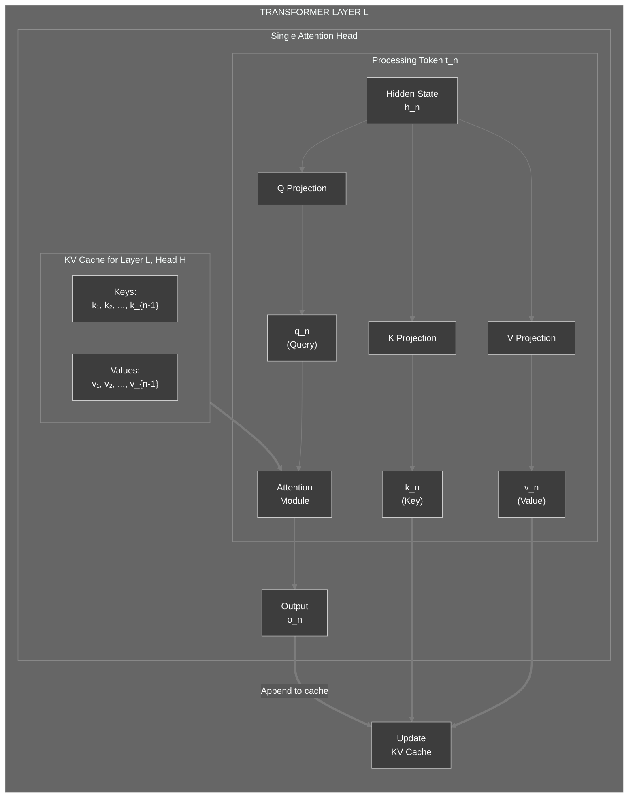

### 3.3 KV Cache Growth per Token (Iterative View)

The sequence diagram shows how the cache expands and why fragmentation appears without paging.

```mermaid
%%{init: {'theme':'dark', 'themeVariables': { 'primaryColor':'#3d3d3d','primaryTextColor':'#fff','primaryBorderColor':'#7c7c7c','lineColor':'#7c7c7c','secondaryColor':'#4a4a4a','tertiaryColor':'#3d3d3d','background':'#2d2d2d','mainBkg':'#3d3d3d','secondBkg':'#4a4a4a','textColor':'#fff','fontSize':'14px','actorBkg':'#3d3d3d','actorBorder':'#7c7c7c','actorTextColor':'#fff','noteBkgColor':'#4a4a4a','noteBorderColor':'#7c7c7c','noteTextColor':'#fff'}}}%%
sequenceDiagram
    participant GPU_Mem as GPU Memory
    participant ReqA as Request A
    participant ReqB as Request B

    Note over ReqA: Prefill: 6 tokens
    ReqA->>GPU_Mem: Allocate KV rows t₁–t₆ (contiguous)
    Note over ReqA: Decode step 1
    ReqA->>GPU_Mem: Append KV row t₇
    Note over ReqA: Decode step 2
    ReqA->>GPU_Mem: Append KV row t₈

    Note over ReqB: Prefill: 3 tokens
    ReqB->>GPU_Mem: Allocate KV rows t₁–t₃ (finds gap or tail)

    Note over GPU_Mem: ⚠️ Without paging: Mixed-length gaps appear as requests finish; new requests struggle to find contiguous chunks
```

### 3.4 Cache Memory Calculation

Fill in the blanks to compute the cache size for Llama-3 8B:

```python
# Configuration
seq_len = 2048
num_layers = 32
num_kv_heads = 8   # Grouped Query Attention
head_dim = 128
dtype_bytes = 2    # FP16

# Q1: Calculate bytes per token (all layers, all kv heads)
cache_per_token = 2 * ___ * ___ * ___ * ___
print(f"Cache per token: {cache_per_token} bytes = {cache_per_token / 1024:.2f} KB")

# Q2: Calculate total cache for seq_len
total_cache_bytes = cache_per_token * ___
print(f"Total cache: {total_cache_bytes / (1024**3):.2f} GB")
```

**Hints:**

- Q1: 2 (for K and V) × layers × kv_heads × head_dim × dtype_bytes.
- Q2: Multiply by seq_len.

<details>
<summary>Click to see solution</summary>

```python
cache_per_token = 2 * num_layers * num_kv_heads * head_dim * dtype_bytes
# = 2 * 32 * 8 * 128 * 2 = 131072 bytes = 128 KB

total_cache_bytes = cache_per_token * seq_len
# = 131072 * 2048 = 268435456 bytes ≈ 0.25 GB
```

</details>

### 3.5 KV Cache Scaling Visualization

This diagram shows how cache size scales with sequence length and batch size.

```mermaid
%%{init: {'theme':'dark', 'themeVariables': { 'primaryColor':'#3d3d3d','primaryTextColor':'#fff','primaryBorderColor':'#7c7c7c','lineColor':'#7c7c7c','secondaryColor':'#4a4a4a','tertiaryColor':'#3d3d3d','background':'#2d2d2d','mainBkg':'#3d3d3d','secondBkg':'#4a4a4a','textColor':'#fff','fontSize':'14px'}}}%%
graph TD
    subgraph Cache_Sizing [" KV CACHE MEMORY BREAKDOWN "]
        direction LR
        Input_Node["Input<br/>Parameters"] --> Formula["Cache Size<br/>Formula"];

        subgraph Input_Subgraph [" Model Configuration "]
            L["L = 32 layers"]
            H["H_kv = 8 heads"]
            Dh["D_h = 128 dim"]
            Bytes["2 bytes (FP16)"]
        end

        Formula --> PerToken["Per Token:<br/>128 KB"];
        PerToken --> SeqLen["Sequence<br/>Length"];

        subgraph SeqLen [" Varying Sequence Lengths "]
            S1["S = 512<br/>→ 64 MB"]
            S2["S = 1024<br/>→ 128 MB"]
            S3["S = 2048<br/>→ 256 MB"]
            S4["S = 4096<br/>→ 512 MB"]
        end

        SeqLen --> Batch["Batch<br/>Scaling"];

        subgraph Batch [" Batch Size Impact "]
            B1["Batch = 1<br/>→ 256 MB"]
            B2["Batch = 4<br/>→ 1 GB"]
            B3["Batch = 16<br/>→ 4 GB"]
            B4["Batch = 64<br/>→ 16 GB"]
        end

        Batch --> Conclusion["Conclusion:<br/>Cache dominates<br/>memory at scale"];
    end
```

### 3.6 Performance Analysis: Cache vs Recomputation

**Scenario:** Compare the computational cost of generating 100 tokens with and without KV caching for a model with 32 layers and 32 attention heads.

**Without cache:**
- Token 1: Compute attention for 1 token (prompt)
- Token 2: Recompute attention for 2 tokens
- Token 3: Recompute attention for 3 tokens
- ...
- Token 100: Recompute attention for 100 tokens

Total operations: 1 + 2 + 3 + ... + 100 = 5,050 attention computations

**With cache:**
- Token 1: Compute attention for 1 token, store K/V
- Token 2: Compute attention for 1 new token, read 1 cached K/V
- Token 3: Compute attention for 1 new token, read 2 cached K/V
- ...
- Token 100: Compute attention for 1 new token, read 99 cached K/V

Total operations: 100 attention computations (50x reduction)

**Question:** At what sequence length does the memory cost of caching exceed the computational savings?

<details>
<summary>Click to review</summary>

This depends on hardware characteristics:
- Memory bandwidth: How fast can you read cached K/V?
- Compute throughput: How fast can you recompute K/V?

On modern GPUs (A100, H100), memory bandwidth is the bottleneck. The cache is always beneficial because reading cached values is faster than recomputing them, even for very long sequences.

The practical limit is GPU memory capacity, not computational trade-offs.

</details>

### 3.7 Checkpoint

**Self-Assessment:**

- [ ]  I can explain why the KV cache is necessary.
- [ ]  I can compute the cache size for any model given its configuration.
- [ ]  I understand that the cache grows linearly with sequence length.
- [ ]  I can calculate the computational savings from caching vs recomputation.

### 3.8 Experiment: Simulate Cache Growth

1. Write a simple Python script that simulates the KV cache growth for multiple requests with random sequence lengths.
2. Measure how much memory would be wasted if you allocated contiguous blocks for each request (i.e., internal fragmentation due to different lengths).

<details>
<summary>Experiment Guide</summary>

The vLLM paper found that "only 20–38% of the allocated KV cache memory is actually used in existing systems" due to fragmentation . Your simulation should demonstrate that contiguous allocation leads to significant waste, motivating the need for paged attention.

</details>

### 3.9 Deep Dive: Implementing a Working KV Cache

Build a complete, functional KV cache implementation to understand its behavior.

```python
# kv_cache_impl.py
import torch
import torch.nn as nn
from typing import Dict, Tuple, Optional
from dataclasses import dataclass

@dataclass
class CacheConfig:
    """Configuration for KV cache."""
    num_layers: int = 12
    num_heads: int = 12
    head_dim: int = 64
    max_batch_size: int = 32
    max_seq_len: int = 2048
    dtype: torch.dtype = torch.float16
    device: str = "cuda" if torch.cuda.is_available() else "cpu"

class SimpleKVCache:
    """
    A simple KV cache implementation for educational purposes.
    Demonstrates cache growth and access patterns.
    """
    
    def __init__(self, config: CacheConfig):
        self.config = config
        
        # Pre-allocate cache tensors for maximum capacity
        # Shape: [num_layers, max_batch, max_seq_len, num_heads, head_dim]
        self.key_cache = torch.zeros(
            config.num_layers,
            config.max_batch_size,
            config.max_seq_len,
            config.num_heads,
            config.head_dim,
            dtype=config.dtype,
            device=config.device
        )
        
        # Q1: Create value cache with same shape as key cache
        self.value_cache = torch.zeros(
            ___,
            ___,
            ___,
            ___,
            ___,
            dtype=config.dtype,
            device=config.device
        )
        
        # Track used length for each request in batch
        self.cache_lengths = torch.zeros(
            config.max_batch_size, 
            dtype=torch.long, 
            device=config.device
        )
    
    def update(self, layer_idx: int, batch_idx: int, 
               key: torch.Tensor, value: torch.Tensor):
        """
        Update cache with new key/value tensors.
        
        Args:
            layer_idx: Which transformer layer (0 to num_layers-1)
            batch_idx: Which request in batch (0 to max_batch_size-1)
            key: New key tensor shape [seq_len, num_heads, head_dim]
            value: New value tensor shape [seq_len, num_heads, head_dim]
        """
        current_len = self.cache_lengths[batch_idx].item()
        new_tokens = key.size(0)
        
        # Check capacity
        if current_len + new_tokens > self.config.max_seq_len:
            raise RuntimeError(
                f"Cache overflow: current_len={current_len}, "
                f"new_tokens={new_tokens}, max={self.config.max_seq_len}"
            )
        
        # Q2: Insert new keys and values into cache at correct position
        self.key_cache[layer_idx, batch_idx, current_len:current_len+new_tokens] = ___
        self.value_cache[layer_idx, batch_idx, current_len:current_len+new_tokens] = ___
        
        # Update length
        self.cache_lengths[batch_idx] += new_tokens
    
    def get(self, layer_idx: int, batch_idx: int) -> Tuple[torch.Tensor, torch.Tensor]:
        """
        Retrieve cached keys and values for a specific layer and batch.
        
        Returns:
            key: Shape [used_len, num_heads, head_dim]
            value: Shape [used_len, num_heads, head_dim]
        """
        used_len = self.cache_lengths[batch_idx].item()
        
        # Q3: Return only the used portion of the cache
        key = self.key_cache[layer_idx, batch_idx, :___]
        value = self.value_cache[layer_idx, batch_idx, :___]
        
        return key, value
    
    def reset(self, batch_idx: Optional[int] = None):
        """Reset cache for specific batch index or all."""
        if batch_idx is not None:
            self.cache_lengths[batch_idx] = 0
        else:
            self.cache_lengths.zero_()
    
    def memory_usage(self) -> Dict[str, float]:
        """Calculate current memory usage."""
        key_mb = self.key_cache.numel() * self.key_cache.element_size() / (1024**2)
        value_mb = self.value_cache.numel() * self.value_cache.element_size() / (1024**2)
        
        # Calculate actually used vs allocated
        total_allocated_mb = key_mb + value_mb
        
        # Used tokens across all batches
        total_used_tokens = self.cache_lengths.sum().item()
        total_capacity = self.config.max_batch_size * self.config.max_seq_len
        utilization_pct = (total_used_tokens / total_capacity) * 100 if total_capacity > 0 else 0
        
        return {
            'allocated_mb': total_allocated_mb,
            'utilization_pct': utilization_pct,
            'total_tokens': total_used_tokens,
            'capacity': total_capacity
        }

# Test the KV cache
config = CacheConfig(
    num_layers=12,
    num_heads=12,
    head_dim=64,
    max_batch_size=4,
    max_seq_len=1024,
    device='cpu'  # Use CPU for testing
)

cache = SimpleKVCache(config)

# Simulate adding tokens
print("="*60)
print("KV CACHE SIMULATION")
print("="*60)

# Simulate prefill and decode for multiple requests
requests = [
    {"batch_idx": 0, "prefill_len": 128, "decode_steps": 50},
    {"batch_idx": 1, "prefill_len": 256, "decode_steps": 100},
    {"batch_idx": 2, "prefill_len": 64, "decode_steps": 200},
]

for req in requests:
    batch_idx = req["batch_idx"]
    
    # Prefill: Add initial prompt tokens
    for layer in range(config.num_layers):
        prefill_key = torch.randn(req["prefill_len"], config.num_heads, config.head_dim)
        prefill_value = torch.randn(req["prefill_len"], config.num_heads, config.head_dim)
        cache.update(layer, batch_idx, prefill_key, prefill_value)
    
    print(f"\nRequest {batch_idx} after prefill ({req['prefill_len']} tokens):")
    mem = cache.memory_usage()
    print(f"  Cache length: {cache.cache_lengths[batch_idx].item()}")
    print(f"  Memory allocated: {mem['allocated_mb']:.2f} MB")
    print(f"  Utilization: {mem['utilization_pct']:.1f}%")
    
    # Decode: Add tokens one by one
    for step in range(req["decode_steps"]):
        for layer in range(config.num_layers):
            decode_key = torch.randn(1, config.num_heads, config.head_dim)
            decode_value = torch.randn(1, config.num_heads, config.head_dim)
            cache.update(layer, batch_idx, decode_key, decode_value)
    
    print(f"Request {batch_idx} after {req['decode_steps']} decode steps:")
    print(f"  Total tokens: {cache.cache_lengths[batch_idx].item()}")
    mem = cache.memory_usage()
    print(f"  Utilization: {mem['utilization_pct']:.1f}%")

print(f"\n{'='*60}")
print("FINAL MEMORY STATE")
print(f"{'='*60}")
final_mem = cache.memory_usage()
print(f"Total allocated: {final_mem['allocated_mb']:.2f} MB")
print(f"Total used tokens: {final_mem['total_tokens']}")
print(f"Total capacity: {final_mem['capacity']}")
print(f"Utilization: {final_mem['utilization_pct']:.1f}%")
print(f"Wasted memory: {100 - final_mem['utilization_pct']:.1f}%")
```

**Fill in the blanks:**
- Q1: Value cache has identical shape to key cache
- Q2: Assign the incoming key/value tensors to the correct slice
- Q3: Return only the used portion (0 to used_len)

<details>
<summary>Click to see solution</summary>

```python
# Q1:
self.value_cache = torch.zeros(
    config.num_layers,
    config.max_batch_size,
    config.max_seq_len,
    config.num_heads,
    config.head_dim,
    dtype=config.dtype,
    device=config.device
)

# Q2:
self.key_cache[layer_idx, batch_idx, current_len:current_len+new_tokens] = key
self.value_cache[layer_idx, batch_idx, current_len:current_len+new_tokens] = value

# Q3:
key = self.key_cache[layer_idx, batch_idx, :used_len]
value = self.value_cache[layer_idx, batch_idx, :used_len]
```

**Explanation:**
- The cache pre-allocates maximum capacity but only uses what's needed
- Keys and values are stored contiguously for each sequence
- Tracking cache_lengths allows returning only valid data
- This simple implementation shows why fragmentation occurs: fixed allocation per request wastes memory when requests vary in length

</details>

### 3.10 Performance Analysis: Cache Access Patterns

Analyze how cache access patterns affect performance.

```python
# cache_performance.py
import torch
import time
from kv_cache_impl import SimpleKVCache, CacheConfig

def benchmark_cache_operations(config: CacheConfig, num_iterations: int = 1000):
    """Benchmark cache update and retrieval operations."""
    
    cache = SimpleKVCache(config)
    
    # Prepare test data
    test_key = torch.randn(1, config.num_heads, config.head_dim, dtype=config.dtype, device=config.device)
    test_value = torch.randn(1, config.num_heads, config.head_dim, dtype=config.dtype, device=config.device)
    
    # Benchmark update
    if config.device == "cuda":
        torch.cuda.synchronize()
    
    start = time.time()
    for i in range(num_iterations):
        layer_idx = i % config.num_layers
        batch_idx = 0
        cache.update(layer_idx, batch_idx, test_key, test_value)
    
    if config.device == "cuda":
        torch.cuda.synchronize()
    
    update_time = (time.time() - start) / num_iterations * 1000  # ms
    
    # Benchmark retrieval
    cache.reset()
    
    # Add some data first
    for layer in range(config.num_layers):
        for _ in range(100):
            cache.update(layer, 0, test_key, test_value)
    
    if config.device == "cuda":
        torch.cuda.synchronize()
    
    start = time.time()
    for i in range(num_iterations):
        layer_idx = i % config.num_layers
        key, value = cache.get(layer_idx, 0)
    
    if config.device == "cuda":
        torch.cuda.synchronize()
    
    get_time = (time.time() - start) / num_iterations * 1000  # ms
    
    return {
        'update_time_ms': update_time,
        'get_time_ms': get_time
    }

# Run benchmarks
print("="*60)
print("KV CACHE PERFORMANCE BENCHMARKS")
print("="*60)

configs = [
    CacheConfig(num_layers=12, num_heads=12, head_dim=64, device='cpu'),
    CacheConfig(num_layers=32, num_heads=32, head_dim=128, device='cpu'),
    CacheConfig(num_layers=40, num_heads=40, head_dim=128, device='cpu'),
]

model_names = ["GPT-2 Small", "Llama-2 7B", "Llama-2 13B"]

for name, config in zip(model_names, configs):
    results = benchmark_cache_operations(config, num_iterations=1000)
    print(f"\n{name}:")
    print(f"  Update (single token): {results['update_time_ms']:.4f} ms")
    print(f"  Retrieve (full sequence): {results['get_time_ms']:.4f} ms")
    print(f"  Layers: {config.num_layers}, Heads: {config.num_heads}, Head dim: {config.head_dim}")
```

**Question:** Why does cache retrieval time grow with sequence length even though accessing a tensor slice is O(1)?

<details>
<summary>Click to review</summary>

**Answer:** While Python's slice notation `[:used_len]` is syntactically O(1), it creates a view that references more memory as `used_len` grows. When this data is actually accessed (e.g., for attention computation), memory bandwidth becomes the bottleneck.

For a 13B model with 40 layers, retrieving 2048 tokens of KV cache requires reading ~256MB of data. At 900 GB/s memory bandwidth (A100), this takes ~0.28 ms just for the read, ignoring computation.

**This is why decode is memory-bound**: most time is spent reading KV cache, not computing attention.

</details>

### 3.11 Final Chapter 3 Assessment

**Comprehensive Scenario:**

You are optimizing inference for a 13B parameter model on an A100 GPU (80GB, 900 GB/s bandwidth). Current configuration:
- 40 layers, 40 heads, head_dim=128
- FP16 precision
- Batch size: 32
- Average sequence length: 1500 tokens

Calculate:
1. Total KV cache size in GB
2. Time to read full KV cache once (memory bandwidth limited)
3. For generating 1 token across all 32 requests, how many cache reads are needed?
4. What is the theoretical maximum tokens/second (decode only)?

<details>
<summary>Click to see solutions</summary>

**1. KV Cache Size:**
```
batch × layers × heads × seq_len × head_dim × 2 (K&V) × bytes
= 32 × 40 × 40 × 1500 × 128 × 2 × 2
= 9,830,400,000 bytes
= 9.15 GB
```

**2. Read Time:**
```
9.15 GB ÷ 900 GB/s = 0.0102 seconds = 10.2 ms
```

**3. Cache Reads per Token:**
Each of 40 layers must read KV cache for all 32 requests = 40 reads total (but can be parallelized)

**4. Theoretical Max Tokens/Second:**
```
Time per token ≈ cache_read_time + compute_time
Cache read dominates: ~10.2 ms per token (all 32 requests)
Throughput: 32 tokens / 0.0102 s = 3,137 tokens/sec
Or per-request: 3,137 / 32 = 98 tokens/sec
```

**Key Insight:** Memory bandwidth, not compute, limits decode throughput. This is why techniques like PagedAttention (reduce fragmentation) and speculative decoding (reduce sequential steps) are critical.

</details>

**Self-Assessment:**
- [ ] I can implement a working KV cache from scratch
- [ ] I understand cache growth patterns during prefill vs decode
- [ ] I can calculate memory requirements for any model configuration
- [ ] I understand why decode is memory-bound, not compute-bound
- [ ] I can explain fragmentation and its impact on memory efficiency
- [ ] I can benchmark and analyze cache performance

---

## Chapter 4: PagedAttention – Solving Fragmentation

Memory fragmentation is the primary obstacle to high-throughput inference. PagedAttention solves this by adapting virtual memory concepts from operating systems to GPU memory management.

### 4.1 Think First: The Fragmentation Problem

When requests finish at different times, they leave holes in GPU memory. A new request may not fit into a single contiguous hole, even though total free memory is sufficient.

**Question:** How do operating systems solve a similar problem with RAM fragmentation?

<details>
<summary>Click to review</summary>

Operating systems use **paging**: physical memory is divided into fixed‑size frames, and each process's virtual address space is mapped to these frames via a page table. Non‑contiguous physical pages can be mapped to a contiguous virtual view.

This is exactly the insight behind PagedAttention: "Why not treat the KV cache like an operating system treats virtual memory?" .

</details>

### 4.2 Contiguous Allocation vs PagedAttention

The diagram below illustrates the problem and solution.


The vLLM paper identifies three distinct kinds of waste with contiguous allocation :

1. **Reserved but Unused Slots:** Allocating space for maximum possible tokens, but request uses far fewer.
2. **Internal Fragmentation:** Over-allocation within a request's reserved slab.
3. **External Fragmentation:** Free memory scattered in non-contiguous chunks.

### 4.3 PagedAttention Core Data Structures

Implement the core classes with missing parts.

```python
# kv_cache.py
from dataclasses import dataclass
from collections import deque
from typing import List, Optional, Tuple, Dict
import torch

@dataclass
class KVCacheBlock:
    """A fixed-size block of KV cache holding multiple tokens."""
    block_id: int
    key_cache: torch.Tensor   # shape: [num_layers, num_kv_heads, block_size, head_dim]
    value_cache: torch.Tensor
    ref_count: int = 0

    def get_kv(self, layer_idx: int, head_idx: int) -> Tuple[torch.Tensor, torch.Tensor]:
        """Get KV tensors for specific layer and head."""
        return (
            self.key_cache[layer_idx, head_idx],
            self.value_cache[layer_idx, head_idx]
        )

class PagedKVCache:
    """Manages KV cache using paged attention scheme as described in vLLM paper ."""

    def __init__(self, num_blocks: int, block_size: int, num_layers: int,
                 num_kv_heads: int, head_dim: int, dtype: torch.dtype = torch.float16):
        self.block_size = block_size
        self.num_layers = num_layers
        self.num_kv_heads = num_kv_heads
        self.head_dim = head_dim

        # Pre‑allocate all blocks
        self.blocks: List[KVCacheBlock] = []
        for block_id in range(num_blocks):
            key = torch.zeros(num_layers, num_kv_heads, block_size, head_dim, dtype=dtype, device='cuda')
            value = torch.zeros_like(key)
            self.blocks.append(KVCacheBlock(block_id, key, value))

        self.free_blocks: deque = deque(range(num_blocks))
        self.block_tables: Dict[str, List[int]] = {}   # request_id -> list of block_ids

    def allocate(self, request_id: str, seq_len: int) -> Optional[List[int]]:
        """Allocate blocks for a request. Returns list of block IDs or None if insufficient."""
        blocks_needed = (seq_len + self.block_size - 1) // self.block_size
        if len(self.free_blocks) < blocks_needed:
            return None

        allocated = []
        for _ in range(blocks_needed):
            # Q1: Pop from free_blocks and append to allocated
            block_id = self.free_blocks.___
            allocated.___
            self.blocks[block_id].ref_count += 1

        self.block_tables[request_id] = allocated
        return allocated

    def free(self, request_id: str):
        """Free blocks for a finished request."""
        if request_id not in self.block_tables:
            return
        for block_id in self.block_tables[request_id]:
            self.blocks[block_id].ref_count -= 1
            if self.blocks[block_id].ref_count == 0:
                # Q2: Return block to free pool
                self.free_blocks.___
        del self.block_tables[request_id]

    def get_required_blocks(self, seq_len: int) -> int:
        """Calculate number of blocks needed for a sequence length."""
        return (seq_len + self.block_size - 1) // self.block_size
```

**Hints:**

- Q1: Use `popleft()` and `append()`.
- Q2: Use `append()`.

<details>
<summary>Click to see solution</summary>

```python
block_id = self.free_blocks.popleft()
allocated.append(block_id)
...
self.free_blocks.append(block_id)
```

</details>

### 4.4 Block Table and Physical Memory

The block table maps logical token positions to physical block IDs.

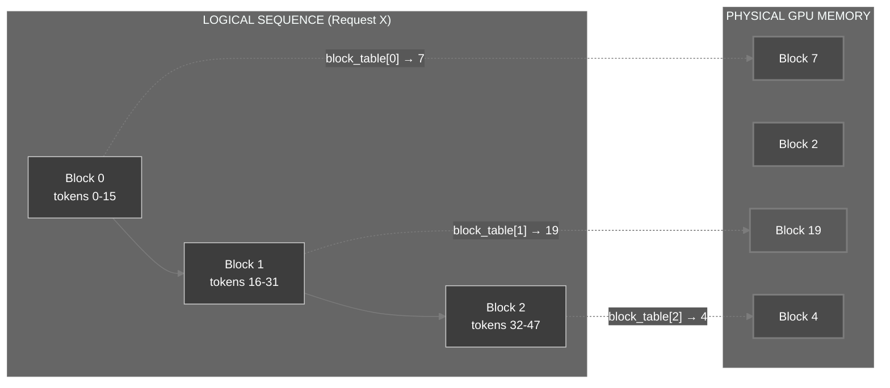

### 4.5 PagedAttention Kernel Architecture

The diagram below shows how the PagedAttention kernel accesses blocks during computation, based on the vLLM implementation .

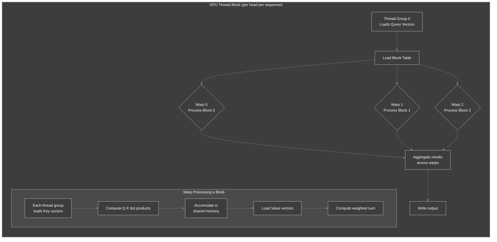

### 4.6 Block Size Trade-offs

Block size is a critical tuning parameter. The vLLM paper notes: "A smaller block size reduces internal fragmentation but increases kernel overhead; a larger block size improves kernel efficiency but wastes more memory" .

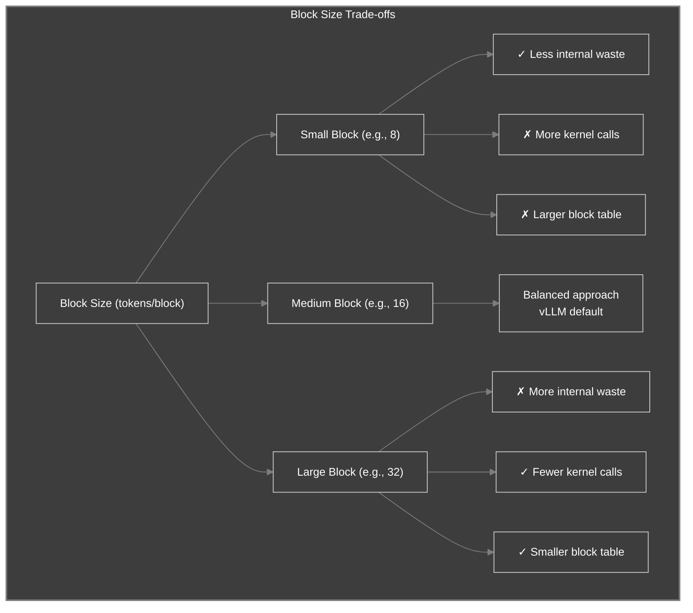

### 4.7 Understanding Block Allocation

**Question:** A request needs to store 50 tokens. With a block size of 16, how many blocks are allocated? How many token slots are wasted?

<details>
<summary>Click to review</summary>

Blocks needed: ceil(50 / 16) = 4 blocks
Total capacity: 4 × 16 = 64 token slots
Used: 50 tokens
Wasted: 64 - 50 = 14 tokens (internal fragmentation)

Waste percentage: 14 / 64 = 21.9%

This is the maximum internal fragmentation per request. Across many requests with varying lengths, the average waste is approximately block_size / 2.

</details>

### 4.8 Checkpoint

**Self-Assessment:**

- [ ]  I can explain why contiguous allocation leads to fragmentation.
- [ ]  I understand how PagedAttention uses a block table to decouple logical and physical memory.
- [ ]  I can implement a basic block allocator with reference counting.

### 4.8 Experiment: Simulate Fragmentation

1. Write a simulation that allocates and frees blocks for random requests.
2. Track the number of free blocks and compare the fragmentation in contiguous vs paged allocation.

<details>
<summary>Experiment Guide</summary>

The vLLM paper reports that with PagedAttention, "internal fragmentation collapses" to at most block_size - 1 tokens per sequence, and external fragmentation is eliminated entirely . Your simulation should show that paged allocation achieves near-100% utilization while contiguous allocation wastes 60-80% of memory.

</details>

---

## Chapter 5: Building the Inference Pipeline

### 5.1 Think First: Orchestrating Requests

A real inference engine must handle multiple requests concurrently. Requests arrive at different times, have different prompt lengths, and generate different numbers of output tokens.

**Question:** What challenges arise when mixing a short prompt (e.g., 10 tokens) with a long prompt (e.g., 2000 tokens) in the same batch?

<details>
<summary>Click to review</summary>

- **Prefill phase:** The short prompt finishes quickly and moves to decode, while the long prompt is still in prefill. The batch must handle both phases simultaneously.
- **Memory:** The long prompt consumes more KV cache blocks.
- **Scheduling:** The engine must decide when to admit new requests and when to preempt running ones.

As the IEEE characterization study notes, "the decision of what batching strategy, what KV cache eviction policy to apply and how the KV cache impacts the inference performance is non-trivial" .

</details>

### 5.2 Two-Phase Inference Architecture

Production systems like NVIDIA's TensorRT-LLM explicitly separate prefill and generation phases .

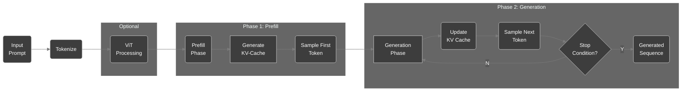

### 5.3 Core Data Structures

The scheduler tracks request state and allocates resources.

```python
# scheduler.py
from enum import Enum
from dataclasses import dataclass
import time
from typing import List, Optional, Dict, Any

class RequestStatus(Enum):
    WAITING = "waiting"
    RUNNING = "running"
    FINISHED = "finished"

@dataclass
class InferenceRequest:
    """A single user request with engine-managed state."""
    request_id: str
    prompt_token_ids: List[int]
    output_token_ids: List[int] = None
    status: RequestStatus = RequestStatus.WAITING
    block_table: List[int] = None
    created_at: float = None
    started_at: float = None

    def __post_init__(self):
        if self.output_token_ids is None:
            self.output_token_ids = []
        if self.created_at is None:
            self.created_at = time.time()

    @property
    def total_tokens(self) -> int:
        return len(self.prompt_token_ids) + len(self.output_token_ids)

    @property
    def is_prefill(self) -> bool:
        return len(self.output_token_ids) == 0

class BatchScheduler:
    """Implements continuous batching as described in vLLM paper ."""

    def __init__(self, max_batch_size=64, max_seq_len=4096):
        self.max_batch_size = max_batch_size
        self.max_seq_len = max_seq_len
        self.waiting_queue = []
        self.running_queue = []
        self.finished_queue = []

    def add_request(self, request: InferenceRequest):
        self.waiting_queue.append(request)

    def schedule(self, kv_cache: PagedKVCache) -> List[InferenceRequest]:
        # Sort waiting by prompt length (smaller first for efficiency)
        self.waiting_queue.sort(key=lambda r: len(r.prompt_token_ids))

        scheduled = []
        for request in list(self.waiting_queue):
            if len(self.running_queue) + len(scheduled) >= self.max_batch_size:
                break
            # Q1: Compute required blocks for this request
            required_blocks = kv_cache.get_required_blocks(request.total_tokens)
            if len(kv_cache.free_blocks) < required_blocks:
                continue
            block_table = kv_cache.allocate(request.request_id, request.total_tokens)
            if block_table:
                request.block_table = block_table
                request.status = RequestStatus.RUNNING
                request.started_at = time.time()
                self.waiting_queue.remove(request)
                self.running_queue.append(request)
                scheduled.append(request)
        return scheduled
```

### 5.4 The Engine's Execution Loop

The following diagram shows the flow of one engine step.

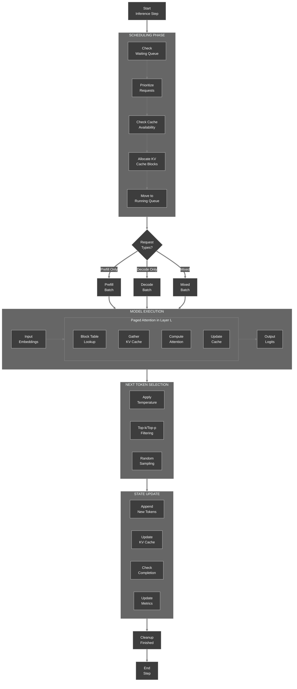

### 5.5 Continuous Batching Timeline

This Gantt chart shows how prefill and decode phases interleave for multiple requests.

```mermaid
gantt
    dateFormat  X
    axisFormat  %L ms
    title Continuous Batching Timeline: Overlapping Requests

    section Request A (512 tokens)
    Prefill A (45ms)     :done, a1, 0, 45
    Decode A (100 tokens):active, a2, 45, 145

    section Request B (64 tokens)
    Waiting             :done, b0, 10, 15
    Prefill B (6ms)     :done, b1, 15, 21
    Decode B (50 tokens):active, b2, 21, 71

    section Request C (256 tokens)
    Waiting             :done, c0, 20, 25
    Prefill C (22ms)    :done, c1, 25, 47
    Decode C (150 tokens):active, c2, 47, 197
```

### 5.6 Simplified Engine Step Implementation

Fill in the missing parts of the engine's main step.

```python
# engine.py
class NanoVLLMEngine:
    """Minimal inference engine implementing the full pipeline."""

    def __init__(self, model, tokenizer, scheduler, kv_cache):
        self.model = model
        self.tokenizer = tokenizer
        self.scheduler = scheduler
        self.kv_cache = kv_cache
        self.requests: Dict[str, InferenceRequest] = {}

    def add_request(self, prompt: str, **params) -> str:
        """Add a new inference request."""
        token_ids = self.tokenizer.encode(prompt)
        request_id = f"req_{len(self.requests)}"
        request = InferenceRequest(
            request_id=request_id,
            prompt_token_ids=token_ids
        )
        self.requests[request_id] = request
        self.scheduler.add_request(request)
        return request_id

    def step(self):
        # 1. Schedule new requests
        scheduled = self.scheduler.schedule(self.kv_cache)
        if not self.scheduler.running_queue:
            return {}

        # 2. Prepare batch
        batch = self._prepare_batch(self.scheduler.running_queue)

        # 3. Forward pass
        if batch['is_prefill']:
            logits = self.model.prefill(batch['embeddings'], batch['block_tables'])
        else:
            logits = self.model.decode(batch['embeddings'], batch['block_tables'], batch['seq_lengths'])

        # 4. Sample next tokens
        next_tokens = self._sample(logits, batch['requests'])

        # 5. Update each request
        completed = []
        for i, req in enumerate(batch['requests']):
            req.output_token_ids.append(next_tokens[i])
            # Q1: Update KV cache (append new K/V for this token)
            # (Assume model has method to get new K/V from last token)
            new_k, new_v = self.model.get_last_kv(req, next_tokens[i])
            # In a full implementation, you would call kv_cache.append
            # self.kv_cache.append(req.request_id, new_k, new_v)

            if self._is_finished(req):
                req.status = RequestStatus.FINISHED
                self.scheduler.running_queue.remove(req)
                self.scheduler.finished_queue.append(req)
                self.kv_cache.free(req.request_id)
                completed.append(req.request_id)

        return {'completed': completed}
```

**Hints:**

- Q1: The exact implementation of `append` depends on the cache design. In a paged cache, you would write into the current block and allocate a new block if needed.

<details>
<summary>Click to see discussion</summary>

In a real implementation, `append` would:

- Determine the current block and offset from the block table and sequence length.
- Write the new K and V tensors into the appropriate slot in that block.
- If the block is full, allocate a new block from the free pool and update the block table.

The vLLM kernel documentation describes this process in detail: each thread group loads query vectors, then iterates over blocks, computing attention scores and accumulating results .

</details>

### 5.7 Request State Machine

This diagram shows the lifecycle of a request through the engine.

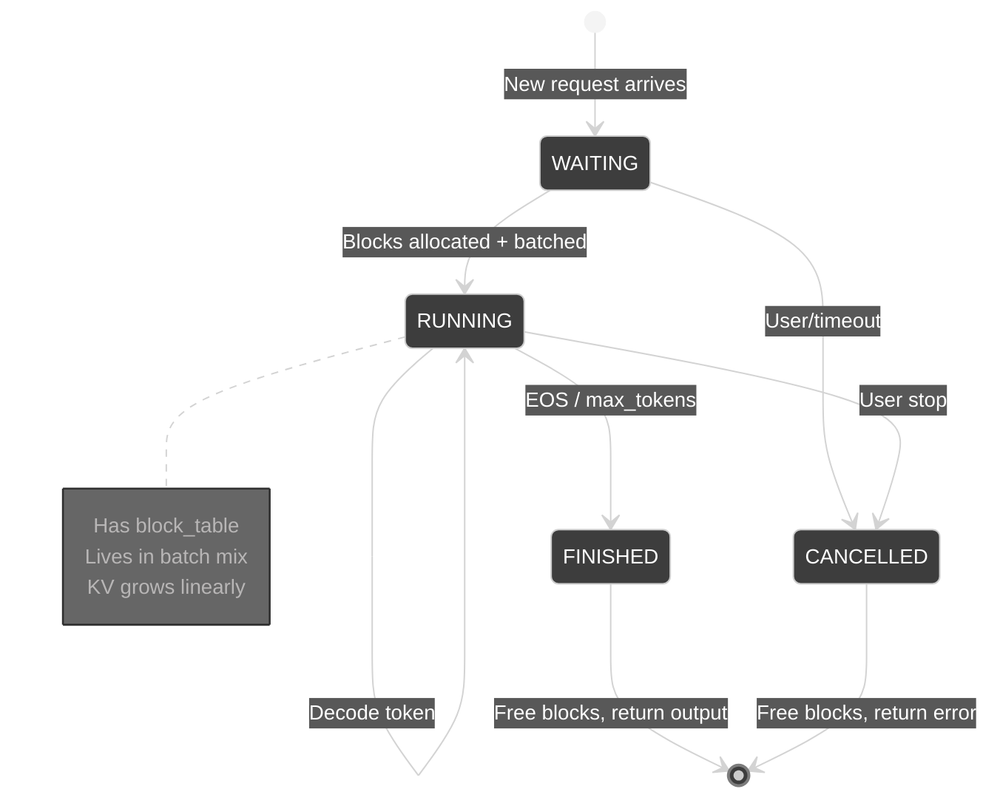

### 5.8 Checkpoint

**Self-Assessment:**

- [ ]  I can explain the role of the scheduler in continuous batching.
- [ ]  I understand how the engine interleaves prefill and decode.
- [ ]  I can trace the data flow from request admission to token output.

---

## Epilogue: The Complete System

You have now built (conceptually) all components of a minimal inference engine:

| Component | Purpose | Source |
| --- | --- | --- |
| Tokenizer | Converts text to token IDs | BPE algorithm |
| Embedding layer | Maps IDs to dense vectors | Standard transformer component |
| Transformer layers | Process embeddings with cached K/V | Attention mechanism |
| KV cache | Stores keys/values for previous tokens | Avoids recomputation |
| PagedAttention allocator | Manages cache blocks without fragmentation | vLLM design |
| Scheduler | Orchestrates multiple requests | Continuous batching |
| Sampler | Selects next token | Top-k, top-p, temperature |

To verify your understanding, run through the full flow for a single request:

```python
# Simulate one inference step (pseudocode)
request = InferenceRequest(request_id="1", prompt_token_ids=[1,2,3,4])
engine.add_request(request)
while engine.has_running():
    output = engine.step()
    if output['completed']:
        print(f"Completed: {output['completed']}")
```

---

## The Principles

1. **Inference is a subset of training** – Remove backward pass, gradients, and optimizer states; only forward pass and KV cache remain. This shifts bottlenecks from compute to memory bandwidth .
2. **The KV cache is the only dynamic state** – Its size grows linearly with sequence length and batch size, dominating memory at scale. As research shows, "the KV cache grows linearly with respect to the length and number of reasoning chains" .
3. **Paging eliminates fragmentation** – Decouple logical token order from physical memory using fixed‑size blocks and a block table, exactly as operating systems have done for decades .
4. **Two phases have different characteristics** – Prefill is compute‑bound, decode is memory‑bound; treat them separately in scheduling .
5. **Continuous batching maximizes utilization** – Interleave prefill and decode to keep GPU busy while respecting memory limits .

---

## Troubleshooting

### Error: CUDA out of memory

**Cause:** KV cache has grown too large or too many requests are running concurrently.

**Solutions:**

- Reduce `max_batch_size` in the scheduler.
- Use a smaller block size (but may increase block table overhead).
- Enable request preemption (swap KV cache to CPU) as described in the vLLM paper .

### Error: Tokenizer produces unexpected tokens

**Cause:** The tokenizer may add special tokens (e.g., `<|endoftext|>`) or handle spaces differently.

**Solution:** Inspect the tokenizer's configuration. Byte-level BPE tokenizers like GPT-2's add spaces differently from WordPiece tokenizers like BERT's .

### Error: Model forward pass fails due to shape mismatch

**Cause:** Block table indices out of range or incorrect tensor shapes.

**Solution:** Verify that the block table length matches the number of blocks allocated. Check that `head_dim` and `num_kv_heads` match the model's configuration.

---

## Next Steps

Now that you understand the inference pipeline, proceed to [**Lab 0.2: Prefill vs. Decode – The Two‑Phase Engine**](https://www.notion.so/lab0.2/README.md), where you will dive deeper into the compute‑bound prefill phase and memory‑bound decode phase, and implement a continuous batching scheduler that handles both.

**Suggested extensions:**

- Implement a simple simulator that models cache allocation and measures throughput under different scheduling policies.
- Add support for **speculative decoding** to reduce latency.
- Explore **quantization** (INT8, INT4) to shrink the weight memory footprint.
- Investigate KV cache compression techniques like Dynamic Memory Sparsification .

---

## Additional Resources

- [vLLM: Easy, Fast, and Cheap LLM Serving with PagedAttention](https://vllm.readthedocs.io/) – Production inference engine with PagedAttention
- [FlashAttention: Fast and Memory‑Efficient Exact Attention with IO-Awareness](https://arxiv.org/abs/2205.14135) – I/O-aware attention algorithm
- [Byte-Pair Encoding tokenization](https://huggingface.co/docs/transformers/tokenizer_summary) – Hugging Face's tokenizer documentation
- [TensorRT-LLM Documentation](https://nvidia.github.io/TensorRT-LLM/) – NVIDIA's optimized inference runtime
- [Characterizing KV Caching Under Concurrency](https://ieeexplore.ieee.org/document/11078403) – IEEE study on KV cache behavior

---

**Navigation:** [← Main](https://www.notion.so/README.md) | [Next: Lab 0.2 →](https://www.notion.so/lab0.2/README.md)