# Lab 0.2: Prefill vs. Decode – The Two-Phase Engine

**Navigation:** [← Lab 0.1](../lab0.1/README.md) | [Main](../README.md) | [Next: Lab 0.3 →](../lab0.3/README.md)

---

## Introduction

Large Language Model (LLM) inference is not a single uniform process. It splits into two physically distinct phases – **prefill** and **decode** – that behave differently on hardware and require different optimization strategies [1]. This lab dissects these phases, explains why they exist, and shows how modern systems (vLLM, TensorRT-LLM, TGI) manage them to achieve low latency and high throughput.

You will learn the mathematical foundation of autoregressive generation, the role of the KV cache, the memory/compute characteristics of each phase, and the scheduling techniques that allow efficient batching. Through code examples and interactive exercises, you will internalize why LLM serving is challenging and how production systems overcome those challenges.

**Prerequisites:** Basic understanding of transformer architecture, Python, and familiarity with PyTorch. Knowledge of GPU architecture (HBM, compute units) is helpful but not required.

---

## Learning Objectives

By the end of this lab, you will be able to:

1. Explain why LLM inference is split into prefill and decode phases.
2. Describe the mathematical chain rule that forces sequential generation.
3. Identify the compute‑bound nature of prefill and the memory‑bound nature of decode.
4. Implement a simple KV cache and quantify its speedup.
5. Analyze the memory access patterns that limit decode performance.
6. Compare static, dynamic, and continuous batching strategies.
7. Sketch the architecture of PagedAttention and chunked prefill.
8. Predict the impact of batch size, sequence length, and model size on latency and throughput.
9. Evaluate the trade‑offs of advanced optimizations like prefix caching and speculative decoding.

---

## Prologue: The Challenge

You are an ML engineer at a startup that just launched a conversational AI assistant. Users love it, but the inference latency is too high – especially when many users chat simultaneously. Your CTO asks you to investigate: “Why does generating a 100‑token answer take 2 seconds even on an A100? And why does the first token appear quickly but the rest trickle out slowly?”

You suspect the answer lies in how the model generates text. Unlike traditional deep learning models that process all inputs in one forward pass, an LLM must produce tokens one by one. This inherent sequentiality creates two distinct phases: one that processes the user’s prompt in parallel, and another that generates each new token using the results of the previous step. Understanding these phases is the key to optimizing your system.

In this lab, you will step into the role of a performance engineer. You will dissect the two‑phase engine, run experiments, and learn the techniques that frameworks like vLLM use to deliver fast, scalable inference.

---

## Environment Setup

Before you begin, set up a Python environment with the required libraries. All code examples use PyTorch; you can run them on a CPU, but a GPU will make the performance differences more visible.

```bash
# Create and activate a virtual environment
python3 -m venv venv
source venv/bin/activate

# Install packages
pip install torch transformers matplotlib numpy
```

Optionally, install `vllm` and `tensorrt-llm` if you want to explore production systems later, but they are not required for the core exercises.

Create a working directory for your code:

```bash
mkdir lab0.2
cd lab0.2
touch prefill.py decode.py scheduler.py
```

---

## Chapter 1: Autoregressive Foundation

### What You Will Build

In this chapter, you will calculate KV cache memory requirements and understand the speedup from caching. You will not write code yet, but you will perform mental calculations and predict outcomes.

### 1.1 Why Generation Must Be Sequential

Every LLM is trained to predict the next token given the previous ones. During inference, this becomes a chain: the output of step 1 is the input for step 2. This is the **autoregressive property** [1].

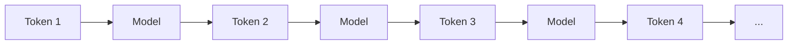

The probability of a whole sequence is the product of conditional probabilities, as established in the foundational Transformer paper “Attention Is All You Need” [1]:

$$
P(w_1, w_2, ..., w_T) = \prod_{t=1}^{T} P(w_t | w_1, ..., w_{t-1})
$$

Because each probability depends on all previous tokens, we cannot compute tokens in parallel during inference. This sequential dependency is the root cause of the two-phase architecture.

### 1.2 Think First: Sequential Dependency

**Question:** If you have a model that can process 1000 tokens in parallel during training, why can’t it generate 1000 tokens in parallel during inference?

<details>
<summary>Click to review</summary>

During training, the entire correct sequence is available, so the model can compute all positions simultaneously using a causal mask. During inference, you don’t know the future tokens; each step’s output depends on the previous step’s sampled token. This creates a data dependency that forces sequential generation.

</details>

### 1.3 Computational Graph Decomposition

The forward pass of a single transformer layer at time $t$ can be written as:

$$
h_t = \text{TransformerLayer}(h_{t-1}, K_{1:t-1}, V_{1:t-1})
$$

where $K_{1:t-1}, V_{1:t-1}$ are the key and value vectors from all previous tokens. If we had to recompute these vectors for every new token, the cost would be $O(T^2)$. This is why we cache them – the **KV cache** [2].

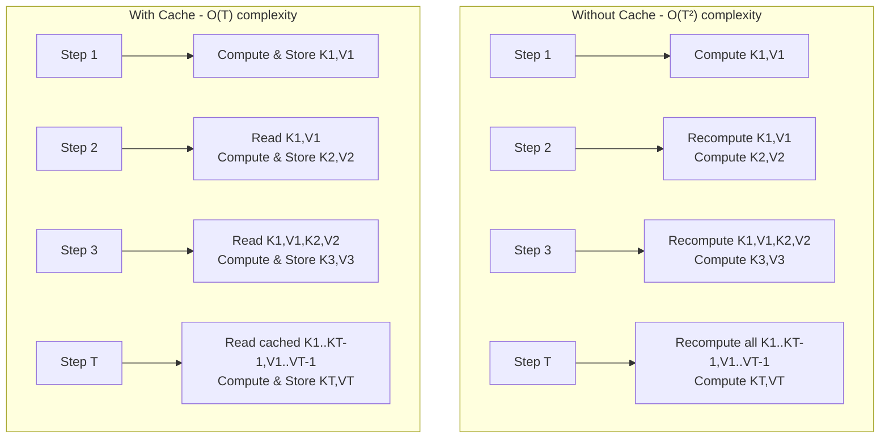

### 1.4 The KV Cache: Trading Memory for Compute

The KV cache eliminates redundant computation, reducing total cost from $O(T^2)$ to $O(T)$.

**Performance Impact:**

| Sequence Length | Without Cache (ops) | With Cache (ops) | Speedup |
| --- | --- | --- | --- |
| 10 | 55 | 10 | 5.5× |
| 100 | 5050 | 100 | 50.5× |
| 1000 | 500500 | 1000 | 500.5× |

**Think First:** For a 32‑layer model with hidden size 4096, how many bytes are needed to store the KV cache for a 1000‑token sequence? Assume FP16.

<details>
<summary>Click to calculate</summary>

Each token produces a key and a value vector per layer. For each layer: $2 \times 4096 \times 2$ bytes = 16 KB per token (key + value). For 32 layers: $32 \times 16$ KB = 512 KB per token. For 1000 tokens: 512 MB.

</details>

### 1.5 GPT Inference Process Diagram

The following diagram from the ORCA paper illustrates the autoregressive inference process for a 3-layer GPT model [10]:

```mermaid
graph LR
    I1["Iteration 1 Prefill:<br/>Input: I think this"] --> L1_1[Process Layer 1] --> L2_1[Process Layer 2] --> L3_1[Process Layer 3] --> O1["Output: is"]
    O1 --> I2["Iteration 2 Decode:<br/>Input: I think this is"]
    I2 --> L1_2[Process Layer 1] --> L2_2[Process Layer 2] --> L3_2[Process Layer 3] --> O2["Output: awesome"]
    O2 --> I3["Iteration 3 Decode:<br/>Input: I think this is awesome"]
    I3 --> L1_3[Process Layer 1] --> L2_3[Process Layer 2] --> L3_3[Process Layer 3] --> O3["Output: EOS"]
```

**Diagram Explanation:** This diagram shows a 3-layer GPT model processing a request through multiple iterations. The first iteration (prefill) processes all input tokens ("I think this") in parallel and generates the first output token ("is"). Subsequent iterations (decode) process one token at a time, using previously generated tokens as input. Nodes with the same color represent the same model layer executing at different time steps. This visualization makes clear why inference must be sequential—each iteration depends on the output of the previous one.

### 1.6 KV Cache Evolution Diagram

The following diagram illustrates how the KV cache evolves during the decode phase:

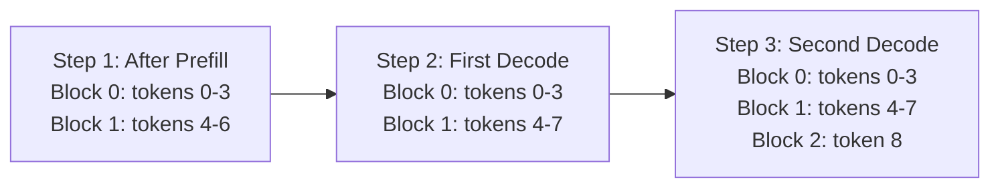

**Diagram Explanation:** This diagram shows the progressive growth of the KV cache during decode. After prefill with 7 tokens, logical blocks 0 and 1 are partially filled. The first decode step adds one token, filling the remaining slot in block 1. The second decode step requires allocating block 2. This incremental allocation avoids pre-allocating memory for the maximum possible sequence length, saving significant memory when actual output lengths are shorter.

### 1.7 GPU Memory Allocation in LLM Inference

The following diagram from the PagedAttention paper shows how memory is allocated in LLM inference on an A100 GPU [7]:

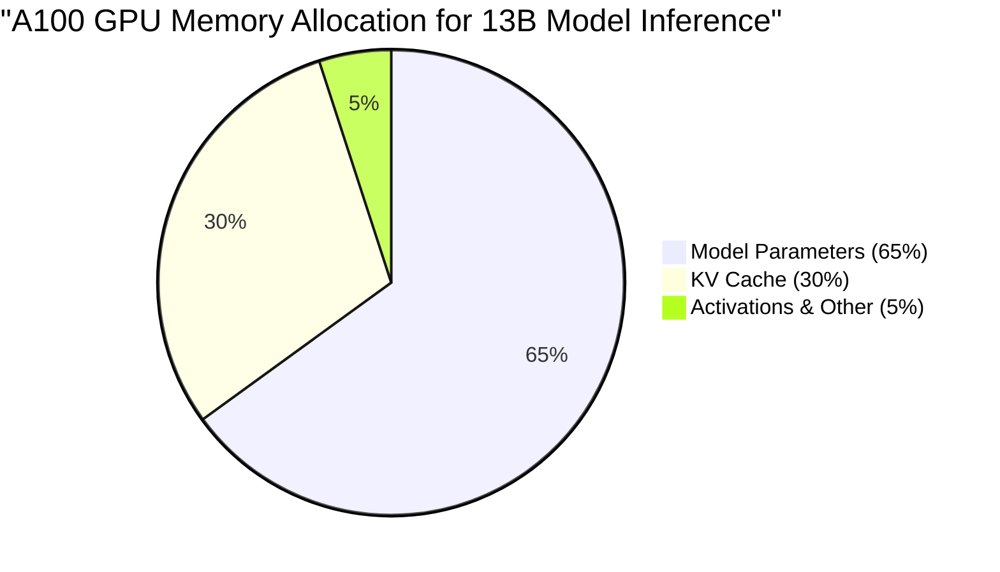

**Diagram Explanation:** This pie chart illustrates the memory breakdown for a 13B parameter model on an A100 GPU. Model parameters consume the majority (65%) of GPU memory and are statically allocated. The KV cache, despite being dynamically allocated based on sequence length, consumes a significant portion (30%). This highlights why efficient KV cache management is critical—it's the second-largest memory consumer and grows unpredictably with request length.

### 1.8 vLLM Memory Efficiency Comparison

The following diagram compares vLLM's memory usage against other systems:

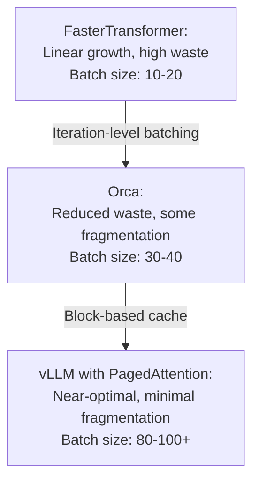

**Diagram Explanation:** This comparison shows how different systems handle memory as batch size increases. FasterTransformer shows steep memory growth due to pre-allocation. Orca improves but suffers from fragmentation. vLLM with PagedAttention achieves near-linear scaling, enabling much larger batch sizes within the same memory budget.

### 1.9 Internal and External Fragmentation in KV Cache

The following diagram illustrates the fragmentation problem in traditional KV cache allocation:

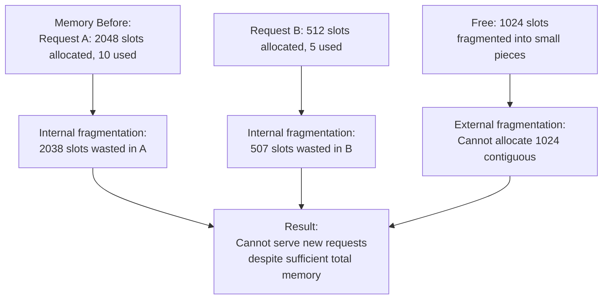

**Diagram Explanation:** This diagram shows the fragmentation problem in traditional contiguous KV cache allocation. Request A pre-allocates 2048 slots but only uses 10, wasting 2038 slots internally. Request B pre-allocates 512 slots but only uses 5, wasting 507 slots. Even though total free memory (1024 slots) exceeds what Request C needs, external fragmentation prevents allocating a contiguous 1024-slot block. This motivates PagedAttention's block-based approach.

### 1.10 From Mathematics to Two Phases

The KV cache leads naturally to two phases:

1. **Prefill** – Process the entire prompt, compute and store the initial $K_{1:S}, V_{1:S}$.
2. **Decode** – Generate one new token at a time, using the cache to avoid recomputation.

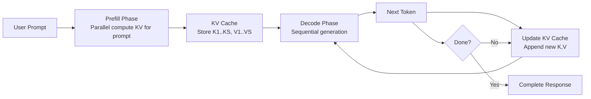

### 1.11 Architecture Diagram

The diagram below illustrates the two-phase inference engine with modern optimizations.


> **Note:** The diagram shows FlashAttention and PagedAttention applied during both phases, with the KV cache serving as the bridge between prefill and decode. Time-to-First-Token (TTFT) is determined by prefill, while Time-per-Output-Token (TPOT) is determined by decode.

### 1.12 Test and Verify

**Predict:** For a 2048‑token sequence and a 7B model (32 layers, hidden size 4096), what is the approximate KV cache size in GB? Use FP16.

<details>
<summary>Click to verify</summary>

Cache size per token = 32 layers × 2 (key+value) × 4096 × 2 bytes = 32 × 2 × 4096 × 2 = 524,288 bytes ≈ 0.5 MB.

For 2048 tokens: 2048 × 0.5 MB = 1024 MB = 1 GB.

</details>

### 1.13 Checkpoint

**Self-Assessment:**
- [ ] I can explain why inference must be sequential.
- [ ] I can write the probability chain rule.
- [ ] I can describe the purpose of the KV cache.
- [ ] I can compute the speedup from caching for a given sequence length.
- [ ] I can estimate the memory required for KV cache.

---

## Chapter 2: The Prefill Phase – Compute‑Bound Parallelism

### What You Will Build

You will implement a simplified prefill that computes attention for a prompt and populates the KV cache. You will measure its arithmetic intensity and confirm it is compute‑bound.

### 2.1 Context

The prefill phase processes the user’s prompt in one shot. Because the entire prompt is available, the model can perform massive matrix multiplications, fully utilizing the GPU’s compute units. This phase is **compute‑bound** [3].

### 2.2 Think First: Parallelism

**Question:** Why is prefill able to use parallelism while decode cannot?

<details>
<summary>Click to review</summary>

Prefill has all tokens available simultaneously, so it can compute attention scores for all positions in parallel using matrix multiplication. Decode must compute one token at a time because each new token depends on the previous one.

</details>

### 2.3 Prefill Phase Data Flow Diagram

The following diagram from FlashInfer documentation illustrates the prefill phase data flow:

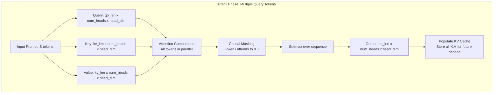

**Diagram Explanation:** This diagram shows the data flow during the prefill phase. The query tensor has shape `[qo_len, num_heads, head_dim]` where `qo_len` is the prompt length. All query tokens are processed in parallel against the key and value tensors. Causal masking ensures each token can only attend to previous tokens. The output includes embeddings for all prompt positions, and the KV cache is populated for future decode steps.

### 2.4 Attention Computation

The attention mechanism:

$$
\text{Attention}(Q,K,V) = \text{softmax}\left(\frac{QK^T}{\sqrt{d_k}}\right)V
$$

For a prompt of length $S$:

- $Q,K,V \in \mathbb{R}^{S \times d_{\text{model}}}$
- $QK^T \in \mathbb{R}^{S \times S}$ (quadratic complexity)

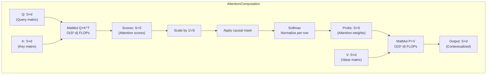

### 2.5 Prefill Kernel Architecture

The following diagram illustrates the architecture of FlashInfer's prefill kernel:

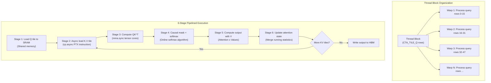

**Diagram Explanation:** This diagram shows the thread block organization in FlashInfer's prefill kernel. Each thread block processes a tile of query rows (`CTA_TILE_Q`) and a tile of KV columns (`CTA_TILE_KV`). Warps within the block distribute the query rows. The kernel operates in six stages: loading query data to shared memory, asynchronously loading key/value tiles, computing QK multiplication using tensor core `mma_sync` instructions, applying causal masking and softmax, computing the output with value tensors, and updating the attention state with online softmax statistics.

### 2.6 FLOPs Breakdown

Total FLOPs ≈ $2 N S \left(1 + \frac{S}{d_{\text{model}}}\right)$, where $N$ is the number of model parameters. The term $\frac{S}{d_{\text{model}}}$ is the quadratic attention cost.

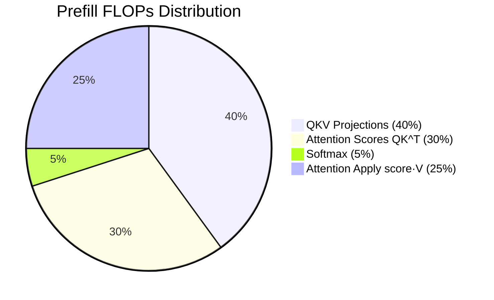

### 2.7 Memory Hierarchy During Prefill

Modern GPUs have a complex memory hierarchy. Understanding it is key to optimizing prefill.

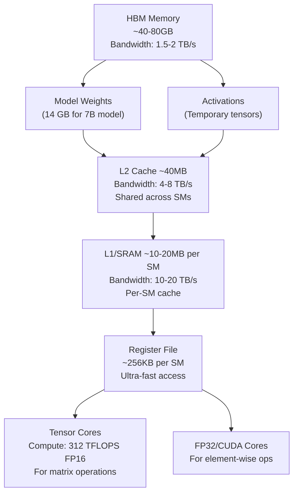

**Arithmetic intensity** = total FLOPs / total bytes moved. For prefill, it is proportional to $S$, so for typical prompts ($S > 100$) it exceeds the GPU’s ops:byte ratio, making it compute‑bound.

### 2.8 Tiled Attention Computation

The following diagram illustrates tiled attention computation used in FlashAttention:

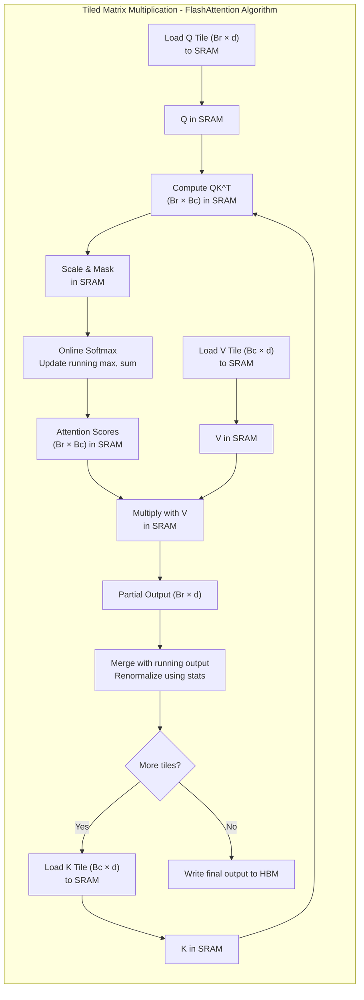

**Diagram Explanation:** This diagram shows the tiled approach used in FlashAttention. Instead of computing the full S×S attention matrix, the computation is broken into tiles that fit in shared memory. Each tile computes QK^T for a subset of query and key positions, applies softmax incrementally, and computes partial output. This reduces memory footprint from quadratic to linear and enables better cache utilization.

### 2.9 FlashAttention: IO-Aware Attention

FlashAttention, introduced by Dao et al. (2022) [3], is an IO-aware exact attention algorithm that uses tiling to reduce memory reads/writes. It achieves 2-4× speedup compared to PyTorch standard attention.

```mermaid
graph TB
    subgraph StandardAttention["Standard Attention - Multiple HBM Accesses"]
        SA1["1. Load Q,K,V from HBM<br/>(3 reads)"]
        SA1 --> SA2["2. Compute S = QK^T<br/>(in registers)"]
        SA2 --> SA3["3. Write S to HBM<br/>(1 write, S×S matrix)"]
        SA3 --> SA4["4. Load S from HBM<br/>(1 read)"]
        SA4 --> SA5["5. Compute softmax(S)<br/>(in registers)"]
        SA5 --> SA6["6. Write P to HBM<br/>(1 write, S×S matrix)"]
        SA6 --> SA7["7. Load P from HBM<br/>(1 read)"]
        SA7 --> SA8["8. Compute O = PV<br/>(in registers)"]
        SA8 --> SA9["9. Write O to HBM<br/>(1 write)"]
        SA9 --> SATotal["Total: O(S²) memory I/O"]
    end
    
    subgraph FlashAttn["FlashAttention - SRAM-Based Tiling"]
        FA1["1. Load Q tile to SRAM"]
        FA1 --> FA2["2. Load K tile to SRAM"]
        FA2 --> FA3["3. Compute QK^T in SRAM"]
        FA3 --> FA4["4. Online softmax in SRAM"]
        FA4 --> FA5["5. Load V tile to SRAM"]
        FA5 --> FA6["6. Compute partial output<br/>Accumulate in SRAM"]
        FA6 --> FA7{"More tiles?"}
        FA7 -->|Yes| FA2
        FA7 -->|No| FA8["7. Write final O to HBM<br/>(1 write only)"]
        FA8 --> FATotal["Total: O(S) memory I/O"]
    end
```

**Memory savings:** FlashAttention reduces memory footprint from quadratic to linear in sequence length. At sequence length 4K, memory savings reach 20× [3].

### 2.10 Implementation: Naive vs FlashAttention

Complete the following code for a naive attention forward pass. Fill in the blanks.

```python
import torch
import torch.nn.functional as F

def naive_attention(q, k, v):
    # q, k, v: [batch, seq_len, num_heads, head_dim]
    batch, seq_len, num_heads, head_dim = q.shape

    # Reshape for matmul
    q = q.transpose(1, 2)  # [batch, num_heads, seq_len, head_dim]
    k = k.transpose(1, 2)
    v = v.transpose(1, 2)

    # Compute scores (QK^T)
    scores = torch.matmul(q, k.transpose(-2, -1)) / (head_dim ** 0.5)  # Q1: What shape? [batch, num_heads, seq_len, seq_len]

    # Apply causal mask
    mask = torch.triu(torch.ones(seq_len, seq_len, device=q.device), diagonal=1).bool()
    scores = scores.masked_fill(mask, float('-inf'))

    # Softmax
    attn_weights = F.softmax(scores, dim=-1)  # Q2: Which dimension? dim=-1 (over keys)

    # Apply to values
    out = torch.matmul(attn_weights, v)  # Q3: What is the output shape? [batch, num_heads, seq_len, head_dim]

    return out.transpose(1, 2)  # [batch, seq_len, num_heads, head_dim]
```

- Click for solutions
    
    **Q1:** `[batch, num_heads, seq_len, seq_len]`
    
    **Q2:** `dim=-1` (over the last dimension, i.e., over keys)
    
    **Q3:** `[batch, num_heads, seq_len, head_dim]` after transpose becomes `[batch, seq_len, num_heads, head_dim]`
    

Now, compare with FlashAttention using PyTorch’s built‑in implementation (available in 2.0+):

```python
def flash_attention(q, k, v):
    return F.scaled_dot_product_attention(
        q, k, v, attn_mask=None, dropout_p=0.0, is_causal=True
    )
```

For more control, you can use the official FlashAttention package [4]:

```python
# Using the official FlashAttention package for more control
from flash_attn.flash_attention import FlashAttention

flash_attn = FlashAttention(
    softmax_scale=None,  # Will use 1/sqrt(d) by default
    attention_dropout=0.0
)
# q, k, v should be [batch, seq_len, num_heads, head_dim]
output = flash_attn(q, k, v)
```

### 2.11 FlashAttention Speedup and Memory Savings

The official FlashAttention benchmarks show significant improvements across different GPUs [4]:

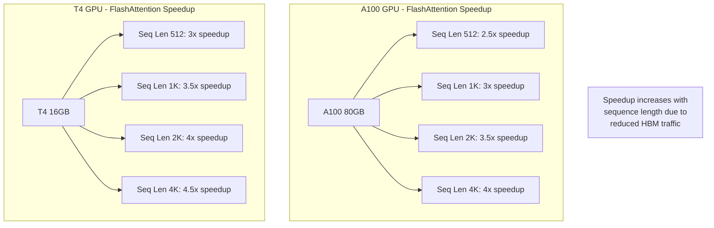

### 2.12 Multi-Query and Grouped-Query Attention

Modern models often use **Multi-Query Attention (MQA)** or **Grouped-Query Attention (GQA)** to reduce KV cache size and memory bandwidth. Instead of having separate key/value heads for each query head, they share keys and values across groups of query heads [5].

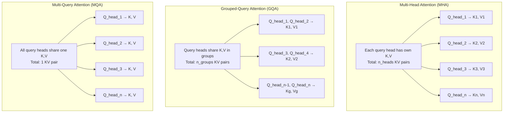

**Memory savings:** For Llama 2 70B (8 KV heads, 64 query heads), GQA reduces KV cache size by 8× compared to MHA.

### 2.13 Test and Verify

**Predict:** For a prompt of 512 tokens and a model with 4096 hidden size, will prefill be compute‑bound or memory‑bound on an A100 (peak compute 312 TFLOPS, bandwidth 1.5 TB/s)? Assume arithmetic intensity threshold ≈ 100 FLOPs/byte.

<details>
<summary>Click to verify</summary>

Compute‑bound. Arithmetic intensity ~ $S$ = 512, which is well above 100. The GPU will spend most of its time computing, not waiting for memory.

</details>

### 2.14 Experiment: Measure Arithmetic Intensity

Write a simple script to measure the arithmetic intensity of prefill:

```python
import torch
import time

def measure_arithmetic_intensity(model, input_ids):
    # Profile forward pass
    torch.cuda.reset_peak_memory_stats()
    start_time = time.time()
    
    with torch.no_grad():
        output = model(input_ids)
    
    torch.cuda.synchronize()  # Wait for GPU to finish
    end_time = time.time()
    elapsed_time = end_time - start_time

    # Get memory stats
    memory_stats = torch.cuda.memory_stats()
    bytes_moved = memory_stats["active_bytes.all.current"]

    # Estimate FLOPs (simplified)
    # For a transformer: roughly 2 * n_params * seq_len FLOPs
    n_params = sum(p.numel() for p in model.parameters())
    seq_len = input_ids.shape[1]
    flops = 2 * n_params * seq_len

    arithmetic_intensity = flops / bytes_moved
    print(f"Sequence Length: {seq_len}")
    print(f"FLOPs: {flops / 1e9:.2f} GFLOPs")
    print(f"Bytes Moved: {bytes_moved / 1e9:.2f} GB")
    print(f"Arithmetic Intensity: {arithmetic_intensity:.2f} FLOPs/byte")
    print(f"Time: {elapsed_time * 1000:.2f} ms")
    
    return arithmetic_intensity
```

Run this for different sequence lengths and observe the trend.

### 2.15 Checkpoint

**Self-Assessment:**
- [ ] I can explain why prefill is compute‑bound.
- [ ] I can implement a basic attention mechanism.
- [ ] I can describe the memory hierarchy and its impact on prefill.
- [ ] I know what FlashAttention improves and by how much.
- [ ] I can explain the tiling strategy used in FlashAttention.
- [ ] I understand the difference between MHA, GQA, and MQA.

---

## Chapter 3: The Decode Phase – Memory‑Bound Iteration

### What You Will Build

You will implement a decode step that reads from a KV cache and produces the next token logits. You will measure its arithmetic intensity and see why it is memory‑bound.

### 3.1 Context

After the prompt is processed, the model enters the decode phase. It generates one token at a time, each requiring a full forward pass through the model. Because the KV cache holds the history, the model still attends to all previous tokens, but now the workload is dominated by moving data from memory to the compute units. This phase is **memory‑bound** [6].

### 3.2 Think First: Memory Access

**Question:** In the decode step, you need to load the model weights and the entire KV cache. How many bytes are moved for a model with 7B parameters (FP16) and a KV cache of 1000 tokens (each token contributes key and value vectors of size $d_{\text{model}}$ per layer)? Assume 32 layers, hidden size 4096.

<details>
<summary>Click to review</summary>

- Model weights: $7B \times 2$ bytes ≈ 14 GB.
    - KV cache: As computed earlier, 512 MB. So total ≈ 14.5 GB moved per decode step. The computation performed is only a few GFLOPS, leading to an arithmetic intensity < 1. Hence memory‑bound.

</details>

### 3.3 Decode Phase Data Flow Diagram

The following diagram from FlashInfer documentation illustrates the decode phase data flow:

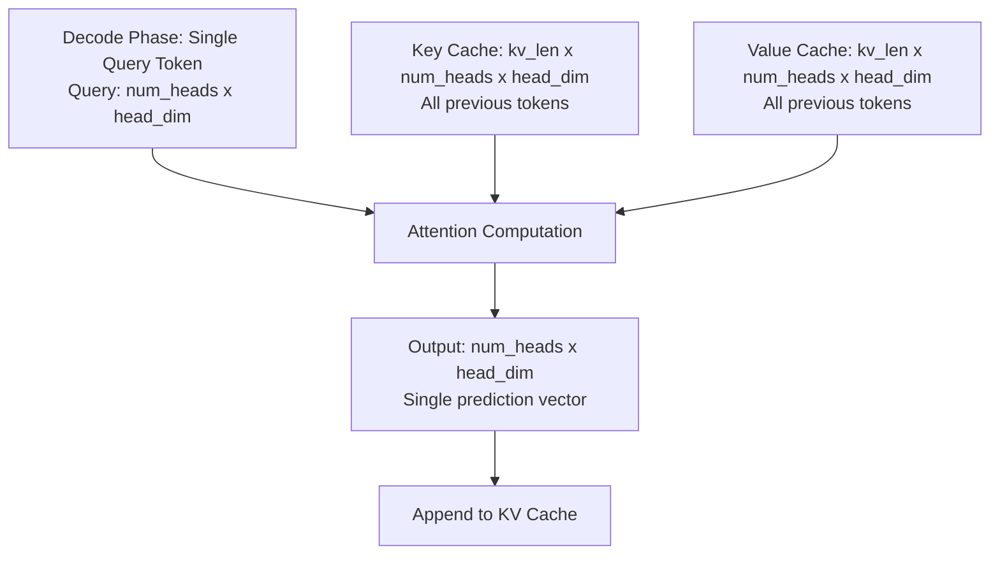

**Diagram Explanation:** This diagram shows the data flow during the decode phase. Unlike prefill, the query is a single token with shape `[num_heads, head_dim]`. The key and value tensors are the accumulated KV cache from all previous tokens. Attention is computed between this single query and all cached keys/values. The output is a single vector used to predict the next token. This phase is memory-bound because it must read the entire KV cache for each token generated.

### 3.3.1 Decode Kernel Architecture

The following diagram illustrates FlashInfer's decode kernel architecture with pipelining:

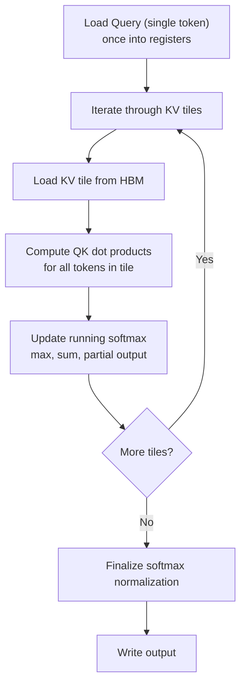

**Diagram Explanation:** This diagram shows the pipelined architecture of FlashInfer's decode kernel. The query vector is loaded once into registers. Then the kernel iterates through KV cache tiles, loading each tile from HBM, computing QK dot products for all tokens in the tile, and updating the online softmax state. This pipelining overlaps computation with memory loads, hiding some latency, but the kernel remains memory-bound because the ratio of computation to memory access is low.

### 3.3.2 Memory Access Pattern Analysis

The following diagram breaks down memory access and compute per decode step:

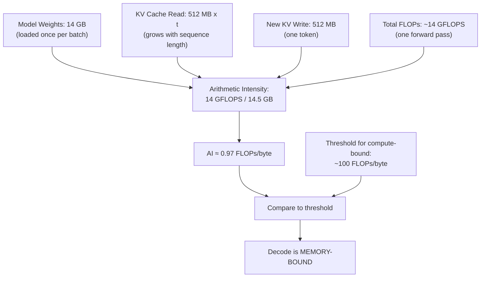

**Diagram Explanation:** This diagram quantifies why decode is memory-bound. The left column shows bytes moved from HBM: model weights (loaded once per batch), KV cache read (grows with sequence length t), and new KV write. The middle column shows FLOPs performed. The resulting arithmetic intensity (FLOPs/byte) is typically 0.1-1, far below the 100+ needed to keep tensor cores busy. The GPU spends most time waiting for data movement.

This low arithmetic intensity means the GPU is starved for data. The solution is to **batch** multiple decode requests together so that the weights are reused across sequences [6].

### 3.4 KV Cache Evolution

The cache grows linearly with each step, increasing the memory footprint and the amount of data that must be read.

```mermaid
graph LR
    K1["Step 1:<br/>K cache: 1 token<br/>V cache: 1 token"] --> K2["Step 2:<br/>K cache: 2 tokens<br/>V cache: 2 tokens"]
    K2 --> K3["Step 3:<br/>K cache: 3 tokens<br/>V cache: 3 tokens"]
```

### 3.5 The Memory Fragmentation Problem

Traditional systems allocate contiguous memory for each sequence’s KV cache. This leads to severe fragmentation [7]:

```mermaid
graph TD
    Step1["User 1 reserves 40GB slot"] --> Step2["User 1 finishes, memory freed<br/>but with alignment boundaries"]
    Step2 --> Step3["User 2 tries to allocate 40GB"]
    Step3 --> Result["Result: OOM error<br/>despite 80GB free<br/>due to fragmentation"]
```

This fragmentation limits concurrent users and wastes GPU memory [7].

### 3.6 PagedAttention: Solving Fragmentation

**PagedAttention**, introduced by Kwon et al. (2023) in the vLLM paper [7], divides the cache into fixed‑size blocks and maintains a logical-to-physical mapping.

```mermaid
flowchart LR
    T0[T0] --> T1[T1] --> T2[T2] --> T3[T3] --> T4[T4]
    T4 --> Mapping[Block Table]
    Mapping --> B0["Block 0: T0, T1"]
    Mapping --> B1["Block 1: T2, T3"]
    Mapping --> B2["Block 2: T4"]
```

This allows non‑contiguous allocation, eliminates fragmentation, and enables sharing of common prefixes (e.g., system prompts) [7].

### 3.6.1 PagedAttention Kernel Memory Access

The following diagram from vLLM documentation illustrates how threads access PagedAttention memory:

```mermaid
graph TD
    TG["Thread Group (2 threads)"] --> T0["Thread 0: handles even elements"]
    TG --> T1["Thread 1: handles odd elements"]
    
    QToken[Query Token] --> TG
    KToken[Key Token Block] --> T0
    KToken --> T1
    
    T0 --> K0["K even indices"]
    T1 --> K1["K odd indices"]
    
    K0 & K1 --> Note["Memory coalescing:<br/>Adjacent threads read<br/>adjacent memory locations"]
```

**Diagram Explanation:** This diagram shows how thread groups access memory in the PagedAttention kernel. Each thread group (2 threads in this example) handles one query token and one key token. Each thread processes a subset of elements (every other element) so that neighboring threads read neighboring memory addresses, achieving memory coalescing for better bandwidth utilization.

Key concepts from the vLLM implementation [8]:

- **Block:** Fixed-size unit of KV cache (e.g., 16 tokens per block)
- **Thread group:** Group of threads that fetch and calculate one query token together
- **Warp:** 32 threads that process one entire block of key tokens
- **Vector size:** Chosen so each thread group fetches 16 bytes at a time for coalesced memory access

### 3.7 Implementation: Decode Step with KV Cache

Complete the following decode step. Assume you have a KV cache stored as a list of `(k_cache, v_cache)` for each layer.

```python
def decode_step(input_token, position, kv_cache, model):
    # input_token: [batch, 1] token IDs
    # position: current position (int)
    # kv_cache: list of (k_cache, v_cache) for each layer
    # model: transformer model

    hidden = model.embedding(input_token)                # [batch, 1, d]
    pos_emb = model.position_embedding(position)         # [1, d]
    hidden = hidden + pos_emb.unsqueeze(0)

    for layer_idx, layer in enumerate(model.layers):
        k_cache, v_cache = kv_cache[layer_idx]

        # Compute Q, K, V for current token
        q, k, v = layer.attention.qkv_proj(hidden)       # Q1: What are shapes?

        # Update cache
        if k_cache is None:
            k_cache = k
            v_cache = v
        else:
            k_cache = torch.cat([k_cache, k], dim=1)    # Q2: Which dimension?
            v_cache = torch.cat([v_cache, v], dim=1)
        kv_cache[layer_idx] = (k_cache, v_cache)

        # Attention using full cache
        attn_out = layer.attention(q, k_cache, v_cache)
        hidden = layer.ffn(layer.norm1(hidden + attn_out))
        hidden = layer.norm2(hidden)

    logits = model.lm_head(hidden[:, -1, :])
    return logits, kv_cache
```

<details>
<summary>Click for solutions</summary>

**Q1:** `q, k, v` each have shape `[batch, 1, num_heads, head_dim]`.

**Q2:** Concatenate along the sequence dimension (`dim=1`), because the new token extends the sequence.

</details>

### 3.8 Speculative Decoding: Breaking Sequentiality

Speculative decoding [9] uses a smaller draft model to propose multiple tokens, which are then verified in parallel by the target model. This can reduce latency by 2-3×.

```mermaid
graph LR
    A[Input token] --> B["Draft model<br/>generates K candidates"]
    B --> C["Target model<br/>verifies all in parallel"]
    C --> D[Accept longest prefix]
    D --> E[Next input token]
```

**Implementation note:** This technique is especially effective when the draft model is much smaller and the acceptance rate is high.

### 3.9 Test and Verify

**Predict:** If you run decode for 100 steps, how does the time per step change? Why?

<details>
<summary>Click to verify</summary>

The time per step increases slightly because the KV cache grows, so more data must be read from memory each time. However, the increase is sublinear because the attention computation is $O(t \cdot d)$ and memory movement is $O(t \cdot d)$ as well. The dominating factor is still the model weights, so the increase may be modest.

</details>

### 3.10 Checkpoint

**Self-Assessment:**
- [ ] I can explain why decode is memory‑bound.
- [ ] I can implement a decode step with a KV cache.
- [ ] I understand how PagedAttention reduces fragmentation.
- [ ] I can calculate arithmetic intensity for a given configuration.
- [ ] I can explain the memory fragmentation problem with an example.
- [ ] I understand the basic idea of speculative decoding.

---

## Chapter 4: The Scheduler’s Challenge – Batching Heterogeneous Work

### What You Will Build

You will simulate a simple scheduler that batches requests and observe the trade‑offs between static, dynamic, and continuous batching.

### 4.1 Context

A production server handles many requests simultaneously. Some are in prefill (processing a new prompt), others are in decode (generating the next token). The scheduler must decide which requests to run in each iteration to maximize throughput while meeting latency SLOs [10].

### 4.2 Think First: Batching

**Question:** Why can’t we simply run all waiting requests together in one giant batch?

<details>
<summary>Click to review</summary>

- Different requests are at different phases (prefill vs decode) and have different lengths. Mixing them naively would waste computation (e.g., padding short sequences) or cause high latency (a long prefill blocking many decodes).
    - The total number of tokens that can be processed in one iteration is limited by GPU memory and compute capacity.

</details>

### 4.3 Scheduling Algorithms

```mermaid
flowchart LR
    Static["Static Batching:<br/>Fill batch, then run<br/>Wait for timeout or full"] --> Dynamic["Dynamic Batching:<br/>Or-recursive batching<br/>Adaptive batch size"]
    Dynamic --> Continuous["Continuous Batching:<br/>Iteration-level scheduling<br/>Chunk-aware prefill"]
```

**Continuous batching** (used in vLLM, TGI) adds new requests to the batch at every iteration, allowing prefill chunks to interleave with decode steps [10].

### 4.4 Performance Impact of Continuous Batching

Studies show significant improvements with continuous batching [7,10]:

```mermaid
graph TB
    Traditional["Traditional Batching:<br/>Baseline throughput<br/>GPU Utilization: 60-70%"]
    vLLM["vLLM:<br/>+30% throughput<br/>GPU Utilization: 90-95%"]
    TGI["TGI:<br/>+40% throughput<br/>GPU Utilization: 90-95%"]
    Traditional --> vLLM --> TGI
```

### 4.5 Continuous Batching State Machine

```mermaid
stateDiagram-v2
    [*] --> Waiting : Request arrives
    Waiting --> Prefill : scheduled
    Prefill --> Decoding : first token generated
    Decoding --> Decoding : next token
    Decoding --> Finished : generation complete
    Finished --> [*] : free resources
    Decoding --> Paused : preempted (memory pressure)
    Paused --> Decoding : resumed
```

The scheduler may pause a low‑priority decode request and swap its KV cache to CPU if GPU memory is tight [7].

### 4.6 Prefill-Decode Imbalance

Long prompts create imbalance [11]:

```mermaid
graph LR
    WO1["Without Chunking:<br/>Time 0ms"] --> WO2["32K token prefill<br/>2-8 seconds<br/>200 decode users starved"]
    WO2 --> WO3["Decode user 1: token 1"] --> WO4["Decode user 1: token 2"]
    
    WC1["With Chunking:<br/>Prefill chunk 1<br/>512 tokens"] --> WC2["Decode all users:<br/>1 step"]
    WC2 --> WC3["Prefill chunk 2<br/>512 tokens"] --> WC4["Decode all users:<br/>1 step"]
```

### 4.7 Implementation: Simple Continuous Batching Simulator

Write a simulator that maintains a list of active requests, each with a `state` (prefill or decode) and `remaining_tokens`. At each iteration, the scheduler selects a set of requests to run up to a token budget.

```python
class Request:
    def __init__(self, prompt_len, output_len):
        self.prompt_len = prompt_len
        self.output_len = output_len
        self.generated = 0
        self.state = 'prefill'   # or 'decode'
        self.done = False

class Scheduler:
    def __init__(self, token_budget):
        self.budget = token_budget
        self.waiting = []
        self.running = []

    def add_request(self, req):
        self.waiting.append(req)

    def schedule(self):
        # Move waiting to running if they fit in budget
        remaining = self.budget
        new_running = []
        for req in self.waiting:
            if req.state == 'prefill' and req.prompt_len <= remaining:
                new_running.append(req)
                remaining -= req.prompt_len
            else:
                break
        for req in new_running:
            self.waiting.remove(req)
            self.running.append(req)

        # Process one step for all running requests
        for req in self.running:
            if req.state == 'prefill':
                req.prompt_len -= 1
                if req.prompt_len == 0:
                    req.state = 'decode'
            else:  # decode
                req.generated += 1
                if req.generated == req.output_len:
                    req.done = True
        # Remove finished
        self.running = [r for r in self.running if not r.done]
```

**Enhancement:** Add a priority queue to handle requests with different SLOs.

### 4.8 Production Scheduler Implementations

Different frameworks implement continuous batching with variations [12,13,14]:

| Framework | Scheduler Name | Key Features |
| --- | --- | --- |
| vLLM | PagedAttention Scheduler | Iteration-level, block tables, preemption [7] |
| TGI | Continuous Batching | Dynamic batch sizing, token budgets [12] |
| TensorRT-LLM | In-flight Batching | Maximum kernel fusion, overlap scheduler [13] |
| SGLang | RadixAttention | Tree-structured cache, cache-aware routing [14] |

### 4.9 Test and Verify

**Predict:** If you have two requests: A (prompt 100, output 10) and B (prompt 10, output 100), and a token budget of 50, which request will finish first under your scheduler? Why?

<details>
<summary>Click to verify</summary>

It depends on scheduling policy. If you prioritize prefill first, B’s prefill (10 tokens) may be scheduled immediately, then A’s prefill might be chunked. B will likely finish first because its short prompt allows it to enter decode quickly, and decode steps are cheap.

</details>

### 4.10 Checkpoint

**Self-Assessment:**
- [ ] I can explain the difference between static, dynamic, and continuous batching.
- [ ] I can describe how a continuous batching scheduler works.
- [ ] I have implemented a simple scheduler.
- [ ] I understand why mixing prefill and decode is challenging.
- [ ] I can compare scheduler implementations across frameworks.
- [ ] I understand the concept of preemption and swapping.

---

## Chapter 5: Advanced Optimizations

### What You Will Build

You will understand advanced techniques like chunked prefill, sliding window attention, prefix caching, and KV cache eviction. You will calculate memory savings and predict their impact.

### 5.1 Context

Modern inference systems employ several advanced techniques to further optimize the two-phase engine. This chapter covers chunked prefill, sliding window attention, prefix caching, and KV cache eviction.

### 5.2 Think First: Prefix Sharing

**Question:** Consider a chatbot where every conversation starts with the system prompt “You are a helpful assistant.” This prompt is 20 tokens long. If 500 users are chatting simultaneously, how much memory can prefix caching save if the KV cache per user is 1 GB? Assume the system prompt’s KV cache is 10 MB.

<details>
<summary>Click to calculate</summary>

Without prefix caching: each user stores the full KV cache (1 GB) = 500 GB total.

With prefix caching: the system prompt’s KV cache (10 MB) is stored once and shared. Each user only stores their unique conversation after the prompt. If average conversation length is 1000 tokens, each user’s unique cache is 1 GB - 10 MB = 990 MB. Total = 10 MB + 500 × 990 MB ≈ 10 MB + 495 GB ≈ 495 GB. Saving = 5 GB. The saving grows with the number of users.

</details>

### 5.3 Chunked Prefill (Chunked Context)

Long prompts can block decode requests for hundreds of milliseconds. **Chunked prefill** splits a long prompt into smaller chunks and interleaves them with decode steps [11].

```mermaid
flowchart LR
    WO1["Without Chunking:<br/>Long prefill 500ms"] --> WO2[Decode step 1] --> WO3[Decode step 2]
    
    WC1["With Chunking:<br/>Prefill chunk 1: 50ms"] --> WC2[Decode step 1]
    WC2 --> WC3["Prefill chunk 2: 50ms"] --> WC4[Decode step 2]
    WC4 --> WC5["Prefill chunk 3: 50ms"]
```

Benefits of chunked prefill [11]:

1. **Prevents bottleneck:** Context phase no longer blocks decode requests
2. **Higher concurrency:** Memory usage depends on chunk size, not prompt length
3. **Better GPU utilization:** Interleaves compute-bound and memory-bound work

To enable in TensorRT-LLM [13]:

```python
llm = LLM(
    model="meta-llama/Llama-2-7b-hf",
    enable_chunked_prefill=True,
    max_num_tokens=8192  # Should be multiple of block size
)
```

### 5.4 Sliding Window Attention and Cyclic KV Cache

Sliding window attention limits each token’s attention span to a fixed-size window, dramatically reducing computation and memory [15].

```mermaid
graph TD
    SW1["Sliding Window Attention<br/>Window Size 3"]
    SW1 --> W1["T5 attends to T2,T3,T4"]
    SW1 --> W2["T6 attends to T3,T4,T5"]
    SW1 --> W3["T7 attends to T4,T5,T6"]
    
    CK1["Cyclic KV Cache"]
    CK1 --> B0["Block 0: tokens 1-64"]
    CK1 --> B1["Block 1: tokens 65-128"]
    CK1 --> B2["Block 2: tokens 129-192"]
    B2 --> New["New token 193<br/>overwrites block 0"]
```

TensorRT-LLM implements this as a circular buffer [13]:

```python
kv_cache_config = KvCacheConfig(
    max_attention_window=[2048, 2048, ...]  # Per-layer window sizes
)
llm = LLM(..., kv_cache_config=kv_cache_config)
```

### 5.5 Prefix Caching

Many requests share common prefixes (system prompts, chat templates). Prefix caching stores KV cache for these prefixes and reuses them across requests [7,14].

```mermaid
graph TD
    P1["Shared Prefix:<br/>You are a helpful assistant"] --> P2["Answer the following question"]
    P2 --> U1["User 1:<br/>What is Python?"]
    P2 --> U2["User 2:<br/>Explain quantum computing"]
    Note["KV cache for P1,P2<br/>computed once, shared"] --> P1
```

**Memory savings example** [7]:
- 200 tokens of shared prefix
- 300 concurrent users
- 20GB memory saved (from 19.6GB to 65MB)

### 5.6 RadixAttention (SGLang)

SGLang extends prefix caching with a radix tree structure, enabling efficient sharing of arbitrary common prefixes [14].

```mermaid
graph TD
    Root[Root] --> A['/']
    A --> B['/chat']
    A --> C['/search']
    B --> D['/chat/1']
    B --> E['/chat/2']
    C --> F['/search/query1']
    C --> G['/search/query2']
```

### 5.7 KV Cache Eviction and Quantization

For extremely long contexts (100K+ tokens), even PagedAttention may not suffice. Recent research explores cache eviction and quantization [16,17,18].

```mermaid
graph TD
    S1["KIVI:<br/>2-4 bit quantization<br/>reduces memory usage"]
    S2["StreamingLLM:<br/>keep sink + recent tokens<br/>enables infinite sequences"]
    S3["Ada-KV:<br/>adaptive budget allocation<br/>reduces eviction loss"]
    S4["DuoAttention:<br/>full cache for retrieval heads<br/>optimizes long contexts"]
```

**Ada-KV** (Feng et al., 2024) adaptively allocates KV cache budgets across attention heads, reducing eviction loss [18].

### 5.8 Disaggregated Architecture

Because prefill and decode have different hardware requirements, some systems separate them onto different GPU clusters [20].

```mermaid
flowchart LR
    Client[Client Requests] --> Gateway[Gateway Router]
    Gateway --> Prefill["Prefill Nodes<br/>Compute-optimized H100"]
    Prefill --> Cache["KV Cache Store<br/>High-speed fabric<br/>InfiniBand/NVLink"]
    Cache --> Decode["Decode Nodes<br/>Memory-optimized A100<br/>with large HBM"]
    Decode --> Client
```

TensorRT-LLM added disaggregation support with pipeline parallelism in 2025 [13].

### 5.9 Implementation Exercise

Research one of the following papers and write a one‑paragraph summary of how it optimizes prefill or decode:

- “FlashAttention: Fast and Memory‑Efficient Exact Attention with IO‑Awareness” [3]
- “PagedAttention: Attention with Block‑Wise KV Cache for LLM Serving” [7]
- “Ada-KV: Optimizing KV Cache Eviction by Adaptive Budget Allocation” [18]
- “StreamingLLM: Efficient Streaming Language Models with Attention Sinks” [17]

### 5.10 Checkpoint

**Self-Assessment:**
- [ ] I can explain chunked prefill and its benefits.
- [ ] I understand how sliding window attention reduces memory.
- [ ] I can describe prefix caching and calculate memory savings.
- [ ] I know about advanced techniques like KV eviction and disaggregation.
- [ ] I can compare different cache eviction strategies.

---

## Chapter 6: Putting It All Together – Production Optimization Checklist

### 6.1 The Optimization Levers

Based on the comprehensive guide from Hugging Face [21] and production experience, here are the optimization levers in order of impact:

```mermaid
graph TD
    L1["1. Continuous batching<br/>+ paged KV"] --> L2["2. Weight quantization<br/>4-bit"]
    L2 --> L3["3. Chunked prefill"]
    L3 --> L4["4. FlashAttention"]
    L4 --> L5["5. Prefix caching"]
    L5 --> L6["6. Speculative decoding"]
    L6 --> L7["7. CUDA Graphs<br/>+ kernel fusion"]
```

### 6.2 Production-Ready Configuration Examples

**TGI with continuous batching and quantization** [12]:

```bash
text-generation-launcher \
  --model-id meta-llama/Meta-Llama-3.1-8B-Instruct \
  --num-shard 1 \
  --max-input-length 131072 \
  --quantize bitsandbytes
```

**vLLM with PagedAttention and prefix caching** [7]:

```bash
vllm serve meta-llama/Meta-Llama-3.1-8B-Instruct \
  --enable-prefix-caching \
  --max-num-batched-tokens 8192 \
  --gpu-memory-utilization 0.9
```

**TensorRT-LLM with in-flight batching** [13]:

```bash
trtllm-build --checkpoint-dir ckpt --gemm-plugin auto --enable_context_fmha
tritonserver --model-repository=/models  # TRT-LLM backend with IFB
```

### 6.3 Framework Comparison

| Feature | vLLM | TGI | TensorRT-LLM |
| --- | --- | --- | --- |
| Continuous batching | ✓ | ✓ | ✓ (in-flight) |
| PagedAttention | ✓ | Partial | ✓ |
| Chunked prefill | ✓ | ✓ | ✓ |
| Prefix caching | ✓ | ✓ (v3) | ✓ |
| Multi-LoRA | ✓ (June 2024) | ✓ (April 2024) | ✓ |
| Speculative decoding | Partial | ✓ | ✓ |
| Disaggregation | Research | No | ✓ (2025) [13] |

### 6.4 Decision Tree for Optimizations

When optimizing your inference stack, follow this decision tree:

```mermaid
graph TD
    Start[Start Optimization] --> Q1{"Latency SLO<br/>strict?"}
    Q1 -->|Yes| Use["Use small batch<br/>prioritize decode"]
    Q1 -->|No| Q2{"Throughput<br/>critical?"}
    Q2 -->|Yes| UseCont["Use continuous batching<br/>large batch"]
    Q2 -->|No| Q3{"Memory<br/>constrained?"}
    Q3 -->|Yes| UseQuant["Quantize weights<br/>use PagedAttention"]
    Q3 -->|No| Q4{"Long prompts<br/>common?"}
    Q4 -->|Yes| UseChunk["Enable<br/>chunked prefill"]
    Q4 -->|No| UseFlash["Use<br/>FlashAttention"]
```

### 6.5 Performance Tuning Checklist

- [ ]  Enable continuous batching (vLLM, TGI, TensorRT-LLM)
- [ ]  Use PagedAttention to eliminate fragmentation
- [ ]  Quantize weights to 4-bit (AWQ, GPTQ) if quality acceptable
- [ ]  Enable FlashAttention (PyTorch 2.0+ or flash-attn package)
- [ ]  Enable chunked prefill for long prompts
- [ ]  Use prefix caching if many requests share prefixes
- [ ]  Consider speculative decoding for latency-sensitive apps
- [ ]  Profile with PyTorch Profiler or NVIDIA Nsight to identify bottlenecks
- [ ]  Tune `max_num_batched_tokens` and `max_num_seqs` for your hardware

---

## Epilogue: The Complete System

You have now explored the two‑phase engine from the ground up. You understand:

- Why inference must be sequential and how the KV cache makes it feasible.
- Why prefill is compute‑bound and decode is memory‑bound.
- How continuous batching and PagedAttention enable high throughput.
- How advanced techniques like chunked prefill, prefix caching, and disaggregation push performance further.

Your mental model of LLM serving now includes the critical trade‑offs that engineers face when building production systems.

---

## The Principles

1. **Sequential dependency is fundamental** – It cannot be eliminated; it can only be managed.
2. **Cache aggressively** – The KV cache turns quadratic complexity into linear, but at the cost of memory.
3. **Match hardware to workload** – Prefill wants compute; decode wants memory bandwidth and capacity.
4. **Batch to reuse weights** – Decode becomes less memory‑bound when multiple sequences share the same weights.
5. **Schedule at iteration level** – Continuous batching maximizes utilization without starving any request.
6. **Break long work into chunks** – Chunked prefill prevents head‑of‑line blocking.
7. **Share common prefixes** – Prefix caching can save gigabytes of memory.
8. **Specialize hardware when possible** – Disaggregated architectures optimize each phase independently.

---

## Troubleshooting

### Error: CUDA out of memory

**Cause:** KV cache or model weights exceed GPU memory.

**Solution:** Reduce batch size, use PagedAttention (vLLM), enable chunked prefill, or offload to CPU.

### Error: Slow generation after many tokens

**Cause:** KV cache is large, causing high memory read overhead.

**Solution:** Use FlashAttention kernels, enable sliding window attention, or consider KV cache quantization/eviction.

### Error: First token takes too long

**Cause:** Long prompt with no chunking.

**Solution:** Enable chunked prefill to interleave with decode steps.

### Error: OOM even with free memory

**Cause:** Memory fragmentation from contiguous allocation.

**Solution:** Use PagedAttention which eliminates fragmentation [7].

### Error: High tail latency under load

**Cause:** Prefill requests blocking decode.

**Solution:** Implement decode-first scheduling or chunked prefill [11].

### Error: Throughput lower than expected

**Cause:** Batch size too small or scheduler not tuned.

**Solution:** Increase `max_num_batched_tokens`, enable continuous batching, and profile to find bottleneck.

---

## Next Steps

- Run a production inference engine like vLLM or TGI locally and observe its scheduling behavior.
- Implement a simple version of PagedAttention in PyTorch.
- Read the Splitwise paper on disaggregating prefill and decode [20].
- Explore speculative decoding to break the sequential dependency [9].
- Experiment with KV cache quantization using KIVI or GEAR [16].
- Try SGLang’s RadixAttention for advanced prefix caching [14].

---

## Knowledge Check

**Question 1:** Explain why the KV cache is necessary for efficient inference. What would happen without it?

<details>
<summary>Answer</summary>

Without KV cache, each decode step would recompute the key and value vectors for all previous tokens, leading to $O(T^2)$ complexity. The cache stores these vectors, reducing complexity to $O(T)$ and enabling practical generation lengths.

</details>

**Question 2:** A model has 32 layers, hidden size 5120, and uses FP16. Calculate the KV cache size for a 2048-token sequence.

<details>
<summary>Answer</summary>

Per token per layer: 2 (key+value) × 5120 × 2 bytes = 20,480 bytes ≈ 20 KB.

32 layers: 32 × 20 KB = 640 KB per token.

2048 tokens: 2048 × 640 KB = 1,310,720 KB = 1.25 GB.

</details>

**Question 3:** Why is decode phase memory‑bound while prefill is compute‑bound?

<details>
<summary>Answer</summary>

Prefill processes many tokens in parallel, performing large matrix multiplications with high arithmetic intensity. Decode processes one token at a time, but must load all model weights and the growing KV cache from memory, resulting in low arithmetic intensity (often <1 FLOP/byte). The GPU spends most of its time waiting for data movement.

</details>

**Question 4:** What problem does PagedAttention solve? How does it work?

<details>
<summary>Answer</summary>

PagedAttention solves memory fragmentation caused by contiguous KV cache allocation. It divides the cache into fixed-size blocks and uses a logical-to-physical mapping (block table), allowing non-contiguous storage, eliminating fragmentation, and enabling prefix sharing.

</details>

**Question 5:** List three advanced techniques that improve inference performance and briefly describe each.

<details>
<summary>Answer</summary>

1. **Chunked prefill:** Splits long prompts into chunks interleaved with decode steps to prevent head-of-line blocking.
2. **Prefix caching:** Reuses KV cache for common prefixes (e.g., system prompts) across requests to save memory.
3. **Speculative decoding:** Uses a draft model to propose multiple tokens, verified in parallel by the target model, reducing latency.

</details>

---

## Additional Resources

### Papers

- [1] “Attention Is All You Need” (Vaswani et al., 2017) https://arxiv.org/abs/1706.03762
- [2] “Generating Long Sequences with Sparse Transformers” (Child et al., 2019) https://arxiv.org/abs/1904.10509
- [3] “FlashAttention: Fast and Memory-Efficient Exact Attention” (Dao et al., 2022) https://arxiv.org/abs/2205.14135
- [4] FlashAttention GitHub https://github.com/HazyResearch/flash-attention
- [5] “GQA: Training Generalized Multi-Query Transformer Models” (Ainslie et al., 2023) https://arxiv.org/abs/2305.13245
- [6] “Efficiently Scaling Transformer Inference” (Pope et al., 2022) https://arxiv.org/abs/2211.05102
- [7] “vLLM: Easy, Fast, and Cheap LLM Serving with PagedAttention” (Kwon et al., 2023) https://arxiv.org/abs/2309.06180
- [8] vLLM PagedAttention Documentation https://docs.vllm.ai/en/stable/design/paged_attention.html
- [9] “Speculative Decoding” (Leviathan et al., 2022) https://arxiv.org/abs/2211.17192
- [10] “Orca: A Distributed Serving System for Transformer-Based Generative Models” (Yu et al., 2022) https://www.usenix.org/conference/osdi22/presentation/yu
- [11] “Sarathi: Efficient LLM Inference by Piggybacking Decodes onto Chunked Prefills” (Agrawal et al., 2024) https://arxiv.org/abs/2403.02310
- [12] Hugging Face TGI Documentation https://huggingface.co/docs/text-generation-inference
- [13] TensorRT-LLM Documentation https://nvidia.github.io/TensorRT-LLM/
- [14] “SGLang: Efficient Execution of Structured Language Model Programs” (Zheng et al., 2024) https://arxiv.org/abs/2312.07104
- [15] “Sliding Window Attention” (Beltagy et al., 2020) https://arxiv.org/abs/2004.05150
- [16] “KIVI: A Tuning-Free Asymmetric 2bit Quantization for KV Cache” (Liu et al., 2024) https://arxiv.org/abs/2402.02750
- [17] “StreamingLLM: Efficient Streaming Language Models with Attention Sinks” (Xiao et al., 2023) https://arxiv.org/abs/2309.17453
- [18] “Ada-KV: Optimizing KV Cache Eviction by Adaptive Budget Allocation” (Feng et al., 2024) https://arxiv.org/abs/2407.11550
- [19] “DuoAttention: Efficient Long-Context LLM Inference with Retrieval and Streaming Heads” (2024) https://arxiv.org/abs/2410.10819
- [20] “Splitwise: Efficient generative LLM inference using phase prediction” (Patel et al., 2024) https://arxiv.org/abs/2311.18677
- [21] Hugging Face LLM Inference Guide https://huggingface.co/docs/transformers/en/llm_tutorial

---

**Navigation:** [← Lab 0.1](../lab0.1/README.md) | [Main](../README.md) | [Next: Lab 0.3 →](../lab0.3/README.md)

