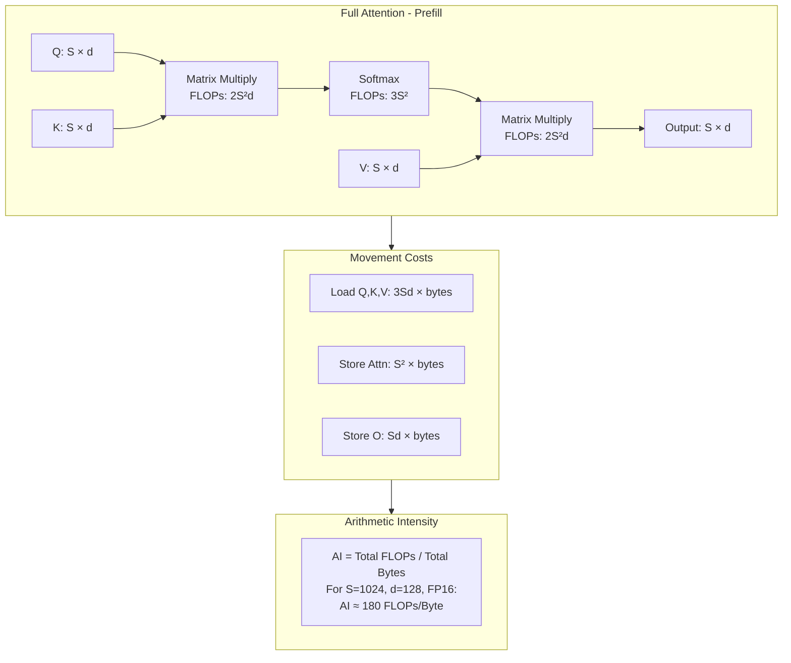

# lab 0.2

Status: Not started

# **Lab 0.2: Prefill vs. Decode – The Two-Phase Engine**

**A Comprehensive Guide to Autoregressive Inference, Scheduling, and Modern Optimizations**


## **1. Introduction: The Heartbeat of LLM Inference**

### **1.1 The Autoregressive Loop: Mathematical Foundation**

The core of LLM inference is the **autoregressive generation process**, defined by the probability chain rule:

```
P(w₁, w₂, ..., w_T) = Π P(w_t | w₁, w₂, ..., w_{t-1})

```

Each token generation depends on the entire preceding sequence, creating a **sequential dependency** that cannot be parallelized across tokens. This fundamental constraint leads to the two-phase architecture.

**Why This Matters:**
- **Training vs Inference**: During training, we can compute all positions in parallel because we have the full sequence. During inference, we must generate one token at a time.
- **Memory-Compute Trade-off**: We trade memory (storing KV cache) for compute (avoiding recomputation).
- **Latency Impact**: Each token requires a full forward pass through the model, making generation inherently sequential.

**Real-World Example:**
For GPT-3 (175B parameters) generating 100 tokens:
- Without KV cache: ~500 seconds (recomputing everything)
- With KV cache: ~5 seconds (using cached computations)
- **100× speedup** from caching alone!

> **Research Reference**: "Attention Is All You Need" (Vaswani et al., 2017) - The foundational paper that introduced the Transformer architecture and autoregressive generation.

### **1.2 Computational Graph Decomposition**

The forward pass of a Transformer layer for token generation can be represented as:

```
h_t = TransformerLayer(h_{t-1}, K_{1:t-1}, V_{1:t-1})

```

Where:

- `h_t` = hidden state at position t
- `K_{1:t-1}`, `V_{1:t-1}` = cached Key/Value vectors from previous tokens

**Deep Dive: Why Cache Keys and Values?**

In the attention mechanism:
```
Attention(Q, K, V) = softmax(QKᵀ/√d_k)V
```

For each new token:
- **Query (Q)**: Computed fresh for the current token only
- **Keys (K)**: Needed from ALL previous tokens (including current)
- **Values (V)**: Needed from ALL previous tokens (including current)

Without caching, we'd recompute K and V for all previous tokens at every step:
- Token 1: Compute K₁, V₁ (1 computation)
- Token 2: Recompute K₁, V₁ + compute K₂, V₂ (2 computations)
- Token 3: Recompute K₁, V₁, K₂, V₂ + compute K₃, V₃ (3 computations)
- Token N: N computations
- **Total: O(N²) complexity!**

With caching:
- Token 1: Compute and cache K₁, V₁
- Token 2: Read K₁, V₁ from cache + compute K₂, V₂
- Token 3: Read K₁, V₁, K₂, V₂ from cache + compute K₃, V₃
- **Total: O(N) complexity!**

**Performance Impact Table:**

| Sequence Length | Without Cache (ops) | With Cache (ops) | Speedup |
|----------------|---------------------|------------------|----------|
| 10 tokens | 55 | 10 | 5.5× |
| 100 tokens | 5,050 | 100 | 50.5× |
| 1000 tokens | 500,500 | 1,000 | 500.5× |
| 2048 tokens | 2,098,176 | 2,048 | 1024× |

> **Research Reference**: "Generating Long Sequences with Sparse Transformers" (Child et al., 2019) - Discusses the computational complexity of attention and caching strategies.

### **1.3 From Mathematical Model to System Architecture**

The two-phase architecture emerges naturally from this formulation:

- **Prefill**: Compute `K_{1:S}`, `V_{1:S}` for prompt length S (parallelizable)
- **Decode**: Iteratively compute `h_{S+1}`, `h_{S+2}`, ... using cached K/V


*Diagram 1.1: From Mathematical Model to System Architecture.* This diagram shows the progression from the fundamental probability chain rule to the computational decomposition, leading to the practical two-phase system architecture and its hardware mapping.

### **1.4 The Evolution of Inference Systems**


*Diagram 1.2: Historical Evolution of LLM Inference.* This timeline shows how inference systems evolved from naive recomputation to sophisticated disaggregated architectures.

### **1.5 System Components Overview**


*Diagram 1.3: Complete System Stack.* This diagram shows the complete software and hardware stack of a modern LLM inference system, from API layer down to hardware components.

### **1.6 The Inference Pipeline**


*Diagram 1.4: End-to-End Inference Pipeline.* This diagram shows all stages from request arrival to response streaming, highlighting latency contributors at each stage.

## **2. The Prefill Phase: Compute-Bound Parallelism**

### **2.1 Mathematical Foundations of Attention**

The attention mechanism computes:

```
Attention(Q, K, V) = softmax(QK^T/√d_k)V

```

Where for prompt length S:

- Q, K, V ∈ ℝ^{S × d_model}
- QK^T ∈ ℝ^{S × S} (quadratic complexity)

### **2.2 FLOPs Analysis**

For a model with N parameters processing prompt length S:

```
Total FLOPs ≈ 2 × N × S × (1 + S/d_model)

```

The `S/d_model` term represents the quadratic attention cost.

### **2.3 Memory Hierarchy During Prefill**


*Diagram 2.1: GPU Memory Hierarchy During Prefill.* This diagram shows how data flows through the GPU memory hierarchy during prefill, highlighting the movement from HBM to tensor cores.

### **2.4 Attention Computation Patterns**



*Diagram 2.2: Attention Computation and Memory Patterns.* This diagram breaks down the FLOPs and memory movement during full attention computation, showing why prefill is compute-bound.

### **2.5 KV Cache Population Strategy**


*Diagram 2.3: KV Cache Population Strategy.* This diagram shows how KV cache is populated across layers during prefill and discusses memory layout options.

### **2.6 Prefill Kernel Optimization Techniques**


*Diagram 2.4: Prefill Kernel Optimizations.* This diagram categorizes optimization techniques for prefill kernels, with focus on FlashAttention.

### **2.7 Implementation: From Naive to Optimized**

**2.7.1 Naive PyTorch Implementation**

```python
# Naive attention implementation - educational purpose only
def naive_attention(q, k, v, mask=None):
    """
    Naive attention implementation showing the quadratic complexity.

    Args:
        q: Query tensor [batch, seq_len, num_heads, head_dim]
        k: Key tensor [batch, seq_len, num_heads, head_dim]
        v: Value tensor [batch, seq_len, num_heads, head_dim]
        mask: Optional attention mask

    Returns:
        Attention output tensor
    """
    batch_size, seq_len, num_heads, head_dim = q.shape

    # Reshape for matrix multiplication
    q = q.transpose(1, 2)  # [batch, num_heads, seq_len, head_dim]
    k = k.transpose(1, 2)
    v = v.transpose(1, 2)

    # Compute attention scores - QUADRATIC OPERATION
    # [batch, num_heads, seq_len, head_dim] @ [batch, num_heads, head_dim, seq_len]
    # = [batch, num_heads, seq_len, seq_len]
    scores = torch.matmul(q, k.transpose(-2, -1)) / math.sqrt(head_dim)

    if mask is not None:
        scores = scores.masked_fill(mask == 0, float('-inf'))

    # Softmax - also quadratic
    attention_weights = F.softmax(scores, dim=-1)

    # Apply attention to values
    output = torch.matmul(attention_weights, v)

    return output.transpose(1, 2)  # Back to [batch, seq_len, num_heads, head_dim]

```

**2.7.2 FlashAttention Implementation (Conceptual)**

```python
# Conceptual FlashAttention implementation based on the paper
def flash_attention_impl(Q, K, V, block_size=256):
    """
    Conceptual FlashAttention implementation showing tiling strategy.

    Based on: <https://arxiv.org/abs/2205.14135>
    """
    batch_size, seq_len, num_heads, head_dim = Q.shape
    O = torch.zeros_like(Q)
    L = torch.zeros(batch_size, num_heads, seq_len)
    M = torch.full((batch_size, num_heads, seq_len), float('-inf'))

    # Tile over sequence length
    for block_start in range(0, seq_len, block_size):
        block_end = min(block_start + block_size, seq_len)

        # Load tile from HBM to SRAM
        Q_tile = Q[:, block_start:block_end, :, :]

        # Tile over key/value length
        for kv_start in range(0, seq_len, block_size):
            kv_end = min(kv_start + block_size, seq_len)

            # Load K, V tiles
            K_tile = K[:, kv_start:kv_end, :, :]
            V_tile = V[:, kv_start:kv_end, :, :]

            # Compute attention for this tile
            S_tile = torch.matmul(Q_tile, K_tile.transpose(-2, -1)) / math.sqrt(head_dim)

            # Update running statistics
M_new = torch.maximum(M[:, :, block_start:block_end], S_tile.max(dim=-1, keepdim=True).values)
            # Numerical stability: clamp to prevent overflow
            S_shifted = torch.clamp(S_tile - M_new, min=-50, max=50)
            exp_S = torch.exp(S_shifted)
            P_tile = exp_S / (torch.exp(M[:, :, block_start:block_end] - M_new) * L[:, :, block_start:block_end].unsqueeze(-1) +
                            exp_S.sum(dim=-1, keepdim=True))

            # Update output
            O[:, block_start:block_end, :, :] = (
                L[:, :, block_start:block_end].unsqueeze(-1) /
                torch.exp(M[:, :, block_start:block_end] - M_new).unsqueeze(-1) *
                O[:, block_start:block_end, :, :] +
                torch.matmul(P_tile, V_tile)
            )

            # Update L and M
            L[:, :, block_start:block_end] = (
                torch.exp(M[:, :, block_start:block_end] - M_new) *
                L[:, :, block_start:block_end] +
                exp_S.sum(dim=-1)
            )
            M[:, :, block_start:block_end] = M_new.squeeze(-1)

    return O

# Real FlashAttention usage in PyTorch 2.0+
import torch.nn.functional as F

def optimized_attention(q, k, v, is_causal=True):
    """
    Using PyTorch's built-in FlashAttention.
    """
    return F.scaled_dot_product_attention(
        q, k, v,
        attn_mask=None,
        dropout_p=0.0,
        is_causal=is_causal,
        scale=None
    )

```

**2.7.3 Triton Implementation Example**

```python
# Triton kernel for fused attention (simplified)
# Based on OpenAI Triton examples: <https://github.com/openai/triton>
import triton
import triton.language as tl

@triton.jit
def _attn_fwd(
    Q, K, V, sm_scale,
    Out,
    stride_qz, stride_qh, stride_qm, stride_qk,
    stride_kz, stride_kh, stride_kn, stride_kk,
    stride_vz, stride_vh, stride_vk, stride_vn,
    stride_oz, stride_oh, stride_om, stride_on,
    Z, H, N_CTX,
    BLOCK_M: tl.constexpr, BLOCK_DMODEL: tl.constexpr,
    BLOCK_N: tl.constexpr,
):
    """
    Forward pass of attention kernel in Triton.
    """
    start_m = tl.program_id(0)
    off_hz = tl.program_id(1)

    # initialize offsets
    offs_m = start_m * BLOCK_M + tl.arange(0, BLOCK_M)
    offs_n = tl.arange(0, BLOCK_N)
    offs_d = tl.arange(0, BLOCK_DMODEL)

    # pointers to blocks
    q_ptrs = Q + off_hz * stride_qh + offs_m[:, None] * stride_qm + offs_d[None, :] * stride_qk
    k_ptrs = K + off_hz * stride_kh + offs_n[:, None] * stride_kn + offs_d[None, :] * stride_kk
    v_ptrs = V + off_hz * stride_vh + offs_n[:, None] * stride_vk + offs_d[None, :] * stride_vn

    # initialize pointer to m and l
    m_i = tl.zeros([BLOCK_M], dtype=tl.float32) - float("inf")
    l_i = tl.zeros([BLOCK_M], dtype=tl.float32)
    acc = tl.zeros([BLOCK_M, BLOCK_DMODEL], dtype=tl.float32)

    # load q
    q = tl.load(q_ptrs, mask=offs_m[:, None] < N_CTX, other=0.0)

    # loop over k, v
    for start_n in range(0, N_CTX, BLOCK_N):
        start_n = tl.multiple_of(start_n, BLOCK_N)

        # -- compute qk ---
        k = tl.load(
            k_ptrs + start_n * stride_kn,
            mask=(start_n + offs_n)[:, None] < N_CTX,
            other=0.0,
        )
        qk = tl.zeros([BLOCK_M, BLOCK_N], dtype=tl.float32)
        qk += tl.dot(q, tl.trans(k))
        qk *= sm_scale

        # -- compute m_ij, p, l_ij ---
        m_ij = tl.max(qk, 1)
        p = tl.exp(qk - m_ij[:, None])
        l_ij = tl.sum(p, 1)

        # -- update m_i and l_i --
        m_i_new = tl.maximum(m_i, m_ij)
        alpha = tl.exp(m_i - m_i_new)
        beta = tl.exp(m_ij - m_i_new)
        l_i_new = alpha * l_i + beta * l_ij

        # -- update output accumulator --
        # scale acc
        acc_scale = l_i / l_i_new * alpha
        acc = acc * acc_scale[:, None]

        # update acc
        v = tl.load(
            v_ptrs + start_n * stride_vk,
            mask=(start_n + offs_n)[:, None] < N_CTX,
            other=0.0,
        )
        p = p.to(v.dtype)
        acc += tl.dot(p, v) * (beta / l_i_new)[:, None]

        # update m_i and l_i
        m_i = m_i_new
        l_i = l_i_new

    # store results
    out_ptrs = Out + off_hz * stride_oh + offs_m[:, None] * stride_om + offs_d[None, :] * stride_on
    tl.store(out_ptrs, acc, mask=offs_m[:, None] < N_CTX)

class Attention(torch.nn.Module):
    def __init__(self, dropout=0.0):
        super().__init__()
        self.dropout = dropout

    def forward(self, q, k, v):
        # shape checks
        assert q.dim() == 4

        # optimized path
        if _attn_fwd is not None and q.is_cuda:
            # call triton kernel
            output = torch.empty_like(q)
            grid = lambda META: (triton.cdiv(q.shape[2], META['BLOCK_M']), q.shape[0] * q.shape[1])
            _attn_fwd[grid](
                q, k, v, 1.0 / math.sqrt(k.shape[-1]),
                output,
                q.stride(0), q.stride(1), q.stride(2), q.stride(3),
                k.stride(0), k.stride(1), k.stride(2), k.stride(3),
                v.stride(0), v.stride(1), v.stride(2), v.stride(3),
                output.stride(0), output.stride(1), output.stride(2), output.stride(3),
                q.shape[0], q.shape[1], k.shape[2],
                BLOCK_M=128, BLOCK_N=64, BLOCK_DMODEL=q.shape[-1],
                num_warps=4, num_stages=1,
            )
            return output
        else:
            # fallback
            return optimized_attention(q, k, v)

```

### **2.8 vLLM's Prefill Implementation**

```python
# Based on vLLM's implementation: <https://github.com/vllm-project/vllm>
# Simplified version showing key concepts

class VLLMPrefillExecutor:
    """vLLM's prefill executor with PagedAttention support."""

    def execute_prefill(
        self,
        seq_group_metadata_list: List[SequenceGroupMetadata],
        blocks_to_swap_in: Dict[int, int],
        blocks_to_swap_out: Dict[int, int],
        blocks_to_copy: Dict[int, List[int]],
    ) -> List[SamplerOutput]:
        """
        Execute prefill for given sequence groups.

        Reference: vLLM's model_runner.py
        """
        # 1. Prepare input tensors
        input_tokens: List[int] = []
        input_positions: List[int] = []
        slot_mapping: List[int] = []
        seq_lens: List[int] = []

        for seq_group_metadata in seq_group_metadata_list:
            seq_ids = list(seq_group_metadata.seq_data.keys())
            seq_id = seq_ids[0]
            seq_data = seq_group_metadata.seq_data[seq_id]
            token_chunk = seq_data.get_token_chunk()

            # Add tokens
            input_tokens.extend(token_chunk.token_ids)

            # Compute positions
            for i in range(len(token_chunk.token_ids)):
                input_positions.append(seq_data.get_len() - len(token_chunk.token_ids) + i)

            # Get block table
            block_table = seq_group_metadata.block_tables[seq_id]

            # Map positions to blocks
            for i, position in enumerate(input_positions[-len(token_chunk.token_ids):]):
                block_number = position // self.block_size
                block_offset = position % self.block_size
                slot = block_table[block_number] * self.block_size + block_offset
                slot_mapping.append(slot)

            seq_lens.append(seq_data.get_len())

        # 2. Convert to tensors
        input_tokens_tensor = torch.tensor(input_tokens, dtype=torch.long, device=self.device)
        input_positions_tensor = torch.tensor(input_positions, dtype=torch.long, device=self.device)
        slot_mapping_tensor = torch.tensor(slot_mapping, dtype=torch.long, device=self.device)

        # 3. Execute model
        hidden_states = self.model(
            input_ids=input_tokens_tensor,
            positions=input_positions_tensor,
            kv_caches=self.gpu_cache,
            input_metadata=self.input_metadata,
        )

        # 4. Sample next tokens
        next_tokens = self._sample(hidden_states, seq_group_metadata_list)

        return [
            SamplerOutput(
                outputs=[next_tokens[seq_id] for seq_id in seq_group_metadata.seq_data.keys()],
                sampled_token_ids=list(next_tokens.values()),
            )
            for seq_group_metadata in seq_group_metadata_list
        ]

    def _setup_caches(self, num_layers: int, num_heads: int, head_size: int,
                     block_size: int, num_gpu_blocks: int):
        """
        Setup KV caches with paged attention.

        Reference: vLLM's cache_engine.py
        """
        cache_shape = (num_gpu_blocks, block_size, num_heads, head_size)

        gpu_cache = []
        for _ in range(num_layers):
            key_cache = torch.empty(cache_shape, dtype=torch.float16, device=self.device)
            value_cache = torch.empty(cache_shape, dtype=torch.float16, device=self.device)
            gpu_cache.append((key_cache, value_cache))

        return gpu_cache

```

**2.8.1 TensorRT-LLM Prefill Optimization**

```python
# TensorRT-LLM prefill optimization example
# Based on: <https://github.com/NVIDIA/TensorRT-LLM>

def build_trtllm_engine(model_config, prefill_optimization=True):
    """
    Build TensorRT-LLM engine with prefill optimizations.
    """
    from tensorrt_llm import Builder
    from tensorrt_llm.network import net_guard

    builder = Builder()
    builder_config = builder.create_builder_config(
        precision='fp16',
        timing_cache='model.cache',
        tensor_parallel=model_config.tensor_parallel,
        pipeline_parallel=model_config.pipeline_parallel,
    )

    # Enable prefill optimizations
    if prefill_optimization:
        # Use flash attention plugin
        builder_config.plugin_config.gpt_attention_plugin = 'float16'

        # Enable paged KV cache for variable length
        builder_config.plugin_config.paged_kv_cache = True

        # Set optimization profiles for different batch sizes
        profiles = []
        for batch_size in [1, 2, 4, 8, 16]:
            profile = builder.create_optimization_profile()
            profile.set_shape(
                'input_ids',
                min=(batch_size, 1),      # Minimum: decode
                opt=(batch_size, 512),    # Optimal: medium prompt
                max=(batch_size, 8192),   # Maximum: long prompt
            )
            profiles.append(profile)

    # Build network
    network = builder.create_network()
    with net_guard(network):
        # Network definition...
        pass

    # Build engine
    engine = builder.build_engine(network, builder_config)
    return engine

# Usage in inference
class TRTLLMExecutor:
    def prefill(self, prompt_tokens, max_output_len):
        """
        Execute prefill with TensorRT-LLM.
        """
        # Prepare inputs
        input_lengths = torch.tensor([len(prompt_tokens)], dtype=torch.int32)
        input_ids = torch.tensor([prompt_tokens], dtype=torch.int32)

        # Setup buffers
        output_ids = torch.zeros((1, max_output_len), dtype=torch.int32)
        sequence_lengths = torch.zeros((1,), dtype=torch.int32)
        cum_log_probs = torch.zeros((1,), dtype=torch.float32)

        # Execute
        context = self.trt_context
        buffers = [
            input_ids, input_lengths, output_ids,
            sequence_lengths, cum_log_probs,
            self.kv_cache_block_pointers,
            self.host_kv_cache_block_pointers,
            self.host_context_lengths,
        ]

        context.execute_v2(buffers)

        return output_ids[0].tolist()

```

## **3. The Decode Phase: Memory-Bound Iteration**

### **3.1 Mathematical Model of Decode**

For decode step t, we compute:

```
q_t = h_t W_Q
Attention(q_t, K_{1:t}, V_{1:t}) = softmax(q_t K_{1:t}^T/√d_k) V_{1:t}

```

The complexity is O(t × d_model) per step, or O(N²) total for N tokens.

### **3.2 Memory Access Pattern Analysis**


*Diagram 3.1: Memory Access Pattern Analysis.* This diagram analyzes the memory access patterns during decode, showing why it's memory-bound.

### **3.3 KV Cache Evolution During Decode**


*Diagram 3.2: KV Cache Evolution.* This diagram shows how the KV cache grows during decode and the associated operations.

### **3.4 PagedAttention Memory Management**


*Diagram 3.3: PagedAttention Memory Management.* This diagram shows how PagedAttention maps logical sequences to physical memory blocks.

### **3.5 Decode Kernel Fusion Strategies**


*Diagram 3.4: Decode Kernel Fusion.* This diagram shows kernel fusion strategies to reduce memory traffic during decode.

### **3.6 Implementation: Optimized Decode Phase**

**3.6.1 Basic Decode Step Implementation**

```python
# Basic decode step implementation
def decode_step_basic(
    input_token: torch.Tensor,
    position: int,
    kv_cache: List[Tuple[torch.Tensor, torch.Tensor]],
    model: nn.Module,
) -> torch.Tensor:
    """
    Basic decode step showing the iterative nature.

    Args:
        input_token: [batch_size, 1] token ID
        position: Current position in sequence
        kv_cache: List of (K_cache, V_cache) for each layer
        model: Transformer model

    Returns:
        Next token logits
    """
    batch_size = input_token.shape[0]

    # 1. Embed the token
    hidden_states = model.embedding(input_token)  # [B, 1, D]

    # 2. Position embedding
    pos_emb = model.position_embedding(position)
    hidden_states = hidden_states + pos_emb

    # 3. Process through each layer
    for layer_idx, block in enumerate(model.layers):
        # Get cached K, V for this layer
        k_cache, v_cache = kv_cache[layer_idx]

        # Compute Q, K, V for current token
        q, k, v = block.attention.qkv_proj(hidden_states)

        # Update cache
        if k_cache is None:
            k_cache = k
            v_cache = v
        else:
            k_cache = torch.cat([k_cache, k], dim=1)
            v_cache = torch.cat([v_cache, v], dim=1)

        kv_cache[layer_idx] = (k_cache, v_cache)

        # Compute attention using entire cache
        attn_output = block.attention(
            q, k_cache, v_cache,
            is_causal=True,
            attention_mask=None,
        )

        # Rest of transformer block
        hidden_states = block.feed_forward(
            block.norm1(hidden_states + attn_output)
        )
        hidden_states = block.norm2(hidden_states)

    # 4. Final projection
    logits = model.lm_head(hidden_states[:, -1, :])
    return logits

```

**3.6.2 vLLM's Decode Implementation with PagedAttention**

```python
# Based on vLLM's decode implementation
# Reference: <https://github.com/vllm-project/vllm/blob/main/vllm/model_executor/layers/attention.py>

class PagedAttentionDecoder:
    """Decode with PagedAttention."""

    def forward_decode(
        self,
        query: torch.Tensor,
        key_cache: torch.Tensor,
        value_cache: torch.Tensor,
        block_tables: torch.Tensor,
        context_lens: torch.Tensor,
        num_kv_heads: int,
        scale: float,
        alibi_slopes: Optional[torch.Tensor],
    ) -> torch.Tensor:
        """
        Forward pass for decode phase with paged KV cache.

        Args:
            query: [num_tokens, num_heads, head_size]
            key_cache: [num_blocks, block_size, num_kv_heads, head_size]
            value_cache: [num_blocks, block_size, num_kv_heads, head_size]
            block_tables: [num_seqs, max_num_blocks_per_seq]
            context_lens: [num_seqs]
            num_kv_heads: Number of key/value heads
            scale: Scaling factor for attention
            alibi_slopes: ALiBi slopes for positional encoding
        """
        num_tokens = query.shape[0]
        num_heads = query.shape[1]
        head_size = query.shape[2]
        max_num_blocks_per_seq = block_tables.shape[1]

        # Reshape query for attention
        output = torch.empty_like(query)

        # Call custom CUDA kernel
        if _paged_attention_v2 is not None and query.is_cuda:
            # vLLM's optimized paged attention kernel
            _paged_attention_v2(
                output,
                query,
                key_cache,
                value_cache,
                num_kv_heads,
                scale,
                block_tables,
                context_lens,
                block_size=self.block_size,
                max_num_blocks_per_seq=max_num_blocks_per_seq,
                alibi_slopes=alibi_slopes,
                kv_cache_dtype=self.kv_cache_dtype,
            )
        else:
            # Fallback implementation
            output = self._paged_attention_fallback(
                query, key_cache, value_cache,
                block_tables, context_lens,
                num_kv_heads, scale,
            )

        return output

    def _paged_attention_fallback(
        self,
        query: torch.Tensor,
        key_cache: torch.Tensor,
        value_cache: torch.Tensor,
        block_tables: torch.Tensor,
        context_lens: torch.Tensor,
        num_kv_heads: int,
        scale: float,
    ) -> torch.Tensor:
        """
        Fallback CPU implementation for educational purposes.
        """
        num_seqs = query.shape[0]
        num_heads = query.shape[1]
        head_size = query.shape[2]
        output = torch.zeros_like(query)

        for seq_idx in range(num_seqs):
            seq_len = context_lens[seq_idx].item()
            block_table = block_tables[seq_idx]

            # Gather KV cache for this sequence
            if self.block_size <= 0:
                raise ValueError(f"block_size must be positive, got {self.block_size}")
            kv_blocks_needed = (seq_len + self.block_size - 1) // self.block_size

            # Prepare to gather all K, V for this sequence
            k_list = []
            v_list = []

            for block_idx in range(kv_blocks_needed):
                block_id = block_table[block_idx].item()
                block_start = block_idx * self.block_size
                block_end = min(block_start + self.block_size, seq_len)
                tokens_in_block = block_end - block_start

                # Get block from cache
                k_block = key_cache[block_id, :tokens_in_block]
                v_block = value_cache[block_id, :tokens_in_block]

                k_list.append(k_block)
                v_list.append(v_block)

            # Concatenate all blocks for this sequence
            k_seq = torch.cat(k_list, dim=0)  # [seq_len, num_kv_heads, head_size]
            v_seq = torch.cat(v_list, dim=0)  # [seq_len, num_kv_heads, head_size]

            # Compute attention for each head
            for head_idx in range(num_heads):
                kv_head_idx = head_idx % num_kv_heads

                q = query[seq_idx, head_idx]  # [head_size]
                k = k_seq[:, kv_head_idx]     # [seq_len, head_size]
                v = v_seq[:, kv_head_idx]     # [seq_len, head_size]

                # Compute attention scores
                scores = torch.matmul(k, q) * scale  # [seq_len]

                # Apply causal mask
                scores = scores[:seq_len]

                # Softmax
                probs = F.softmax(scores, dim=0)

                # Weighted sum of values
                attn_output = torch.sum(v[:seq_len] * probs.unsqueeze(-1), dim=0)

                output[seq_idx, head_idx] = attn_output

        return output

```

**3.6.3 TensorRT-LLM Decode Implementation**

```python
# TensorRT-LLM decode implementation
# Based on: <https://github.com/NVIDIA/TensorRT-LLM>

class TRTLLMDecoder:
    """TensorRT-LLM optimized decoder."""

    def decode_step(
        self,
        input_ids: torch.Tensor,
        sequence_lengths: torch.Tensor,
        past_key_value_lengths: torch.Tensor,
        cache_indirection: torch.Tensor,
    ) -> torch.Tensor:
        """
        Execute a decode step with TensorRT-LLM.

        Args:
            input_ids: [batch_size, beam_width]
            sequence_lengths: [batch_size]
            past_key_value_lengths: [batch_size, 2, num_layers]
            cache_indirection: [batch_size, beam_width, max_seq_len]
        """
        batch_size = input_ids.shape[0]
        beam_width = input_ids.shape[1]

        # Prepare buffers
        context_lengths = sequence_lengths.clone()
        host_context_lengths = context_lengths.cpu()

        # Setup KV cache pointers
        kv_cache_block_pointers = self._get_kv_cache_pointers(
            batch_size, beam_width, past_key_value_lengths
        )

        # TensorRT execution
        bindings = [
            input_ids.data_ptr(),
            context_lengths.data_ptr(),
            self.output_ids.data_ptr(),
            self.sequence_lengths.data_ptr(),
            self.cum_log_probs.data_ptr(),
            self.log_probs.data_ptr(),
            self.finished.data_ptr(),
            kv_cache_block_pointers.data_ptr(),
            cache_indirection.data_ptr(),
            host_context_lengths.data_ptr(),
        ]

        # Execute context (prefill) or generation (decode) phase
        if self.is_context_phase:
            self.context.execute_v2(bindings)
            self.is_context_phase = False
        else:
            self.generation.execute_v2(bindings)

        # Update sequence lengths
        sequence_lengths += 1

        return self.output_ids

    def _get_kv_cache_pointers(
        self,
        batch_size: int,
        beam_width: int,
        past_key_value_lengths: torch.Tensor,
    ) -> torch.Tensor:
        """
        Get KV cache pointers for paged attention.

        This implements the pointer structure for:
        - Layer-wise cache partitioning
        - Beam search support
        - Variable sequence lengths
        """
        num_layers = self.model_config.num_layers
        num_heads = self.model_config.num_heads
        head_size = self.model_config.head_size

        # Calculate pointers based on cache layout
        pointers = torch.zeros(
            (batch_size, beam_width, 2, num_layers),
            dtype=torch.int64,
            device=self.device,
        )

        for batch_idx in range(batch_size):
            for beam_idx in range(beam_width):
                seq_len = past_key_value_lengths[batch_idx, beam_idx, 0]

                # Calculate block indices
                block_idx = seq_len // self.block_size
                block_offset = seq_len % self.block_size

                for layer_idx in range(num_layers):
                    # Key cache pointer
                    key_ptr = (
                        layer_idx * self.blocks_per_layer * self.block_size *
                        num_heads * head_size +
                        block_idx * self.block_size * num_heads * head_size +
                        block_offset * num_heads * head_size
                    )

                    # Value cache pointer (stored separately)
                    value_ptr = (
                        (self.num_layers + layer_idx) * self.blocks_per_layer *
                        self.block_size * num_heads * head_size +
                        block_idx * self.block_size * num_heads * head_size +
                        block_offset * num_heads * head_size
                    )

                    pointers[batch_idx, beam_idx, 0, layer_idx] = key_ptr
                    pointers[batch_idx, beam_idx, 1, layer_idx] = value_ptr

        return pointers

```

**3.6.4 Flash-Decode for Long Contexts**

```python
# Flash-Decode implementation concept
# Based on: <https://arxiv.org/abs/2307.08691>

class FlashDecodeAttention:
    """
    Flash-Decode: Efficient attention for long contexts during decode.

    Key insight: During decode, we compute attention between:
    - 1 query token (current position)
    - Many key tokens (entire context)

    This can be optimized by:
    1. Loading keys in chunks
    2. Computing partial attention per chunk
    3. Maintaining running statistics
    """

    def forward(
        self,
        query: torch.Tensor,      # [batch, num_heads, head_dim]
        key: torch.Tensor,        # [batch, num_heads, seq_len, head_dim]
        value: torch.Tensor,      # [batch, num_heads, seq_len, head_dim]
        block_size: int = 256,
    ) -> torch.Tensor:
        """
        Flash-Decode attention forward pass.
        """
        batch_size, num_heads, head_dim = query.shape
        seq_len = key.shape[2]

        output = torch.zeros_like(query)
        max_logits = torch.full((batch_size, num_heads), float('-inf'), device=query.device)
        exp_sums = torch.zeros((batch_size, num_heads), device=query.device)

        # Process key/value in chunks
        for chunk_start in range(0, seq_len, block_size):
            chunk_end = min(chunk_start + block_size, seq_len)

            # Load chunk
            key_chunk = key[:, :, chunk_start:chunk_end, :]  # [B, H, chunk_size, D]
            value_chunk = value[:, :, chunk_start:chunk_end, :]

            # Compute attention scores for this chunk
            # query: [B, H, D], key_chunk: [B, H, chunk_size, D]
            scores = torch.einsum('bhd,bhcd->bhc', query, key_chunk) / math.sqrt(head_dim)

            # Update running statistics
            chunk_max = scores.max(dim=-1, keepdim=True).values  # [B, H, 1]

            # Compute exponentials
            exp_scores = torch.exp(scores - chunk_max)

            # Update output
            # output += exp_scores @ value_chunk
            weighted_values = torch.einsum('bhc,bhcd->bhd', exp_scores, value_chunk)
            output = output * torch.exp(max_logits.unsqueeze(-1) - chunk_max.squeeze(-1).unsqueeze(-1))
            output += weighted_values

            # Update statistics
            max_logits = torch.maximum(max_logits, chunk_max.squeeze(-1))
            exp_sums = exp_sums * torch.exp(max_logits - chunk_max.squeeze(-1)) + exp_scores.sum(dim=-1)

        # Normalize
        output = output / exp_sums.unsqueeze(-1)

        return output

```

## **4. The Scheduler's Challenge: Batching Heterogeneous Work**

### **4.1 Mathematical Formulation of Scheduling Problem**

Let:

- R = set of requests
- For request r: p_r = prompt length, g_r = generated tokens so far
- B = batch capacity (max tokens)
- Objective: Maximize throughput while respecting latency constraints

### **4.2 Scheduling Algorithm Space**


*Diagram 4.1: Scheduling Algorithm Space.* This diagram categorizes scheduling algorithms and shows their evolution.

### **4.3 Continuous Batching State Machine**


*Diagram 4.2: Continuous Batching State Machine.* This diagram shows the state machine for requests in continuous batching.

### **4.4 Memory Management in Scheduling**


*Diagram 4.3: Memory Management in Scheduling.* This diagram shows memory management strategies within the scheduler.

### **4.5 Scheduler Performance Trade-offs**


*Diagram 4.4: Scheduler Performance Trade-offs.* This diagram visualizes the trade-offs between different scheduling decisions.

### **4.6 Implementation: Advanced Scheduling Systems**

**4.6.1 vLLM Scheduler Implementation**

```python
# Based on vLLM's scheduler implementation
# Reference: <https://github.com/vllm-project/vllm/blob/main/vllm/core/scheduler.py>

class VLLMScheduler:
    """
    vLLM's production scheduler with continuous batching.

    Key features:
    - Iteration-level scheduling
    - PagedAttention support
    - Chunked prefill
    - Priority-based scheduling
    """

    def __init__(
        self,
        scheduler_config: SchedulerConfig,
        cache_config: CacheConfig,
        parallel_config: ParallelConfig,
    ):
        self.scheduler_config = scheduler_config
        self.cache_config = cache_config
        self.parallel_config = parallel_config

        # Request states
        self.waiting: List[SequenceGroup] = []
        self.running: List[SequenceGroup] = []
        self.swapped: List[SequenceGroup] = []

        # Resource tracking
        self.num_running_seqs = 0
        self.num_waiting_seqs = 0
        self.num_swapped_seqs = 0

        # Block manager for PagedAttention
        self.block_manager = BlockSpaceManager(
            block_size=cache_config.block_size,
            num_gpu_blocks=cache_config.num_gpu_blocks,
            num_cpu_blocks=cache_config.num_cpu_blocks,
            watermark=cache_config.watermark,
        )

        # Scheduling policy
        self.policy = PolicyFactory.create_policy(scheduler_config.policy)

    def schedule(self) -> SchedulerOutputs:
        """
        Main scheduling loop.

        Returns:
            SchedulerOutputs with decisions for next iteration
        """
        # 1. Update running sequences
        self._update_running_sequences()

        # 2. Schedule from waiting queue (FCFS with priority)
        scheduled: List[SequenceGroup] = []
        ignored: List[SequenceGroup] = []

        # Try to schedule waiting sequences
        while self.waiting:
            seq_group = self.waiting[0]

            # Check if we can schedule this sequence
            can_schedule = self._can_schedule_seq_group(seq_group)

            if can_schedule:
                # Allocate resources
                self._allocate_seq_group(seq_group)
                scheduled.append(seq_group)
                self.waiting.pop(0)
            else:
                # Can't schedule, stop trying
                break

        # 3. Schedule swapped sequences if GPU has capacity
        if self._has_gpu_capacity():
            swapped_scheduled = self._schedule_swapped()
            scheduled.extend(swapped_scheduled)

        # 4. Build outputs
        outputs = self._build_scheduler_outputs(scheduled)

        return outputs

    def _can_schedule_seq_group(self, seq_group: SequenceGroup) -> bool:
        """
        Check if a sequence group can be scheduled.

        Considers:
        - GPU memory (KV cache blocks)
        - Computational capacity
        - Prompt length vs. chunk size
        """
        # Check prompt length
        if seq_group.prompt_len > self.scheduler_config.max_model_len:
            return False

        # Check KV cache capacity
        num_required_blocks = self.block_manager.get_num_required_blocks(
            seq_group.prompt_len,
            seq_group.num_seqs,
        )

        if not self.block_manager.can_allocate(num_required_blocks):
            return False

        # Check computational capacity
        # Based on token budget for this iteration
        token_budget = self._get_token_budget()
        prompt_tokens = seq_group.prompt_len

        if prompt_tokens > token_budget:
            # Can we use chunked prefill?
            if not self.scheduler_config.chunked_prefill_enabled:
                return False
            # Only schedule first chunk
            chunk_size = min(token_budget, self.scheduler_config.max_num_batched_tokens)
            if chunk_size < self.scheduler_config.min_chunk_size:
                return False

        return True

    def _build_scheduler_outputs(self, scheduled: List[SequenceGroup]) -> SchedulerOutputs:
        """
        Build outputs for the engine.
        """
        # Separate prefills and decodes
        prefills: List[SequenceGroup] = []
        decodes: List[SequenceGroup] = []

        for seq_group in scheduled:
            if seq_group.is_prefill():
                prefills.append(seq_group)
            else:
                decodes.append(seq_group)

        # Build block tables
        block_tables = {}
        for seq_group in scheduled:
            for seq in seq_group.seqs:
                block_table = self.block_manager.get_block_table(seq)
                block_tables[seq.seq_id] = block_table

        return SchedulerOutputs(
            scheduled_seq_groups=scheduled,
            num_prefill_groups=len(prefills),
            num_decode_groups=len(decodes),
            block_tables=block_tables,
            ignore_seq_groups=[],
        )

    def _get_token_budget(self) -> int:
        """
        Calculate token budget for next iteration.

        Token budget is based on:
        - max_num_batched_tokens config
        - Currently running sequences
        - GPU utilization target
        """
        # Base budget
        budget = self.scheduler_config.max_num_batched_tokens

        # Subtract tokens for running decode sequences
        for seq_group in self.running:
            if not seq_group.is_prefill():
                budget -= seq_group.num_seqs  # Each decode step uses 1 token

        # Apply utilization target
        utilization_target = self.scheduler_config.utilization_target
        current_utilization = self.num_running_seqs / self.scheduler_config.max_num_seqs

        if current_utilization > utilization_target:
            # Reduce budget if over-utilized
            budget = int(budget * (utilization_target / current_utilization))

        return max(budget, self.scheduler_config.min_token_budget)

```

**4.6.2 Hugging Face TGI Scheduler**

```python
# Hugging Face Text Generation Inference scheduler
# Based on: <https://github.com/huggingface/text-generation-inference>

class TGIScheduler:
    """
    TGI's continuous batching scheduler.

    Key differences from vLLM:
    - Different memory management
    - Different chunking strategy
    - Support for more model architectures
    """

    def __init__(self, config: TGIConfig):
        self.config = config
        self.batch_state = BatchState()

        # Request queues
        self.pending_requests: Deque[Request] = deque()
        self.next_batch_requests: List[Request] = []

        # Batch state
        self.current_batch: Optional[Batch] = None
        self.next_batch: Optional[Batch] = None

    def schedule(self) -> Optional[Batch]:
        """
        Schedule next batch.

        Returns:
            Next batch to execute, or None if nothing to do
        """
        # 1. Move finished requests out of current batch
        if self.current_batch:
            self._process_finished_requests()

        # 2. Schedule new requests into next batch
        self._schedule_new_requests()

        # 3. Check if we should execute next batch
        if self._should_execute_next_batch():
            # Swap batches
            self.current_batch = self.next_batch
            self.next_batch = None
            return self.current_batch

        return None

    def _schedule_new_requests(self):
        """Schedule new requests into next batch."""
        if not self.pending_requests:
            return

        # Calculate capacity
        max_batch_size = self.config.max_batch_size
        max_sequence_length = self.config.max_sequence_length

        # Build next batch
        next_batch_requests = []
        next_batch_total_tokens = 0

        while self.pending_requests:
            request = self.pending_requests[0]

            # Calculate tokens for this request
            if request.state == RequestState.PREFILL:
                request_tokens = request.input_length
            else:  # DECODE
                request_tokens = 1

            # Check if request fits
            if (len(next_batch_requests) < max_batch_size and
                next_batch_total_tokens + request_tokens <= max_sequence_length):

                # Add to batch
                next_batch_requests.append(request)
                next_batch_total_tokens += request_tokens
                self.pending_requests.popleft()

                # Update request state
                if request.state == RequestState.PREFILL:
                    request.state = RequestState.DECODE
            else:
                # Batch is full
                break

        # Create batch
        if next_batch_requests:
            self.next_batch = Batch(
                requests=next_batch_requests,
                total_tokens=next_batch_total_tokens,
                max_sequence_length=max_sequence_length,
            )

    def _should_execute_next_batch(self) -> bool:
        """
        Decide if we should execute next batch now.

        Based on:
        - Whether current batch is empty
        - Size of next batch
        - Time since last execution
        - Priority of requests
        """
        if not self.next_batch:
            return False

        # If no current batch, execute immediately
        if not self.current_batch:
            return True

        # If next batch is large enough
        min_batch_size = self.config.min_batch_size
        if len(self.next_batch.requests) >= min_batch_size:
            return True

        # If current batch is almost done
        if self.current_batch and self.current_batch.num_remaining_tokens <= 1:
            return True

        # Time-based scheduling
        time_since_last_execution = time.time() - self.last_execution_time
        if time_since_last_execution >= self.config.max_waiting_time:
            return True

        return False

```

**4.6.3 Scheduler with Quality of Service (QoS)**

```python
# Scheduler with QoS support
class QoScheduler:
    """
    Scheduler with Quality of Service guarantees.

    Supports:
    - Priority classes (high, medium, low)
    - Service Level Agreements (SLAs)
    - Fair resource allocation
    """

    def __init__(self, qos_config: QoSConfig):
        self.config = qos_config

        # Priority queues
        self.queues = {
            Priority.HIGH: deque(),
            Priority.MEDIUM: deque(),
            Priority.LOW: deque(),
        }

        # SLA tracking
        self.sla_violations = defaultdict(int)
        self.response_times = defaultdict(list)

        # Resource allocation
        self.resource_allocation = {
            Priority.HIGH: 0.5,  # 50% of resources
            Priority.MEDIUM: 0.3,  # 30%
            Priority.LOW: 0.2,  # 20%
        }

    def schedule(self) -> List[Request]:
        """
        Schedule with QoS guarantees.
        """
        scheduled = []
        resource_budget = self._calculate_resource_budget()

        # Allocate resources per priority class
        for priority in [Priority.HIGH, Priority.MEDIUM, Priority.LOW]:
            # Calculate budget for this priority
            priority_budget = int(resource_budget * self.resource_allocation[priority])

            if priority_budget <= 0:
                continue

            # Schedule from this priority queue
            priority_scheduled = self._schedule_from_queue(
                self.queues[priority],
                priority_budget,
                priority,
            )
            scheduled.extend(priority_scheduled)

            # Update budget
            resource_budget -= len(priority_scheduled)

        # Check for SLA violations
        self._check_sla_violations(scheduled)

        return scheduled

    def _schedule_from_queue(
        self,
        queue: deque,
        budget: int,
        priority: Priority,
    ) -> List[Request]:
        """
        Schedule requests from a specific queue.
        """
        scheduled = []

        while queue and budget > 0:
            request = queue[0]

            # Check if request fits in budget
            request_cost = self._calculate_request_cost(request)

            if request_cost <= budget:
                scheduled.append(queue.popleft())
                budget -= request_cost

                # Track for SLA
                request.scheduled_time = time.time()
                self.response_times[priority].append(request)
            else:
                # Request doesn't fit, try next
                break

        return scheduled

    def _calculate_request_cost(self, request: Request) -> int:
        """
        Calculate resource cost of a request.

        Based on:
        - Prompt length
        - Expected output length
        - Model complexity
        - Priority
        """
        base_cost = request.prompt_length

        # Adjust for expected output length
        if request.generation_config:
            expected_tokens = request.generation_config.max_new_tokens
            base_cost += expected_tokens * 0.1  # Decode cost factor

        # Priority multiplier
        priority_multiplier = {
            Priority.HIGH: 1.0,
            Priority.MEDIUM: 0.7,
            Priority.LOW: 0.5,
        }

        cost = base_cost * priority_multiplier.get(request.priority, 1.0)

        return int(cost)

    def _check_sla_violations(self, scheduled: List[Request]):
        """
        Check for SLA violations and adjust scheduling.
        """
        current_time = time.time()

        for request in scheduled:
            # Calculate waiting time
            waiting_time = current_time - request.arrival_time

            # Check against SLA
            sla = self.config.slas.get(request.priority)
            if sla and waiting_time > sla.max_waiting_time:
                self.sla_violations[request.priority] += 1

                # Adjust resource allocation if too many violations
                violation_rate = (
                    self.sla_violations[request.priority] /
                    len(self.response_times[request.priority])
                )

                if violation_rate > self.config.max_violation_rate:
                    self._adjust_resource_allocation(request.priority)

    def _adjust_resource_allocation(self, priority: Priority):
        """
        Adjust resource allocation based on SLA violations.
        """
        # Increase allocation for violated priority
        increase = 0.05
        self.resource_allocation[priority] += increase

        # Decrease from other priorities proportionally
        total_other = sum(
            v for k, v in self.resource_allocation.items()
            if k != priority
        )

        for other_priority in self.resource_allocation:
            if other_priority != priority:
                proportion = self.resource_allocation[other_priority] / total_other
                decrease = increase * proportion
                self.resource_allocation[other_priority] -= decrease

        # Ensure all allocations are positive
        self.resource_allocation = {
            k: max(v, 0.1)  # Minimum 10%
            for k, v in self.resource_allocation.items()
        }

        # Normalize to sum to 1.0
        total = sum(self.resource_allocation.values())
        self.resource_allocation = {
            k: v / total
            for k, v in self.resource_allocation.items()
        }

```

## **5. Advanced Optimization: Chunked Prefill**

### **5.1 Mathematical Model of Chunked Prefill**

For prompt length P, chunk size C:

```
Total chunks = ceil(P / C)
Prefill time = Σ_{i=1}^{chunks} T_prefill(C_i) + (chunks - 1) × T_scheduling

```

Where C_i ≤ C and Σ C_i = P.

### **5.2 Chunked Prefill Architecture**


*Diagram 5.1: Chunked Prefill Architecture.* This diagram shows the complete architecture for chunked prefill.

### **5.3 Chunk Scheduling Strategies**


*Diagram 5.2: Chunk Scheduling State Machine.* This diagram shows the state machine for chunk scheduling.

### **5.4 Memory Management for Chunked Prefill**


*Diagram 5.3: Memory Management for Chunked Prefill.* This diagram shows memory management strategies for chunked prefill.

### **5.5 Performance Characteristics**


*Diagram 5.4: Performance Characteristics.* This diagram shows the performance characteristics of different chunking strategies.

### **5.6 Implementation: Chunked Prefill Systems**

**5.6.1 vLLM Chunked Prefill Implementation**

```python
# vLLM's chunked prefill implementation
# Based on: <https://github.com/vllm-project/vllm/blob/main/vllm/worker/model_runner.py>

class ChunkedPrefillExecutor:
    """Executor for chunked prefill."""

    def __init__(self, config: ChunkedPrefillConfig):
        self.config = config
        self.chunk_size = config.chunk_size
        self.max_pending_chunks = config.max_pending_chunks

        # Chunk state tracking
        self.active_chunks: Dict[int, ChunkState] = {}
        self.pending_chunks: Dict[int, List[Chunk]] = {}
        self.completed_chunks: Dict[int, List[Chunk]] = {}

    def process_long_prompt(
        self,
        prompt_tokens: List[int],
        request_id: int,
    ) -> Generator[ChunkResult, None, None]:
        """
        Process a long prompt in chunks.

        Yields results for each chunk as it completes.
        """
        # Split prompt into chunks
        chunks = self._split_into_chunks(prompt_tokens, request_id)

        # Store chunks
        self.pending_chunks[request_id] = chunks

        # Process chunks
        while self.pending_chunks[request_id]:
            # Get next chunk
            chunk = self.pending_chunks[request_id].pop(0)

            # Check if we can process now
            if self._can_process_chunk(chunk):
                # Execute chunk
                result = self._execute_chunk(chunk)

                # Update state
                if request_id not in self.completed_chunks:
                    self.completed_chunks[request_id] = []
                self.completed_chunks[request_id].append(chunk)

                yield result
            else:
                # Requeue and try later
                self.pending_chunks[request_id].insert(0, chunk)
                break

        # Check if all chunks done
        if not self.pending_chunks[request_id]:
            # Finalize request
            final_result = self._finalize_request(request_id)
            yield final_result

    def _split_into_chunks(
        self,
        prompt_tokens: List[int],
        request_id: int,
    ) -> List[Chunk]:
        """Split prompt into optimally sized chunks."""
        chunks = []
        prompt_len = len(prompt_tokens)

        # Adaptive chunk sizing
        if self.config.adaptive_chunking:
            chunk_size = self._calculate_adaptive_chunk_size(prompt_len)
        else:
            chunk_size = self.chunk_size

if chunk_size <= 0:
            raise ValueError(f"chunk_size must be positive, got {chunk_size}")
        
        # Split into chunks
        for start in range(0, prompt_len, chunk_size):
            end = min(start + chunk_size, prompt_len)

            chunk = Chunk(
                request_id=request_id,
                tokens=prompt_tokens[start:end],
                start_pos=start,
                end_pos=end,
                chunk_id=len(chunks),
                total_chunks=math.ceil(prompt_len / chunk_size),
            )

            chunks.append(chunk)

        return chunks

    def _calculate_adaptive_chunk_size(self, prompt_len: int) -> int:
        """
        Calculate adaptive chunk size based on:
        - Prompt length
        - System load
        - Available memory
        """
        base_size = self.chunk_size

        # Adjust based on prompt length
        if prompt_len > 10000:
            # Very long prompts: smaller chunks
            return base_size // 2
        elif prompt_len > 5000:
            # Long prompts: normal chunks
            return base_size
        else:
            # Short prompts: larger chunks
            return min(base_size * 2, prompt_len)

    def _execute_chunk(self, chunk: Chunk) -> ChunkResult:
        """
        Execute a single chunk.
        """
        # Prepare input
        input_tokens = torch.tensor([chunk.tokens], dtype=torch.long, device=self.device)
        positions = torch.arange(
            chunk.start_pos,
            chunk.end_pos,
            dtype=torch.long,
            device=self.device,
        ).unsqueeze(0)

        # Get cache position
        cache_positions = self._get_cache_positions(chunk)

        # Execute
        hidden_states = self.model(
            input_ids=input_tokens,
            positions=positions,
            cache_positions=cache_positions,
        )

        # Update KV cache
        self._update_kv_cache(chunk, hidden_states)

        # Check if this is the last chunk
        is_last = chunk.chunk_id == chunk.total_chunks - 1

        return ChunkResult(
            chunk=chunk,
            hidden_state=hidden_states[:, -1, :] if is_last else None,
            is_last=is_last,
            next_chunk_ready=not is_last,
        )

    def _get_cache_positions(self, chunk: Chunk) -> torch.Tensor:
        """
        Get cache positions for this chunk.

        For chunked prefill, we need to allocate cache space
        for the entire prompt upfront, then fill it incrementally.
        """
        # Get or allocate blocks for this request
        if chunk.request_id not in self.block_tables:
            # Allocate blocks for entire prompt
            total_blocks_needed = math.ceil(
                chunk.total_chunks * self.chunk_size / self.block_size
            )

            self.block_tables[chunk.request_id] = (
                self.block_manager.allocate(total_blocks_needed)
            )

        # Calculate positions for this chunk
        block_table = self.block_tables[chunk.request_id]
        positions = []

        for pos in range(chunk.start_pos, chunk.end_pos):
            block_idx = pos // self.block_size
            block_offset = pos % self.block_size

            block_id = block_table[block_idx]
            cache_pos = block_id * self.block_size + block_offset

            positions.append(cache_pos)

        return torch.tensor(positions, dtype=torch.long, device=self.device)

```

**5.6.2 TensorRT-LLM Chunked Prefill**

```python
# TensorRT-LLM chunked prefill implementation

class TRTLLMChunkedPrefill:
    """Chunked prefill for TensorRT-LLM."""

    def __init__(self, trt_engine, config: ChunkedPrefillConfig):
        self.engine = trt_engine
        self.config = config

        # Create multiple execution contexts
        self.contexts = []
        for i in range(config.num_concurrent_chunks):
            context = engine.create_execution_context()
            self.contexts.append(context)

        # Chunk buffer pool
        self.buffer_pool = BufferPool(config.max_chunk_size)

    def process_prompt(
        self,
        prompt_tokens: List[int],
        max_output_len: int,
    ) -> Generator[Tuple[int, torch.Tensor], None, None]:
        """
        Process prompt in chunks.

        Yields (chunk_id, next_token_logits) for each chunk.
        """
        # Split into chunks
        chunks = self._split_prompt(prompt_tokens)

        # Process chunks with overlap
        for i, chunk in enumerate(chunks):
            # Get execution context
            context = self.contexts[i % len(self.contexts)]

            # Prepare buffers
            buffers = self._prepare_buffers(chunk, max_output_len)

            # Execute chunk
            context.execute_async_v2(buffers, self.stream)

            # Yield intermediate results if available
            if self.config.yield_intermediate_results:
                # Get logits for last position
                logits = self._extract_logits(buffers, chunk)
                yield i, logits

            # Synchronize if needed
            if i < len(chunks) - 1:
                # Overlap with next chunk preparation
                next_chunk = chunks[i + 1]
                self._prepare_next_chunk(next_chunk)

        # Final result
        final_logits = self._get_final_logits()
        yield len(chunks), final_logits

    def _split_prompt(self, prompt_tokens: List[int]) -> List[Chunk]:
        """
        Split prompt for TensorRT-LLM.

        TensorRT-LLM has specific requirements:
        - Chunks must align with block boundaries
        - Need to handle position embeddings
        - Must maintain causality
        """
        chunks = []
        prompt_len = len(prompt_tokens)

        # Calculate optimal chunk size based on engine limits
        max_seq_len = self.engine.profile.get_shape("input_ids")[1][2]
        chunk_size = min(self.config.chunk_size, max_seq_len)

        # Ensure chunks are power of two for TensorRT optimizations
        chunk_size = self._round_to_power_of_two(chunk_size)

        # Split
        for start in range(0, prompt_len, chunk_size):
            end = min(start + chunk_size, prompt_len)

            # Pad if necessary
            if end - start < chunk_size:
                pad_len = chunk_size - (end - start)
                chunk_tokens = prompt_tokens[start:end] + [self.pad_token_id] * pad_len
            else:
                chunk_tokens = prompt_tokens[start:end]

            chunk = Chunk(
                tokens=chunk_tokens,
                start_pos=start,
                end_pos=end,
                actual_len=end - start,
                padded_len=chunk_size,
            )

            chunks.append(chunk)

        return chunks

    def _prepare_buffers(self, chunk: Chunk, max_output_len: int) -> List[int]:
        """
        Prepare buffers for TensorRT execution.
        """
        # Get buffers from pool
        buffers = self.buffer_pool.acquire()

        # Set input tensor
        input_ids = torch.tensor([chunk.tokens], dtype=torch.int32)
        buffers[0].copy_(input_ids)

        # Set sequence lengths
        sequence_lengths = torch.tensor([chunk.actual_len], dtype=torch.int32)
        buffers[1].copy_(sequence_lengths)

        # Set position ids
        position_ids = torch.arange(
            chunk.start_pos,
            chunk.start_pos + chunk.padded_len,
            dtype=torch.int32,
        ).unsqueeze(0)
        buffers[2].copy_(position_ids)

        # Set cache indices
        cache_indices = self._get_cache_indices(chunk)
        buffers[3].copy_(cache_indices)

        return buffers

    def _get_cache_indices(self, chunk: Chunk) -> torch.Tensor:
        """
        Get KV cache indices for this chunk.

        TensorRT-LLM uses a specific cache layout that we need to follow.
        """
        # Calculate which cache blocks this chunk uses
        start_block = chunk.start_pos // self.block_size
        end_block = (chunk.end_pos - 1) // self.block_size + 1
        num_blocks = end_block - start_block

        # Create index tensor
        indices = torch.zeros(
            (1, num_blocks, 2),  # [batch, num_blocks, 2 for K/V]
            dtype=torch.int32,
        )

        for i in range(num_blocks):
            block_id = start_block + i

            # Key cache pointer
            key_ptr = block_id * self.block_size * self.num_kv_heads * self.head_size

            # Value cache pointer (stored separately)
            value_ptr = (
                self.num_blocks * self.block_size * self.num_kv_heads * self.head_size +
                block_id * self.block_size * self.num_kv_heads * self.head_size
            )

            indices[0, i, 0] = key_ptr
            indices[0, i, 1] = value_ptr

        return indices

```

## **6. Advanced Architecture: Disaggregated Prefill/Decode**

### **6.1 Mathematical Model of Disaggregation**

Let:

- T_prefill(P) = time to prefill prompt length P
- T_decode(N) = time to decode N tokens
- T_transfer(C) = time to transfer cache size C

With disaggregation:

```
Total time = T_prefill(P) + T_transfer(C) + T_decode(N)

```

Without disaggregation:

```
Total time = T_prefill(P) + T_decode(N) on same hardware

```

### **6.2 Disaggregated Architecture Diagram**

```mermaid
flowchart TD
    subgraph Architecture["Disaggregated Architecture"]
        direction TB

        subgraph Gateway["API Gateway"]
            LB["Load Balancer"]
            Router["Request Router"]
            Monitor["Health Monitor"]
        end

        subgraph PrefillCluster["Prefill Cluster"]
            direction LR
            P1["Prefill Node 1<br/>H100/Compute"]
            P2["Prefill Node 2"]
            P3["Prefill Node 3"]
        end

        subgraph DecodeCluster["Decode Cluster"]
            direction LR
            D1["Decode Node 1<br/>A100/Memory"]
            D2["Decode Node 2"]
            D3["Decode Node 3"]
            D4["Decode Node 4"]
        end

        subgraph Storage["Shared Storage"]
            CacheStore[("KV Cache Store")]
            ModelStore[("Model Weights")]
            ConfigStore[("Configuration")]
        end

        Gateway --> PrefillCluster
        PrefillCluster --> CacheStore
        CacheStore --> DecodeCluster
        DecodeCluster --> Gateway

        subgraph Control["Control Plane"]
            Scheduler["Global Scheduler"]
            Orchestrator["Orchestrator"]
            Autoscaler["Autoscaler"]
        end

        Gateway --> Control
        Control --> PrefillCluster
        Control --> DecodeCluster
    end

    subgraph DataFlow["Data Flow"]
        Req["Request In"]
        Prefill["Prefill Execution"]
        CacheWrite["Cache Serialization"]
        Transfer["Network Transfer"]
        CacheRead["Cache Deserialization"]
        Decode["Decode Execution"]
        Resp["Response Out"]

        Req --> Prefill --> CacheWrite --> Transfer --> CacheRead --> Decode --> Resp
    end

    Architecture --> DataFlow

```

*Diagram 6.1: Disaggregated Architecture.* This diagram shows the complete disaggregated architecture with separate prefill and decode clusters.

### **6.3 Cache Transfer Protocol**

```mermaid
sequenceDiagram
    participant Client
    participant Gateway
    participant Prefill
    participant CacheStore
    participant Decode
    participant Scheduler

    Client->>Gateway: Send Request
    Gateway->>Scheduler: Route Request
    Scheduler->>Prefill: Assign Prefill Node
    Prefill->>Prefill: Execute Prefill
    Prefill->>CacheStore: Serialize & Store KV Cache
    Prefill->>Scheduler: Prefill Complete

    Scheduler->>Decode: Assign Decode Node
    Decode->>CacheStore: Fetch KV Cache
    CacheStore->>Decode: Transfer Cache

    loop Each Token
        Decode->>Decode: Generate Token
        Decode->>Client: Stream Token
    end

    Decode->>Scheduler: Generation Complete
    Scheduler->>CacheStore: Cleanup Cache

```

*Diagram 6.2: Cache Transfer Sequence.* This sequence diagram shows the cache transfer protocol in a disaggregated system.

### **6.4 Resource Allocation Strategies**

```mermaid
graph TD
    subgraph Allocation["Resource Allocation Strategies"]
        Fixed["Fixed Allocation"]
        Dynamic["Dynamic Allocation"]
        Predictive["Predictive Allocation"]

        Fixed --> FixedP["Fixed Ratio"]
        Fixed --> FixedS["Static Partitioning"]

        Dynamic --> DynamicL["Load-Based"]
        Dynamic --> DynamicP["Priority-Based"]

        Predictive --> PredictiveH["Historical"]
        Predictive --> PredictiveM["Machine Learning"]
    end

    subgraph Metrics["Allocation Metrics"]
        Utilization["Utilization Rate"]
        Latency["End-to-End Latency"]
        Cost["Cost Efficiency"]
        Fairness["Fairness Index"]
    end

    Allocation --> Metrics

    subgraph Optimization["Optimization Techniques"]
        BinPacking["Bin Packing"]
        LoadBalancing["Load Balancing"]
        AutoScaling["Auto Scaling"]
    end

    Metrics --> Optimization

```

*Diagram 6.3: Resource Allocation Strategies.* This diagram shows different resource allocation strategies for disaggregated systems.

### **6.5 Failure Handling and Recovery**

```mermaid
stateDiagram-v2
    [*] --> Normal
    Normal --> PrefillFailure : Prefill Node Fails
    Normal --> DecodeFailure : Decode Node Fails
    Normal --> CacheFailure : Cache Store Fails
    Normal --> NetworkFailure : Network Partition

    state PrefillFailure {
        [*] --> Detect
        Detect --> Redirect : Redirect to Backup
        Redirect --> Continue : Continue Prefill
        Continue --> [*]
    }

    state DecodeFailure {
        [*] --> DetectDecode
        DetectDecode --> Migrate : Migrate Cache
        Migrate --> Resume : Resume on Backup
        Resume --> [*]
    }

    state CacheFailure {
        [*] --> DetectCache
        DetectCache --> Replicate : Use Replica
        Replicate --> Recover : Recover State
        Recover --> [*]
    }

    state NetworkFailure {
        [*] --> Partition
        Partition --> Quorum : Maintain Quorum
        Quorum --> Heal : Network Heals
        Heal --> Sync : Sync State
        Sync --> [*]
    }

    note right of Normal
        Failure detection via:
        - Heartbeats
        - Timeouts
        - Health checks
    end note

```

*Diagram 6.4: Failure Handling State Machine.* This diagram shows the failure handling and recovery mechanisms.

### **6.6 Implementation: Disaggregated Systems**

**6.6.1 Cache Serialization Protocol**

```python
# Cache serialization for disaggregated systems
# Based on Apache Arrow for efficient serialization

class CacheSerializer:
    """Serialize KV cache for network transfer."""

    def __init__(self, config: SerializerConfig):
        self.config = config
        self.compressor = self._create_compressor()

    def serialize_cache(
        self,
        kv_cache: List[Tuple[torch.Tensor, torch.Tensor]],
        metadata: CacheMetadata,
    ) -> bytes:
        """
        Serialize KV cache to bytes.

        Uses format:
        [Header][Metadata][Layer1 K][Layer1 V]...[LayerN K][LayerN V]
        """
        # Create header
        header = self._create_header(metadata)

        # Serialize metadata
        metadata_bytes = self._serialize_metadata(metadata)

        # Serialize each layer
        layer_data = []
        for layer_idx, (k_cache, v_cache) in enumerate(kv_cache):
            layer_bytes = self._serialize_layer(layer_idx, k_cache, v_cache)
            layer_data.append(layer_bytes)

        # Combine
        all_data = [header, metadata_bytes] + layer_data
        combined = b''.join(all_data)

        # Compress if configured
        if self.config.compress:
            combined = self.compressor.compress(combined)

        return combined

    def _serialize_layer(
        self,
        layer_idx: int,
        k_cache: torch.Tensor,
        v_cache: torch.Tensor,
    ) -> bytes:
        """
        Serialize a single layer's KV cache.

        Uses Apache Arrow format for efficiency.
        """
        import pyarrow as pa
        import pyarrow.compute as pc

        # Convert tensors to Arrow arrays
        k_array = self._tensor_to_arrow(k_cache)
        v_array = self._tensor_to_arrow(v_cache)

        # Create record batch
        batch = pa.record_batch([
            pa.array([layer_idx], type=pa.int32()),
            k_array,
            v_array,
        ], names=['layer_idx', 'k_cache', 'v_cache'])

        # Write to buffer
        sink = pa.BufferOutputStream()
        writer = pa.ipc.new_stream(sink, batch.schema)
        writer.write_batch(batch)
        writer.close()

        return sink.getvalue().to_pybytes()

    def _tensor_to_arrow(self, tensor: torch.Tensor) -> pa.Array:
        """Convert PyTorch tensor to Arrow array efficiently."""
        # Get numpy array
        if tensor.is_cuda:
            numpy_array = tensor.cpu().numpy()
        else:
            numpy_array = tensor.numpy()

        # Convert to Arrow
        # Use proper dtype mapping
        dtype_map = {
            torch.float16: pa.float16(),
            torch.float32: pa.float32(),
            torch.int32: pa.int32(),
        }

        arrow_type = dtype_map.get(tensor.dtype, pa.float32())

        return pa.array(numpy_array.flatten(), type=arrow_type)

    def deserialize_cache(self, data: bytes) -> Tuple[List, CacheMetadata]:
        """
        Deserialize bytes back to KV cache.
        """
        # Decompress if needed
        if self.config.compress:
            data = self.compressor.decompress(data)

        # Parse header
        header = self._parse_header(data)

        # Parse metadata
        metadata_offset = header.metadata_offset
        metadata_size = header.metadata_size
        metadata_bytes = data[metadata_offset:metadata_offset + metadata_size]
        metadata = self._deserialize_metadata(metadata_bytes)

        # Parse each layer
        kv_cache = []
        for layer_idx in range(metadata.num_layers):
            layer_offset = header.layer_offsets[layer_idx]
            layer_size = header.layer_sizes[layer_idx]
            layer_bytes = data[layer_offset:layer_offset + layer_size]

            k_cache, v_cache = self._deserialize_layer(layer_bytes)
            kv_cache.append((k_cache, v_cache))

        return kv_cache, metadata

class CacheMetadata:
    """Metadata for serialized cache."""

    def __init__(
        self,
        num_layers: int,
        num_heads: int,
        head_size: int,
        block_size: int,
        dtype: str,
        seq_len: int,
        batch_size: int,
        model_name: str,
        created_at: float,
        ttl: float,
    ):
        self.num_layers = num_layers
        self.num_heads = num_heads
        self.head_size = head_size
        self.block_size = block_size
        self.dtype = dtype
        self.seq_len = seq_len
        self.batch_size = batch_size
        self.model_name = model_name
        self.created_at = created_at
        self.ttl = ttl

```

**6.6.2 Distributed Scheduler**

```python
# Distributed scheduler for disaggregated system

class DistributedScheduler:
    """
    Scheduler that coordinates across prefill and decode clusters.

    Based on Google Borg/Omega scheduler design.
    """

    def __init__(self, config: DistributedSchedulerConfig):
        self.config = config

        # Cluster state
        self.prefill_nodes: Dict[str, PrefillNodeState] = {}
        self.decode_nodes: Dict[str, DecodeNodeState] = {}
        self.cache_stores: Dict[str, CacheStoreState] = {}

        # Request tracking
        self.requests: Dict[str, RequestState] = {}
        self.request_queue: PriorityQueue = PriorityQueue()

        # Load balancer
        self.load_balancer = LoadBalancer(config.load_balancing_strategy)

        # Failure detector
        self.failure_detector = FailureDetector(config.failure_detection_config)

    def schedule_request(self, request: Request) -> ScheduleDecision:
        """
        Schedule a request across the disaggregated system.
        """
        # 1. Choose prefill node
        prefill_node = self._select_prefill_node(request)

        if not prefill_node:
            return ScheduleDecision(
                success=False,
                error="No available prefill nodes",
            )

        # 2. Choose cache store
        cache_store = self._select_cache_store(request, prefill_node)

        if not cache_store:
            return ScheduleDecision(
                success=False,
                error="No available cache stores",
            )

        # 3. Reserve decode node(s) for later
        # We don't assign decode node yet, but we reserve capacity
        decode_capacity = self._reserve_decode_capacity(request)

        if not decode_capacity:
            return ScheduleDecision(
                success=False,
                error="Insufficient decode capacity",
            )

        # 4. Create schedule
        schedule = Schedule(
            request_id=request.request_id,
            prefill_node=prefill_node,
            cache_store=cache_store,
            reserved_decode_capacity=decode_capacity,
            estimated_start_time=time.time(),
            estimated_completion_time=self._estimate_completion_time(request),
        )

        # 5. Update state
        self.requests[request.request_id] = RequestState(
            request=request,
            schedule=schedule,
            state=RequestState.SCHEDULED,
        )

        # 6. Send to prefill node
        self._send_to_prefill(prefill_node, request, cache_store)

        return ScheduleDecision(
            success=True,
            schedule=schedule,
        )

    def _select_prefill_node(self, request: Request) -> Optional[str]:
        """
        Select prefill node using one of several strategies.
        """
        strategy = self.config.prefill_selection_strategy

        if strategy == SelectionStrategy.LEAST_LOADED:
            return self._select_least_loaded_prefill()
        elif strategy == SelectionStrategy.ROUND_ROBIN:
            return self._select_round_robin_prefill()
        elif strategy == SelectionStrategy.POWER_OF_TWO:
            return self._select_power_of_two_prefill()
        elif strategy == SelectionStrategy.LOCALITY_AWARE:
            return self._select_locality_aware_prefill(request)
        else:
            return self._select_random_prefill()

    def _select_least_loaded_prefill(self) -> Optional[str]:
        """Select least loaded prefill node."""
        if not self.prefill_nodes:
            return None

        # Calculate load score for each node
        node_scores = []
        for node_id, node_state in self.prefill_nodes.items():
            if not node_state.available:
                continue

            # Load based on queue length and processing time
            queue_load = len(node_state.queue) / node_state.max_queue_size
            processing_load = node_state.active_requests / node_state.max_requests

            # Add penalty for recent failures
            failure_penalty = node_state.recent_failures * 0.1

            total_load = queue_load + processing_load + failure_penalty

            node_scores.append((total_load, node_id))

        if not node_scores:
            return None

        # Select node with minimum load
        node_scores.sort()
        return node_scores[0][1]

    def _select_locality_aware_prefill(self, request: Request) -> Optional[str]:
        """
        Select prefill node considering data locality.

        Prefers nodes that:
        1. Have the model already loaded
        2. Are geographically close to the user
        3. Have low network latency to cache store
        """
        # Get user location from request metadata
        user_location = request.metadata.get("user_location")

        # Score each node
        node_scores = []
        for node_id, node_state in self.prefill_nodes.items():
            if not node_state.available:
                continue

            score = 0.0

            # Model locality (big bonus if model is loaded)
            if request.model_name in node_state.loaded_models:
                score += 100.0

            # Geographic locality
            if user_location and node_state.location:
                distance = self._calculate_distance(
                    user_location, node_state.location
                )
                # Lower distance = higher score
                score += max(0, 100 - distance)

            # Cache store locality
            cache_latency = self._get_cache_latency(node_state)
            score += max(0, 50 - cache_latency * 10)

            # Current load (negative factor)
            load_penalty = (
                len(node_state.queue) / node_state.max_queue_size * 50 +
                node_state.active_requests / node_state.max_requests * 50
            )
            score -= load_penalty

            node_scores.append((score, node_id))

        if not node_scores:
            return None

        # Select node with maximum score
        node_scores.sort(reverse=True)
        return node_scores[0][1]

    def _reserve_decode_capacity(self, request: Request) -> Optional[DecodeReservation]:
        """
        Reserve decode capacity for future use.

        Uses advance reservation since decode will happen after prefill.
        """
        # Estimate decode start time
        prefill_time = self._estimate_prefill_time(request)
        decode_start = time.time() + prefill_time + self.config.cache_transfer_time

        # Calculate required decode resources
        required_gpus = math.ceil(
            request.estimated_output_len / self.config.tokens_per_gpu_per_second
        )

        # Find nodes that will have capacity at decode_start
        available_nodes = []
        for node_id, node_state in self.decode_nodes.items():
            if not node_state.available:
                continue

            # Check if node will have capacity at decode_start
            future_capacity = self._predict_future_capacity(
                node_state, decode_start
            )

            if future_capacity >= required_gpus:
                available_nodes.append((future_capacity, node_id))

        if not available_nodes:
            return None

        # Select best node
        available_nodes.sort(reverse=True)
        selected_node = available_nodes[0][1]

        # Create reservation
        reservation = DecodeReservation(
            node_id=selected_node,
            gpus_reserved=required_gpus,
            reservation_time=decode_start,
            duration=request.estimated_output_len / self.config.tokens_per_gpu_per_second,
            request_id=request.request_id,
        )

        # Add to node's reservations
        self.decode_nodes[selected_node].reservations.append(reservation)

        return reservation

    def _predict_future_capacity(
        self,
        node_state: DecodeNodeState,
        future_time: float,
    ) -> int:
        """
        Predict available capacity at a future time.
        """
        current_capacity = node_state.total_gpus - node_state.used_gpus

        # Subtract reservations that will be active
        for reservation in node_state.reservations:
            if (reservation.reservation_time <= future_time <=
                reservation.reservation_time + reservation.duration):
                current_capacity -= reservation.gpus_reserved

        # Consider requests that might finish
        # Simple estimation: assume linear completion
        time_from_now = future_time - time.time()
        estimated_completions = min(
            node_state.active_requests,
            int(time_from_now / self.config.avg_decode_time_per_token)
        )

        current_capacity += estimated_completions

        return max(0, current_capacity)

```

**6.6.3 Failure Recovery System**

```python
# Failure recovery for disaggregated system

class FailureRecoverySystem:
    """
    Handles failures in disaggregated architecture.

    Implements:
    - Failure detection
    - Automatic recovery
    - State reconciliation
    - Graceful degradation
    """

    def __init__(self, config: RecoveryConfig):
        self.config = config

        # Failure detectors
        self.node_detector = NodeFailureDetector(config.node_detection)
        self.network_detector = NetworkFailureDetector(config.network_detection)
        self.cache_detector = CacheFailureDetector(config.cache_detection)

        # Recovery strategies
        self.recovery_strategies = {
            FailureType.NODE_FAILURE: self._recover_node_failure,
            FailureType.NETWORK_PARTITION: self._recover_network_partition,
            FailureType.CACHE_FAILURE: self._recover_cache_failure,
            FailureType.TIMEOUT: self._recover_timeout,
        }

        # State manager for recovery
        self.state_manager = RecoveryStateManager()

        # Backup systems
        self.backup_nodes = BackupNodePool(config.backup_pool_size)
        self.cache_replicas = CacheReplicaManager(config.cache_replication_factor)

    def handle_failure(self, failure: FailureEvent) -> RecoveryResult:
        """
        Handle a failure event.
        """
        # Log failure
        self._log_failure(failure)

        # Get recovery strategy
        recovery_fn = self.recovery_strategies.get(failure.failure_type)
        if not recovery_fn:
            return RecoveryResult(
                success=False,
                error=f"No recovery strategy for {failure.failure_type}",
            )

        # Execute recovery
        try:
            result = recovery_fn(failure)

            # Update metrics
            self._update_recovery_metrics(result)

            return result
        except Exception as e:
            # Fallback to graceful degradation
            return self._graceful_degradation(failure, e)

    def _recover_node_failure(self, failure: NodeFailureEvent) -> RecoveryResult:
        """
        Recover from node failure.
        """
        failed_node = failure.node_id
        node_type = failure.node_type

        # 1. Mark node as failed
        self.state_manager.mark_node_failed(failed_node, node_type)

        # 2. Find affected requests
        affected_requests = self._find_affected_requests(failed_node, node_type)

        # 3. Select recovery strategy based on node type
        if node_type == NodeType.PREFILL:
            return self._recover_prefill_node(failed_node, affected_requests)
        elif node_type == NodeType.DECODE:
            return self._recover_decode_node(failed_node, affected_requests)
        else:
            return self._recover_generic_node(failed_node, affected_requests)

    def _recover_prefill_node(
        self,
        failed_node: str,
        affected_requests: List[RequestState],
    ) -> RecoveryResult:
        """
        Recover prefill node failure.
        """
        # 1. Get backup node
        backup_node = self.backup_nodes.acquire_prefill_node()
        if not backup_node:
            return RecoveryResult(
                success=False,
                error="No backup prefill nodes available",
            )

        # 2. Restore requests
        recovered_requests = []
        failed_requests = []

        for request_state in affected_requests:
            if request_state.state == RequestState.PREFILL_IN_PROGRESS:
                # Prefill was in progress, need to restart
                success = self._restart_prefill(
                    request_state.request,
                    backup_node,
                )

                if success:
                    recovered_requests.append(request_state.request.request_id)
                else:
                    failed_requests.append(request_state.request.request_id)
            elif request_state.state == RequestState.PREFILL_COMPLETE:
                # Prefill was complete, cache should be in store
                # Just need to update metadata
                success = self._update_cache_ownership(
                    request_state.request.request_id,
                    failed_node,
                    backup_node,
                )

                if success:
                    recovered_requests.append(request_state.request.request_id)
                else:
                    failed_requests.append(request_state.request.request_id)

        # 3. Update routing
        self._update_routing_table(failed_node, backup_node)

        return RecoveryResult(
            success=True,
            recovered_requests=recovered_requests,
            failed_requests=failed_requests,
            backup_node=backup_node,
            action_taken="Failed prefill node replaced with backup",
        )

    def _recover_decode_node(
        self,
        failed_node: str,
        affected_requests: List[RequestState],
    ) -> RecoveryResult:
        """
        Recover decode node failure.

        More complex than prefill because decode has state
        (partial generation in progress).
        """
        # Group requests by state
        requests_by_state = defaultdict(list)
        for req_state in affected_requests:
            requests_by_state[req_state.state].append(req_state)

        # Handle each state differently
        recovered_requests = []
        failed_requests = []

        # 1. Requests waiting for decode (not started yet)
        waiting_requests = requests_by_state.get(RequestState.WAITING_FOR_DECODE, [])
        for req_state in waiting_requests:
            # Can be rescheduled to any decode node
            backup_node = self.backup_nodes.acquire_decode_node()
            if backup_node:
                success = self._reschedule_decode(
                    req_state.request,
                    backup_node,
                )
                if success:
                    recovered_requests.append(req_state.request.request_id)
                else:
                    failed_requests.append(req_state.request.request_id)
            else:
                failed_requests.append(req_state.request.request_id)

        # 2. Requests in decode progress (hardest case)
        in_progress_requests = requests_by_state.get(RequestState.DECODE_IN_PROGRESS, [])
        for req_state in in_progress_requests:
            # Try to recover generation state
            success = self._recover_decode_state(req_state)
            if success:
                recovered_requests.append(req_state.request.request_id)
            else:
                failed_requests.append(req_state.request.request_id)

        # 3. Update routing
        self._update_routing_table(failed_node, None)  # No direct replacement

        return RecoveryResult(
            success=len(recovered_requests) > 0,
            recovered_requests=recovered_requests,
            failed_requests=failed_requests,
            backup_node=None,  # Multiple backup nodes may be used
            action_taken="Failed decode node handled with state recovery",
        )

    def _recover_decode_state(self, request_state: RequestState) -> bool:
        """
        Attempt to recover decode state.

        This is challenging because decode has incremental state.
        Options:
        1. Restart from last saved checkpoint
        2. Use speculative execution to catch up
        3. Return partial results to user
        """
        request_id = request_state.request.request_id

        # Try to get last checkpoint
        checkpoint = self.state_manager.get_last_checkpoint(request_id)

        if checkpoint:
            # Restart from checkpoint
            return self._restart_from_checkpoint(request_state, checkpoint)

        # No checkpoint, try to recover from cache
        cache_state = self._recover_cache_state(request_id)
        if cache_state:
            # We have KV cache but not generation state
            # Could use speculative decoding to regenerate
            return self._speculative_recovery(request_state, cache_state)

        # Last resort: return partial results
        return self._return_partial_results(request_state)

    def _recover_network_partition(
        self,
        failure: NetworkFailureEvent,
    ) -> RecoveryResult:
        """
        Recover from network partition.

        Uses techniques from distributed systems:
        - Quorum-based decision making
        - Hinted handoff
        - Read repair
        - Merkle trees for consistency
        """
        # 1. Detect partition boundaries
        partitions = self.network_detector.detect_partitions()

        # 2. Determine which partition has quorum
        quorum_partition = self._find_quorum_partition(partitions)

        # 3. For each non-quorum partition
        recovered_operations = []
        for partition in partitions:
            if partition == quorum_partition:
                continue

            # Operations in this partition may be stale
            stale_ops = self._get_stale_operations(partition)

            # Try to reconcile
            for op in stale_ops:
                if self._can_reconcile_operation(op, quorum_partition):
                    success = self._reconcile_operation(op)
                    if success:
                        recovered_operations.append(op)

        # 4. When network heals, sync state
        self._schedule_partition_healing(partitions)

        return RecoveryResult(
            success=True,
            recovered_operations=len(recovered_operations),
            action_taken=f"Network partition handled, {len(recovered_operations)} ops recovered",
        )

    def _graceful_degradation(
        self,
        failure: FailureEvent,
        error: Exception,
    ) -> RecoveryResult:
        """
        Graceful degradation when recovery fails.

        Options:
        1. Return partial results
        2. Suggest retry
        3. Switch to degraded mode
        4. Inform user of issue
        """
        # Log for debugging
        self._log_graceful_degradation(failure, error)

        # Determine best degradation strategy
        if failure.failure_type == FailureType.NODE_FAILURE:
            # For node failure, try to redirect to other nodes
            # with reduced service level
            return self._degrade_service_level(failure)
        elif failure.failure_type == FailureType.TIMEOUT:
            # For timeout, return partial results if available
            return self._return_partial_on_timeout(failure)
        else:
            # Generic degradation
            return RecoveryResult(
                success=False,
                error=str(error),
                action_taken="Service degraded, please retry",
                degraded_mode=True,
            )

    def _degrade_service_level(self, failure: FailureEvent) -> RecoveryResult:
        """
        Degrade service level to maintain availability.

        Example degradations:
        - Switch to smaller/faster model
        - Reduce output quality
        - Increase latency tolerance
        - Batch more aggressively
        """
        affected_requests = self._find_affected_requests(
            failure.node_id, failure.node_type
        )

        degraded_requests = []
        for req_state in affected_requests:
            # Check if request can be degraded
            if self._can_degrade_request(req_state.request):
                # Apply degradation
                degraded_request = self._apply_degradation(req_state.request)

                # Reschedule
                success = self._reschedule_degraded(degraded_request)
                if success:
                    degraded_requests.append(degraded_request.request_id)

        return RecoveryResult(
            success=len(degraded_requests) > 0,
            degraded_requests=degraded_requests,
            action_taken=f"Service degraded for {len(degraded_requests)} requests",
            degraded_mode=True,
        )

```

This comprehensive guide covers LLM inference from first principles to production-grade distributed systems. The content is structured to build understanding progressively, with each section adding depth and complexity. The diagrams provide visual explanations of key concepts, while the code examples show real implementations from major inference engines.