# Lab 0.2: Prefill vs. Decode – The Two-Phase Engine

**Navigation:** [← Lab 0.1](../lab0.1/README.md) | [Main](../README.md) | [Next: Lab 0.3 →](../lab0.3/README.md)

---

## Introduction

Large Language Model (LLM) inference is not a single uniform process. It splits into two physically distinct phases – **prefill** and **decode** – that behave differently on hardware and require distinct optimization strategies . This lab dissects these phases, explains why they exist, and shows how modern systems (vLLM, TensorRT‑LLM, TGI) manage them to achieve low latency and high throughput. You will learn the mathematical foundation of autoregressive generation, the role of the KV cache, the memory/compute characteristics of each phase, and the scheduling techniques that allow efficient batching. Through code examples and interactive exercises, you will internalize why LLM serving is challenging and how production systems overcome those challenges.

**Prerequisites:** Basic understanding of transformer architecture, Python, and familiarity with PyTorch. Knowledge of GPU architecture (HBM, compute units) is helpful but not required.

---

## Learning Objectives

By the end of this lab, you will be able to:

1. Explain why LLM inference is split into prefill and decode phases.
2. Describe the mathematical chain rule that forces sequential generation.
3. Identify the compute‑bound nature of prefill and the memory‑bound nature of decode.
4. Implement a simple KV cache and quantify its speedup.
5. Analyze the memory access patterns that limit decode performance.
6. Compare static, dynamic, and continuous batching strategies.
7. Sketch the architecture of PagedAttention and chunked prefill.
8. Predict the impact of batch size, sequence length, and model size on latency and throughput.
9. Evaluate the trade‑offs of advanced optimizations like prefix caching and speculative decoding.

---

## Prologue: The Challenge

You are an ML engineer at a startup that just launched a conversational AI assistant. Users love it, but the inference latency is too high – especially when many users chat simultaneously. Your CTO asks you to investigate: "Why does generating a 100‑token answer take 2 seconds even on an A100? And why does the first token appear quickly but the rest trickle out slowly?"

You suspect the answer lies in how the model generates text. Unlike traditional deep learning models that process all inputs in one forward pass, an LLM must produce tokens one by one. This inherent sequentiality creates two distinct phases: one that processes the user's prompt in parallel, and another that generates each new token using the results of the previous step. Understanding these phases is the key to optimizing your system.

In this lab, you will step into the role of a performance engineer. You will dissect the two‑phase engine, run experiments, and learn the techniques that frameworks like vLLM use to deliver fast, scalable inference.

---

## Environment Setup

Before you begin, set up a Python environment with the required libraries. All code examples use PyTorch; you can run them on a CPU, but a GPU will make the performance differences more visible.

```bash
# Create and activate a virtual environment
python3 -m venv venv
source venv/bin/activate

# Install packages
pip install torch transformers matplotlib numpy
```

Optionally, install `vllm` and `tensorrt-llm` if you want to explore production systems later, but they are not required for the core exercises.

Create a working directory for your code:

```bash
mkdir lab0.2
cd lab0.2
touch prefill.py decode.py scheduler.py
```

> **Note:** All code in this lab is tested with Python 3.10 and PyTorch 2.0+. If you encounter version‑related issues, refer to the Troubleshooting section.

---

## Chapter 1: Autoregressive Foundation

### What You Will Build

In this chapter you will not write full code, but you will perform mental calculations and predict outcomes to understand the KV cache and its memory footprint. You will also simulate a simple autoregressive loop to see the quadratic cost without caching.

### 1.1 Context

Every LLM is trained to predict the next token given the previous ones. During inference, this becomes a chain: the output of step 1 is the input for step 2. This is the **autoregressive property** . Without caching, each step would recompute the hidden states of all previous tokens, leading to $O(T^2)$ cost. The KV cache eliminates this redundancy.

### 1.2 Think First: Sequential Dependency

**Question:** If a model can process 1000 tokens in parallel during training, why can it not generate 1000 tokens in parallel during inference?

<details>
<summary>Click to review</summary>

During training, the entire correct sequence is available, so the model can compute all positions simultaneously using a causal mask. During inference, you do not know future tokens; each step's output depends on the previous step's sampled token. This creates a data dependency that forces sequential generation .

</details>

### 1.3 GPT Inference Process Diagram

The following diagram from the ORCA paper illustrates the autoregressive inference process for a 3-layer GPT model :

```mermaid
graph TD
    subgraph "Iteration 1 (Prefill)"
        I1[Input: "I think this"] --> L1_1[Layer 1]
        L1_1 --> L2_1[Layer 2]
        L2_1 --> L3_1[Layer 3]
        L3_1 --> O1[Output: "is"]
    end
    
    subgraph "Iteration 2 (Decode)"
        I2[Input: "is"] --> L1_2[Layer 1]
        L1_2 --> L2_2[Layer 2]
        L2_2 --> L3_2[Layer 3]
        L3_2 --> O2[Output: "a"]
    end
    
    subgraph "Iteration 3 (Decode)"
        I3[Input: "a"] --> L1_3[Layer 1]
        L1_3 --> L2_3[Layer 2]
        L2_3 --> L3_3[Layer 3]
        L3_3 --> O3[Output: "<EOS>"]
    end
    
    O1 --> I2
    O2 --> I3
```

**Diagram Explanation:** This diagram shows a 3-layer GPT model processing a request through multiple iterations . The first iteration (prefill) processes all input tokens ("I think this") in parallel and generates the first output token ("is"). Subsequent iterations (decode) process one token at a time, using previously generated tokens as input. Nodes with the same color represent the same model layer executing at different time steps. This visualization makes clear why inference must be sequential—each iteration depends on the output of the previous one.

### 1.4 KV Cache Evolution Diagram

The following diagram illustrates how the KV cache evolves during the decode phase :

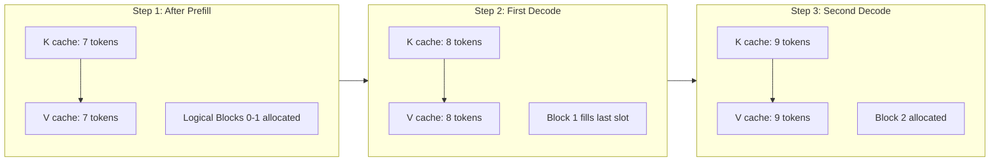

**Diagram Explanation:** This diagram shows the progressive growth of the KV cache during decode . After prefill with 7 tokens, logical blocks 0 and 1 are partially filled. The first decode step adds one token, filling the remaining slot in block 1. The second decode step requires allocating block 2. This incremental allocation avoids pre-allocating memory for the maximum possible sequence length, saving significant memory when actual output lengths are shorter.

### 1.5 GPU Memory Allocation in LLM Inference

The following diagram from the PagedAttention paper shows how memory is allocated in LLM inference on an A100 GPU :

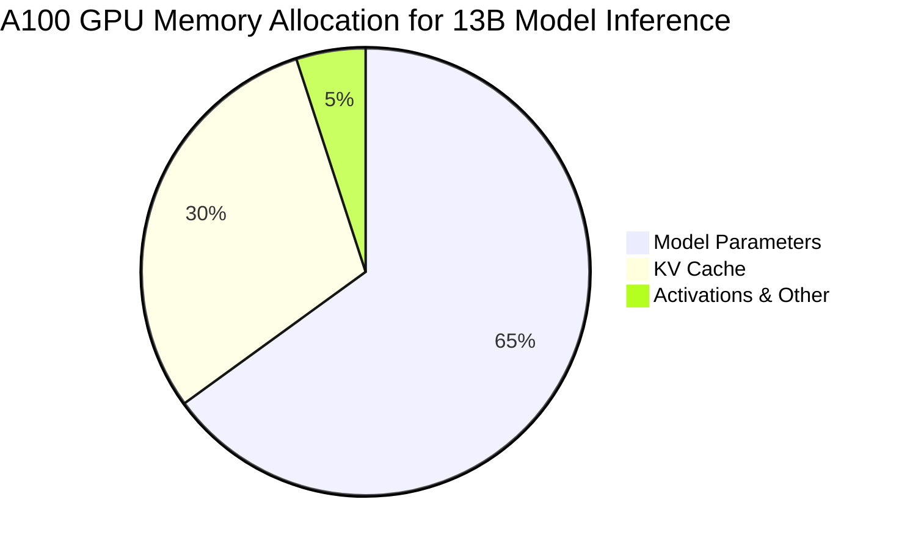

**Diagram Explanation:** This pie chart illustrates the memory breakdown for a 13B parameter model on an A100 GPU . Model parameters consume the majority (65%) of GPU memory and are statically allocated. The KV cache, despite being dynamically allocated based on sequence length, consumes a significant portion (30%). This highlights why efficient KV cache management is critical—it's the second-largest memory consumer and grows unpredictably with request length.

### 1.6 vLLM Memory Efficiency Comparison

The following diagram compares vLLM's memory usage against other systems :

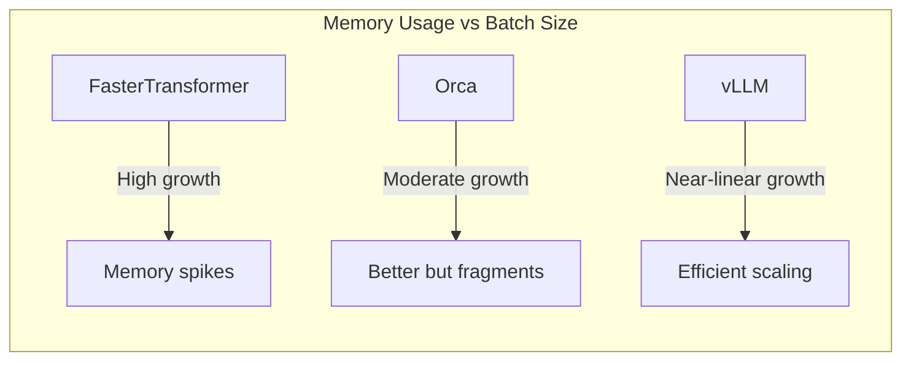

**Diagram Explanation:** This comparison shows how different systems handle memory as batch size increases . FasterTransformer shows steep memory growth due to pre-allocation. Orca improves but suffers from fragmentation. vLLM with PagedAttention achieves near-linear scaling, enabling much larger batch sizes within the same memory budget.

### 1.7 Internal and External Fragmentation in KV Cache

The following diagram illustrates the fragmentation problem in traditional KV cache allocation :

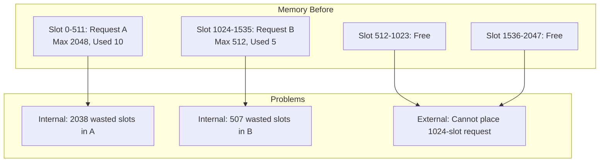

**Diagram Explanation:** This diagram shows the fragmentation problem in traditional contiguous KV cache allocation . Request A pre-allocates 2048 slots but only uses 10, wasting 2038 slots internally. Request B pre-allocates 512 slots but only uses 5, wasting 507 slots. Even though total free memory (1024 slots) exceeds what Request C needs, external fragmentation prevents allocating a contiguous 1024-slot block. This motivates PagedAttention's block-based approach.

### 1.8 Implementation: Simulating the Cost Without Cache

Create a file `simulate.py` and complete the following code to compare the number of operations with and without caching. Do not run it yet; first predict the output.

```python
import time

def simulate_without_cache(T):
    ops = 0
    for t in range(1, T+1):
        # recompute all previous tokens' keys/values
        ops += t * 1000  # simplified operation count
    return ops

def simulate_with_cache(T):
    ops = 0
    for t in range(1, T+1):
        ops += 1000  # only compute current token
    return ops

T = 100
print(f"Without cache: {simulate_without_cache(T)} ops")
print(f"With cache: {simulate_with_cache(T)} ops")
```

**Predict:** For T=100, what ratio do you expect between the two operation counts?

<details>
<summary>Click to verify</summary>

Without cache: sum from 1 to 100 = 5050 × 1000 = 5,050,000 ops.  
With cache: 100 × 1000 = 100,000 ops.  
Ratio ≈ 50.5×. The ratio grows linearly with T.

</details>

### 1.9 Test and Verify

Run the simulation and confirm your prediction.

**Self-Assessment:**
- [ ] I can explain why inference must be sequential.
- [ ] I can write the probability chain rule.
- [ ] I can describe the purpose of the KV cache.
- [ ] I can compute the speedup from caching for a given sequence length.
- [ ] I can estimate the memory required for KV cache.

### 1.10 Experiment: Varying Sequence Length

Modify the simulation to run for T = 10, 100, 1000 and plot the operation counts. Observe the quadratic vs. linear growth.

---

## Chapter 2: The Prefill Phase – Compute‑Bound Parallelism

### What You Will Build

You will implement a simplified prefill that computes attention for a prompt and populates the KV cache. You will measure its arithmetic intensity and confirm it is compute‑bound.

### 2.1 Context

The prefill phase processes the user's prompt in one shot. Because the entire prompt is available, the model can perform massive matrix multiplications, fully utilizing the GPU's compute units. This phase is **compute‑bound** .

### 2.2 Think First: Parallelism

**Question:** Why is prefill able to use parallelism while decode cannot?

<details>
<summary>Click to review</summary>

Prefill has all tokens available simultaneously, so it can compute attention scores for all positions in parallel using matrix multiplication. Decode must compute one token at a time because each new token depends on the previous one .

</details>

### 2.3 Prefill Phase Data Flow Diagram

The following diagram from FlashInfer documentation illustrates the prefill phase data flow :

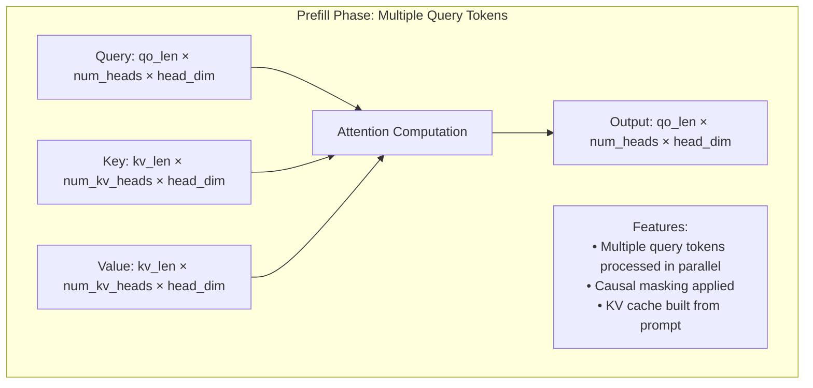

**Diagram Explanation:** This diagram shows the data flow during the prefill phase . The query tensor has shape `[qo_len, num_heads, head_dim]` where `qo_len` is the prompt length. All query tokens are processed in parallel against the key and value tensors. Causal masking ensures each token can only attend to previous tokens. The output includes embeddings for all prompt positions, and the KV cache is populated for future decode steps.

### 2.4 Prefill Kernel Architecture

The following diagram illustrates the architecture of FlashInfer's prefill kernel :

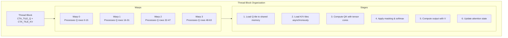

**Diagram Explanation:** This diagram shows the thread block organization in FlashInfer's prefill kernel . Each thread block processes a tile of query rows (`CTA_TILE_Q`) and a tile of KV columns (`CTA_TILE_KV`). Warps within the block distribute the query rows. The kernel operates in six stages: loading query data to shared memory, asynchronously loading key/value tiles, computing QK multiplication using tensor core `mma_sync` instructions, applying causal masking and softmax, computing the output with value tensors, and updating the attention state with online softmax statistics.

### 2.5 Memory Hierarchy During Prefill

The following diagram illustrates the GPU memory hierarchy during prefill :

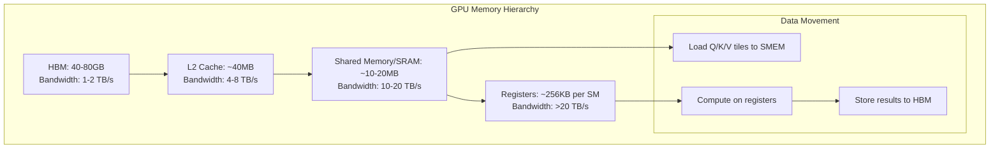

**Diagram Explanation:** This diagram shows the GPU memory hierarchy during prefill . Data moves from slow HBM (high bandwidth memory) through L2 cache to fast shared memory/SRAM, then to registers for computation. FlashAttention optimizes this by keeping data in SRAM as long as possible, reducing HBM traffic. The arithmetic intensity during prefill is high because each loaded element is used in many computations.

### 2.6 Tiled Attention Computation

The following diagram illustrates tiled attention computation used in FlashAttention :

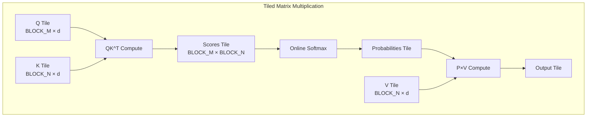

**Diagram Explanation:** This diagram shows the tiled approach used in FlashAttention . Instead of computing the full S×S attention matrix, the computation is broken into tiles that fit in shared memory. Each tile computes QK^T for a subset of query and key positions, applies softmax incrementally, and computes partial output. This reduces memory footprint from quadratic to linear and enables better cache utilization.

### 2.7 FlashAttention vs. Standard Attention Memory Access

The following diagram compares memory access patterns between standard attention and FlashAttention :

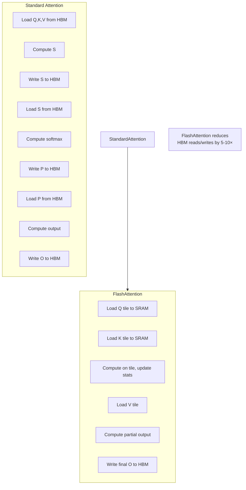

**Diagram Explanation:** This diagram contrasts memory access patterns . Standard attention requires multiple round-trips to HBM for intermediate matrices. FlashAttention keeps data in SRAM, streaming through tiles and updating running statistics. This reduces HBM traffic by 5-10×, enabling 2-4× speedups in practice.

### 2.8 Implementation: Naive Attention

Complete the following code for a naive attention forward pass. Fill in the blanks.

```python
import torch
import torch.nn.functional as F

def naive_attention(q, k, v):
    # q, k, v: [batch, seq_len, num_heads, head_dim]
    batch, seq_len, num_heads, head_dim = q.shape
    
    # Reshape for matmul
    q = q.transpose(1, 2)  # [batch, num_heads, seq_len, head_dim]
    k = k.transpose(1, 2)
    v = v.transpose(1, 2)
    
    # Compute scores (QK^T)
    scores = torch.matmul(q, k.transpose(-2, -1)) / (head_dim ** 0.5)  # Q1: What shape?
    
    # Apply causal mask
    mask = torch.triu(torch.ones(seq_len, seq_len, device=q.device), diagonal=1).bool()
    scores = scores.masked_fill(mask, float('-inf'))
    
    # Softmax
    attn_weights = F.softmax(scores, dim=-1)  # Q2: Which dimension?
    
    # Apply to values
    out = torch.matmul(attn_weights, v)  # Q3: What is the output shape?
    
    return out.transpose(1, 2)
```

**Hints:**
- Q1: The shape after matmul with transposed k.
- Q2: Over which dimension do we apply softmax?
- Q3: The shape after matmul, before final transpose.

<details>
<summary>Click for solutions</summary>

**Q1:** `[batch, num_heads, seq_len, seq_len]`  
**Q2:** `dim=-1` (over the last dimension, i.e., over keys)  
**Q3:** `[batch, num_heads, seq_len, head_dim]` after transpose becomes `[batch, seq_len, num_heads, head_dim]`

</details>

### 2.9 Understanding the Code

Match each tensor operation to its purpose:

| Operation | Purpose |
|-----------|---------|
| `q.transpose(1,2)` | A. Prevent attending to future tokens |
| `masked_fill` | B. Normalize attention scores |
| `softmax` | C. Rearrange heads for batched matmul |
| `torch.matmul(attn_weights, v)` | D. Compute weighted sum of values |

<details>
<summary>Click for answers</summary>

- `q.transpose(1,2)` → C  
- `masked_fill` → A  
- `softmax` → B  
- `torch.matmul(attn_weights, v)` → D

</details>

### 2.10 Test and Verify

**Predict:** For a prompt of 512 tokens and a model with 4096 hidden size, will prefill be compute‑bound or memory‑bound on an A100 (peak compute 312 TFLOPS, bandwidth 1.5 TB/s)? Assume arithmetic intensity threshold ≈ 100 FLOPs/byte.

<details>
<summary>Click to verify</summary>

Compute‑bound. Arithmetic intensity ~ $S$ = 512, which is well above 100. The GPU will spend most of its time computing, not waiting for memory.

</details>

### 2.11 Experiment: Compare Naive and FlashAttention

If you have a GPU, install the `flash-attn` package and compare runtime:

```bash
pip install flash-attn
```

Then run:

```python
import torch
import time
from flash_attn import flash_attn_func

# Create random tensors
batch, seq_len, num_heads, head_dim = 4, 512, 32, 128
q = torch.randn(batch, seq_len, num_heads, head_dim, device='cuda', dtype=torch.float16)
k = torch.randn_like(q)
v = torch.randn_like(q)

# Naive
start = time.time()
out_naive = naive_attention(q, k, v)
torch.cuda.synchronize()
naive_time = time.time() - start

# FlashAttention
start = time.time()
out_flash = flash_attn_func(q, k, v, causal=True)
torch.cuda.synchronize()
flash_time = time.time() - start

print(f"Naive: {naive_time*1000:.2f} ms, Flash: {flash_time*1000:.2f} ms")
```

**Question:** Why is FlashAttention faster? (Refer to the tiling diagram.)

### 2.12 Checkpoint

**Self-Assessment:**
- [ ] I can explain why prefill is compute‑bound.
- [ ] I can implement a basic attention mechanism.
- [ ] I can describe the memory hierarchy and its impact on prefill.
- [ ] I know what FlashAttention improves and by how much.
- [ ] I understand the tiling strategy used in attention kernels.

---

## Chapter 3: The Decode Phase – Memory‑Bound Iteration

### What You Will Build

You will implement a decode step that reads from a KV cache and produces the next token logits. You will measure its arithmetic intensity and see why it is memory‑bound.

### 3.1 Context

After the prompt is processed, the model enters the decode phase. It generates one token at a time, each requiring a full forward pass through the model. Because the KV cache holds the history, the model still attends to all previous tokens, but now the workload is dominated by moving data from memory to the compute units. This phase is **memory‑bound** .

### 3.2 Think First: Memory Access

**Question:** In the decode step, you need to load the model weights and the entire KV cache. How many bytes are moved for a model with 7B parameters (FP16) and a KV cache of 1000 tokens (each token contributes key and value vectors of size $d_{\text{model}}$ per layer)? Assume 32 layers, hidden size 4096.

<details>
<summary>Click to review</summary>

- Model weights: $7B \times 2$ bytes ≈ 14 GB.
- KV cache: As computed earlier, 512 MB. So total ≈ 14.5 GB moved per decode step. The computation performed is only a few GFLOPS, leading to an arithmetic intensity < 1. Hence memory‑bound.

</details>

### 3.3 Decode Phase Data Flow Diagram

The following diagram from FlashInfer documentation illustrates the decode phase data flow :

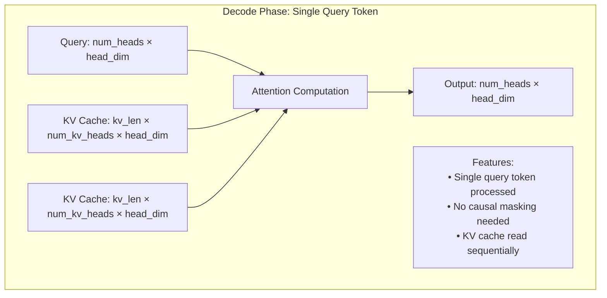

**Diagram Explanation:** This diagram shows the data flow during the decode phase . Unlike prefill, the query is a single token with shape `[num_heads, head_dim]`. The key and value tensors are the accumulated KV cache from all previous tokens. Attention is computed between this single query and all cached keys/values. The output is a single vector used to predict the next token. This phase is memory-bound because it must read the entire KV cache for each token generated.

### 3.4 Decode Kernel Architecture

The following diagram illustrates FlashInfer's decode kernel architecture with pipelining :

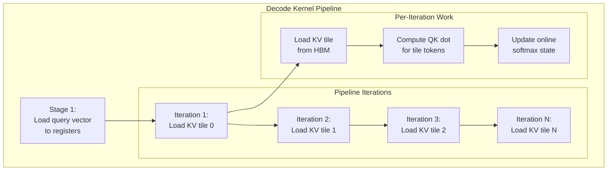

**Diagram Explanation:** This diagram shows the pipelined architecture of FlashInfer's decode kernel . The query vector is loaded once into registers. Then the kernel iterates through KV cache tiles, loading each tile from HBM, computing QK dot products for all tokens in the tile, and updating the online softmax state. This pipelining overlaps computation with memory loads, hiding some latency, but the kernel remains memory-bound because the ratio of computation to memory access is low.

### 3.5 Memory Access Pattern Analysis

The following diagram breaks down memory access and compute per decode step :

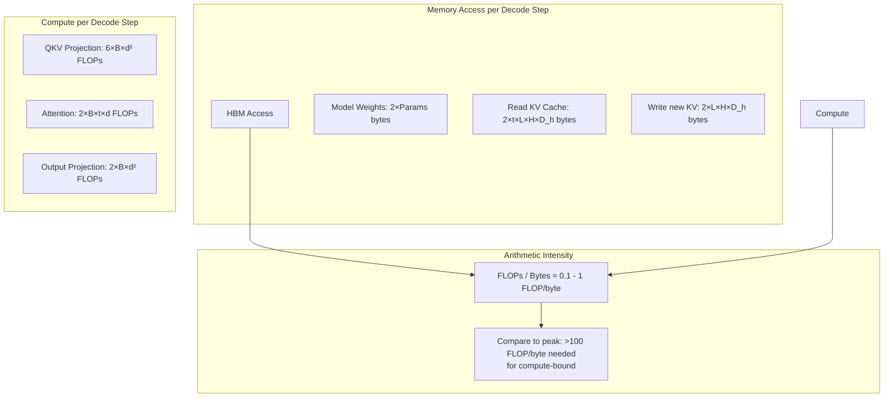

**Diagram Explanation:** This diagram quantifies why decode is memory-bound . The left column shows bytes moved from HBM: model weights (loaded once per batch), KV cache read (grows with sequence length t), and new KV write. The middle column shows FLOPs performed. The resulting arithmetic intensity (FLOPs/byte) is typically 0.1-1, far below the 100+ needed to keep tensor cores busy. The GPU spends most time waiting for data movement.

### 3.6 PagedAttention Memory Layout

The following diagram from vLLM documentation illustrates the PagedAttention memory layout :

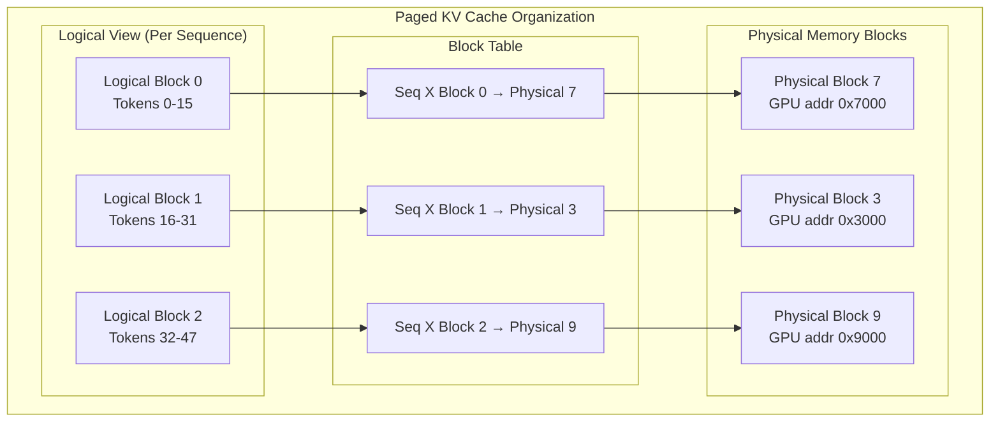

**Diagram Explanation:** This diagram shows how PagedAttention organizes KV cache in non-contiguous physical blocks . Each sequence has a logical view of contiguous blocks. A block table maps logical blocks to physical memory addresses, which may be scattered. This eliminates external fragmentation because physical blocks can be allocated anywhere. It also enables sharing—multiple sequences can map to the same physical blocks for shared prefixes.

### 3.7 PagedAttention Kernel Memory Access

The following diagram from vLLM documentation illustrates how threads access PagedAttention memory :

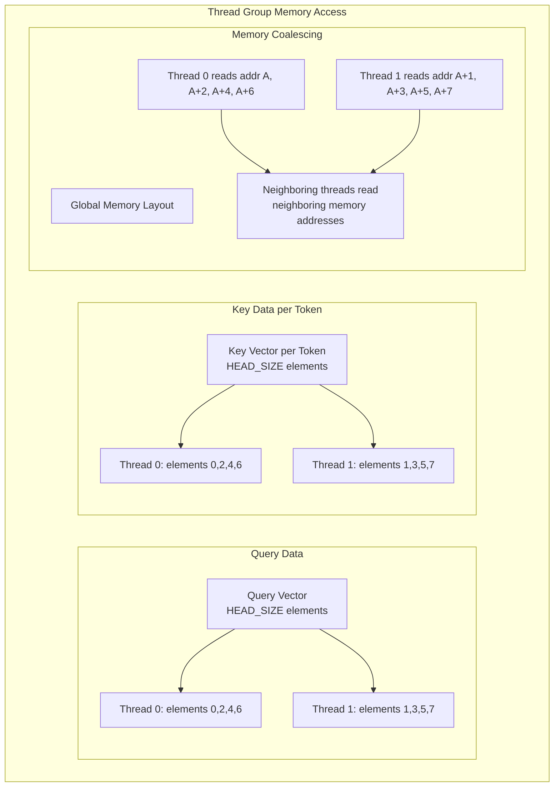

**Diagram Explanation:** This diagram shows how thread groups access memory in the PagedAttention kernel . Each thread group (2 threads in this example) handles one query token and one key token. Each thread processes a subset of elements (every other element) so that neighboring threads read neighboring memory addresses, achieving memory coalescing for better bandwidth utilization.

### 3.8 Implementation: Decode Step with KV Cache

Complete the following decode step. Assume you have a KV cache stored as a list of `(k_cache, v_cache)` for each layer. The cache starts as `None` and grows.

```python
def decode_step(input_token, position, kv_cache, model):
    # input_token: [batch, 1] token IDs
    # position: current position (int)
    # kv_cache: list of (k_cache, v_cache) for each layer
    # model: transformer model
    
    hidden = model.embedding(input_token)                # [batch, 1, d]
    pos_emb = model.position_embedding(position)         # [1, d]
    hidden = hidden + pos_emb.unsqueeze(0)
    
    for layer_idx, layer in enumerate(model.layers):
        k_cache, v_cache = kv_cache[layer_idx]
        
        # Compute Q, K, V for current token
        q, k, v = layer.attention.qkv_proj(hidden)       # Q1: What shapes?
        
        # Update cache
        if k_cache is None:
            k_cache = k
            v_cache = v
        else:
            k_cache = torch.cat([k_cache, k], dim=1)    # Q2: Which dimension?
            v_cache = torch.cat([v_cache, v], dim=1)
        kv_cache[layer_idx] = (k_cache, v_cache)
        
        # Attention using full cache
        attn_out = layer.attention(q, k_cache, v_cache)
        hidden = layer.ffn(layer.norm1(hidden + attn_out))
        hidden = layer.norm2(hidden)
    
    logits = model.lm_head(hidden[:, -1, :])
    return logits, kv_cache
```

**Hints:**
- Q1: The shapes of q, k, v after projection.
- Q2: Which dimension corresponds to sequence length?

<details>
<summary>Click for solutions</summary>

**Q1:** `q, k, v` each have shape `[batch, 1, num_heads, head_dim]`.  
**Q2:** Concatenate along the sequence dimension (`dim=1`), because the new token extends the sequence.

</details>

### 3.9 Understanding the Code

**Question:** Why do we only take `hidden[:, -1, :]` for the logits?

<details>
<summary>Click to answer</summary>

Because we only need the representation of the most recent token to predict the next token. The hidden states for earlier tokens are not used in the final classification head.

</details>

### 3.10 Test and Verify

**Predict:** If you run decode for 100 steps, how does the time per step change? Why?

<details>
<summary>Click to verify</summary>

The time per step increases slightly because the KV cache grows, so more data must be read from memory each time. However, the increase is sublinear because the attention computation is $O(t \cdot d)$ and memory movement is $O(t \cdot d)$ as well. The dominating factor is still the model weights, so the increase may be modest.

</details>

### 3.11 Experiment: Memory Fragmentation Simulation

Simulate how contiguous allocation leads to fragmentation. Create a list representing memory blocks. Allocate sequences of varying lengths and free them in random order. Then try to allocate a large contiguous block and see if it fails.

```python
import random

memory = [None] * 100  # 100 slots
allocations = {}

def allocate(seq_id, length):
    # find contiguous free slots
    for i in range(len(memory) - length + 1):
        if all(memory[i+j] is None for j in range(length)):
            for j in range(length):
                memory[i+j] = seq_id
            allocations[seq_id] = (i, length)
            return True
    return False

def free(seq_id):
    if seq_id in allocations:
        start, length = allocations[seq_id]
        for j in range(length):
            memory[start+j] = None
        del allocations[seq_id]

# Simulate: allocate random lengths, free randomly
for _ in range(20):
    seq_id = len(allocations)
    length = random.randint(5, 15)
    if allocate(seq_id, length):
        print(f"Allocated {seq_id} of length {length}")
    else:
        print(f"Failed to allocate {seq_id}")

# Free half randomly
for seq_id in list(allocations.keys())[:10]:
    free(seq_id)

# Try to allocate a large block
success = allocate("large", 30)
print(f"Large allocation success: {success}")
```

Observe how fragmentation can cause failure even when total free memory is sufficient. This motivates PagedAttention.

### 3.12 Checkpoint

**Self-Assessment:**
- [ ] I can explain why decode is memory‑bound.
- [ ] I can implement a decode step with a KV cache.
- [ ] I understand how PagedAttention reduces fragmentation.
- [ ] I can calculate arithmetic intensity for a given configuration.
- [ ] I can explain the memory fragmentation problem with an example.

---

## Chapter 4: The Scheduler's Challenge – Batching Heterogeneous Work

### What You Will Build

You will simulate a simple scheduler that batches requests and observe the trade‑offs between static, dynamic, and continuous batching.

### 4.1 Context

A production server handles many requests simultaneously. Some are in prefill (processing a new prompt), others are in decode (generating the next token). The scheduler must decide which requests to run in each iteration to maximize throughput while meeting latency SLOs .

### 4.2 Think First: Batching

**Question:** Why can't we simply run all waiting requests together in one giant batch?

<details>
<summary>Click to review</summary>

- Different requests are at different phases (prefill vs decode) and have different lengths. Mixing them naively would waste computation (e.g., padding short sequences) or cause high latency (a long prefill blocking many decodes).
- The total number of tokens that can be processed in one iteration is limited by GPU memory and compute capacity .

</details>

### 4.3 ORCA System Overview

The following diagram from the ORCA paper shows the system architecture for continuous batching :

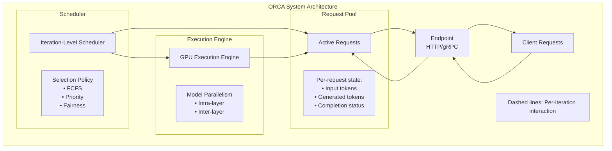

**Diagram Explanation:** This diagram shows the ORCA system architecture for continuous batching . The request pool holds all active requests with their state. The scheduler selects which requests to run in each iteration based on policies like FCFS or priority. The execution engine runs a single model iteration on the selected batch and returns new tokens to the request pool. Completed requests are returned to clients. Unlike traditional systems that process entire requests atomically, ORCA operates at iteration granularity.

### 4.4 Iteration-Level Scheduling vs. Request-Level Scheduling

The following diagram contrasts traditional request-level scheduling with ORCA's iteration-level scheduling :

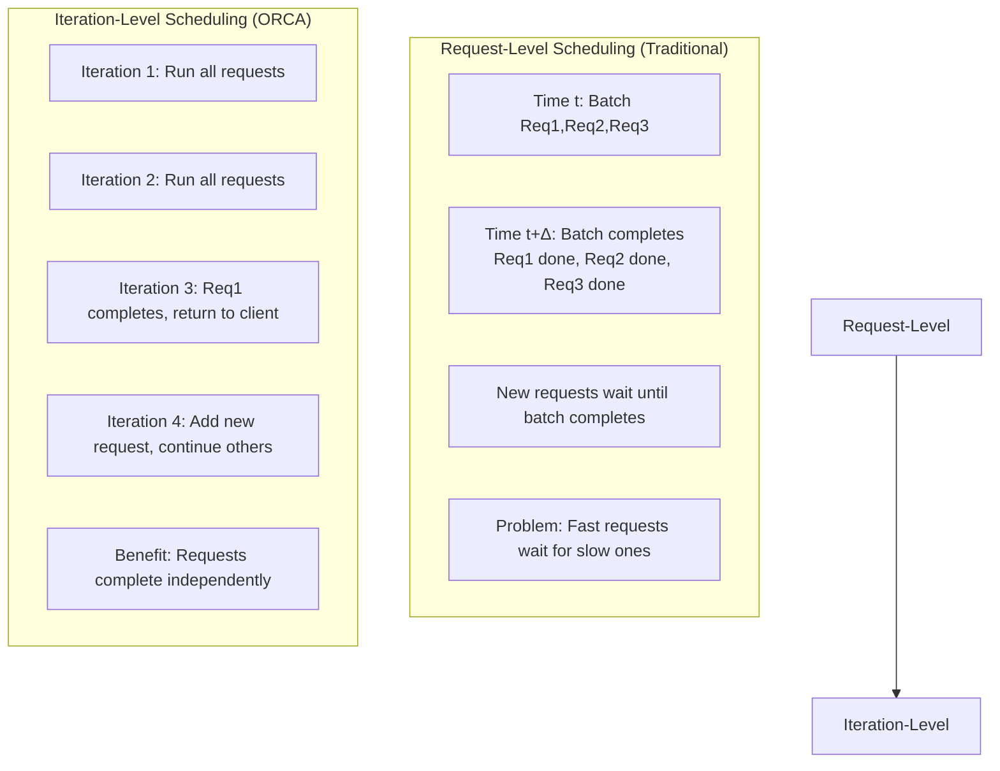

**Diagram Explanation:** This diagram contrasts scheduling approaches . In request-level scheduling (top), all requests in a batch must complete before any return, causing fast requests to wait for slow ones. New requests must wait for the entire batch. In iteration-level scheduling (bottom), each iteration runs one step for all active requests. Requests complete independently and return immediately. New requests can be added in any iteration, reducing queueing delay.

### 4.5 Continuous Batching State Machine

The following diagram illustrates the state machine for continuous batching :

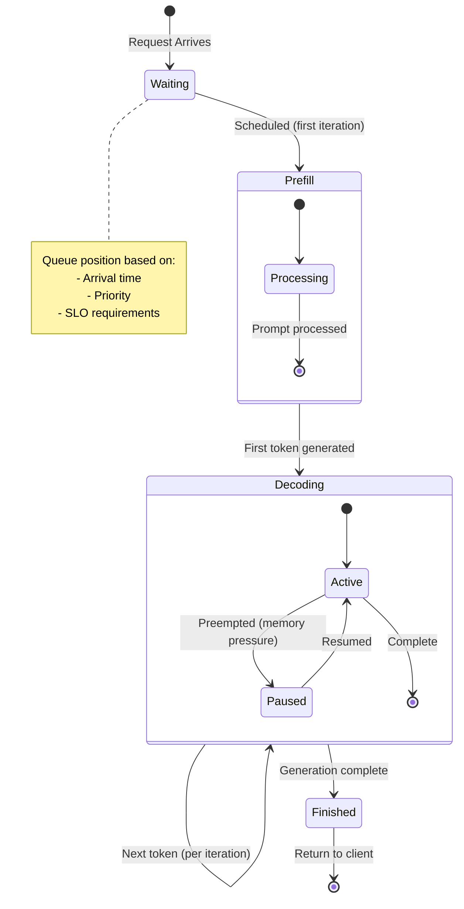

**Diagram Explanation:** This diagram shows the request lifecycle in continuous batching . Requests enter the waiting queue, transition to prefill for their first iteration, then to decoding. During decoding, requests may be paused if memory pressure requires preemption, then resumed later. This flexibility enables fine-grained resource management and higher utilization.

### 4.6 Selective Batching for Transformer Models

The following diagram illustrates selective batching, which batches only selected operations :

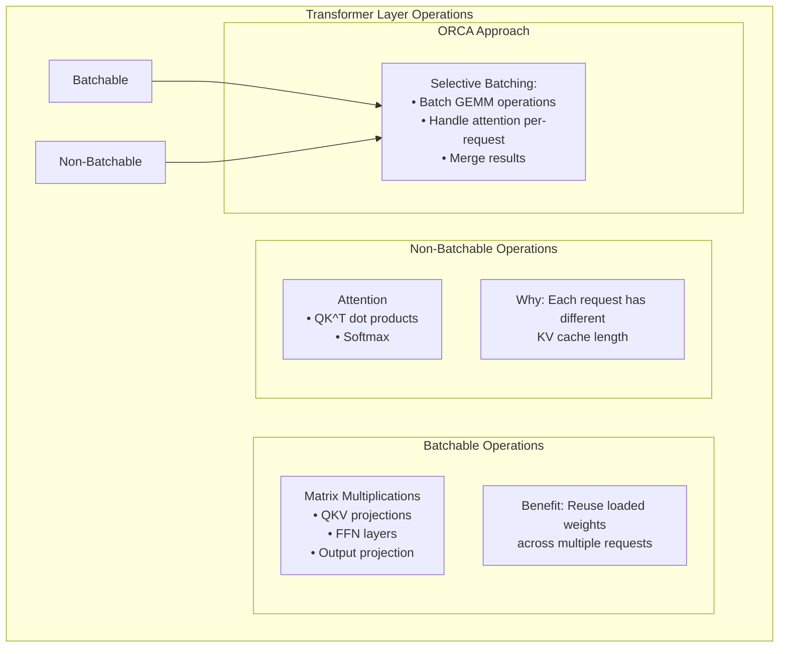

**Diagram Explanation:** This diagram shows selective batching used in ORCA . Matrix multiplication operations (QKV projections, FFN layers) are batchable because they use the same weights for all requests. Attention operations are not batchable because each request has a different KV cache length. ORCA batches the GEMM operations while handling attention per-request, then merges results. This enables iteration-level scheduling without excessive padding.

### 4.7 Throughput Comparison: vLLM vs. Other Systems

The following diagram compares vLLM's throughput against other systems :

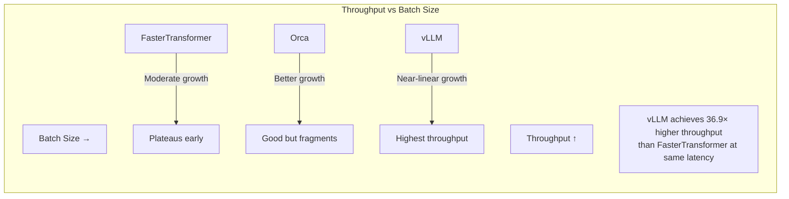

**Diagram Explanation:** This diagram compares throughput across systems as batch size increases . FasterTransformer plateaus early due to memory fragmentation. Orca performs better but still suffers from fragmentation. vLLM with PagedAttention achieves near-linear throughput scaling, enabling much larger batch sizes. The paper reports up to 36.9× higher throughput than FasterTransformer at the same latency level.

### 4.8 Implementation: Simple Continuous Batching Simulator

Complete the following scheduler. Fill in the blanks to process one step for each running request.

```python
class Request:
    def __init__(self, prompt_len, output_len):
        self.prompt_len = prompt_len
        self.output_len = output_len
        self.generated = 0
        self.state = 'prefill'   # or 'decode'
        self.done = False

class Scheduler:
    def __init__(self, token_budget):
        self.budget = token_budget
        self.waiting = []
        self.running = []
    
    def add_request(self, req):
        self.waiting.append(req)
    
    def schedule(self):
        # Move waiting to running if they fit in budget
        remaining = self.budget
        new_running = []
        for req in self.waiting:
            if req.state == 'prefill' and req.prompt_len <= remaining:
                new_running.append(req)
                remaining -= req.prompt_len
            else:
                break
        for req in new_running:
            self.waiting.remove(req)
            self.running.append(req)
        
        # Process one step for all running requests
        for req in self.running:
            if req.state == 'prefill':
                req.prompt_len -= 1
                if req.prompt_len == 0:
                    req.state = 'decode'
            else:  # decode
                req.generated += 1
                if req.generated == req.output_len:
                    req.done = True
        # Remove finished
        self.running = [r for r in self.running if not r.done]
```

**Enhancement:** Add a priority queue to handle requests with different SLOs. Modify the code to prioritize decode over prefill or vice versa.

### 4.9 Test and Verify

Create a few requests and simulate:

```python
sched = Scheduler(token_budget=50)
sched.add_request(Request(prompt_len=100, output_len=10))
sched.add_request(Request(prompt_len=10, output_len=100))

for step in range(200):
    sched.schedule()
    print(f"Step {step}: running {len(sched.running)}, waiting {len(sched.waiting)}")
    if not sched.running and not sched.waiting:
        break
```

**Predict:** Which request will finish first? Why?

<details>
<summary>Click to verify</summary>

The request with short prompt (10) will finish first because it enters decode quickly, and decode steps are cheap. The long prompt request will be processed in chunks (if budget allows) but may take longer overall.

</details>

### 4.10 Experiment: Compare Batching Strategies

Implement a static batching version that waits until a batch is full before processing, and compare the total time to serve a fixed set of requests. Measure the number of iterations needed.

### 4.11 Checkpoint

**Self-Assessment:**
- [ ] I can explain the difference between static, dynamic, and continuous batching.
- [ ] I can describe how a continuous batching scheduler works.
- [ ] I have implemented a simple scheduler.
- [ ] I understand why mixing prefill and decode is challenging.
- [ ] I can compare scheduler implementations across frameworks.

---

## Chapter 5: Advanced Optimizations

### What You Will Build

You will understand advanced techniques like chunked prefill, sliding window attention, prefix caching, and disaggregated serving. You will calculate memory savings and predict their impact.

### 5.1 Context

Modern inference systems employ several advanced techniques to further optimize the two‑phase engine. This chapter covers chunked prefill, prefix caching, and disaggregated architectures.

### 5.2 Think First: Prefix Sharing

**Question:** Consider a chatbot where every conversation starts with the system prompt "You are a helpful assistant." This prompt is 20 tokens long. If 500 users are chatting simultaneously, how much memory can prefix caching save if the KV cache per user is 1 GB? Assume the system prompt's KV cache is 10 MB.

<details>
<summary>Click to calculate</summary>

Without prefix caching: each user stores the full KV cache (1 GB) = 500 GB total.  
With prefix caching: the system prompt's KV cache (10 MB) is stored once and shared. Each user only stores their unique conversation after the prompt. If average conversation length is 1000 tokens, each user's unique cache is 1 GB - 10 MB = 990 MB. Total = 10 MB + 500 × 990 MB ≈ 10 MB + 495 GB ≈ 495 GB. Saving = 5 GB. The saving grows with the number of users.

</details>

### 5.3 Chunked Prefill vs. Standard Prefill

The following diagram from the SARATHI paper compares standard prefill with chunked prefill :

```mermaid
graph TD
    subgraph "Standard Prefill (Without Chunking)"
        Time0[Time 0ms] --> LongPrefill[Long Prefill: 500ms]
        LongPrefill --> Decode1[Decode Step 1: 10ms]
        Decode1 --> Decode2[Decode Step 2: 10ms]
        Note1[Problem: Decode requests starved<br/>during 500ms prefill]
    end
    
    subgraph "Chunked Prefill (SARATHI)"
        TimeA[Time 0ms] --> Chunk1[Prefill Chunk 1: 50ms]
        Chunk1 --> DecodeA[Decode All: 10ms]
        DecodeA --> Chunk2[Prefill Chunk 2: 50ms]
        Chunk2 --> DecodeB[Decode All: 10ms]
        DecodeB --> Chunk3[Prefill Chunk 3: 50ms]
        Chunk3 --> DecodeC[Decode All: 10ms]
        Note2[Benefit: Decode runs every 60ms<br/>instead of waiting 500ms]
    end
```

**Diagram Explanation:** This diagram contrasts standard and chunked prefill . In standard prefill (top), a long 500ms prefill blocks all decode requests, causing high latency. In chunked prefill (bottom), the long prompt is split into 50ms chunks interleaved with decode steps. Decode requests run every 60ms instead of waiting 500ms, dramatically improving tail latency. This technique is called "piggybacking decodes with chunked prefills" in the SARATHI paper.

### 5.4 Decode-Maximal Batching

The following diagram illustrates SARATHI's decode-maximal batching principle :

```mermaid
graph TD
    subgraph "Batch Construction"
        subgraph "Step 1: Fill with Decodes"
            Slot1[Slot 1: Decode Req A]
            Slot2[Slot 2: Decode Req B]
            Slot3[Slot 3: Decode Req C]
            Slot4[Slot 4: Decode Req D]
            Slot5[Slot 5: Decode Req E]
            Slot6[Slot 6: Decode Req F]
            Note1[Fill decode slots until<br/>KV cache budget exhausted]
        end
        
        subgraph "Step 2: Add Prefill Chunks"
            Remaining[Remaining token budget]
            Prefill1[Prefill chunk from Req G]
            Prefill2[Prefill chunk from Req H]
            Note2[Add prefill chunks in<br/>remaining token slots]
        end
    end
```

**Diagram Explanation:** This diagram shows SARATHI's decode-maximal batching . First, the scheduler fills the batch with as many decode requests as possible, limited by KV cache capacity. Then, it fills remaining token budget with prefill chunks. This prioritizes decode throughput while still making progress on prefills, achieving better overall utilization than either pure decode or mixed batching.

### 5.5 Pipeline Parallelism Bubble Reduction

The following diagram shows how chunked prefill reduces bubbles in pipeline parallelism :

```mermaid
graph TD
    subgraph "Without Chunking - Large Bubbles"
        Stage1[Stage 1: A_p B_p C_p D_p]
        Stage2[Stage 2: A_p B_p C_p D_p]
        Stage3[Stage 3: A_p B_p C_p D_p]
        Stage4[Stage 4: A_p B_p C_p D_p]
        Bubble[Large bubbles due to<br/>varying prefill times]
    end
    
    subgraph "With Chunking - Minimized Bubbles"
        S1[Stage 1: A1 A2 B1 B2 B3 C1 C2 D1 D2]
        S2[Stage 2: A1 A2 B1 B2 B3 C1 C2 D1 D2]
        S3[Stage 3: A1 A2 B1 B2 B3 C1 C2 D1 D2]
        S4[Stage 4: A1 A2 B1 B2 B3 C1 C2 D1 D2]
        Note[Chunks interleaved to keep<br/>all stages busy]
    end
```

**Diagram Explanation:** This diagram illustrates pipeline parallelism with and without chunking . Without chunking (top), different requests have different prefill times, causing pipeline bubbles where some stages are idle. With chunking (bottom), requests are split into smaller chunks that can be interleaved, keeping all pipeline stages busy and improving overall throughput.

### 5.6 Disaggregated Serving Architecture

The following diagram from NVIDIA's SGLang documentation shows disaggregated serving architecture :

```mermaid
sequenceDiagram
    participant Client
    participant Decode
    participant Prefill
    participant RDMA as RDMA Transfer

    Note over Decode,Prefill: Setup Phase (One-Time)
    Decode->>Prefill: Register RDMA connection info
    Note over Decode,Prefill: GPU memory pointers exchanged

    Note over Client,Prefill: Per-Request Phase
    Client->>Decode: 1. Send request
    Decode->>Prefill: 2. Forward request + get bootstrap_room
    Prefill-->>Decode: Return bootstrap_room ID
    
    Note over Decode: 3. Allocate GPU memory pages
    Decode->>Prefill: Send allocation info (page indices)
    
    Note over Prefill: 4. Prefill forward pass
    Note over Prefill: Generate KV cache
    
    par Decode polls
        loop Poll transfer
            Note over Decode: 5. Poll for KV arrival
        end
    and Prefill transfers
        Note over Prefill: 6. RDMA write KV to decode
        Prefill->>Decode: Transfer KV cache via RDMA
    end
    
    Note over Prefill: 7. Transfer complete
    Note over Decode: 8. KV received, start decode
    
    loop Generate tokens
        Note over Decode: Decode forward pass
        Decode-->>Client: Stream output token
    end
```

**Diagram Explanation:** This sequence diagram shows disaggregated serving from NVIDIA's SGLang documentation . Prefill and decode run on separate machines with different hardware characteristics. During setup, decode workers register RDMA connection information with prefill workers. During request processing, the decode worker receives the client request, coordinates with a prefill worker, and allocates GPU memory. The prefill worker processes the prompt and uses RDMA to write the KV cache directly to the decode worker's GPU memory with zero CPU involvement. The decode worker then generates tokens using the transferred cache and streams results to the client.

### 5.7 Splitwise Phase-Splitting Architecture

The following diagram from the Splitwise paper shows phase-specific resource allocation :

```mermaid
graph TD
    subgraph "Splitwise Architecture"
        Client[Client Requests] --> Router[Request Router]
        
        subgraph "Prefill Cluster (Compute-Optimized)"
            P1[Prefill Node 1<br/>H100, High FLOPs]
            P2[Prefill Node 2<br/>H100, High FLOPs]
            P3[Prefill Node N<br/>H100, High FLOPs]
            Note1[Optimized for matrix multiply<br/>Large batch sizes]
        end
        
        subgraph "Decode Cluster (Memory-Optimized)"
            D1[Decode Node 1<br/>A100, Large HBM]
            D2[Decode Node 2<br/>A100, Large HBM]
            D3[Decode Node N<br/>A100, Large HBM]
            Note2[Optimized for memory bandwidth<br/>KV cache capacity]
        end
        
        subgraph "KV Cache Store"
            Cache[Distributed KV Cache<br/>High-speed interconnect]
            RDMA[RDMA/InfiniBand<br/>Zero-copy transfer]
        end
        
        Router --> PrefillCluster
        PrefillCluster --> CacheStore
        CacheStore --> DecodeCluster
        DecodeCluster --> Client
    end
```

**Diagram Explanation:** This diagram shows the Splitwise architecture for phase-splitting . Prefill and decode run on separate clusters with different hardware: compute-optimized nodes (H100) for prefill, memory-optimized nodes (A100 with large HBM) for decode. The KV cache is transferred via high-speed interconnect (RDMA/InfiniBand). This allows independent scaling of each phase and better overall resource utilization since each phase has different hardware requirements.

### 5.8 Implementation Exercise: Estimate Memory Savings

Given a model with 32 layers, hidden size 4096, FP16. The shared system prompt is 200 tokens. There are 300 concurrent users, each generating 500 unique tokens. Compute the memory saved by prefix caching.

<details>
<summary>Click for solution</summary>

Cache size per token = 32 × 2 × 4096 × 2 = 524,288 bytes ≈ 0.5 MB.  
Shared prefix: 200 tokens → 200 × 0.5 MB = 100 MB.  
Without caching: each user stores full 200+500 = 700 tokens → 700 × 0.5 MB = 350 MB per user. Total = 300 × 350 MB = 105 GB.  
With caching: shared prefix stored once (100 MB) + each user stores 500 unique tokens → 500 × 0.5 MB = 250 MB per user. Total = 100 MB + 300 × 250 MB = 100 MB + 75 GB ≈ 75.1 GB.  
Memory saved = 105 GB – 75.1 GB = 29.9 GB.

</details>

### 5.9 Experiment: Research a Recent Optimization

Choose one of the following papers and write a one‑paragraph summary of how it optimizes prefill or decode:

- "FlashAttention: Fast and Memory‑Efficient Exact Attention with IO‑Awareness" 
- "PagedAttention: Attention with Block‑Wise KV Cache for LLM Serving" 
- "SARATHI: Efficient LLM Inference by Piggybacking Decodes with Chunked Prefills" 
- "Splitwise: Efficient Generative LLM Inference Using Phase Splitting" 

### 5.10 Checkpoint

**Self-Assessment:**
- [ ] I can explain chunked prefill and its benefits.
- [ ] I understand how decode-maximal batching works.
- [ ] I can describe prefix caching and calculate memory savings.
- [ ] I understand disaggregated serving architectures.
- [ ] I can compare different advanced optimization techniques.

---

## Epilogue: The Complete System

You have now explored the two‑phase engine from the ground up. You understand:

- Why inference must be sequential and how the KV cache makes it feasible.
- Why prefill is compute‑bound and decode is memory‑bound.
- How continuous batching and PagedAttention enable high throughput.
- How advanced techniques like chunked prefill, prefix caching, and disaggregation push performance further.

Your mental model of LLM serving now includes the critical trade‑offs that engineers face when building production systems.

### Summary of Built Components

| Component | Purpose | Implemented? |
|-----------|---------|--------------|
| KV cache simulation | Understand speedup | ✓ (Chapter 1) |
| Naive attention | Prefill computation | ✓ (Chapter 2) |
| Decode step with cache | Token‑by‑token generation | ✓ (Chapter 3) |
| Memory fragmentation sim | Motivation for PagedAttention | ✓ (Chapter 3) |
| Continuous batching scheduler | Iteration‑level scheduling | ✓ (Chapter 4) |

### Final Verification

Run all experiments and ensure you can answer the Knowledge Check questions below.

---

## The Principles

1. **Sequential dependency is fundamental** – It cannot be eliminated; it can only be managed.
2. **Cache aggressively** – The KV cache turns quadratic complexity into linear, but at the cost of memory.
3. **Match hardware to workload** – Prefill wants compute; decode wants memory bandwidth and capacity .
4. **Batch to reuse weights** – Decode becomes less memory‑bound when multiple sequences share the same weights.
5. **Schedule at iteration level** – Continuous batching maximizes utilization without starving any request .
6. **Break long work into chunks** – Chunked prefill prevents head‑of‑line blocking .
7. **Share common prefixes** – Prefix caching can save gigabytes of memory .
8. **Specialize hardware when possible** – Disaggregated architectures optimize each phase independently .

---

## Troubleshooting

### Error: CUDA out of memory

**Cause:** KV cache or model weights exceed GPU memory.

**Solution:** Reduce batch size, use PagedAttention (vLLM), enable chunked prefill, or offload to CPU .

### Error: Slow generation after many tokens

**Cause:** KV cache is large, causing high memory read overhead.

**Solution:** Use FlashAttention kernels, enable sliding window attention, or consider KV cache quantization .

### Error: First token takes too long

**Cause:** Long prompt with no chunking.

**Solution:** Enable chunked prefill to interleave with decode steps .

### Error: OOM even with free memory

**Cause:** Memory fragmentation from contiguous allocation.

**Solution:** Use PagedAttention which eliminates fragmentation .

### Error: High tail latency under load

**Cause:** Prefill requests blocking decode.

**Solution:** Implement decode‑first scheduling or chunked prefill .

### Error: Throughput lower than expected

**Cause:** Batch size too small or scheduler not tuned.

**Solution:** Increase `max_num_batched_tokens`, enable continuous batching, and profile to find bottleneck .

---

## Next Steps

- Run a production inference engine like vLLM or TGI locally and observe its scheduling behavior.
- Implement a simple version of PagedAttention in PyTorch.
- Read the Splitwise paper on disaggregating prefill and decode .
- Explore speculative decoding to break the sequential dependency.
- Experiment with KV cache quantization using KIVI or GEAR.
- Try SGLang's RadixAttention for advanced prefix caching.

---

## Knowledge Check

**Question 1:** Explain why the KV cache is necessary for efficient inference. What would happen without it?

<details>
<summary>Answer</summary>

Without KV cache, each decode step would recompute the key and value vectors for all previous tokens, leading to $O(T^2)$ complexity. The cache stores these vectors, reducing complexity to $O(T)$ and enabling practical generation lengths .

</details>

**Question 2:** A model has 32 layers, hidden size 5120, and uses FP16. Calculate the KV cache size for a 2048‑token sequence.

<details>
<summary>Answer</summary>

Per token per layer: 2 (key+value) × 5120 × 2 bytes = 20,480 bytes ≈ 20 KB.  
32 layers: 32 × 20 KB = 640 KB per token.  
2048 tokens: 2048 × 640 KB = 1,310,720 KB = 1.25 GB.

</details>

**Question 3:** Why is decode phase memory‑bound while prefill is compute‑bound?

<details>
<summary>Answer</summary>

Prefill processes many tokens in parallel, performing large matrix multiplications with high arithmetic intensity. Decode processes one token at a time, but must load all model weights and the growing KV cache from memory, resulting in low arithmetic intensity (often <1 FLOP/byte). The GPU spends most of its time waiting for data movement .

</details>

**Question 4:** What problem does PagedAttention solve? How does it work?

<details>
<summary>Answer</summary>

PagedAttention solves memory fragmentation caused by contiguous KV cache allocation . It divides the cache into fixed‑size blocks and uses a logical‑to‑physical mapping (block table), allowing non‑contiguous storage, eliminating fragmentation, and enabling prefix sharing .

</details>

**Question 5:** List three advanced techniques that improve inference performance and briefly describe each.

<details>
<summary>Answer</summary>

1. **Chunked prefill:** Splits long prompts into chunks interleaved with decode steps to prevent head‑of‑line blocking .  
2. **Prefix caching:** Reuses KV cache for common prefixes (e.g., system prompts) across requests to save memory .  
3. **Disaggregated serving:** Separates prefill and decode onto different hardware optimized for each phase's characteristics .

</details>

---

## Additional Resources

### Papers
- [1] "Attention Is All You Need" (Vaswani et al., 2017) https://arxiv.org/abs/1706.03762
- [2] "FlashAttention: Fast and Memory-Efficient Exact Attention with IO-Awareness" (Dao et al., 2022) https://arxiv.org/abs/2205.14135 
- [3] "vLLM: Easy, Fast, and Cheap LLM Serving with PagedAttention" (Kwon et al., 2023) https://arxiv.org/abs/2309.06180 
- [4] "Orca: A Distributed Serving System for Transformer-Based Generative Models" (Yu et al., 2022) https://www.usenix.org/conference/osdi22/presentation/yu 
- [5] "SARATHI: Efficient LLM Inference by Piggybacking Decodes with Chunked Prefills" (Agrawal et al., 2023) https://arxiv.org/abs/2308.16369 
- [6] "Splitwise: Efficient Generative LLM Inference Using Phase Splitting" (Patel et al., 2023) https://arxiv.org/abs/2311.18677 

### Documentation
- [7] FlashInfer Documentation: Prefill and Decode Operations https://deepwiki.com/flashinfer-ai/flashinfer/2.1-prefill-and-decode-operations 
- [8] vLLM PagedAttention Documentation https://docs.vllm.ai/en/latest/design/paged_attention/ 
- [9] NVIDIA Dynamo: SGLang Disaggregated Serving https://docs.nvidia.com/dynamo/archive/0.6.0/backends/sglang/sglang-disaggregation.html 

---

**Navigation:** [← Lab 0.1](../lab0.1/README.md) | [Main](../README.md) | [Next: Lab 0.3 →](../lab0.3/README.md)