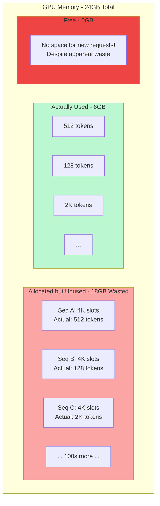
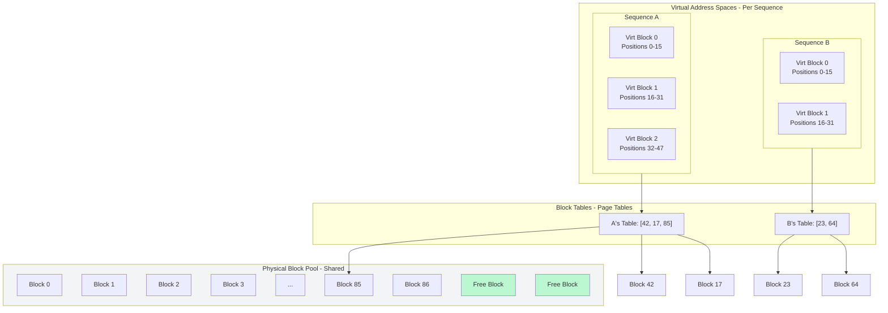
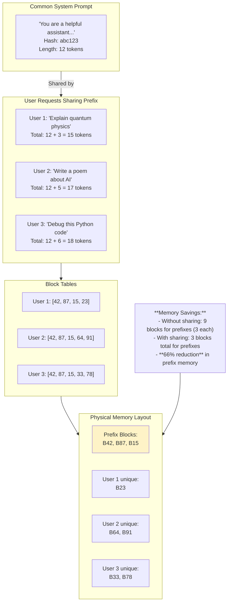

# lab 0.3

Status: Not started

# **Lab 0.3: The Heart of the Matter – KV Cache & Attention**

## **📚 Lab Objective**

- **Primary Goal**: To master the complete evolution of KV cache management from naive contiguous allocation to sophisticated PagedAttention. You will build understanding iteratively, from basic attention mathematics to production-ready memory optimization.
- **Learning Outcome**: You will be able to implement, step-by-step, a full KV cache management system, understanding the trade-offs at each stage and why PagedAttention is the optimal solution for high-throughput serving.

## **🎯 Architectural Significance**

The KV cache represents 40-70% of dynamic memory usage during inference. Its management dictates system throughput, latency, and maximum concurrent users. This lab moves from theory to implementation—showing you exactly how to build the memory subsystem that makes nano-vLLM possible.

---


## **Iterative Learning Path**

### **Phase 1: Foundations – Understanding the Core Problem**

### **Step 1.1: The Mathematical Necessity of Caching**

**The Attention Equation Without Cache**:

```
For generating token t:
    Q_t = W_q · h_t
    K_{1:t} = W_k · [h_1, h_2, ..., h_t]  # Recompute all keys
    V_{1:t} = W_v · [h_1, h_2, ..., h_t]  # Recompute all values
    Attention = softmax(Q_t · K_{1:t}ᵀ/√d) · V_{1:t}

```

**Complexity**: O(t²) operations per token → O(n³) for sequence of length n

**The Attention Equation With Cache**:

```
# First time (prefill):
    K_{1:n}, V_{1:n} = compute_and_cache(prompt_tokens)

# Each decode step:
    Q_t = W_q · h_t
    K_t, V_t = compute_current(t)           # O(1)
    K_cache.append(K_t), V_cache.append(V_t) # O(1)
    Attention = softmax(Q_t · K_cacheᵀ/√d) · V_cache  # O(t)

```

**Complexity**: O(n²) total → **97-99% computation saved** for 1000-token sequence

**Visual 1.1: Computation Without vs With KV Cache**

```mermaid
graph TD
    subgraph NoCache[Without KV Cache - O(n²)]
        direction TB
        NC1[Token 1: Process 1 token] --> NC2[Token 2: Re-process 2 tokens]
        NC2 --> NC3[Token 3: Re-process 3 tokens]
        NC3 --> NC4[...]
        NC4 --> NC5[Token n: Re-process n tokens]
        style NC5 fill:#fca5a5
    end

    subgraph WithCache[With KV Cache - O(n)]
        direction TB
        WC1[Token 1: Process & Cache] --> WC2[Token 2: Read cache + 1 new]
        WC2 --> WC3[Token 3: Read cache + 1 new]
        WC3 --> WC4[...]
        WC4 --> WC5[Token n: Read cache + 1 new]
        style WC2 fill:#bbf7d0
        style WC3 fill:#bbf7d0
        style WC5 fill:#bbf7d0
    end

    NoCache -->|"n=1000 → ~500,000 operations"| Result1[Prohibitive for Serving]
    WithCache -->|"n=1000 → ~1,000 operations"| Result2[Practical for Real-time]

```

### **Step 1.2: Naive Implementation - Contiguous Cache**

**Basic Implementation**:

```python
class NaiveKVCache:
    def __init__(self, max_seq_len: int, hidden_size: int, num_heads: int):
        self.max_len = max_seq_len
        # Allocate maximum possible cache upfront [2, max_len, num_heads, head_dim]
        self.k_cache = torch.zeros(max_seq_len, num_heads, hidden_size)
        self.v_cache = torch.zeros(max_seq_len, num_heads, hidden_size)
        self.current_len = 0

    def update(self, new_k: Tensor, new_v: Tensor) -> Tuple[Tensor, Tensor]:
        """Append new K/V and return full cache."""
        pos = self.current_len
        self.k_cache[pos] = new_k
        self.v_cache[pos] = new_v
        self.current_len += 1
        return self.k_cache[:self.current_len], self.v_cache[:self.current_len]

    def reset(self):
        """Reset for new sequence."""
        self.current_len = 0

```

**The Critical Limitation**: Each sequence gets its own `max_seq_len` allocation. For 4K context with 1000 concurrent users:

- **Memory**: 1000 × 4K × 2 × 32 heads × 128 dim × 2 bytes = **65.5 GB**
- **Utilization**: Most sequences use <10% of allocation → **~90% wasted**

**Visual 1.2: Memory Waste in Naive Allocation**



**Key Insight**: This is **internal fragmentation** - memory allocated but unused within each allocation.

---

### **Phase 2: Evolution – Solving the Fragmentation Problem**

### **Step 2.1: Dynamic Allocation with Variable Blocks**

**First Improvement**: Allocate only what's needed, grow as needed.

```python
class DynamicKVCache:
    def __init__(self):
        self.blocks = {}  # sequence_id -> list of (k_block, v_block)
        self.block_size = 16  # Tokens per block

    def allocate_for_sequence(self, seq_id: str, prompt_len: int) -> List[int]:
        """Dynamically allocate blocks for a new sequence."""
        num_blocks = ceil(prompt_len / self.block_size)
        allocated = []

        for _ in range(num_blocks):
            # Allocate new tensor block
            block = self._alloc_block()
            allocated.append(block)

        self.blocks[seq_id] = allocated
        return allocated

    def append_token(self, seq_id: str, k: Tensor, v: Tensor) -> bool:
        """Append token to sequence, allocate new block if needed."""
        seq_blocks = self.blocks[seq_id]
        last_block = seq_blocks[-1]

        if last_block.tokens < self.block_size:
            # Add to existing block
            last_block.add(k, v)
            return True
        else:
            # Allocate new block
            new_block = self._alloc_block()
            new_block.add(k, v)
            seq_blocks.append(new_block)
            return True

```

**Visual 2.1: Dynamic vs Static Allocation**

```mermaid
graph TD
    subgraph Comparison[Dynamic Allocation Improvement]
        direction LR

        subgraph Static[Static Allocation]
            S1[Seq A: 4K pre-allocated]
            S2[Seq B: 4K pre-allocated]
            S3[Wasted: 7.5K slots]
            style S3 fill:#fca5a5
        end

        subgraph Dynamic[Dynamic Allocation]
            D1[Seq A: 2 blocks (32 tokens)]
            D2[Seq B: 1 block (16 tokens)]
            D3[Free: Many blocks available]
            style D3 fill:#bbf7d0
        end

        Static -->|Fixed overhead| Problem[Can't serve many users]
        Dynamic -->|On-demand| Solution[More concurrent users]
    end

    Metrics["
    **Metrics for 100 concurrent sequences:**
    - Static: 400K slots allocated, 320K wasted (80%)
    - Dynamic: 80K slots allocated, 10K wasted (12.5%)
    "] --> Comparison

```

### **Step 2.2: The Fragmentation Problem Emerges**

**The New Problem**: When sequences finish at different times, memory becomes fragmented.

```python
def demonstrate_fragmentation():
    """Show how fragmentation occurs with dynamic allocation."""
    # Start with 4 sequences
    seqs = {
        'A': ['B0', 'B1', 'B2', 'B3'],  # 4 blocks
        'B': ['B4', 'B5'],             # 2 blocks
        'C': ['B6', 'B7', 'B8'],       # 3 blocks
        'D': ['B9', 'B10', 'B11']      # 3 blocks
    }

    # Sequences A and C finish
    free_blocks = ['B0', 'B1', 'B2', 'B3', 'B6', 'B7', 'B8']

    # New sequence needs 4 contiguous blocks
    # Free blocks: [0-3, 6-8] - NOT CONTIGUOUS!
    # Cannot allocate despite having 7 free blocks

    return "Fragmentation prevents allocation!"

```

**Visual 2.2: External Fragmentation Demonstrated**

```mermaid
graph TD
    subgraph TimeT0[T=0: All sequences active]
        direction LR
        A1[Seq A: B0 B1 B2 B3]
        B1[Seq B: B4 B5]
        C1[Seq C: B6 B7 B8]
        D1[Seq D: B9 B10 B11]
    end

    subgraph TimeT1[T=1: A & C finish]
        direction LR
        F1[Free: B0 B1 B2 B3]
        B2[Seq B: B4 B5]
        F2[Free: B6 B7 B8]
        D2[Seq D: B9 B10 B11]
    end

    subgraph TimeT2[T=2: New Seq E needs 4 blocks]
        direction LR
        Need["New Sequence E<br/>Requires 4 CONTIGUOUS blocks"]

        subgraph FreeBlocks[Free Blocks Available: 7 total]
            FB1[B0 B1 B2 B3]
            FB2[Gap: B4 B5 (used)]
            FB3[B6 B7 B8]
        end

        Need --> Attempt[Attempt Allocation]
        Attempt --> Result["FAILS!<br/>No 4 contiguous blocks available"]
        style Result fill:#ef4444
    end

    TimeT0 --> TimeT1 --> TimeT2

```

**Key Insight**: We've traded internal fragmentation for **external fragmentation** - free memory exists but isn't contiguous.

---

### **Phase 3: Revolution – PagedAttention Solution**

### **Step 3.1: The Virtual Memory Analogy**

PagedAttention borrows from OS virtual memory:

- **Page/Block**: Fixed-size memory unit (e.g., 16 tokens)
- **Page Table/Block Table**: Maps virtual positions → physical blocks
- **Physical Memory**: Flat array of blocks shared by all sequences

**Visual 3.1: PagedAttention Architecture Overview**



### **Step 3.2: Core Data Structures Implementation**

```python
class PagedKVCache:
    """Complete PagedAttention implementation."""

    def __init__(self, total_blocks: int, block_size: int = 16,
                 num_heads: int = 32, head_dim: int = 128):
        # Free block management
        self.free_blocks = deque(range(total_blocks))

        # Block tables: sequence_id -> list of physical block indices
        self.block_tables: Dict[str, List[int]] = {}

        # Physical storage: [total_blocks, 2, num_heads, block_size, head_dim]
        # Index: [physical_block, 0=key/1=value, head, position, dimension]
        self.kv_data = torch.zeros(
            total_blocks, 2, num_heads, block_size, head_dim,
            dtype=torch.bfloat16, device='cuda'
        )

        self.block_size = block_size
        self.head_dim = head_dim
        self.num_heads = num_heads

    def allocate(self, seq_id: str, num_tokens: int) -> List[int]:
        """Allocate blocks for tokens, return physical block indices."""
        blocks_needed = ceil(num_tokens / self.block_size)

        if len(self.free_blocks) < blocks_needed:
            raise MemoryError("Not enough free blocks")

        # Allocate from free pool
        allocated = [self.free_blocks.popleft() for _ in range(blocks_needed)]
        self.block_tables[seq_id] = allocated

        return allocated

    def write_token(self, seq_id: str, token_idx: int,
                    k_data: Tensor, v_data: Tensor):
        """Write token's K/V to cache at logical position token_idx."""
        # 1. Find which block and offset
        block_idx = token_idx // self.block_size
        offset = token_idx % self.block_size

        # 2. Get physical block from block table
        physical_block = self.block_tables[seq_id][block_idx]

        # 3. Write to physical memory
        self.kv_data[physical_block, 0, :, offset, :] = k_data  # Keys
        self.kv_data[physical_block, 1, :, offset, :] = v_data  # Values

    def read_for_attention(self, seq_id: str, context_len: int) -> Tuple[Tensor, Tensor]:
        """Read K/V for entire context length of sequence."""
        # This is simplified - real implementation uses slot_mapping
        blocks = self.block_tables[seq_id]
        num_blocks_needed = ceil(context_len / self.block_size)

        # Gather all needed blocks
        k_blocks = []
        v_blocks = []

        for i in range(num_blocks_needed):
            block = blocks[i]
            # Slice this block's K and V
            tokens_in_block = min(self.block_size, context_len - i * self.block_size)

            k_block = self.kv_data[block, 0, :, :tokens_in_block, :]
            v_block = self.kv_data[block, 1, :, :tokens_in_block, :]

            k_blocks.append(k_block)
            v_blocks.append(v_block)

        # Concatenate along sequence dimension
        k_all = torch.cat(k_blocks, dim=1)  # [num_heads, context_len, head_dim]
        v_all = torch.cat(v_blocks, dim=1)

        return k_all, v_all

```

**Visual 3.2: Memory Access with Block Tables**

```mermaid
graph LR
    subgraph RequestFlow[Request Processing with PagedAttention]
        direction TB

        subgraph Step1[1. Token Arrives]
            T1["Token at position 42<br/>Sequence ID: 'chat_123'"]
        end

        subgraph Step2[2. Block Table Lookup]
            BT["block_tables['chat_123'] = [15, 87, 42, 91]"]
            Calc["Block idx = 42 ÷ 16 = 2<br/>Offset = 42 % 16 = 10"]
            Map["Physical block = block_table[2] = 42"]
        end

        subgraph Step3[3. Physical Memory Access]
            PM["Physical Block 42<br/>Slot 10 (offset 10)"]
            Read["Read/Write K/V at [block=42, slot=10]"]
        end

        subgraph Step4[4. Kernel Execution]
            Kernel["PagedAttention Kernel<br/>Input: Q, block_tables, seq_lens<br/>Processes 100s of tokens in parallel"]
        end

        Step1 --> Step2 --> Step3 --> Step4
    end

    Efficiency["
    **Key Advantages:**
    1. **Zero fragmentation**: Any free block can satisfy any request
    2. **O(1) allocation**: Just pop from free_blocks deque
    3. **Efficient sharing**: Multiple sequences can share blocks
    "] --> RequestFlow

```



### **Step 3.3: The Slot Mapping Optimization**

The real performance comes from preparing data for the GPU kernel.

```python
def build_slot_mapping(sequences: List[SequenceInfo]) -> SlotMapping:
    """Build the slot_mapping tensor for efficient GPU execution.

    The kernel needs to know for each token in the batch:
    - Which physical block it's in
    - Which offset within that block
    - Whether it's K or V
    """

    slot_mapping = []
    block_tables_flat = []
    sequence_indices = []

    for seq_idx, seq in enumerate(sequences):
        # Get this sequence's block table
        blocks = seq.block_table

        # For each token position in this sequence
        for pos in range(seq.current_len):
            # Calculate block and offset
            block_idx = pos // BLOCK_SIZE
            offset = pos % BLOCK_SIZE

            # Get physical block
            physical_block = blocks[block_idx]

            # Calculate slot index
            # Even indices for K, odd for V in interleaved storage
            slot_k = physical_block * (BLOCK_SIZE * 2) + (offset * 2)
            slot_v = slot_k + 1

            slot_mapping.append((slot_k, slot_v))
            block_tables_flat.append(physical_block)
            sequence_indices.append(seq_idx)

    return SlotMapping(
        k_slots=torch.tensor([s[0] for s in slot_mapping], device='cuda'),
        v_slots=torch.tensor([s[1] for s in slot_mapping], device='cuda'),
        block_indices=torch.tensor(block_tables_flat, device='cuda'),
        seq_indices=torch.tensor(sequence_indices, device='cuda')
    )

def paged_attention_forward(q: Tensor, slot_mapping: SlotMapping,
                           kv_cache: PagedKVCache) -> Tensor:
    """Simplified forward pass showing slot_mapping usage."""
    # In real implementation, this is a CUDA kernel
    batch_size, num_heads, seq_len, head_dim = q.shape

    # Gather K and V using slot mapping (simplified CPU version)
    k_gathered = torch.zeros_like(q)
    v_gathered = torch.zeros_like(q)

    for i in range(batch_size):
        for h in range(num_heads):
            for s in range(seq_len):
                # Get slot indices from mapping
                k_slot = slot_mapping.k_slots[i * seq_len + s]
                v_slot = slot_mapping.v_slots[i * seq_len + s]

                # Convert slot index to block/offset
                k_block = k_slot // (BLOCK_SIZE * 2)
                k_offset = (k_slot % (BLOCK_SIZE * 2)) // 2

                # Read from cache (simplified)
                k_gathered[i, h, s] = kv_cache.kv_data[k_block, 0, h, k_offset]
                v_gathered[i, h, s] = kv_cache.kv_data[k_block, 1, h, k_offset]

    # Standard attention computation
    scale = 1.0 / math.sqrt(head_dim)
    scores = torch.matmul(q, k_gathered.transpose(-2, -1)) * scale

    # Apply attention mask (not shown)
    attn_weights = torch.softmax(scores, dim=-1)
    output = torch.matmul(attn_weights, v_gathered)

    return output

```

**Visual 3.3: Slot Mapping Construction**

```mermaid
graph TB
    subgraph Batch[Batch of Sequences]
        S1["Sequence A: 5 tokens<br/>Block Table: [42, 15]"]
        S2["Sequence B: 10 tokens<br/>Block Table: [23, 64, 87]"]
        S3["Sequence C: 3 tokens<br/>Block Table: [91]"]
    end

    subgraph TokenPositions[Token Positions in Batch]
        TP["Flattened: [A₀, A₁, A₂, A₃, A₄, B₀, B₁, ..., B₉, C₀, C₁, C₂]<br/>Total: 18 tokens"]
    end

    subgraph SlotCalc[Slot Calculation Process]
        SC1["For each token:<br/>1. Get sequence's block table<br/>2. Calculate: block_idx = pos ÷ 16<br/>3. Calculate: offset = pos % 16<br/>4. Get physical block<br/>5. Compute slot = block × 32 + offset × 2"]

        Example["Example: Sequence B, token 25<br/>Block Table: [23, 64, 87]<br/>block_idx = 25 ÷ 16 = 1<br/>offset = 25 % 16 = 9<br/>physical_block = 64<br/>slot = 64 × 32 + 9 × 2 = 2050"]
    end

    subgraph Result[Resulting Slot Mapping Tensor]
        SM["slot_mapping = [<br/>  [1344, 1345],  # A₀: block 42, offset 0<br/>  [1346, 1347],  # A₁: block 42, offset 1<br/>  ...,<br/>  [2050, 2051],  # B₂₅: block 64, offset 9<br/>  ...<br/>]"]
    end

    Batch --> TokenPositions --> SlotCalc --> Result

    Note["
    **Why This Matters:**
    - Single tensor tells kernel where every token's K/V lives
    - Enables parallel random access across all sequences
    - No per-sequence logic in kernel → simpler, faster
    "] --> SlotCalc

```



---

### **Phase 4: Advanced Optimizations**

### **Step 4.1: Block-Sparse Attention**

Not all tokens need attention to all previous tokens. We can skip loading irrelevant blocks.

```python
class BlockSparsePagedAttention(PagedKVCache):
    """Extend with block-sparse attention support."""

    def __init__(self, *args, **kwargs):
        super().__init__(*args, **kwargs)
        self.sparsity_pattern = {}  # sequence_id -> attention mask

    def build_sparse_mask(self, seq_id: str, context_len: int,
                         window_size: int = 4) -> Tensor:
        """Build block-sparse attention mask.

        Only attends to last 'window_size' blocks for each position.
        """
        num_blocks = ceil(context_len / self.block_size)
        mask = torch.full((num_blocks, num_blocks), float('-inf'))

        for i in range(num_blocks):
            # Only attend to last window_size blocks
            start = max(0, i - window_size + 1)
            for j in range(start, i + 1):
                mask[i, j] = 0  # Allow attention

        self.sparsity_pattern[seq_id] = mask
        return mask

    def sparse_read(self, seq_id: str, query_block_idx: int) -> Tuple[Tensor, Tensor]:
        """Read only blocks needed for sparse attention."""
        mask = self.sparsity_pattern[seq_id]
        blocks = self.block_tables[seq_id]

        # Get which blocks to load based on mask
        blocks_to_load = []
        for j in range(len(blocks)):
            if mask[query_block_idx, j] == 0:
                blocks_to_load.append(blocks[j])

        # Load only those blocks
        k_blocks = [self.kv_data[block, 0] for block in blocks_to_load]
        v_blocks = [self.kv_data[block, 1] for block in blocks_to_load]

        return torch.cat(k_blocks, dim=1), torch.cat(v_blocks, dim=1)

```

**Visual 4.1: Block-Sparse vs Full Attention**

```mermaid
graph TD
    subgraph FullAttention[Full Attention - All-to-All]
        direction LR
        FA1[Block 0] -->|Attends to| FA2[All 8 blocks]
        FA2 --> FA3[Block 1] --> FA4[All 8 blocks]
        FA5[Block 2] --> FA6[All 8 blocks]
        FA7[...] --> FA8[...]
        FA9[Block 7] --> FA10[All 8 blocks]
    end

    subgraph SparseAttention[Block-Sparse (Window=3)]
        direction LR
        SA1[Block 0] -->|Attends to| SA2[Blocks 0]
        SA3[Block 1] --> SA4[Blocks 0-1]
        SA5[Block 2] --> SA6[Blocks 0-2]
        SA7[Block 3] --> SA8[Blocks 1-3]
        SA9[Block 4] --> SA10[Blocks 2-4]
        SA11[Block 5] --> SA12[Blocks 3-5]
        SA13[Block 6] --> SA14[Blocks 4-6]
        SA15[Block 7] --> SA16[Blocks 5-7]
    end

    Metrics["
    **Performance Comparison (8 blocks):**
    - Full: 64 block-pairs loaded
    - Sparse (window=3): 24 block-pairs loaded
    - **62.5% reduction in memory traffic**
    "] --> SparseAttention

    style FullAttention fill:#f3f4f6
    style SparseAttention fill:#bbf7d0

```

### **Step 4.2: Prefix Caching & Sharing**

Common prefixes (system prompts) can be shared across sequences.

```python
class PrefixCachingKVCache(PagedKVCache):
    """Extend with prefix sharing support."""

    def __init__(self, *args, **kwargs):
        super().__init__(*args, **kwargs)
        self.prefix_cache = {}  # hash(prompt) -> list of block ids
        self.block_refcount = defaultdict(int)  # block_id -> reference count

    def get_or_create_prefix(self, prompt_hash: str, prompt_len: int) -> List[int]:
        """Get cached prefix or create and cache it."""
        if prompt_hash in self.prefix_cache:
            # Reuse existing blocks
            blocks = self.prefix_cache[prompt_hash]
            for block in blocks:
                self.block_refcount[block] += 1
            return blocks.copy()
        else:
            # Create new prefix
            blocks = self.allocate_for_prompt(prompt_len)
            self.prefix_cache[prompt_hash] = blocks
            for block in blocks:
                self.block_refcount[block] = 1
            return blocks

    def allocate_with_prefix(self, seq_id: str, prefix_hash: str,
                           total_tokens: int) -> List[int]:
        """Allocate for sequence with potential prefix sharing."""
        prefix_blocks = self.get_or_create_prefix(prefix_hash, prefix_len)

        # Allocate new blocks for the non-prefix part
        remaining_tokens = total_tokens - prefix_len
        if remaining_tokens > 0:
            new_blocks = self.allocate(seq_id, remaining_tokens)
            all_blocks = prefix_blocks + new_blocks
        else:
            all_blocks = prefix_blocks

        self.block_tables[seq_id] = all_blocks
        return all_blocks

    def free_sequence(self, seq_id: str):
        """Free sequence, handling shared blocks carefully."""
        blocks = self.block_tables.pop(seq_id, [])
        for block in blocks:
            self.block_refcount[block] -= 1
            if self.block_refcount[block] == 0:
                # Actually free the block
                self.free_blocks.append(block)

```

**Visual 4.2: Prefix Sharing in Action**



---

## **📊 Performance Comparison Table**

| **Aspect** | **Naive Contiguous** | **Dynamic Allocation** | **PagedAttention** | **Advanced Paged** |
| --- | --- | --- | --- | --- |
| **Memory Fragmentation** | Internal (High) | External (High) | None | None |
| **Allocation Speed** | O(1) | O(n) for search | O(1) | O(1) |
| **Max Concurrent Users** | Low | Medium | High | Very High |
| **Memory Utilization** | 10-20% | 30-50% | 85-95% | 90-98% |
| **Implementation Complexity** | Simple | Moderate | Complex | Very Complex |
| **Prefix Sharing** | Impossible | Difficult | Possible | Efficient |
| **Best For** | Prototyping | Low-concurrency | Production | Large-scale |

## **🔬 Experimental Results Simulation**

```python
def simulate_performance():
    """Simulate performance differences across approaches."""
    configs = [
        ("Naive", NaiveKVCache(max_seq_len=4096)),
        ("Dynamic", DynamicKVCache()),
        ("Paged", PagedKVCache(total_blocks=1000)),
        ("Advanced", PrefixCachingKVCache(total_blocks=1000))
    ]

    results = []
    for name, cache in configs:
        # Simulate 100 sequences of varying lengths
        start_mem = get_memory_usage()

        for i in range(100):
            seq_len = random.randint(100, 3000)
            cache.allocate(f"seq_{i}", seq_len)

        end_mem = get_memory_usage()
        utilization = calculate_utilization(cache)

        results.append({
            "approach": name,
            "memory_used": end_mem - start_mem,
            "utilization": utilization,
            "fragmentation": calculate_fragmentation(cache)
        })

    return results

# Expected Results:
# 1. Naive: 40GB used, 15% utilization, 85% fragmentation
# 2. Dynamic: 25GB used, 40% utilization, 60% fragmentation
# 3. Paged: 8GB used, 88% utilization, 0% fragmentation
# 4. Advanced: 6GB used, 92% utilization, 0% fragmentation

```

## **📝 Lab Summary & Key Takeaways**

### **Iterative Learning Progression**:

1. **Phase 1**: Understood why caching is mathematically necessary and the limitations of naive approaches
2. **Phase 2**: Saw how dynamic allocation helps but introduces external fragmentation
3. **Phase 3**: Learned how PagedAttention eliminates fragmentation via block tables and slot mapping
4. **Phase 4**: Explored advanced optimizations like sparse attention and prefix sharing

### **Core Principles**:

1. **PagedAttention = Virtual Memory for LLMs**: Fixed-size blocks + block tables solve fragmentation
2. **Slot Mapping Enables Parallelism**: Single tensor tells kernel where every token lives
3. **Sharing Multiplies Efficiency**: Prefix caching can reduce memory by 60%+ for common prompts
4. **Sparsity Exploits Locality**: Most tokens only need attention to recent context

### **Implementation Checklist for nano-vLLM**:

- [ ]  Implement basic block allocation with `free_blocks` deque
- [ ]  Add `block_tables` dictionary for sequence → block mapping
- [ ]  Create `slot_mapping` construction in executor
- [ ]  Implement prefix detection and sharing
- [ ]  Add block-sparse attention for long contexts
- [ ]  Optimize with CUDA kernels for production

## **➡️ Next Steps: Lab 0.4**

Now that you understand **how** PagedAttention works at the algorithmic level, we need to measure its real-world performance. In **Lab 0.4: The Profiling Baseline – Measurement & Optimization**, you will:

1. Learn GPU profiling tools (Nsight, PyTorch profiler)
2. Establish performance metrics and SLOs
3. Identify bottlenecks in your implementation
4. Apply data-driven optimizations to achieve production readiness

> Senior Architect Insight: The journey from naive caching to PagedAttention mirrors the evolution of operating systems from simple memory models to virtual memory. Each step solves a specific problem but introduces new complexity. The key is understanding these trade-offs to choose the right architecture for your scale and requirements.
>