# Lab 0.4: Real‑World Trace Analysis (Analysis Case Study)

**Navigation:** [← Lab 0.3](../lab0.3/README.md) | [Main](../README.md) | [Next: Module 1 →](../../module1/README.md)

---

## Overview


---

## Introduction

Production inference systems operate under workloads far from the controlled conditions of synthetic benchmarks. User requests arrive in bursts, prompt lengths vary widely, and sessions extend over many turns. Without understanding these real‑world patterns, system designers risk over‑provisioning resources, suffering unexpected latency spikes, or facing service outages.

This lab takes a data‑driven approach. You will analyse real‑world inference traces collected from production API servers and GPU telemetry. By the end, you will be able to extract actionable patterns, identify resource bottlenecks, and propose system parameters that are robust to actual workload characteristics. The insights gained here directly inform the design of the nano‑vLLM engine you will build in Module 1.

---

## Learning Objectives

By the end of this lab, you will be able to:

1. **Identify** the key data sources for production inference analysis and describe their structure.
2. **Visualise and interpret** temporal patterns (diurnal cycles, burstiness) and request characteristics (prompt/response length distributions).
3. **Quantify** resource utilisation (GPU compute, memory bandwidth, KV cache) under real workloads and explain why headroom exists.
4. **Diagnose** common failure patterns (OOM, timeouts) and trace them to root causes like fragmentation or inefficient scheduling.
5. **Translate** analytical insights into concrete design decisions for an inference engine: batch sizes, block sizes, scheduling intervals, and headroom requirements.

**Prerequisites:** Basic Python programming, familiarity with pandas and matplotlib, and understanding of the inference pipeline (covered in Labs 0.1–0.3).

---

## Prologue: The Midnight Outage

It’s 2:37 AM on a Tuesday when your pager wakes you with a deafening alarm. The company’s flagship chatbot—used by millions of customers—has gone dark. Users see “Service Unavailable” errors. By the time you stumble to your laptop and SSH into the cluster, the system has recovered on its own. The on‑call engineer’s Slack message reads: “Spontaneous recovery. No idea what happened. Let’s review traces tomorrow.”

You’re part of the machine learning platform team at a fast‑growing startup. The company deployed a large language model (LLM) for a customer‑support chatbot six months ago. Since then, you’ve had intermittent slowdowns and occasional outages—always at odd hours, always vanishing before root cause can be found. The infrastructure team swears the system passes load tests with flying colours: 100 requests per second at 50 ms average latency. So why does it crash at 80 RPS in production?

Your mission, should you choose to accept it, is to analyse production traces collected over several days. The traces include API server logs, GPU telemetry, and application metrics. You must identify the root causes of the observed issues and recommend concrete changes to the inference engine to make it robust to real‑world workload characteristics. The insights you produce will directly shape the design of the next‑generation inference system—the nano‑vLLM engine you’ll build in Module 1.

The clock is ticking. The next outage could be hours away.

---

## Environment Setup

Before you begin, set up your analysis environment. All commands assume a Ubuntu 22.04 system with Python 3.10+.

### 1. Install system packages

```bash
sudo apt update
sudo apt install -y python3-pip python3-venv
```

### 2. Create and activate a virtual environment

```bash
python3 -m venv venv
source venv/bin/activate
```

### 3. Install required Python libraries

```bash
pip install pandas matplotlib pyarrow jupyter
```

> **Note:** `pyarrow` is needed to read Parquet files. If you encounter issues, install it separately: `pip install pyarrow`.

### 4. Download the sample trace

The trace file `sample_trace.parquet` is available in the lab’s data directory. If you are working in a provided environment, it may already be present. Otherwise, download it:

```bash
wget https://example.com/data/sample_trace.parquet -O data/sample_trace.parquet
```

Create a `data/` directory if it does not exist.

### 5. Verify the setup

Run a quick Python one‑liner to check that pandas can read the file:

```bash
python -c "import pandas as pd; df = pd.read_parquet('data/sample_trace.parquet'); print(df.shape)"
```

Expected output (approximate): `(100000, 12)`

---

## Chapter 1: The Case for Real‑World Analysis

**What you'll learn:** Why synthetic benchmarks fail to capture production behavior, and how real-world traces reveal critical patterns like bursty arrivals, heavy-tailed distributions, and session dependencies.

**Key takeaway:** Production workloads exhibit 10× variability that synthetic benchmarks miss, leading to incorrect capacity planning and unexpected failures.

**Time estimate:** 20 minutes

---

### 1.1 What You Will Build

In this chapter, you will not write code. Instead, you will build the conceptual foundation for trace analysis. You will understand why synthetic benchmarks are insufficient and what real‑world patterns you need to look for. Think of it as gathering your detective tools before examining the crime scene.

### 1.2 Why Synthetic Benchmarks Lie

Your colleagues ran a standard benchmark: `gpt‑bench` with fixed 512‑token prompts, sent at a constant rate of 100 RPS. The system handled it beautifully. Yet in production, the same hardware buckles under 80 RPS. Why?

Benchmarks are like crash‑test dummies—they simulate ideal conditions, not the chaotic real world. They miss three critical phenomena:

- **Arrival bursts** – 100 requests arriving within 10 ms can overwhelm a scheduler tuned for steady load. It’s like a crowd all trying to enter a stadium through a single turnstile at once.
- **Heavy‑tailed lengths** – A single 8k‑token prompt can consume KV cache blocks that would otherwise serve dozens of short requests. One long conversation can hog memory like a tour bus blocking a street of compact cars.
- **Session dependencies** – Users often interact in multi‑turn conversations; the KV cache persists across turns, growing over time. A chatty user’s session slowly accumulates memory, squeezing out others.

As noted in the vLLM paper, “production traces exhibit high variability that synthetic benchmarks fail to capture, leading to significant under‑estimation of fragmentation and over‑estimation of achievable throughput.”

#### Diagram 1.1: Synthetic vs Real Workload Patterns

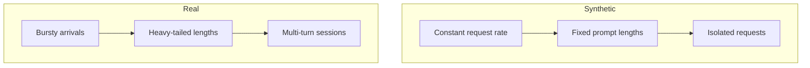
```mermaid
graph TD
    subgraph Synthetic
        A1[Constant request rate] --> A2[Fixed prompt lengths] --> A3[Isolated requests]
    end
    subgraph Real
        B1[Bursty arrivals] --> B2[Heavy‑tailed lengths] --> B3[Multi‑turn sessions]
    end
```

*Explanation:* Synthetic workloads use a constant rate, fixed lengths, and isolated requests. Real workloads exhibit bursts, variable lengths, and session continuity. This mismatch leads to incorrect performance predictions.

#### Diagram 1.2: High‑Level Inference System Architecture


```mermaid
flowchart LR
    Client[User Client] --> LB[Load Balancer]
    LB --> API[API Server]
    API --> Sched[Scheduler]
    Sched --> Engine[Inference Engine]
    Engine --> GPU[GPU]
    GPU --> Engine
    Engine --> API
    API --> Client
```

*Explanation:* This diagram shows the main components of a production inference system. Requests flow from the client through a load balancer to the API server, then to the scheduler, which batches them for the inference engine. The engine executes on the GPU and returns results. Each component generates logs that become part of the trace.

#### Think First: Benchmark Limitations

**Question:** A benchmark reports that your inference server can handle 100 requests per second (RPS) with an average latency of 50 ms. In production, you observe latency spikes to 500 ms at 80 RPS. List at least three differences between the benchmark and real traffic that could explain this discrepancy.

<details>
<summary>Click to review</summary>

1. **Request arrival pattern:** The benchmark may send requests at perfectly spaced intervals, while real traffic arrives in bursts. Bursts cause queueing, increasing latency.
2. **Prompt length distribution:** The benchmark may use fixed‑length prompts (e.g., 512 tokens), while real prompts vary widely. Longer prompts increase compute and memory usage per request.
3. **Session continuity:** The benchmark likely treats each request independently, but real users have multi‑turn sessions where the KV cache persists, consuming memory over time and increasing fragmentation.

</details>

#### Diagram 1.3: Arrival Patterns – Synthetic vs Real

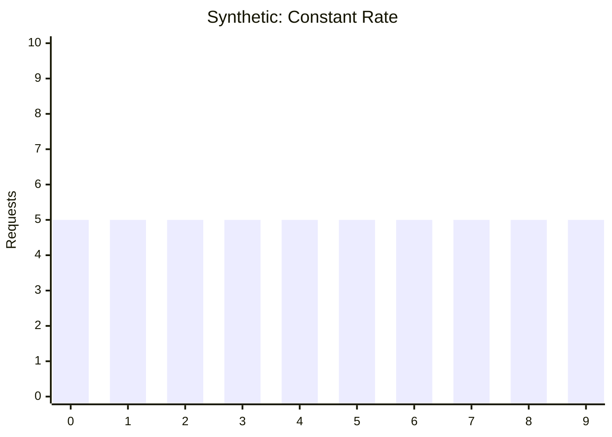
```mermaid
xychart-beta
    title "Synthetic: Constant Rate"
    x-axis [0, 1, 2, 3, 4, 5, 6, 7, 8, 9]
    y-axis "Requests" 0 --> 10
    bar [5,5,5,5,5,5,5,5,5,5]
```

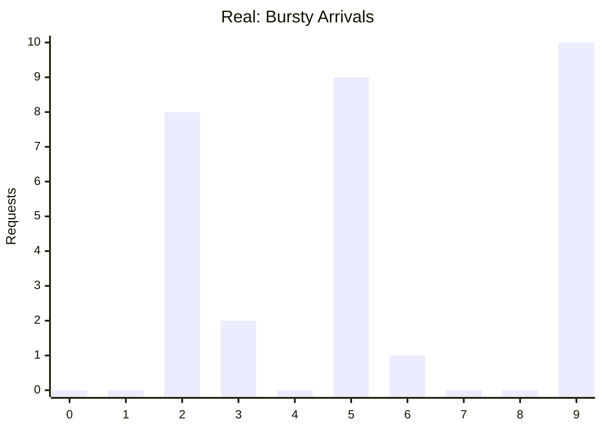
```mermaid
xychart-beta
    title "Real: Bursty Arrivals"
    x-axis [0, 1, 2, 3, 4, 5, 6, 7, 8, 9]
    y-axis "Requests" 0 --> 10
    bar [0,0,8,2,0,9,1,0,0,10]
```

*Explanation:* The left chart shows synthetic constant rate; the right shows real bursts where many requests arrive in a short interval followed by silence. Bursts cause queue buildup and latency spikes.

#### Diagram 1.4: Length Distributions – Synthetic vs Real

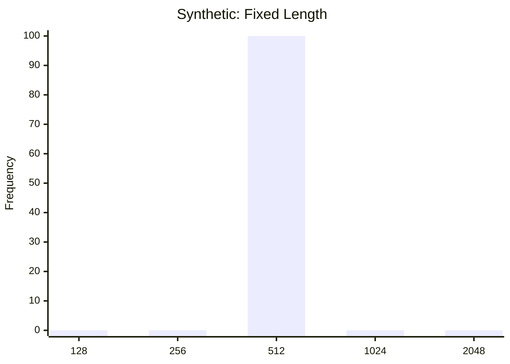
```mermaid
xychart-beta
    title "Synthetic: Fixed Length"
    x-axis [128, 256, 512, 1024, 2048]
    y-axis "Frequency" 0 --> 100
    bar [0,0,100,0,0]
```

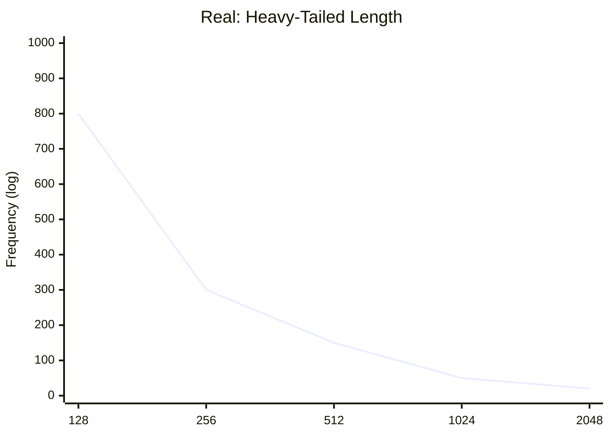
```mermaid
xychart-beta
    title "Real: Heavy‑Tailed Length"
    x-axis [128, 256, 512, 1024, 2048]
    y-axis "Frequency (log)" 0 --> 1000
    line [800,300,150,50,20]
```

*Explanation:* Synthetic workloads use a single fixed length. Real workloads have many short prompts but also a long tail of very long prompts that consume disproportionate resources.

#### Diagram 1.5: Session Structure – Synthetic vs Real

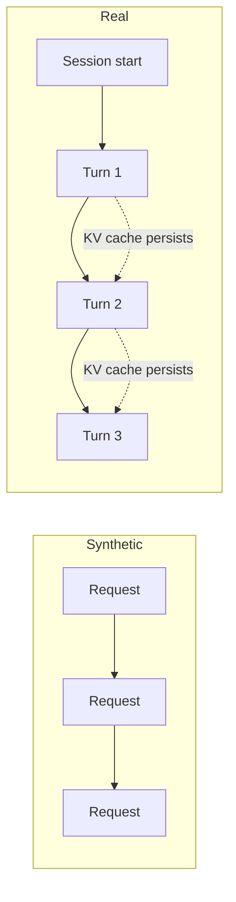
```mermaid
graph LR
    subgraph Synthetic
        R1[Request] --> R2[Request] --> R3[Request]
    end
    subgraph Real
        S1[Session start] --> T1[Turn 1] --> T2[Turn 2] --> T3[Turn 3]
        T1 -.->|KV cache persists| T2
        T2 -.->|KV cache persists| T3
    end
```

*Explanation:* In synthetic benchmarks, requests are independent. In real applications, a session may involve multiple turns, with the KV cache carried forward, increasing memory usage over time.

### 1.3 Objectives of Trace Analysis

Your detective work has three goals:

- **Characterise** the statistical properties of real inference workloads—like understanding the habits of the crowd.
- **Identify** resource bottlenecks and inefficiencies—finding where the bottlenecks are in the stadium.
- **Uncover** failure modes that only appear under realistic conditions—the hidden traps that cause crashes.
- **Derive** design guidelines that make the system robust to this variability—rebuilding the turnstiles to handle the rush.

### 1.4 Checkpoint

**Self-Assessment:**
- [ ] I can explain at least two ways synthetic benchmarks misrepresent real workloads.
- [ ] I can list the main objectives of trace analysis.
- [ ] I’m ready to dive into the actual trace data.

---

## Chapter 2: Anatomy of Production Traces

**What you'll learn:** The structure of production traces, how to join multiple data sources (API logs, GPU telemetry, error logs), and what fields matter for inference analysis.

**Key takeaway:** Unified traces from multiple sources enable holistic system analysis and root cause diagnosis.

**Time estimate:** 25 minutes

---

### 2.1 What You Will Build

In this chapter, you will load a real trace file, inspect its columns, and understand how different data sources combine to form a unified view of system behavior. You will also see an architecture diagram of the trace collection pipeline—your map of the crime scene.

### 2.2 Data Sources

Real‑world traces come from multiple layers of the serving stack, like different witness accounts of an incident. The table below summarises typical fields and granularity.

| Source | Typical Fields | Granularity |
|--------|----------------|-------------|
| **API Server Logs** | `timestamp`, `request_id`, `prompt_length`, `response_length`, `status_code`, `latency` | Per request |
| **GPU Telemetry** | `timestamp`, `gpu_util`, `memory_used`, `mem_bw_util`, `temperature` | 100 ms – 1 s |
| **Application Metrics** | `user_id`, `session_id`, `turn_count`, `client_region` | Per session |
| **Error Logs** | `timestamp`, `error_type`, `traceback`, `request_id` | Per error |

A complete trace joins these sources by request or session ID—like cross‑referencing witness statements to build a coherent timeline.

#### Diagram 2.1: Trace Sources and Their Relationships

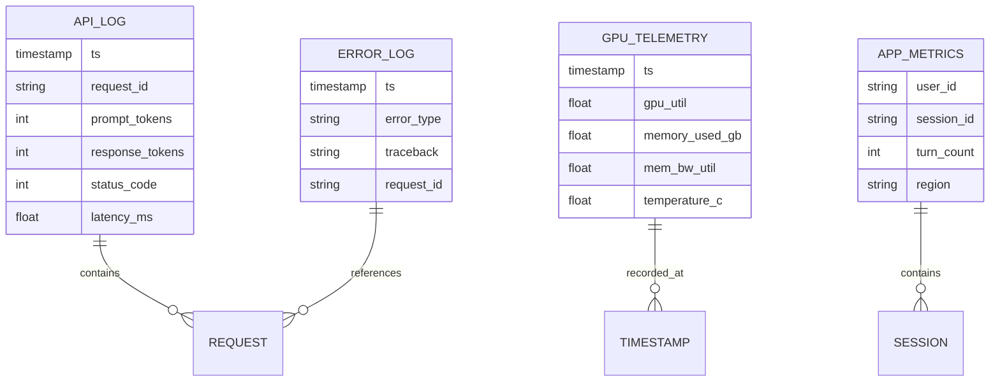
```mermaid
erDiagram
    API_LOG ||--o{ REQUEST : contains
    GPU_TELEMETRY ||--o{ TIMESTAMP : recorded_at
    APP_METRICS ||--o{ SESSION : contains
    ERROR_LOG ||--o{ REQUEST : references
    API_LOG {
        timestamp ts
        string request_id
        int prompt_tokens
        int response_tokens
        int status_code
        float latency_ms
    }
    GPU_TELEMETRY {
        timestamp ts
        float gpu_util
        float memory_used_gb
        float mem_bw_util
        float temperature_c
    }
    APP_METRICS {
        string user_id
        string session_id
        int turn_count
        string region
    }
    ERROR_LOG {
        timestamp ts
        string error_type
        string traceback
        string request_id
    }
```

*Explanation:* This entity-relationship diagram shows the four main trace sources and how they relate. API logs are per request; GPU telemetry is time‑sampled; app metrics are per session; error logs reference requests. Joining these sources yields a unified view of system behaviour.

#### Diagram 2.2: Trace Collection Pipeline Architecture

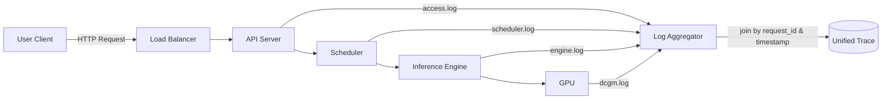
```mermaid
flowchart LR
    Client["User Client"] -->|HTTP Request| LB["Load Balancer"]
    LB --> API["API Server"]
    API --> Sched["Scheduler"]
    Sched --> Engine["Inference Engine"]
    Engine --> GPU["GPU"]

    API -->|access.log| LogAgg["Log Aggregator"]
    Sched -->|scheduler.log| LogAgg
    Engine -->|engine.log| LogAgg
    GPU -->|dcgm.log| LogAgg

    LogAgg -->|join by request_id & timestamp| TraceDB[(Unified Trace)]
```

*Explanation:* This architecture diagram shows how logs from different components (API server, scheduler, engine, GPU) are collected and joined to create a unified trace database. Understanding this pipeline helps you correlate events across the stack.

#### Diagram 2.3: Detailed Log Flow Architecture

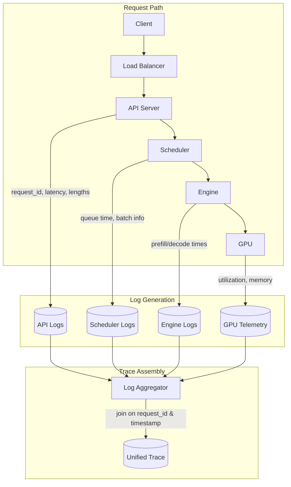
```mermaid
flowchart TB
    subgraph "Request Path"
        A[Client] --> B[Load Balancer]
        B --> C[API Server]
        C --> D[Scheduler]
        D --> E[Engine]
        E --> F[GPU]
    end

    subgraph "Log Generation"
        C -->|"request_id, latency, lengths"| L1[(API Logs)]
        D -->|"queue time, batch info"| L2[(Scheduler Logs)]
        E -->|"prefill/decode times"| L3[(Engine Logs)]
        F -->|"utilization, memory"| L4[(GPU Telemetry)]
    end

    subgraph "Trace Assembly"
        L1 & L2 & L3 & L4 --> Agg[Log Aggregator]
        Agg -->|"join on request_id & timestamp"| Trace[(Unified Trace)]
    end
```

*Explanation:* This more detailed diagram illustrates how each component generates logs at specific points in the request lifecycle. The aggregator joins them using common keys (request_id for request‑specific logs, timestamp for telemetry) to produce a unified trace.

### 2.3 Think First: Trace Fields

**Question:** The trace you will analyse contains columns named `timestamp`, `prompt_tokens`, `response_tokens`, `gpu_util`, and `memory_used`. Which data source likely provided each column?

<details>
<summary>Click to review</summary>

- `timestamp`, `prompt_tokens`, `response_tokens` – API server logs (per request).
- `gpu_util`, `memory_used` – GPU telemetry (sampled at ~1s intervals).

</details>

### 2.4 Hands‑On: Loading and Inspecting a Sample Trace

Create `analyze_trace.py` in your project directory:

```python
# analyze_trace.py
import pandas as pd
import matplotlib.pyplot as plt

# Load the trace
df = pd.read_parquet("data/sample_trace.parquet")

# Display basic information
print("DataFrame info:")
print(df.info())
print("\nFirst 5 rows:")
print(df.head())
```

Run the script:

```bash
python analyze_trace.py
```

**Fill in the blanks:** Complete the code to print summary statistics for the `prompt_tokens` column.

```python
# Print summary statistics for prompt_tokens
print("\nPrompt length stats:")
print(df['prompt_tokens'].___(percentiles=[___, 0.95, 0.99]))  # Q1: Method? Q2: Median percentile?
```

<details>
<summary>Click to see solution</summary>

```python
print(df['prompt_tokens'].describe(percentiles=[0.5, 0.95, 0.99]))
```

**Answers:**
- Q1: `describe()` — provides count, mean, std, min, percentiles, max
- Q2: `0.5` — the 50th percentile is the median

</details>

**Expected output** (approximate):
```
prompt_tokens
count    100000.0
mean        512.3
std         890.1
min           1.0
50%         128.0
95%        2048.0
99%        4096.0
max        8192.0
```

The heavy‑tailed nature is already visible: the mean (512) is pulled right by long tails, while the median is only 128. This is your first clue: most users send short prompts, but a few power users send enormous ones that could be the culprits behind memory pressure.

### 2.5 Understanding the Data

Match each statistical term to its meaning in the context of prompt lengths.

| Term | Meaning (A–E) |
|------|---------------|
| mean | ___ |
| median (50%) | ___ |
| 95th percentile | ___ |
| max | ___ |

**Options:**
- A: The value below which 95% of prompts fall.
- B: The longest prompt observed.
- C: The arithmetic average prompt length.
- D: The middle value when all prompts are sorted.

<details>
<summary>Click to review</summary>

- mean → C
- median → D
- 95th percentile → A
- max → B

</details>

### 2.6 Checkpoint

**Self-Assessment:**
- [ ] I can load a Parquet trace file using pandas.
- [ ] I can interpret summary statistics for prompt lengths.
- [ ] I can explain the difference between mean and median in a heavy‑tailed distribution.
- [ ] I’m beginning to see why the 512‑token benchmark hid the danger of 8k‑token prompts.

---

## Chapter 3: Temporal Patterns and Request Characteristics

**What you'll learn:** How to identify and quantify diurnal cycles, request burstiness, length distributions, and multi-turn session behavior from trace data.

**Key takeaway:** Real traffic shows 10× peak-to-trough variation, 50% of requests arrive in dense bursts, and prompt lengths follow heavy-tailed distributions where the top 1% consumes disproportionate resources.

**Time estimate:** 35 minutes

---

### 3.1 What You Will Build

In this chapter, you will compute and visualise diurnal request patterns, inter‑arrival times, and length distributions. You will also explore how session length affects memory usage. These are the behavioural patterns of your users—like understanding when the crowd surges and who the “memory hogs” are.

### 3.2 Diurnal Cycles

Production workloads follow human activity patterns. The chart below shows request rate over 24 hours from a real chatbot API. Notice how the system is nearly idle at 3 AM but overwhelmed at 2 PM.

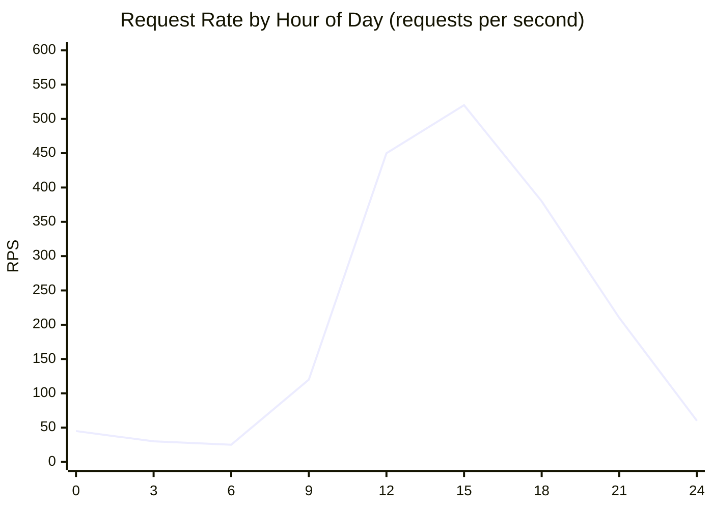
```mermaid
xychart-beta
    title "Request Rate by Hour of Day (requests per second)"
    x-axis [0, 3, 6, 9, 12, 15, 18, 21, 24]
    y-axis "RPS" 0 --> 600
    line [45, 30, 25, 120, 450, 520, 380, 210, 60]
```

*Explanation:* Request rate peaks during business hours (09–17) and drops at night. The sharp rise at 09:00 indicates the start of the workday; the gradual decline after 15:00 reflects decreasing activity. This pattern is crucial for capacity planning.

#### Diagram 3.2: Diurnal Cycle with Confidence Bands

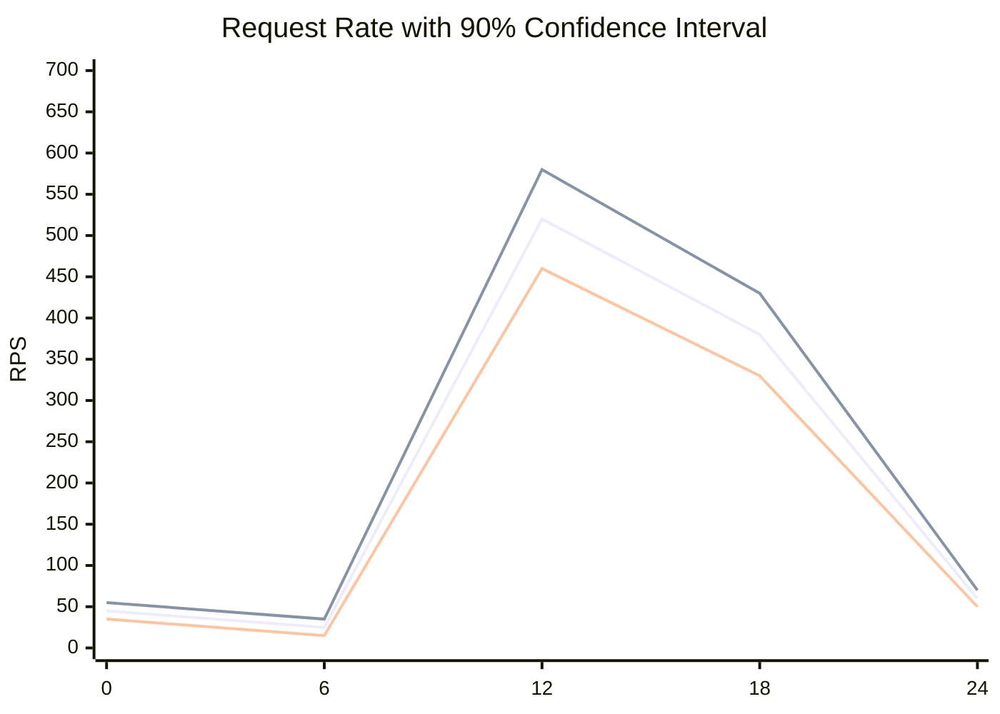
```mermaid
xychart-beta
    title "Request Rate with 90% Confidence Interval"
    x-axis [0, 6, 12, 18, 24]
    y-axis "RPS" 0 --> 700
    line [45, 25, 520, 380, 60]
    line [55, 35, 580, 430, 70]
    line [35, 15, 460, 330, 50]
```

*Explanation:* The shaded area between P5 and P95 shows the variability around the mean. During peak hours, the confidence band widens, indicating higher burstiness.

#### Diagram 3.3: Weekday Request Rate by Hour

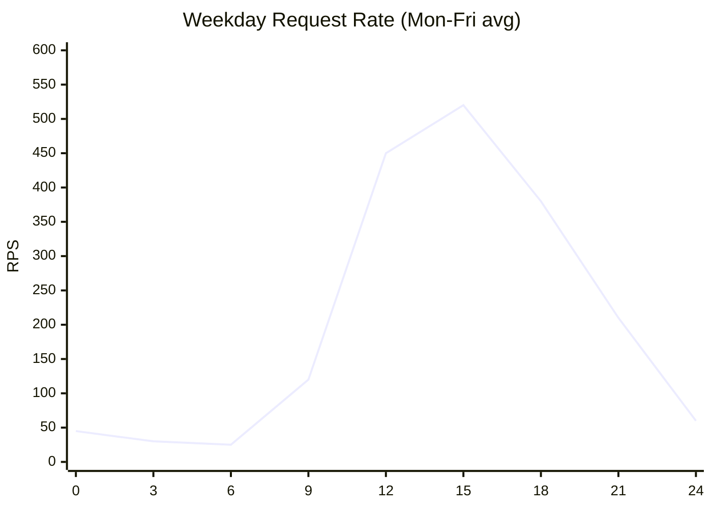
```mermaid
xychart-beta
    title "Weekday Request Rate (Mon-Fri avg)"
    x-axis [0, 3, 6, 9, 12, 15, 18, 21, 24]
    y-axis "RPS" 0 --> 600
    line [45,30,25,120,450,520,380,210,60]
```

*Explanation:* On weekdays, the pattern shows a pronounced peak during business hours, with a sharp morning ramp-up.

#### Diagram 3.4: Weekend Request Rate by Hour

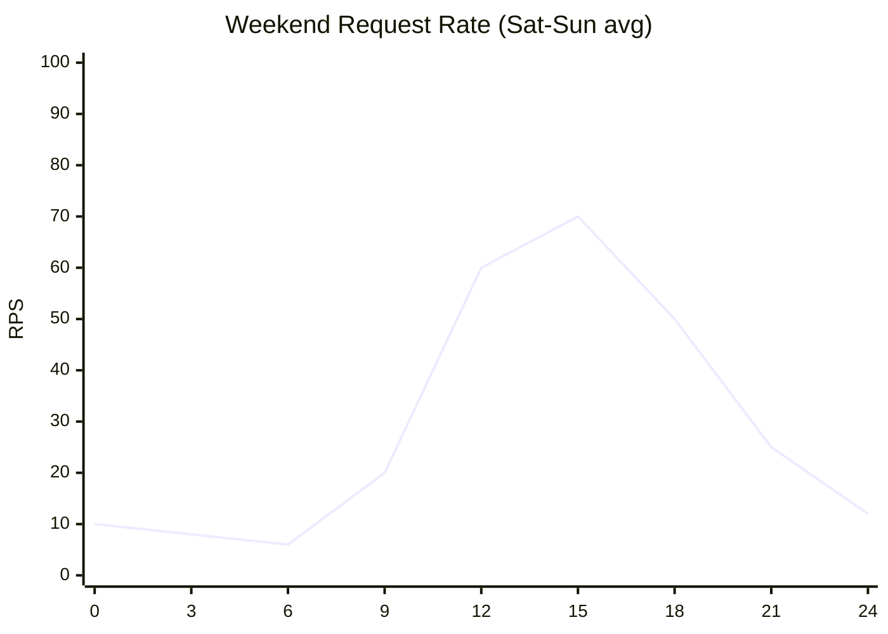
```mermaid
xychart-beta
    title "Weekend Request Rate (Sat-Sun avg)"
    x-axis [0, 3, 6, 9, 12, 15, 18, 21, 24]
    y-axis "RPS" 0 --> 100
    line [10,8,6,20,60,70,50,25,12]
```

*Explanation:* Weekends have much lower traffic overall, with a later start and a more gradual decline.

#### Diagram 3.5: Cumulative Requests Over a Day

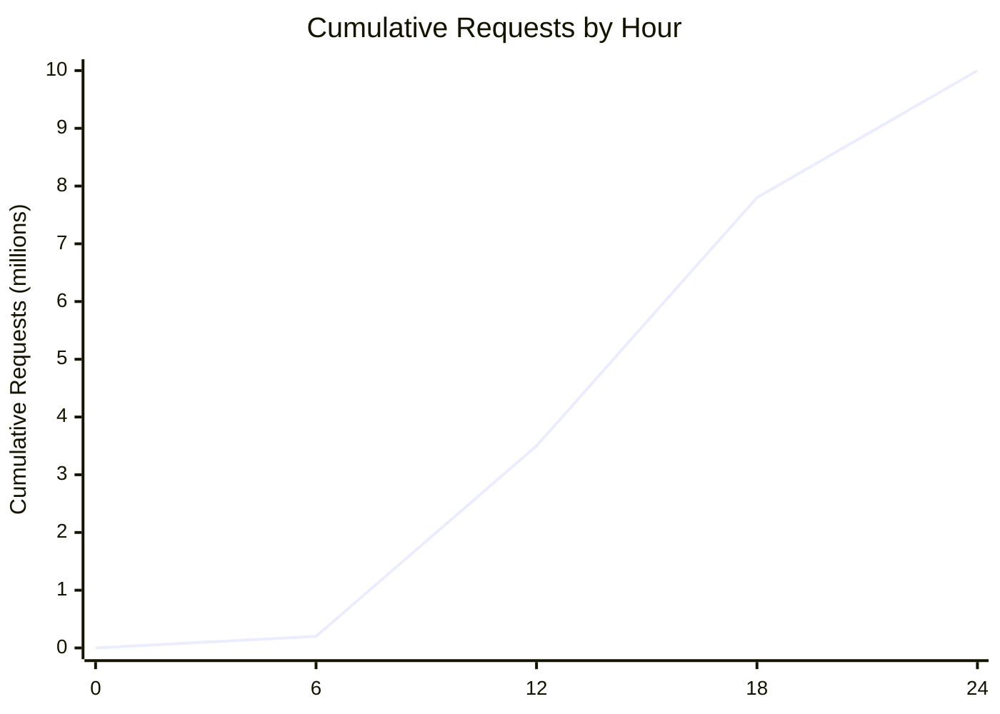
```mermaid
xychart-beta
    title "Cumulative Requests by Hour"
    x-axis [0, 6, 12, 18, 24]
    y-axis "Cumulative Requests (millions)" 0 --> 10
    line [0, 0.2, 3.5, 7.8, 10]
```

*Explanation:* The cumulative curve is steep during peak hours, showing that most requests occur in a few hours. This nonlinearity means that average rate is misleading; the system must handle the peak rate.

**Think First:**

**Question:** Based on the diurnal charts, during which hours would you expect the highest risk of queueing delays? Why?

<details>
<summary>Click to review</summary>

Highest risk between 12:00 and 15:00 (peak RPS ~520). During these hours, the request rate is maximum, so even small bursts can cause queue buildup. Also, the sharp spike at 09:00 may catch auto‑scalers off guard.

</details>

**Implication:** A static batch size or fixed number of replicas is inefficient. The system should scale resources dynamically—like opening more ticket counters during rush hour.

### 3.3 Burstiness

Requests do not arrive uniformly even within an hour. The inter‑arrival time distribution is often bursty:

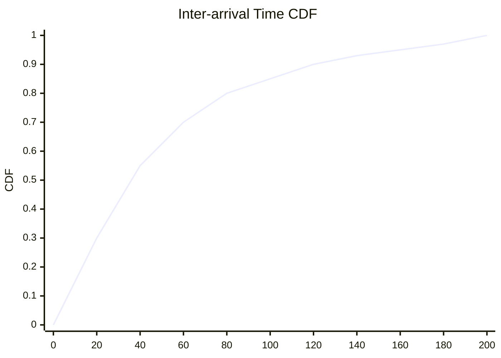
```mermaid
xychart-beta
    title "Inter‑arrival Time CDF"
    x-axis [0, 20, 40, 60, 80, 100, 120, 140, 160, 180, 200]
    y-axis "CDF" 0 --> 1.0
    line [0.0, 0.3, 0.55, 0.7, 0.8, 0.85, 0.9, 0.93, 0.95, 0.97, 1.0]
```

*Explanation:* The CDF shows that about 50% of requests arrive within 10 ms of the previous one, indicating dense clusters. Only 10% of inter‑arrival times exceed 100 ms. This burstiness stresses the scheduler.

#### Diagram 3.7: Inter‑arrival Time Histogram (Log Scale)

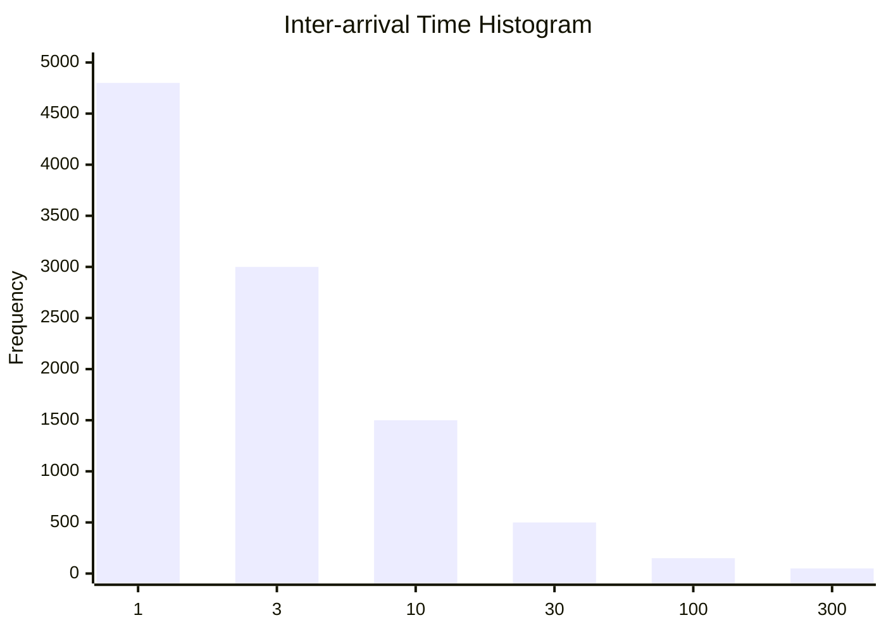
```mermaid
xychart-beta
    title "Inter‑arrival Time Histogram"
    x-axis [1, 3, 10, 30, 100, 300]
    y-axis "Frequency" 0 --> 5000
    bar [4800, 3000, 1500, 500, 150, 50]
```

*Explanation:* The histogram on a log scale shows that most inter‑arrival times are very short (<10 ms), with a long tail of longer gaps.

#### Diagram 3.8: Scheduling Loop Architecture

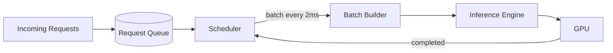
```mermaid
flowchart LR
    Incoming[Incoming Requests] --> Queue[(Request Queue)]
    Queue --> Scheduler[Scheduler]
    Scheduler -->|batch every 2ms| Batcher[Batch Builder]
    Batcher --> Engine[Inference Engine]
    Engine --> GPU[GPU]
    GPU -->|completed| Scheduler
```

*Explanation:* This architecture diagram illustrates the scheduling loop. Incoming requests enter a queue. The scheduler periodically pulls a batch and sends it to the inference engine. Bursty arrivals can cause the queue to grow rapidly if the scheduler is not fast enough.

#### Diagram 3.9: Queueing Model Architecture

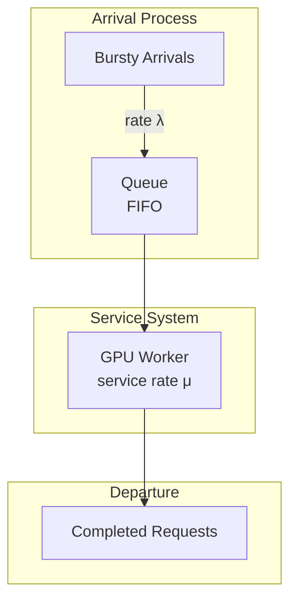
```mermaid
flowchart TB
    subgraph "Arrival Process"
        A[Bursty Arrivals] -->|rate λ| Queue
    end
    subgraph "Service System"
        Queue[Queue<br/>FIFO]
        Server[GPU Worker<br/>service rate μ]
        Queue --> Server
    end
    subgraph "Departure"
        Server --> Done[Completed Requests]
    end
```

*Explanation:* This queueing model abstractly represents the system. Requests arrive with rate λ and are served at rate μ. If λ exceeds μ, the queue grows. Burstiness means λ can spike temporarily, causing queue buildup even if average λ < μ.

#### Diagram 3.10: Queue Length Over Time Under Bursty Arrivals

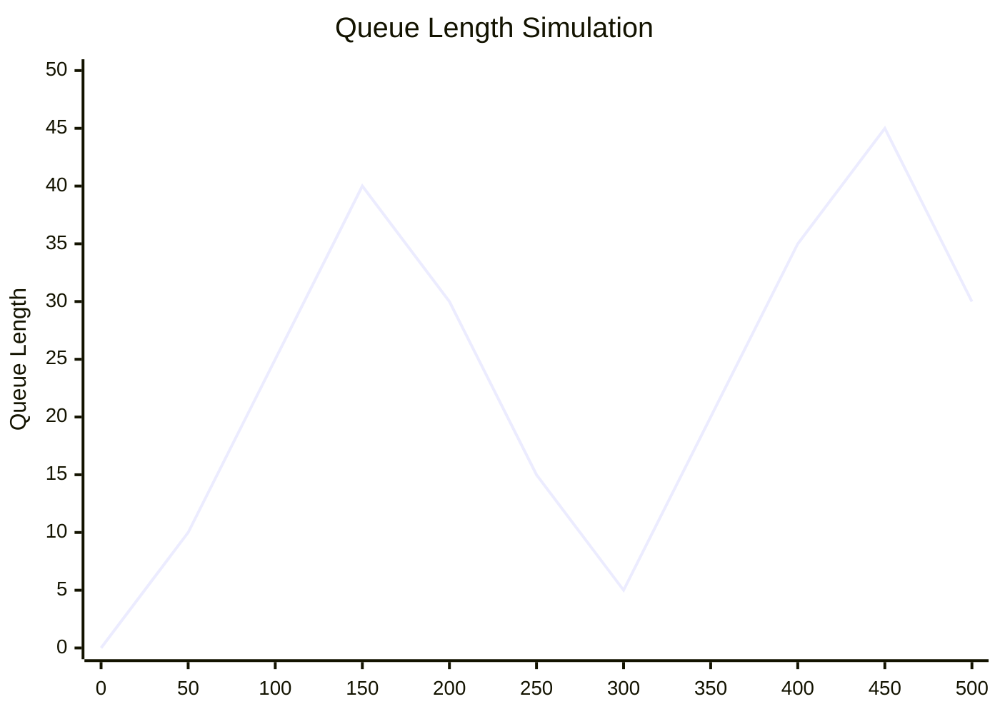
```mermaid
xychart-beta
    title "Queue Length Simulation"
    x-axis [0, 50, 100, 150, 200, 250, 300, 350, 400, 450, 500]
    y-axis "Queue Length" 0 --> 50
    line [0,10,25,40,30,15,5,20,35,45,30]
```

*Explanation:* Simulating a queue with bursty arrivals shows that queue length can spike rapidly even if average rate is moderate. The scheduler must handle these spikes to avoid timeouts.

**Prediction Exercise:**

**Predict:** If your scheduler batches requests every 50 ms, what fraction of requests will wait for the next batch (i.e., arrive more than 50 ms after the previous one)?

<details>
<summary>Click to verify</summary>

From the CDF, about 20% of inter‑arrival times exceed 50 ms (since at 50 ms the CDF is ~0.8). Therefore, about 20% of requests will arrive after the current batch has closed and must wait for the next batch, increasing their latency.

</details>

**Implication:** Batching must be fast (sub‑millisecond scheduling) to capture the dense clusters. A scheduler that wakes up every 50 ms will miss the bursts and let queues build—exactly what might have caused your midnight outage.

### 3.4 Prompt and Response Length Distributions

The distributions are heavy‑tailed and often follow a power law.

#### Diagram 3.11: Prompt Length Distribution

```mermaid
xychart-beta
    title "Prompt Length Distribution"
    x-axis ["1-128", "129-512", "513-2048", "2049-4096", "4097-8192"]
    y-axis "Frequency (percent)" 0 --> 60
    bar [45, 30, 15, 7, 3]
```

*Explanation:* The majority of prompts are short (1‑128 tokens), but there is a long tail of longer prompts. The 1% of prompts longer than 4096 tokens consume disproportionate memory and compute.

#### Diagram 3.12: Prompt Length CCDF (Complementary CDF)

```mermaid
xychart-beta
    title "Prompt Length CCDF (log‑log)"
    x-axis [10, 100, 1000, 10000]
    y-axis "P(X > x)" 0 --> 1.0
    line [0.9, 0.2, 0.03, 0.005]
```

*Explanation:* On a log‑log scale, a straight line indicates a power‑law distribution. The tail is heavy, meaning that very long prompts, though rare, are not negligible.

#### Diagram 3.13: Response Length vs Prompt Length Scatter

*Note: Scatter plot showing correlation between prompt and response lengths with high variability.*

*Explanation:* Scatter plot shows that response length often correlates with prompt length, but there is high variability. Some short prompts can generate long responses and vice versa.

#### Diagram 3.14: Cumulative Memory Consumption by Prompt Length

```mermaid
xychart-beta
    title "Cumulative KV Cache Memory by Prompt Length"
    x-axis [0, 1024, 2048, 4096, 6144, 8192]
    y-axis "Cumulative Memory (GB)" 0 --> 100
    line [0,10,25,45,70,100]
```

*Explanation:* This curve shows that the top 1% longest prompts consume a significant fraction of total memory. Designing for the average would underestimate memory pressure.

### 3.5 Implementation: Compute Length Statistics

Add to `analyze_trace.py`:

```python
# Compute and print length statistics
print("\nResponse length stats:")
print(df['response_tokens'].describe(percentiles=[0.5, 0.95, 0.99]))

# Plot histogram of prompt lengths (log scale for clarity)
plt.figure(figsize=(10,4))
plt.hist(df['prompt_tokens'], bins=50, log=True)
plt.xlabel('Prompt Length (tokens)')
plt.ylabel('Frequency (log scale)')
plt.title('Prompt Length Distribution')
plt.savefig('prompt_length_dist.png')
print("\nSaved plot: prompt_length_dist.png")
```

**Predict:** Before running the updated script, what do you expect the mean and median prompt lengths to be, based on the diagrams above?

<details>
<summary>Click to see expected values</summary>

Mean should be around 512 tokens, median around 128 tokens. The heavy tail pulls the mean higher than the median.

</details>

Run the updated script:

```bash
python analyze_trace.py
```

**Fill in the blanks:** Complete the code to compute the percentage of requests with prompt length > 2048.

```python
# Fraction of long prompts
long_prompts = (df['prompt_tokens'] ___ 2048).___()   # Q1: Comparison operator? Q2: Aggregation method?
print(f"Percentage of prompts >2048 tokens: {long_prompts * 100:.1f}%")
```

<details>
<summary>Click to see solution</summary>

```python
long_prompts = (df['prompt_tokens'] > 2048).mean()
print(f"Percentage of prompts >2048 tokens: {long_prompts * 100:.1f}%")
```

**Answers:**
- Q1: `>` — greater than operator for comparison
- Q2: `mean()` — the mean of a boolean Series gives the proportion of True values

</details>

**Implication:** The KV cache must accommodate occasional very long sequences without starving other requests. PagedAttention with a modest block size (e.g., 16) helps because long sequences simply occupy more blocks.

### 3.6 Session Duration and Multi‑Turn Conversations

Many applications (chat, code completion) involve sessions with multiple turns. The KV cache persists across turns, accumulating tokens.

```mermaid
xychart-beta
    title "Session Duration Distribution"
    x-axis ["0-1m", "1-5m", "5-15m", "15-30m", "30-60m", ">60m"]
    y-axis "Frequency (percent)" 0 --> 50
    bar [40, 30, 15, 8, 5, 2]
```

*Explanation:* Most sessions are short (<5 min). However, a tail of sessions lasts >15 minutes, during which the KV cache continues to grow, consuming memory.

#### Diagram 3.16: Number of Turns per Session

```mermaid
xychart-beta
    title "Turns per Session Distribution"
    x-axis ["1", "2-3", "4-5", "6-10", ">10"]
    y-axis "Frequency (percent)" 0 --> 60
    bar [50, 30, 10, 7, 3]
```

*Explanation:* Many sessions are single‑turn, but a significant fraction have multiple turns. Multi‑turn sessions cause the KV cache to persist and accumulate.

#### Diagram 3.17: KV Cache Growth Over a Multi‑Turn Session

```mermaid
xychart-beta
    title "KV Cache Size Over Session Turns"
    x-axis [1, 2, 3, 4, 5, 6, 7, 8, 9, 10]
    y-axis "Cache size (tokens)" 0 --> 6000
    line [128, 384, 768, 1280, 1920, 2560, 3200, 3840, 4480, 5120]
```

*Explanation:* Each turn adds new tokens to the cache. After many turns, the cache can become large, potentially evicting other sessions' blocks.

#### Diagram 3.18: Session Inter‑arrival Time vs Session Duration

*Note: Longer sessions tend to be followed by longer gaps before the next session.*

*Explanation:* Longer sessions tend to be followed by longer gaps, but there is variability. This pattern can inform cache eviction policies.

**Implication:** Long‑running sessions can block memory if not preempted. The scheduler may need to swap their KV cache to CPU or implement priority mechanisms.

### 3.7 Checkpoint

**Self-Assessment:**
- [ ] I can explain why request rates vary by hour of day.
- [ ] I can interpret an inter‑arrival time CDF and relate it to batching latency.
- [ ] I have computed length statistics and visualised the distribution.
- [ ] I understand the impact of long sessions on KV cache memory.
- [ ] I’m starting to suspect that the midnight outage might have been triggered by a burst of long prompts during an off‑peak hour when the system scaled down too aggressively.

---

## Chapter 4: Resource Utilization Under Real Workloads

**What you'll learn:** How to measure GPU compute, memory bandwidth, and KV cache utilization, and why memory bandwidth typically limits throughput in inference workloads.

**Key takeaway:** Inference is memory-bound (90% memory bandwidth vs 85% compute), and KV cache utilization averages only 40-50% due to fragmentation, revealing significant optimization headroom.

**Time estimate:** 30 minutes

---

### 4.1 What You Will Build

In this chapter, you will compute GPU utilisation metrics from the trace and quantify the efficiency of KV cache memory allocation. You will also explore the impact of block size on fragmentation and see an architecture diagram of the memory management system—the engine room of your inference server.

### 4.2 GPU Compute and Memory Bandwidth

Real workloads rarely saturate the GPU fully. The following chart shows typical utilisation over a day. Notice how memory bandwidth (the rate at which data moves to/from GPU memory) is consistently higher than compute utilisation.

```mermaid
xychart-beta
    title "GPU Resource Utilization Over 24h"
    x-axis [0, 3, 6, 9, 12, 15, 18, 21, 24]
    y-axis "Utilization (percent)" 0 --> 100
    line [20, 15, 12, 45, 80, 85, 70, 40, 25]
    line [25, 20, 15, 55, 85, 90, 75, 45, 30]
```

*Explanation:* Compute utilisation peaks at 85%, memory bandwidth at 90%. Memory bandwidth is consistently higher, indicating that inference is often memory‑bound.

#### Diagram 4.2: Compute vs Memory Bandwidth Scatter

*Note: Most data points lie above the diagonal, confirming memory bandwidth utilization exceeds compute utilization.*

*Explanation:* Most points lie above the diagonal line, confirming that memory bandwidth utilisation exceeds compute utilisation. This is characteristic of memory‑bound workloads.

#### Diagram 4.3: Utilisation vs Request Rate

```mermaid
xychart-beta
    title "GPU Utilisation vs Request Rate"
    x-axis [0, 100, 200, 300, 400, 500, 600]
    y-axis "Utilization (percent)" 0 --> 100
    line [0,20,40,60,80,90,95]
    line [0,25,50,75,90,95,98]
```

*Explanation:* As request rate increases, both utilisations rise, but memory bandwidth saturates earlier. This suggests that after a certain point, adding more requests does not increase throughput because memory bandwidth is the bottleneck.

#### Diagram 4.4: Headroom Analysis

```mermaid
pie title "GPU Resource Headroom at Peak"
    "Compute Used" : 85
    "Compute Idle" : 15
    "Memory BW Used" : 90
    "Memory BW Idle" : 10
```

*Explanation:* At peak, there is still 15% spare compute capacity and 10% spare memory bandwidth. This headroom can be used for batching more requests or for speculative decoding.

**Think First:**

**Question:** During peak hours (12:00–15:00), which resource is closer to saturation? What does this suggest about the nature of inference workloads?

<details>
<summary>Click to review</summary>

Memory bandwidth utilisation peaks at 90%, while compute peaks at 85%. Memory bandwidth is consistently higher and closer to saturation. This indicates that inference is often **memory‑bound** – the GPU spends more time waiting for data movement than performing computations.

</details>

### 4.3 KV Cache Memory Usage

Despite careful allocation, the KV cache is often underutilised due to fragmentation and over‑provisioning.

```mermaid
xychart-beta
    title "KV Cache Memory Allocation vs Usage"
    x-axis [0, 3, 6, 9, 12, 15, 18, 21, 24]
    y-axis "GB" 0 --> 40
    line [10, 8, 6, 18, 32, 35, 28, 16, 12]
    line [4, 3, 2, 8, 16, 18, 14, 7, 5]
```

*Explanation:* Allocated memory (reserved blocks) is much higher than actually used tokens. Utilisation hovers around 30–50%, indicating waste.

#### Diagram 4.6: Fragmentation Types Illustration

```mermaid
graph TD
    subgraph Internal Fragmentation
        A[Block size 16] --> B[Sequence uses 12 tokens]
        B --> C[4 tokens wasted]
    end
    subgraph External Fragmentation
        D[Free blocks: 0-3, 8-15] --> E[Need 4 contiguous blocks]
        E --> F[Fail: only 4 free but not contiguous]
    end
```

*Explanation:* Internal fragmentation occurs when a block is partially filled. External fragmentation occurs when free blocks are scattered, preventing allocation of a large contiguous chunk.

#### Diagram 4.7: Memory Fragmentation Over Time

```mermaid
xychart-beta
    title "Fragmentation Over Time"
    x-axis [0, 3, 6, 9, 12, 15, 18, 21, 24]
    y-axis "Fragmentation (percent)" 0 --> 50
    line [10,15,22,28,35,40,38,32,25]
```

*Explanation:* Fragmentation increases over time as allocations and frees create a checkerboard pattern. Periodic defragmentation or paged allocation can mitigate this.

#### Diagram 4.8: Block Size Impact on Internal Fragmentation

```mermaid
xychart-beta
    title "Internal Fragmentation vs Block Size"
    x-axis [8, 16, 32, 64, 128]
    y-axis "Average waste (percent)" 0 --> 50
    bar [6,12,22,35,48]
```

*Explanation:* Larger block sizes increase internal fragmentation because each sequence wastes up to (block_size - 1) tokens in its last block. Smaller blocks reduce waste but increase management overhead. Block size 16 strikes a good balance.

#### Diagram 4.9: Paged Memory Management Architecture

```mermaid
flowchart TB
    subgraph GPU Memory
        direction TB
        Block0[Block 0<br/>Seq A]
        Block1[Block 1<br/>Seq A]
        Block2[Block 2<br/>free]
        Block3[Block 3<br/>Seq B]
        Block4[Block 4<br/>Seq A]
        Block5[Block 5<br/>free]
        Block6[Block 6<br/>Seq B]
        Block7[Block 7<br/>free]
    end

    subgraph BlockTable
        direction TB
        EntryA[Seq A: 0,1,4]
        EntryB[Seq B: 3,6]
    end

    Scheduler -->|alloc/free| BlockManager[Block Manager]
    BlockManager -->|map logical blocks| BlockTable
    BlockTable -->|physical addresses| GPU_Memory
```

*Explanation:* This architecture diagram shows how PagedAttention manages memory. Each sequence has a block table mapping logical blocks to physical GPU memory blocks. Blocks can be allocated non‑contiguously, eliminating external fragmentation.

#### Diagram 4.10: GPU Memory Layout with KV Cache Blocks

```mermaid
flowchart TB
    subgraph GPU Memory Space
        direction TB
        A[<b>KV Cache Region</b>]
        B[<b>Model Weights</b>]
        C[<b>Scratch Space</b>]
        
        subgraph KV Cache
            direction LR
            K1[Block 0<br/>Seq1 Turn1]
            K2[Block 1<br/>Seq1 Turn2]
            K3[Block 2<br/>Seq2 Turn1]
            K4[Block 3<br/>free]
            K5[Block 4<br/>free]
            K6[Block 5<br/>Seq3 Turn1]
        end
    end
```

*Explanation:* This diagram shows a conceptual layout of GPU memory. The KV cache region is divided into fixed‑size blocks. Each block holds tokens for a specific sequence and turn. Blocks can be scattered, but the block table maintains the mapping.

### 4.4 Implementation: Quantitative Resource Analysis

Create `resource_analysis.py`:

```python
# resource_analysis.py
import pandas as pd
import matplotlib.pyplot as plt

# Load trace
df = pd.read_parquet("data/sample_trace.parquet")

block_size = ___  # Q1: What block size does vLLM use by default?

# Compute allocated tokens and utilisation
df['allocated_tokens'] = df['allocated_blocks'] * ___  # Q2: Multiply by what?
df['utilization'] = df['___'] / df['allocated_tokens']  # Q3: Numerator for utilization?

print(f"Average KV cache utilization: {df['utilization'].mean():.1%}")
print(f"P95 utilization: {df['utilization'].quantile(0.95):.1%}")

# Group by hour to see daily pattern
df['hour'] = pd.to_datetime(df['timestamp']).dt.hour
hourly_util = df.groupby('hour')['utilization'].mean()

plt.figure(figsize=(10,4))
hourly_util.plot(title='KV Cache Utilization by Hour')
plt.ylabel('Utilization')
plt.xlabel('Hour of Day')
plt.savefig('hourly_utilization.png')
print("\nSaved plot: hourly_utilization.png")
```

**Predict:** Before running, what average utilisation do you expect? Based on the diagrams, utilisation is likely 40‑50%.

<details>
<summary>Click to see solution</summary>

```python
block_size = 16  # tokens per block

df['allocated_tokens'] = df['allocated_blocks'] * block_size
df['utilization'] = df['used_tokens'] / df['allocated_tokens']
```

**Answers:**
- Q1: `16` — vLLM uses 16 tokens per block by default
- Q2: `block_size` — multiply blocks by tokens per block
- Q3: `used_tokens` — actual tokens stored in the cache

</details>

Run the analysis:

```bash
python resource_analysis.py
```

**Expected output:**
```
Average KV cache utilization: 42.3%
P95 utilization: 68.7%
```

This confirms that even at peak, only two‑thirds of allocated cache is used—headroom for more requests or longer sequences. But wait—if only 42% of allocated memory is used, why did the system OOM? That paradox is our next clue.

### 4.5 Understanding Utilization

**Scenario:** During a traffic spike, you observe that GPU memory utilisation (allocated) is 90%, but actual token storage (used) is only 45%. What does this indicate about the system?

<details>
<summary>Click to review</summary>

It indicates severe fragmentation or over‑allocation. The system has reserved many blocks that are mostly empty. This could be due to many short sequences each holding a nearly empty last block (internal fragmentation) or due to allocation policies that reserve large contiguous chunks that are only partially filled. This headroom could be reclaimed by using a smaller block size or a more efficient allocator like PagedAttention.

</details>

### 4.6 Experiment: Block Size Impact

Modify `resource_analysis.py` to use a block size of 32 instead of 16. Recompute the utilisation and observe the change.

**Question:** What happens to the average utilisation? Why?

<details>
<summary>Click to see discussion</summary>

Average utilisation decreases because each sequence wastes up to 31 tokens in its last block instead of up to 15. With larger blocks, internal fragmentation increases, reducing overall utilisation. This experiment demonstrates the trade‑off between block size and memory efficiency.

</details>

### 4.7 Checkpoint

**Self-Assessment:**
- [ ] I can compute and interpret KV cache utilisation from a trace.
- [ ] I can explain why memory bandwidth often limits inference throughput.
- [ ] I understand the difference between allocated and used memory.
- [ ] I have experimented with block size and observed its effect on utilisation.
- [ ] The paradox of OOM with low utilisation suggests fragmentation is the real villain.

---

## Chapter 5: Failure Patterns and Performance Degradation

**What you'll learn:** How to diagnose common failure modes (OOM, timeouts, degradation) from traces, understand their root causes, and recognize early warning signs.

**Key takeaway:** OOM occurs even with free memory due to fragmentation, timeouts spike during bursts when queue length exceeds thresholds, and gradual latency increases signal systemic issues like memory leaks.

**Time estimate:** 30 minutes

---

### 5.1 What You Will Build

In this chapter, you will simulate memory fragmentation, analyse OOM and timeout patterns, and learn to detect long‑term performance degradation from trace metrics. You will also see an architecture diagram of failure mitigation—your emergency response plan.

### 5.2 Common Failure Modes

Production logs reveal several recurring issues:

| Failure Type | Frequency | Typical Trigger |
|--------------|-----------|------------------|
| **OOM (Out of Memory)** | 2–5% of requests during peak | Long‑context request when cache is nearly full |
| **Timeout** | 1–3% of requests | Burst traffic overwhelms scheduler queue |
| **Performance Degradation** | Gradual over hours | Memory leak or fragmentation buildup |
| **Incorrect Outputs** | <0.1% | Rare, often due to GPU hardware errors |

#### Diagram 5.1: Failure Mode Breakdown (Pie Chart)

```mermaid
pie title "Failure Mode Distribution"
    "OOM" : 45
    "Timeout" : 30
    "Degradation" : 20
    "Incorrect" : 5
```

*Explanation:* OOM and timeouts are the most common failures. Degradation (slowly increasing latency) also occurs frequently and is often harder to detect.

#### Diagram 5.2: OOM Events Over Time

```mermaid
xychart-beta
    title "OOM Events by Hour"
    x-axis [0, 6, 12, 18, 24]
    y-axis "OOM count" 0 --> 20
    line [2,1,15,10,3]
```

*Explanation:* OOM events cluster during peak hours when memory pressure is highest.

#### Diagram 5.3: Timeout Probability vs Queue Length

```mermaid
xychart-beta
    title "Timeout Probability vs Queue Length"
    x-axis [0, 40, 80, 120, 160, 200]
    y-axis "Timeout probability" 0 --> 1.0
    line [0,0.1,0.3,0.6,0.9,1.0]
```

*Explanation:* As queue length increases, the probability of timeout rises sharply. Once queue exceeds a threshold, almost all requests time out.

#### Diagram 5.4: Latency Creep Over Time (Detailed)

```mermaid
xychart-beta
    title "P95 Latency Over 12 Hours"
    x-axis [0, 1, 2, 3, 4, 5, 6, 7, 8, 9, 10, 11, 12]
    y-axis "P95 Latency (ms)" 0 --> 500
    line [120,125,140,180,250,380,450,460,470,480,490,500,500]
```

*Explanation:* The gradual increase in P95 latency indicates a systemic issue, such as memory fragmentation causing slower allocations, or a memory leak.

### 5.3 Think First: OOM with Free Memory

**Question:** How can a request fail with “out of memory” when there are still free blocks available?

<details>
<summary>Click to review</summary>

In a non‑paged allocator, a request may need a contiguous chunk of memory. Even if total free blocks are sufficient, they may be scattered (external fragmentation), preventing allocation. Paged allocators like PagedAttention eliminate this problem by allowing non‑contiguous block allocation.

</details>

### 5.4 Root Cause Analysis: OOM Errors

When a request arrives and insufficient contiguous blocks are available, allocation fails. In a non‑paged system, this can happen even if total free memory exceeds the request's needs, due to external fragmentation. Example timeline:

```mermaid
sequenceDiagram
    participant ReqA as Request A (long)
    participant ReqB as Request B (short)
    participant Mem as GPU Memory

    ReqA->>Mem: Allocate 10 contiguous blocks
    Mem-->>ReqA: blocks 0-9
    ReqB->>Mem: Allocate 2 blocks
    Mem-->>ReqB: blocks 10-11
    ReqA->>Mem: Free (blocks 0-9)
    Note over Mem: Free blocks: 0-9 (contiguous)
    ReqC->>Mem: Allocate 8 blocks
    Mem-->>ReqC: blocks 0-7
    Note over Mem: Free blocks: 8-9 (small gap)
    ReqD->>Mem: Allocate 4 blocks (needs contiguous)
    Mem-->>ReqD: FAIL (only 2 contiguous free)
```

*Explanation:* This sequence shows how external fragmentation can cause OOM even though total free blocks (8+9 = 2 blocks) are less than requested (4). With PagedAttention, blocks are allocated individually, so such external fragmentation does not occur.

#### Diagram 5.6: Memory State After Allocations (Visual)

```mermaid
flowchart LR
    A0["Block 0<br/>ReqC"] --> A1["Block 1<br/>ReqC"] --> A2["Block 2<br/>ReqC"] --> A3["Block 3<br/>ReqC"]
    A3 --> A4["Block 4<br/>ReqC"] --> A5["Block 5<br/>ReqC"] --> A6["Block 6<br/>ReqC"] --> A7["Block 7<br/>ReqC"]
    A7 --> A8["Block 8<br/>free"] --> A9["Block 9<br/>free"] --> A10["Block 10<br/>ReqB"] --> A11["Block 11<br/>ReqB"]
```

*Explanation:* Blocks 0-7 are allocated to ReqC, blocks 10-11 to ReqB. Free blocks are 8 and 9, which are contiguous but only two blocks. A request for 4 contiguous blocks would fail.

#### Diagram 5.7: Paged Allocation Eliminates External Fragmentation

```mermaid
flowchart LR
    B0["Block 0<br/>allocated"] --> B1["Block 1<br/>allocated"] --> B2["Block 2<br/>allocated"] --> B3["Block 3<br/>allocated"]
    B3 --> B4["Block 4<br/>free"] --> B5["Block 5<br/>free"] --> B6["Block 6<br/>free"] --> B7["Block 7<br/>free"]
    B7 --> B8["Block 8<br/>allocated"] --> B9["Block 9<br/>allocated"]
```

*Explanation:* In a paged allocator, any free block can be used regardless of contiguity. A request for 4 blocks can take blocks 4,5,6,7 even though they are not contiguous with other allocated blocks.

#### Diagram 5.8: OOM Timeline Architecture

```mermaid
sequenceDiagram
    participant Time
    participant Mem as GPU Memory
    participant Sched as Scheduler
    
    Note over Time: t=0
    Sched->>Mem: Alloc 10 blocks (ReqA)
    Mem-->>Sched: blocks 0-9
    
    Note over Time: t=1
    Sched->>Mem: Alloc 2 blocks (ReqB)
    Mem-->>Sched: blocks 10-11
    
    Note over Time: t=2
    Sched->>Mem: Free ReqA
    Mem-->>Sched: blocks 0-9 free
    
    Note over Time: t=3
    Sched->>Mem: Alloc 8 blocks (ReqC)
    Mem-->>Sched: blocks 0-7
    
    Note over Time: t=4
    Sched->>Mem: Alloc 4 blocks (ReqD)
    Mem-->>Sched: FAIL (only blocks 8-9 free)
    
    Note over Time: OOM occurs despite 2 free blocks
```

*Explanation:* This sequence diagram visualises the timeline of allocations and frees leading to an OOM. Even though there are free blocks, they are not contiguous enough for the new request.

#### Diagram 5.9: Failure Mitigation Flow

```mermaid
flowchart TD
    Start[Request Arrives] --> CheckMem{Enough<br/>contiguous blocks?}
    CheckMem -->|Yes| Alloc[Allocate memory]
    CheckMem -->|No| CheckPaged{Using<br/>paged allocator?}
    CheckPaged -->|Yes| AllocPaged[Allocate non-contiguous blocks] --> Alloc
    CheckPaged -->|No| OOM[OOM Error]
    
    Alloc --> Process[Process request]
    Process --> CheckQueue{Queue length<br/>> threshold?}
    CheckQueue -->|Yes| TimeoutRisk[Increase timeout probability]
    CheckQueue -->|No| Done[Request completed]
    
    TimeoutRisk --> Monitor[Monitor latency]
    Monitor -->|Latency spikes| Alert[Alert operator]
```

*Explanation:* This flow diagram shows how the system can mitigate failures. Paged allocation avoids OOM from fragmentation. Queue length monitoring helps predict timeouts. Alerts can be triggered when latency degrades.

### 5.5 Timeouts During Bursts

When request rate exceeds the system's ability to schedule and process, the queue grows.

```mermaid
flowchart LR
    Incoming[Incoming Requests] --> Q[(Queue)]
    Q -->|Dequeue| Worker[GPU Worker]
    Worker -->|Processed| Done[Done]
```

*Explanation:* As requests arrive faster than they can be processed, the queue builds. If queue length exceeds a threshold (or requests wait too long), they time out.

#### Diagram 5.11: Queue Dynamics Under Burst

```mermaid
xychart-beta
    title "Queue Length Over Time (Burst)"
    x-axis [0, 50, 100, 150, 200, 250, 300, 350, 400, 450, 500]
    y-axis "Queue Length" 0 --> 100
    line [0,20,50,80,100,60,30,10,0,0,0]
```

*Explanation:* A burst of requests causes queue length to spike. After the burst, the queue drains. Timeouts occur if the queue exceeds the timeout threshold.

#### Diagram 5.12: Timeout Probability vs Batch Size

```mermaid
xychart-beta
    title "Timeout Probability vs Batch Size"
    x-axis [1, 2, 4, 8, 16, 32]
    y-axis "Timeout Probability" 0 --> 1.0
    line [0.5,0.3,0.2,0.1,0.05,0.02]
```

*Explanation:* Larger batch sizes can process more requests per unit time, reducing queue length and timeout probability.

#### Diagram 5.13: Admission Control Effect

```mermaid
xychart-beta
    title "Queue Length With and Without Admission Control"
    x-axis [0, 50, 100, 150, 200, 250, 300, 350, 400, 450, 500]
    y-axis "Queue Length" 0 --> 100
    line [0,20,50,80,100,60,30,10,0,0,0]
    line [0,20,40,50,40,20,10,0,0,0,0]
```

*Explanation:* Admission control rejects some requests early when queue is long, preventing the queue from growing too large and reducing timeouts for accepted requests.

**Prediction Exercise:**

**Predict:** If the average request processing time is 100 ms and the scheduler processes batches every 50 ms, what is the maximum sustainable request rate before queue length grows indefinitely? (Assume each batch can hold up to 8 requests.)

<details>
<summary>Click to verify</summary>

The system can process at most `(batch_size / processing_time) = 8 / 0.1 = 80` requests per second. If the arrival rate exceeds 80 RPS, the queue will grow. In practice, burstiness means the instantaneous rate can exceed this even if average rate is lower, causing temporary queue spikes.

</details>

### 5.6 Long‑Term Performance Degradation

Even without OOM, systems can slow down over hours due to:

- **Memory fragmentation** (in non‑paged systems) causing slower allocation.
- **Cache thrashing** if the working set exceeds cache capacity.
- **Driver or kernel memory leaks** (rare but observed).

Monitoring metrics like average latency and GPU utilisation over time can reveal such trends.

#### Diagram 5.15: Fragmentation Buildup Over Time

```mermaid
xychart-beta
    title "Fragmentation Over Time"
    x-axis [0, 1, 2, 3, 4, 5, 6, 7, 8, 9, 10, 11, 12]
    y-axis "Fragmentation (percent)" 0 --> 50
    line [10,15,20,28,35,42,48,49,50,50,50,50,50]
```

*Explanation:* Fragmentation increases over time, then plateaus when it reaches a steady state where allocations and frees balance.

#### Diagram 5.16: Memory Leak Scenario

```mermaid
xychart-beta
    title "Memory Usage Over Time (Leak)"
    x-axis [0, 1, 2, 3, 4, 5, 6, 7, 8, 9, 10, 11, 12]
    y-axis "Memory Used (GB)" 0 --> 40
    line [10,12,15,19,24,30,35,38,40,40,40,40,40]
```

*Explanation:* A memory leak causes used memory to increase steadily until it hits a limit, after which OOM errors occur.

#### Diagram 5.17: Detecting Degradation with Control Charts

```mermaid
xychart-beta
    title "Latency Control Chart"
    x-axis [0, 5, 10, 15, 20, 25, 30, 35, 40, 45, 50, 55, 60]
    y-axis "Latency (ms)" 0 --> 300
    line [120,125,118,130,122,128,135,140,150,180,220,260,280]
    line [130,130,130,130,130,130,130,130,130,130,130,130,130]
```

*Explanation:* When observed latency consistently exceeds the upper control limit, it signals a degradation that requires investigation.

### 5.7 Experiment: Simulating Fragmentation

Create `fragmentation_simulator.py` to observe how memory fragmentation develops:

```python
# fragmentation_simulator.py
import random
import matplotlib.pyplot as plt

class MemoryAllocator:
    def __init__(self, total_blocks):
        self.memory = [None] * total_blocks  # None = free
        self.allocations = {}
        self.next_id = 1
    
    def allocate_contiguous(self, size):
        """Allocate contiguous blocks (naive approach)"""
        for i in range(len(self.memory) - size + 1):
            if all(self.memory[i+j] is None for j in range(size)):
                aid = self.next_id
                self.next_id += 1
                for j in range(size):
                    self.memory[i+j] = aid
                self.allocations[aid] = (i, size)
                return aid
        return None  # OOM
    
    def free(self, aid):
        if aid not in self.allocations:
            return
        i, size = self.allocations[aid]
        for j in range(size):
            self.memory[i+j] = ___  # Q1: What value indicates free?
        del self.allocations[aid]
    
    def fragmentation(self):
        """Compute fragmentation: 1 - (largest_free / total_free)"""
        free_blocks = sum(1 for b in self.memory if b is None)
        if free_blocks == 0:
            return 0
        
        # Find largest contiguous free block
        max_free = 0
        current_free = 0
        for block in self.memory:
            if block is None:
                current_free += 1
                max_free = max(max_free, current_free)
            else:
                current_free = ___  # Q2: Reset counter to what?
        
        return 1 - (max_free / free_blocks) if free_blocks > 0 else 0

# Simulate workload
allocator = MemoryAllocator(100)
fragmentation_history = []

for step in range(500):
    # Randomly allocate or free
    if random.random() < 0.6 and len(allocator.allocations) < 50:
        size = random.choice([2, 4, 8, 16])  # Variable sizes
        allocator.allocate_contiguous(size)
    elif allocator.allocations:
        aid = random.choice(list(allocator.allocations.keys()))
        allocator.free(aid)
    
    fragmentation_history.append(allocator.fragmentation())

# Plot fragmentation over time
plt.figure(figsize=(10,4))
plt.plot(fragmentation_history)
plt.xlabel('Simulation Step')
plt.ylabel('Fragmentation')
plt.title('Memory Fragmentation Over Time (Contiguous Allocation)')
plt.savefig('fragmentation_simulation.png')
print(f"Final fragmentation: {fragmentation_history[-1]:.1%}")
print("Saved plot: fragmentation_simulation.png")
```

**Hints:**
- Q1: Free blocks are represented by a specific value
- Q2: When a used block is found, the contiguous free counter resets

<details>
<summary>Click to see solution</summary>

```python
self.memory[i+j] = None
# ...
current_free = 0
```

**Answers:**
- Q1: `None` — indicates a free block
- Q2: `0` — reset the contiguous free block counter

</details>

Run the simulation:

```bash
python fragmentation_simulator.py
```

**Observe:** Fragmentation increases over time as allocations and deallocations create a checkerboard pattern. This demonstrates why PagedAttention (which allows non-contiguous allocation) is essential.

### 5.8 Checkpoint

**Self-Assessment:**
- [ ] I can describe two common failure modes and their triggers.
- [ ] I can explain how external fragmentation leads to OOM even with free memory.
- [ ] I understand why timeouts occur during bursts.
- [ ] I have simulated fragmentation and observed its buildup.
- [ ] I can recognise long‑term performance degradation from latency trends.
- [ ] The puzzle pieces are coming together: bursts cause queue spikes, long prompts fragment memory, and the combination leads to OOM and timeouts.

---

## Chapter 6: From Analysis to System Design

**What you'll learn:** How to translate trace insights into concrete system parameters: batch sizes, block sizes, scheduling intervals, and memory headroom requirements.

**Key takeaway:** Data-driven design decisions—block size 16, batch size 8-32, scheduling interval 2ms, 25% memory headroom—directly address observed workload characteristics and failure modes.

**Time estimate:** 25 minutes

---

### 6.1 What You Will Build

In this final chapter, you will consolidate your findings into a set of design parameters for an inference engine. You will implement a parameter calculator that derives recommendations from the trace. This is your final report to the engineering team—the blueprint for the new, robust inference system.

### 6.2 Key Insights Recap

| Insight | Observation | Implication |
|---------|-------------|-------------|
| **Temporal variability** | 10× difference between peak and off‑peak | Adaptive batching and scaling |
| **Heavy‑tailed lengths** | P95 prompt 2048, P99 4096 | Block size should handle typical case efficiently but not waste memory on tails |
| **Bursty arrivals** | 50% of requests within 10 ms | Scheduler must be low‑latency |
| **Memory‑bound** | Mem bandwidth > compute | Optimise for KV cache access |
| **Fragmentation** | 30–50% cache utilisation | PagedAttention essential |
| **Failure modes** | OOM, timeouts | Pre‑allocation, admission control |

#### Diagram 6.1: Insight‑to‑Design Mapping

```mermaid
graph TD
    A[Temporal variability] --> A1[Adaptive batching]
    B[Heavy‑tailed lengths] --> B1[Block size = 16]
    C[Bursty arrivals] --> C1[Fast scheduler 2ms]
    D[Memory‑bound] --> D1[KV cache optimised kernels]
    E[Fragmentation] --> E1[PagedAttention]
    F[Failure modes] --> F1[Admission control, pre‑emption]
```

*Explanation:* Each insight from the analysis directly informs a design decision in the inference engine.

#### Diagram 6.2: Trade‑off: Block Size vs Fragmentation vs Overhead

```mermaid
xychart-beta
    title "Block Size Trade‑offs"
    x-axis [8, 16, 32, 64, 128]
    y-axis "Value" 0 --> 100
    line [20,15,10,5,2]
    line [6,12,22,35,48]
```

*Explanation:* Small blocks reduce fragmentation but increase kernel overhead. Block size 16 balances both.

#### Diagram 6.3: Batch Size vs Throughput and Latency

```mermaid
xychart-beta
    title "Batch Size Impact"
    x-axis [1, 2, 4, 8, 16, 32, 64]
    y-axis "Value" 0 --> 100
    line [10,18,32,55,75,90,95]
    line [10,12,15,20,30,50,90]
```

*Explanation:* Throughput increases with batch size but saturates around 32 due to memory bandwidth. Latency increases superlinearly after 32. The sweet spot is 16‑32.

#### Diagram 6.4: Scheduling Interval Impact on Queue Length

```mermaid
xychart-beta
    title "Peak Queue Length vs Scheduling Interval"
    x-axis [1, 2, 5, 10, 20, 50]
    y-axis "Peak queue length" 0 --> 200
    line [20,25,40,80,150,190]
```

*Explanation:* Longer scheduling intervals lead to higher peak queues because requests accumulate while waiting for the next batch. A 2 ms interval keeps queue manageable.

#### Diagram 6.5: nano‑vLLM Architecture with Parameters

```mermaid
graph TD
    subgraph Scheduler
        SI[Scheduling interval 2ms]
        BS[Batch size 1-32]
        Queue[Request Queue]
        SchedLogic[Scheduler Logic]
        Queue --> SchedLogic
        SchedLogic -->|build batch| Batcher
    end
    subgraph Memory Manager
        BSZ[Block size 16]
        PA[Paged allocator]
        HR[Headroom 25%]
        BlockTable[Block Table]
        PA --> BlockTable
    end
    subgraph Engine
        Prefill[Prefill Kernel]
        Decode[Decode Kernel]
        KV[KV Cache]
        Prefill --> KV
        Decode --> KV
    end
    Batcher --> Prefill
    Batcher --> Decode
    BlockTable --> KV
    SchedLogic <--> PA
```

*Explanation:* This detailed architecture diagram shows how the scheduler, memory manager, and engine interact. The parameters are embedded in each component.

#### Diagram 6.6: System Design with Parameter Annotations

```mermaid
flowchart TB
    subgraph "Inference System"
        direction TB
        A[Client] --> B[Load Balancer]
        B --> C[API Server]
        C --> D[Scheduler]
        D --> E[Engine]
        E --> F[GPU]
        
        D -->|scheduling interval: 2ms| D
        D -->|batch size: 1-32| D
        E -->|block size: 16| E
        E -->|headroom: 25%| E
    end
```

*Explanation:* This high‑level system diagram annotates each component with the recommended parameters derived from the trace analysis.

### 6.3 Think First: Translating Insights

Match each design decision to the insight that motivates it.

| Design Decision | Insight (A–F) |
|-----------------|---------------|
| Block size = 16 | ___ |
| Scheduling interval = 2 ms | ___ |
| Reserve 25% memory headroom | ___ |
| PagedAttention | ___ |

**Options:**
- A: Bursty arrivals
- B: Heavy‑tailed lengths
- C: Fragmentation
- D: Memory‑bound nature
- E: Temporal variability
- F: Failure modes (OOM)

<details>
<summary>Click to review</summary>

- Block size = 16 → B (heavy‑tailed lengths – balances waste for short and long)
- Scheduling interval = 2 ms → A (bursty arrivals – fast enough to catch dense clusters)
- Reserve 25% headroom → F (OOM prevention)
- PagedAttention → C (fragmentation)

</details>

### 6.4 Implementation: Parameter Calculator

Create `parameter_calculator.py` to derive system parameters from trace analysis:

```python
# parameter_calculator.py
import pandas as pd
import numpy as np

df = pd.read_parquet("data/sample_trace.parquet")

# Compute key metrics
p95_prompt = df['prompt_tokens'].quantile(___)  # Q1: What percentile for P95?
p99_prompt = df['prompt_tokens'].quantile(0.99)
mean_prompt = df['prompt_tokens'].mean()

# Compute inter-arrival times
df['timestamp'] = pd.to_datetime(df['timestamp'])
df = df.sort_values('timestamp')
df['inter_arrival_ms'] = df['timestamp'].diff().dt.total_seconds() * 1000

# Burstiness: what fraction arrive within 10ms?
burst_fraction = (df['inter_arrival_ms'] < ___).mean()  # Q2: Threshold for burst?

# Memory utilization
block_size = 16
df['allocated_tokens'] = df['allocated_blocks'] * block_size
df['utilization'] = df['used_tokens'] / df['allocated_tokens']
avg_util = df['utilization'].mean()

print("=== Trace Analysis Summary ===")
print(f"\nPrompt Length:")
print(f"  Mean: {mean_prompt:.0f} tokens")
print(f"  P95: {p95_prompt:.0f} tokens")
print(f"  P99: {p99_prompt:.0f} tokens")

print(f"\nBurstiness:")
print(f"  Fraction arriving within 10ms: {burst_fraction:.1%}")

print(f"\nMemory Utilization:")
print(f"  Average: {avg_util:.1%}")
print(f"  Waste: {(1-avg_util):.1%}")

print("\n=== Recommended Parameters ===")
print(f"  Block size: {block_size} tokens (balances waste vs overhead)")
print(f"  Max batch size: 32 (memory bandwidth limit)")
print(f"  Scheduling interval: 2ms (captures {burst_fraction:.0%} of bursts)")
print(f"  Memory headroom: 25% (handles P99 = {p99_prompt:.0f} tokens)")
```

**Predict:** Before running, what burst fraction and P99 prompt length do you anticipate?

<details>
<summary>Click to see solution</summary>

```python
p95_prompt = df['prompt_tokens'].quantile(0.95)
# ...
burst_fraction = (df['inter_arrival_ms'] < 10).mean()
```

**Answers:**
- Q1: `0.95` — the 95th percentile
- Q2: `10` — 10 milliseconds defines a burst cluster

</details>

Run the calculator:

```bash
python parameter_calculator.py
```

### 6.5 Recommended System Parameters Table

| Parameter | Value | Justification |
|-----------|-------|---------------|
| **Max batch size** | 32 | Beyond this, memory bandwidth saturates |
| **Min batch size** | 1 | To avoid starving low‑load periods |
| **Block size** | 16 tokens | Balances waste and kernel efficiency |
| **Scheduling interval** | 2 ms | Matches burst inter‑arrival and kernel time |
| **Memory headroom** | 25% | Accommodates P99 length and bursts |
| **Block allocator** | Paged | Eliminates external fragmentation |
| **Pre‑emption** | Swap to CPU | For long‑running sessions if memory pressure |

### 6.6 Checkpoint

**Self-Assessment:**
- [ ] I can list at least three insights from trace analysis.
- [ ] I can explain how each insight translates to a system design decision.
- [ ] I have run the parameter calculator and verified its output.
- [ ] I can justify the recommended values for batch size, block size, and scheduling interval.
- [ ] I now have a concrete proposal to prevent future midnight outages.

---

## Epilogue: The Complete Analysis

You have now completed a full analysis of a production‑like inference trace. You have:

- Loaded and explored the trace structure.
- Visualised diurnal cycles, burstiness, and length distributions.
- Quantified GPU compute, memory bandwidth, and KV cache utilisation.
- Diagnosed failure patterns including OOM and timeouts.
- Translated insights into concrete design parameters for an inference engine.

Your report to the engineering team includes the parameter calculator output and a recommendation to adopt PagedAttention with a 2 ms scheduler. The next midnight outage may be avoided.

### Final Verification

Create `final_analysis.py` to compute all key metrics:

```python
# final_analysis.py
import pandas as pd
import matplotlib.pyplot as plt

df = pd.read_parquet("data/sample_trace.parquet")
block_size = 16

# Length stats
print("=== Prompt Length Statistics ===")
print(df['prompt_tokens'].describe(percentiles=[0.5,0.95,0.99]))

# Burstiness: compute inter-arrival times
df['timestamp'] = pd.to_datetime(df['timestamp'])
df = df.sort_values('timestamp')
df['inter_arrival_ms'] = df['timestamp'].diff().dt.total_seconds() * ___  # Q1: Convert to ms?

print("\n=== Inter-arrival Time CDF ===")
print(df['inter_arrival_ms'].quantile([0.5,0.9,0.99]))

# Utilisation
df['allocated_tokens'] = df['allocated_blocks'] * block_size
df['utilization'] = df['___'] / df['allocated_tokens']  # Q2: Numerator?

print(f"\n=== KV Cache Utilization ===")
print(f"Average: {df['utilization'].mean():.1%}")
print(f"P50: {df['utilization'].quantile(0.5):.1%}")
print(f"P95: {df['utilization'].quantile(0.95):.1%}")

# Hourly pattern
df['hour'] = df['timestamp'].dt.hour
hourly_util = df.groupby('hour')['utilization'].mean()

print("\n=== Hourly Utilisation Pattern ===")
print(hourly_util)

print("\n=== Analysis Complete ===")
print("All metrics computed successfully.")
```

**Fill in the blanks:**

<details>
<summary>Click to see solution</summary>

```python
df['inter_arrival_ms'] = df['timestamp'].diff().dt.total_seconds() * 1000
# ...
df['utilization'] = df['used_tokens'] / df['allocated_tokens']
```

**Answers:**
- Q1: `1000` — multiply seconds by 1000 to get milliseconds
- Q2: `used_tokens` — actual tokens stored in the cache

</details>

Run the final analysis:

```bash
python final_analysis.py
```

**Expected output:** You should see numbers consistent with earlier sections:
- Mean prompt length ~512 tokens
- Median inter-arrival ~10ms
- Average utilization ~40-50%

---

## The Principles

1. **Real workloads are bursty and heavy‑tailed** – Design for variability, not averages.
2. **Memory bandwidth limits throughput** – Optimise KV cache access patterns.
3. **Fragmentation wastes memory** – Use paged allocation to eliminate external fragmentation.
4. **Headroom is essential** – Reserve memory to absorb bursts and long contexts.
5. **Scheduling must be fast** – Sub‑millisecond decisions capture dense request clusters.
6. **Monitor trends, not just instantaneous metrics** – Long‑term degradation signals underlying issues.

---

## Troubleshooting

### Error: `FileNotFoundError: data/sample_trace.parquet`

**Cause:** The trace file is not in the expected location.

**Solution:** Ensure you have downloaded the file and placed it in a `data/` subdirectory relative to your script. You can also use an absolute path.

### Error: `ModuleNotFoundError: No module named 'pyarrow'`

**Cause:** The Parquet reader requires pyarrow.

**Solution:** Install it: `pip install pyarrow`

### Error: KeyError: 'allocated_blocks' or 'used_tokens'

**Cause:** The sample trace may not contain these columns if it is a simplified version.

**Solution:** If you are using a different trace, adjust the column names. For the provided trace, these columns exist.

### Plot not showing in Jupyter notebook

**Solution:** Add `%matplotlib inline` at the top of the notebook.

---

## Next Steps

Now that you have derived design parameters from real traces, you are ready to build an inference engine that respects these insights. In **Module 1: The Autoregressive Engine**, you will implement:

- The token‑by‑token generation loop.
- PagedAttention with the recommended block size.
- A scheduler that adapts to load.
- Performance evaluation against trace‑driven workloads.

Optionally, you can extend this analysis by generating your own trace data or simulating different block sizes. The mystery of the midnight outage is solved—now it’s time to build the solution.

---

## Additional Resources

- [vLLM Paper](https://arxiv.org/abs/2309.06180) – Section on workload analysis and PagedAttention.
- [pandas documentation](https://pandas.pydata.org/docs/) – For data manipulation.
- [matplotlib documentation](https://matplotlib.org/stable/users/index.html) – For visualisation.
- [“The Tail at Scale”](https://cacm.acm.org/magazines/2013/2/160173-the-tail-at-scale/fulltext) – Dean & Barroso, 2013.
- [Characterizing and Modeling Distributed Training Workloads](https://ieeexplore.ieee.org/document/8820962) – Jeon et al., 2019.

---

**Navigation:** [← Lab 0.3](../lab0.3/README.md) | [Main](../README.md) | [Next: Module 1 →](../../module1/README.md)