# Lab 0.4: Real‑World Trace Analysis (Analysis Case Study)

**Navigation:** [← Lab 0.3](../lab0.3/README.md) | [Main](../README.md) | [Next: Module 1 →](../../module1/README.md)

---

## Overview

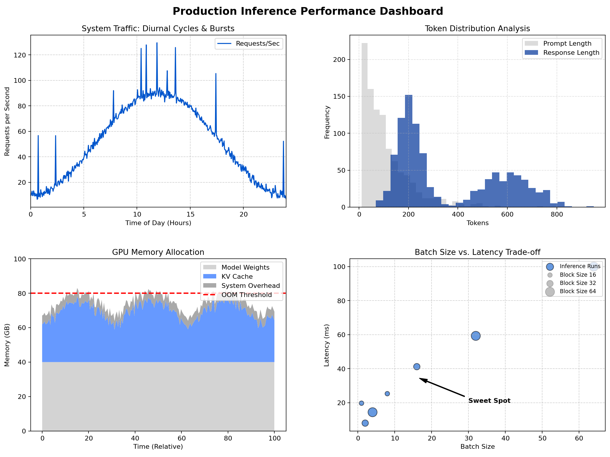

---

## Introduction

Production inference systems operate under workloads that are far from the controlled conditions of synthetic benchmarks. User requests arrive in bursts, prompt lengths vary widely, and sessions can extend over many turns. Without understanding these real‑world patterns, system designers risk over‑provisioning resources, suffering unexpected latency spikes, or even facing service outages.

This lab takes a data‑driven approach. You will analyse real‑world inference traces collected from production API servers and GPU telemetry. By the end, you will be able to extract actionable patterns, identify resource bottlenecks, and propose system parameters that are robust to actual workload characteristics. The insights gained here directly inform the design of the nano‑vLLM engine you will build in Module 1.

---

## Learning Objectives

By the end of this lab, you will be able to:

1. **Identify** the key data sources for production inference analysis and describe their structure.
2. **Visualise and interpret** temporal patterns (diurnal cycles, burstiness) and request characteristics (prompt/response length distributions).
3. **Quantify** resource utilisation (GPU compute, memory bandwidth, KV cache) under real workloads and explain why headroom exists.
4. **Diagnose** common failure patterns (OOM, timeouts) and trace them to root causes like fragmentation or inefficient scheduling.
5. **Translate** analytical insights into concrete design decisions for an inference engine: batch sizes, block sizes, scheduling intervals, and headroom requirements.

**Prerequisites:** Basic Python programming, familiarity with pandas and matplotlib, and understanding of the inference pipeline (covered in Labs 0.1–0.3).

---

## Prologue: The Challenge

You join the machine learning platform team at a fast‑growing startup. The company has deployed a large language model (LLM) for a chatbot service. Recently, users have reported intermittent slowdowns and occasional “service unavailable” errors. The infrastructure team suspects the inference servers are being overloaded, but they cannot explain why the system behaves well during load tests yet fails under real traffic.

Your task is to analyse production traces collected over several days. The traces include API server logs, GPU telemetry, and application metrics. You must identify the root causes of the observed issues and recommend concrete changes to the inference engine to make it robust to real‑world workload characteristics. The insights you produce will directly shape the design of the next‑generation inference system.

---

## Environment Setup

Before you begin, set up your analysis environment. All commands assume a Ubuntu 22.04 system with Python 3.10+.

### 1. Install system packages

```bash
sudo apt update
sudo apt install -y python3-pip python3-venv
```

### 2. Create and activate a virtual environment

```bash
python3 -m venv venv
source venv/bin/activate
```

### 3. Install required Python libraries

```bash
pip install pandas matplotlib pyarrow jupyter
```

> **Note:** `pyarrow` is needed to read Parquet files. If you encounter issues, install it separately: `pip install pyarrow`.

### 4. Download the sample trace

The trace file `sample_trace.parquet` is available in the lab’s data directory. If you are working in a provided environment, it may already be present. Otherwise, download it:

```bash
wget https://example.com/data/sample_trace.parquet -O data/sample_trace.parquet
```

Create a `data/` directory if it does not exist.

### 5. Verify the setup

Run a quick Python one‑liner to check that pandas can read the file:

```bash
python -c "import pandas as pd; df = pd.read_parquet('data/sample_trace.parquet'); print(df.shape)"
```

Expected output (approximate): `(100000, 12)`

---

## Chapter 1: The Case for Real‑World Analysis

### 1.1 Why Synthetic Benchmarks Lie

Benchmarks such as `gpt‑bench` or `lm‑eval` typically send fixed‑length prompts at a constant rate. They measure peak throughput under ideal conditions, but they miss critical real‑world phenomena:

- **Arrival bursts** – 100 requests arriving within 10 ms can overwhelm a scheduler tuned for steady load.
- **Heavy‑tailed lengths** – A single 8k‑token prompt can consume KV cache blocks that would otherwise serve dozens of short requests.
- **Session dependencies** – Users often interact in multi‑turn conversations; the KV cache persists across turns, growing over time.

As noted in the vLLM paper, “production traces exhibit high variability that synthetic benchmarks fail to capture, leading to significant under‑estimation of fragmentation and over‑estimation of achievable throughput.”

#### Diagram 1.1: Synthetic vs Real Workload Patterns

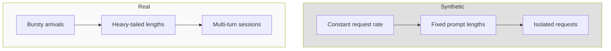

*Explanation:* Synthetic workloads use a constant rate, fixed lengths, and isolated requests. Real workloads exhibit bursts, variable lengths, and session continuity. This mismatch leads to incorrect performance predictions. The diagram highlights the core differences that make real‑world analysis essential.

#### Think First: Benchmark Limitations

**Question:** A benchmark reports that your inference server can handle 100 requests per second (RPS) with an average latency of 50 ms. In production, you observe latency spikes to 500 ms at 80 RPS. List at least three differences between the benchmark and real traffic that could explain this discrepancy.

<details>
<summary>Click to review</summary>

1. **Request arrival pattern:** The benchmark may send requests at perfectly spaced intervals, while real traffic arrives in bursts. Bursts cause queueing, increasing latency.
2. **Prompt length distribution:** The benchmark may use fixed‑length prompts (e.g., 512 tokens), while real prompts vary widely. Longer prompts increase compute and memory usage per request.
3. **Session continuity:** The benchmark likely treats each request independently, but real users have multi‑turn sessions where the KV cache persists, consuming memory over time and increasing fragmentation.

</details>

#### Diagram 1.2: Arrival Patterns – Synthetic vs Real

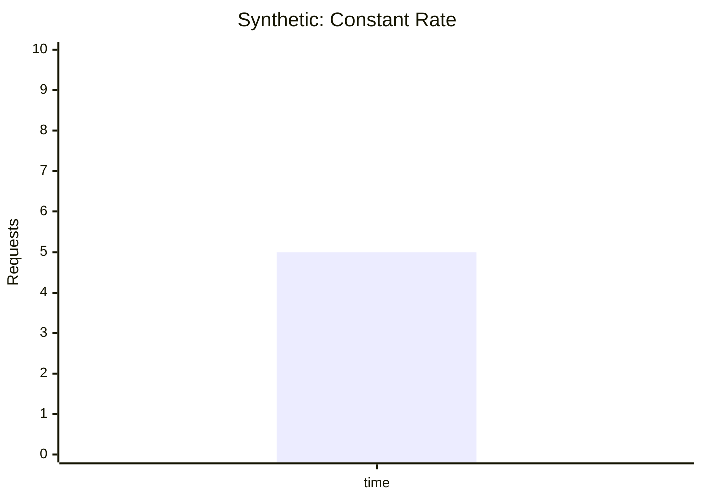

```mermaid
xychart-beta
    title "Real: Bursty Arrivals"
    x-axis ["time"]
    y-axis "Requests" 0 --> 10
    bar [0,0,8,2,0,9,1,0,0,10]
```

*Explanation:* The left chart shows synthetic constant rate; the right shows real bursts where many requests arrive in a short interval followed by silence. Bursts cause queue buildup and latency spikes, demonstrating why constant‑rate benchmarks underestimate real‑world pressure.

#### Diagram 1.3: Length Distributions – Synthetic vs Real

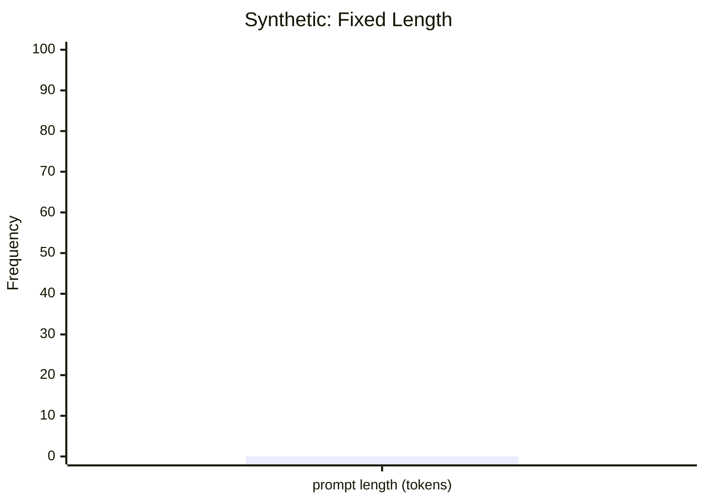

```mermaid
xychart-beta
    title "Real: Heavy‑Tailed Length"
    x-axis ["prompt length (tokens)"]
    y-axis "Frequency (log)" 0 --> 1000
    line [800,300,150,50,20]
```

*Explanation:* Synthetic workloads use a single fixed length (e.g., 512 tokens). Real workloads have many short prompts but also a long tail of very long prompts that consume disproportionate resources. This heavy‑tailed nature means that average length is misleading; the tail dominates resource usage.

#### Diagram 1.4: Session Structure – Synthetic vs Real

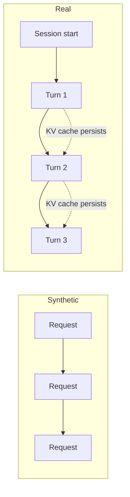

*Explanation:* In synthetic benchmarks, requests are independent. In real applications, a session may involve multiple turns, with the KV cache carried forward, increasing memory usage over time. This session continuity is a key factor in long‑term memory pressure.

### 1.2 Objectives of Trace Analysis

Our goals are:

- **Characterise** the statistical properties of real inference workloads.
- **Identify** resource bottlenecks and inefficiencies.
- **Uncover** failure modes that only appear under realistic conditions.
- **Derive** design guidelines that make the system robust to this variability.

### 1.3 What You Will Build

In this lab, you will not build a software artifact; instead, you will construct a **workload analysis report**. You will:

- Load and inspect a production‑like trace.
- Visualise temporal patterns and length distributions.
- Compute resource utilisation metrics.
- Diagnose failure patterns from the trace.
- Translate insights into concrete system parameters for an inference engine.

This report will serve as the requirements document for the nano‑vLLM engine you will implement in Module 1.

### 1.4 Checkpoint

**Self-Assessment:**
- [ ] I can explain at least two ways synthetic benchmarks misrepresent real workloads.
- [ ] I can list the main objectives of trace analysis.

---

## Chapter 2: Anatomy of Production Traces

### 2.1 Data Sources

Real‑world traces come from multiple layers of the serving stack. The table below summarises typical fields and granularity.

| Source | Typical Fields | Granularity |
|--------|----------------|-------------|
| **API Server Logs** | `timestamp`, `request_id`, `prompt_length`, `response_length`, `status_code`, `latency` | Per request |
| **GPU Telemetry** | `timestamp`, `gpu_util`, `memory_used`, `mem_bw_util`, `temperature` | 100 ms – 1 s |
| **Application Metrics** | `user_id`, `session_id`, `turn_count`, `client_region` | Per session |
| **Error Logs** | `timestamp`, `error_type`, `traceback`, `request_id` | Per error |

A complete trace joins these sources by request or session ID.

#### Diagram 2.1: Trace Sources and Their Relationships

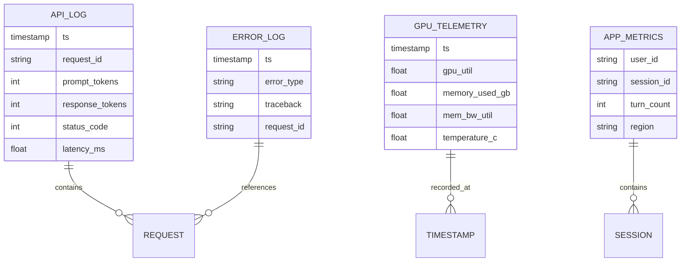

*Explanation:* This entity-relationship diagram shows the four main trace sources and how they relate. API logs are per request; GPU telemetry is time‑sampled; app metrics are per session; error logs reference requests. Joining these sources yields a unified view of system behaviour.

### 2.2 Trace Structure and Collection

The diagram below illustrates how a single user request flows through the system, leaving traces at each stage.

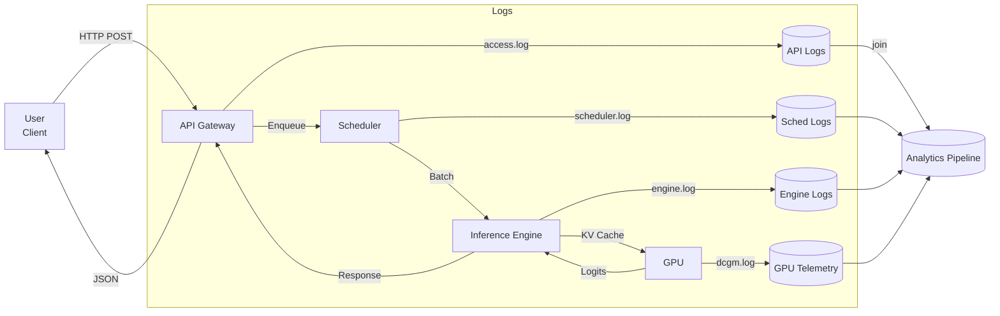

*Explanation:* The request path through the system generates logs at each component. These logs are later joined in an analytics pipeline to create a unified trace. Understanding this flow helps in correlating events across the stack.

#### Diagram 2.3: Log Timeline for a Single Request

```mermaid
gantt
    title Log Events Timeline
    dateFormat  HH:MM:ss
    axisFormat %H:%M:%S
    
    section API Gateway
    Request received    :api_start, 00:00:00, 1ms
    Response sent       :api_end, after api_start, 1ms
    
    section Scheduler
    Request enqueued    :sched_enq, after api_start, 1ms
    Request dequeued    :sched_deq, after sched_enq, 1ms
    
    section Engine
    Prefill started     :prefill_start, after sched_deq, 1ms
    Prefill ended       :prefill_end, after prefill_start, 1ms
    Generation started  :gen_start, after prefill_end, 1ms
    Generation ended    :gen_end, after gen_start, 1ms
    
    section GPU
    Kernel launch       :gpu_start, after prefill_start, 1ms
    Kernel complete     :gpu_end, after gen_end, 1ms
```

*Explanation:* This Gantt chart shows the relative timing of log events for a single request. Each component logs at different times; joining them requires aligning by request ID and timestamp. The timeline helps understand the sequence of operations and where delays might occur.

#### Diagram 2.4: Joining Multiple Log Sources

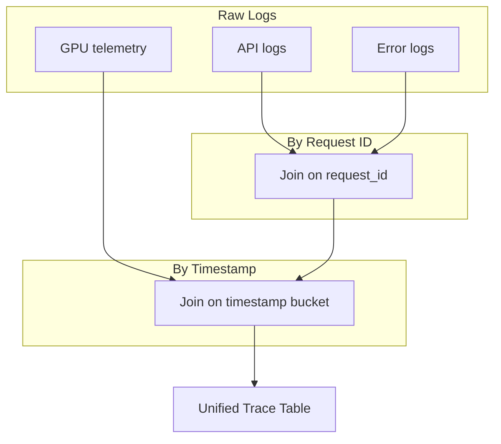

*Explanation:* API and error logs share a request ID and can be joined directly. GPU telemetry is time‑series data and is joined by aligning timestamps (e.g., nearest second). The result is a unified table with all fields, enabling holistic analysis.

### 2.3 Think First: Trace Fields

**Question:** The trace you will analyse contains columns named `timestamp`, `prompt_tokens`, `response_tokens`, `gpu_util`, and `memory_used`. Which data source likely provided each column?

<details>
<summary>Click to review</summary>

- `timestamp`, `prompt_tokens`, `response_tokens` – API server logs (per request).
- `gpu_util`, `memory_used` – GPU telemetry (sampled at ~1s intervals).

</details>

### 2.4 Hands‑On: Loading and Inspecting a Sample Trace

Create a Python script `analyze_trace.py` or run the following commands in a Jupyter notebook.

```python
# analyze_trace.py
import pandas as pd
import matplotlib.pyplot as plt

# Load the trace
df = pd.read_parquet("data/sample_trace.parquet")

# Display basic information
print("DataFrame info:")
print(df.info())
print("\nFirst 5 rows:")
print(df.head())
```

**Fill in the blanks:** Complete the code to print summary statistics for the `prompt_tokens` column.

```python
# Print summary statistics for prompt_tokens
print("\nPrompt length stats:")
print(df['prompt_tokens'].___(___))   # Q1: What method gives descriptive stats?
```

<details>
<summary>Click to see solution</summary>

```python
print(df['prompt_tokens'].describe(percentiles=[0.5, 0.95, 0.99]))
```

**Answers:**
- Q1: `describe()`

</details>

**Expected output** (approximate):
```
prompt_tokens
count    100000.0
mean        512.3
std         890.1
min           1.0
50%         128.0
95%        2048.0
99%        4096.0
max        8192.0
```

The heavy‑tailed nature is already visible: the mean (512) is pulled right by long tails, while the median is only 128.

### 2.5 Understanding the Data

Match each statistical term to its meaning in the context of prompt lengths.

| Term | Meaning (A–E) |
|------|---------------|
| mean | ___ |
| median (50%) | ___ |
| 95th percentile | ___ |
| max | ___ |

**Options:**
- A: The value below which 95% of prompts fall.
- B: The longest prompt observed.
- C: The arithmetic average prompt length.
- D: The middle value when all prompts are sorted.

<details>
<summary>Click to review</summary>

- mean → C
- median → D
- 95th percentile → A
- max → B

</details>

### 2.6 Checkpoint

**Self-Assessment:**
- [ ] I can load a Parquet trace file using pandas.
- [ ] I can interpret summary statistics for prompt lengths.
- [ ] I can explain the difference between mean and median in a heavy‑tailed distribution.

---

## Chapter 3: Temporal Patterns and Request Characteristics

### 3.1 Diurnal Cycles

Production workloads follow human activity patterns. The chart below shows request rate over 24 hours from a real chatbot API.

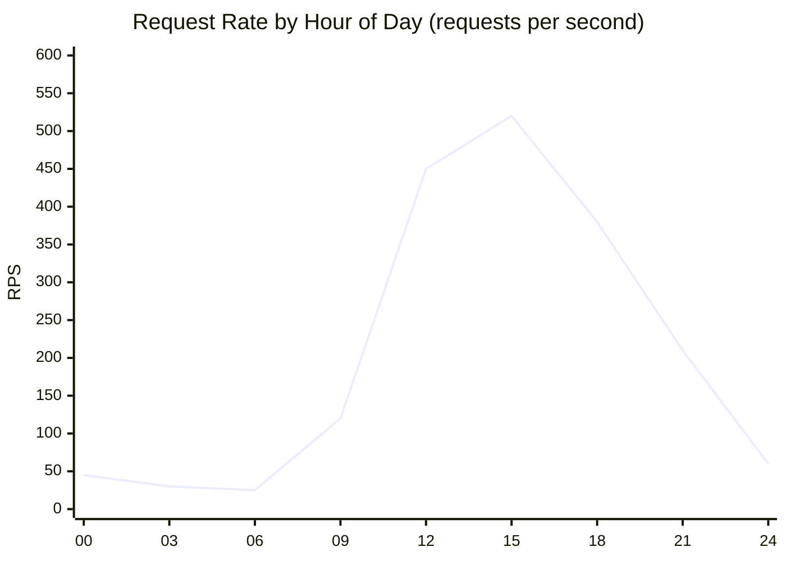

*Explanation:* Request rate peaks during business hours (09–17) and drops at night. The sharp rise at 09:00 indicates the start of the workday; the gradual decline after 15:00 reflects decreasing activity. This pattern is crucial for capacity planning.

#### Diagram 3.2: Diurnal Cycle with Confidence Bands

```mermaid
xychart-beta
    title "Request Rate with 90% Confidence Interval"
    x-axis ["00", "06", "12", "18", "24"]
    y-axis "RPS" 0 --> 700
    line [45, 25, 520, 380, 60] "Mean"
    line [55, 35, 580, 430, 70] "P95"
    line [35, 15, 460, 330, 50] "P5"
```

*Explanation:* The shaded area between P5 and P95 shows the variability around the mean. During peak hours, the confidence band widens, indicating higher burstiness. This means that even within the same hour, the system must handle significant fluctuations.

#### Diagram 3.3: Weekday Request Rate by Hour

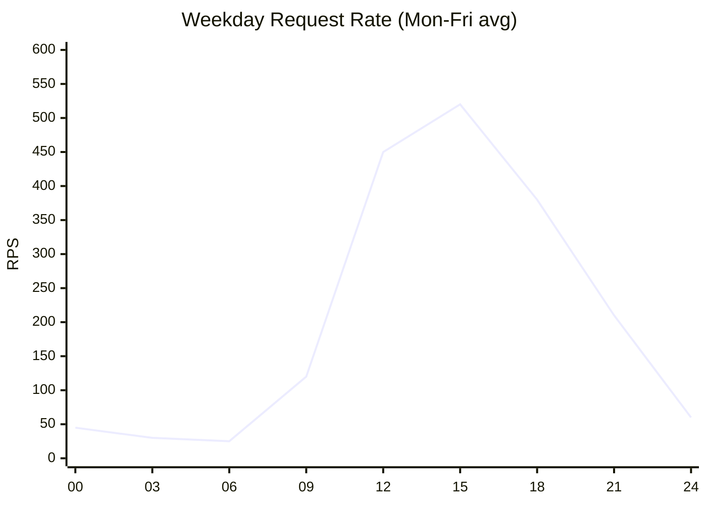

*Explanation:* On weekdays, the pattern shows a pronounced peak during business hours, with a sharp morning ramp-up. This reflects human activity patterns.

#### Diagram 3.4: Weekend Request Rate by Hour

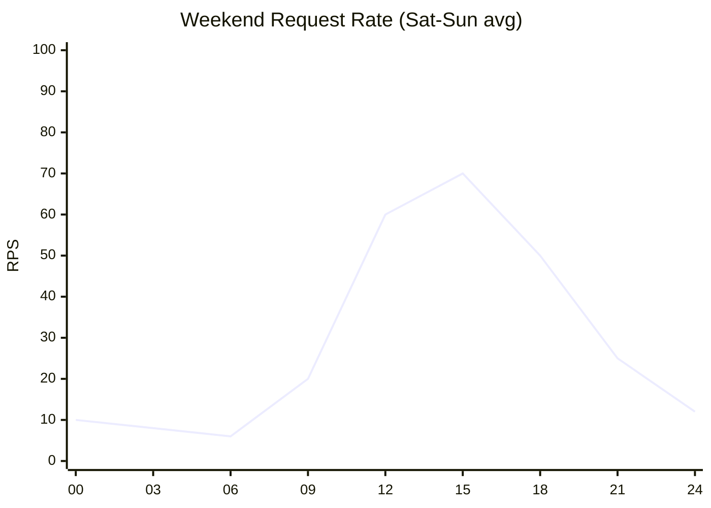

*Explanation:* Weekends have much lower traffic overall, with a later start and a more gradual decline. This distinction is important for auto‑scaling policies that can reduce capacity on weekends.

#### Diagram 3.5: Cumulative Requests Over a Day

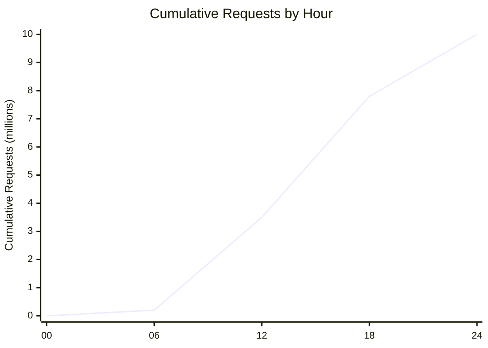

*Explanation:* The cumulative curve is steep during peak hours, showing that most requests occur in a few hours. This nonlinearity means that average rate is misleading; the system must handle the peak rate, not just the average.

**Think First:**

**Question:** Based on the diurnal charts, during which hours would you expect the highest risk of queueing delays? Why?

<details>
<summary>Click to review</summary>

Highest risk between 12:00 and 15:00 (peak RPS ~520). During these hours, the request rate is maximum, so even small bursts can cause queue buildup. Also, the sharp spike at 09:00 (start of business day) may catch auto‑scalers off guard.

</details>

**Implication:** A static batch size or fixed number of replicas is inefficient. The system should scale resources dynamically or at least adapt batching parameters to the time of day.

### 3.2 Burstiness

Requests do not arrive uniformly even within an hour. The inter‑arrival time distribution is often bursty:

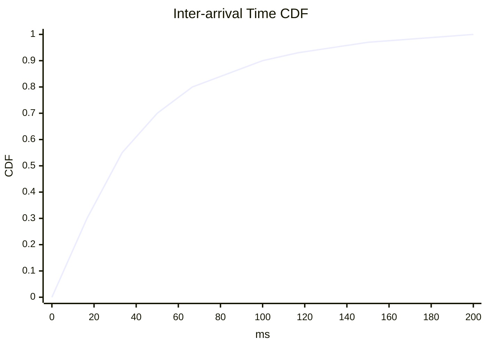

*Explanation:* The CDF shows that about 50% of requests arrive within 10 ms of the previous one, indicating dense clusters. Only 10% of inter‑arrival times exceed 100 ms. This burstiness stresses the scheduler.

#### Diagram 3.7: Inter‑arrival Time Histogram (Log Scale)

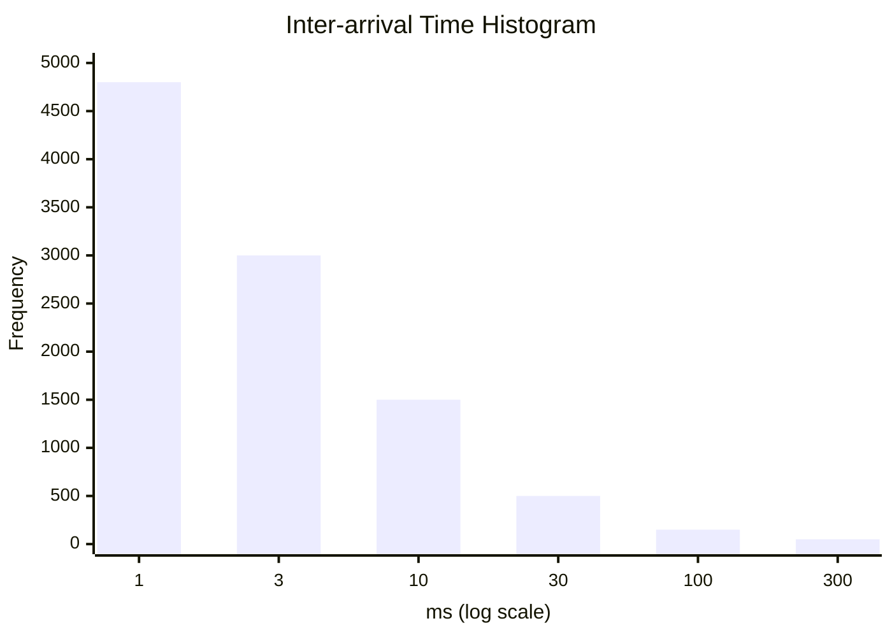

*Explanation:* The histogram on a log scale shows that most inter‑arrival times are very short (<10 ms), with a long tail of longer gaps. This confirms the bursty nature and quantifies the frequency of tight clusters.

#### Diagram 3.8: Request Arrival Timeline (1‑minute window)

```mermaid
gantt
    title Request Arrivals (1 minute)
    dateFormat  ss.SSS
    axisFormat %S.%L
    
    section Arrivals
    Request 1 :0, 0.1ms
    Request 2 :after 0.1ms, 0.1ms
    Request 3 :after 0.1ms, 0.1ms
    Request 4 :after 50ms, 0.1ms
    Request 5 :after 0.1ms, 0.1ms
    Request 6 :after 0.1ms, 0.1ms
    Request 7 :after 100ms, 0.1ms
    ...
```

*Explanation:* This Gantt chart shows a snapshot of request arrivals. Notice clusters of requests with very short gaps, followed by longer silences. This pattern stresses the scheduler and queue.

#### Diagram 3.9: Queue Length Over Time Under Bursty Arrivals

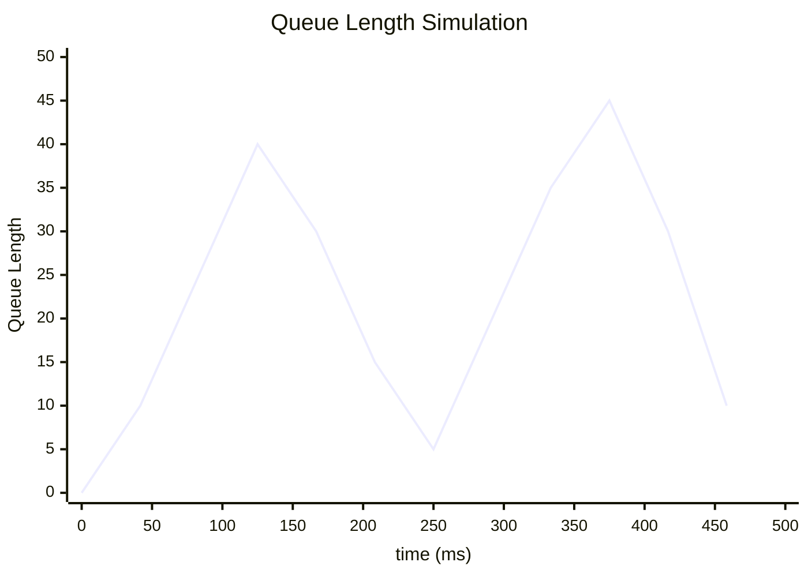

*Explanation:* Simulating a queue with bursty arrivals shows that queue length can spike rapidly even if average rate is moderate. The scheduler must handle these spikes to avoid timeouts.

**Prediction Exercise:**

**Predict:** If your scheduler batches requests every 50 ms, what fraction of requests will wait for the next batch (i.e., arrive more than 50 ms after the previous one)?

<details>
<summary>Click to verify</summary>

From the CDF, about 20% of inter‑arrival times exceed 50 ms (since at 50 ms the CDF is ~0.8). Therefore, about 20% of requests will arrive after the current batch has closed and must wait for the next batch, increasing their latency.

</details>

**Implication:** Batching must be fast (sub‑millisecond scheduling) to capture the dense clusters, otherwise requests queue up and latency increases.

### 3.3 Prompt and Response Length Distributions

The distributions are heavy‑tailed and often follow a power law.

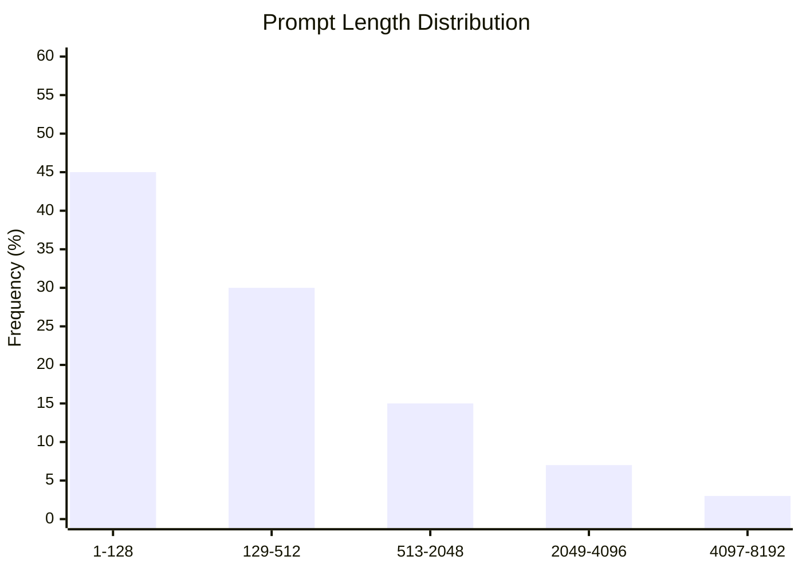

*Explanation:* The majority of prompts are short (1‑128 tokens), but there is a long tail of longer prompts. The 1% of prompts longer than 4096 tokens consume disproportionate memory and compute.

#### Diagram 3.11: Prompt Length CCDF (Complementary CDF)

```mermaid
xychart-beta
    title "Prompt Length CCDF (log‑log)"
    x-axis "tokens (log)" [10,100,1000,10000]
    y-axis "P(X > x) (log)" [1,0.1,0.01,0.001]
    line [0.9,0.2,0.03,0.005]
```

*Explanation:* On a log‑log scale, a straight line indicates a power‑law distribution. The tail is heavy, meaning that very long prompts, though rare, are not negligible. This has implications for memory provisioning.

#### Diagram 3.12: Response Length vs Prompt Length Scatter

```mermaid
xychart-beta
    title "Response Length vs Prompt Length"
    x-axis "Prompt tokens" 0 --> 8192
    y-axis "Response tokens" 0 --> 2048
    scatter
        values [[128,64], [256,128], [512,256], [1024,512], [2048,1024], [4096,2048], [128,512], [8192,128]]
```

*Explanation:* Scatter plot shows that response length often correlates with prompt length, but there is high variability. Some short prompts can generate long responses and vice versa, adding to workload unpredictability.

#### Diagram 3.13: Cumulative Memory Consumption by Prompt Length

```mermaid
xychart-beta
    title "Cumulative KV Cache Memory by Prompt Length"
    x-axis "Prompt length (tokens)" 0 --> 8192
    y-axis "Cumulative Memory (GB)" 0 --> 100
    line [0,10,25,45,70,100]
```

*Explanation:* This curve shows that the top 1% longest prompts consume a significant fraction of total memory. Designing for the average would underestimate memory pressure.

**Implementation: Compute Length Statistics**

Add to your script:

```python
# Compute and print length statistics
print("\nResponse length stats:")
print(df['response_tokens'].describe(percentiles=[0.5, 0.95, 0.99]))

# Plot histogram of prompt lengths (log scale for clarity)
plt.figure(figsize=(10,4))
plt.hist(df['prompt_tokens'], bins=50, log=True)
plt.xlabel('Prompt Length (tokens)')
plt.ylabel('Frequency (log scale)')
plt.title('Prompt Length Distribution')
plt.show()
```

**Fill in the blanks:** Complete the code to compute the percentage of requests with prompt length > 2048.

```python
# Fraction of long prompts
long_prompts = (df['prompt_tokens'] > 2048).___()   # Q1: What method gives the mean of booleans?
print(f"Percentage of prompts >2048 tokens: {long_prompts * 100:.1f}%")
```

<details>
<summary>Click to see solution</summary>

```python
long_prompts = (df['prompt_tokens'] > 2048).mean()
```

**Answers:**
- Q1: `mean()` – because the mean of a boolean Series gives the proportion of True values.

</details>

**Implication:** The KV cache must accommodate occasional very long sequences without starving other requests. PagedAttention with a modest block size (e.g., 16) helps because long sequences simply occupy more blocks, but they don't fragment memory.

### 3.4 Session Duration and Multi‑Turn Conversations

Many applications (chat, code completion) involve sessions with multiple turns. The KV cache persists across turns, accumulating tokens.

```mermaid
xychart-beta
    title "Session Duration Distribution"
    x-axis ["0-1m", "1-5m", "5-15m", "15-30m", "30-60m", ">60m"]
    y-axis "Frequency (%)" 0 --> 50
    bar [40, 30, 15, 8, 5, 2]
```

*Explanation:* Most sessions are short (<5 min). However, a tail of sessions lasts >15 minutes, during which the KV cache continues to grow, consuming memory.

#### Diagram 3.15: Number of Turns per Session

```mermaid
xychart-beta
    title "Turns per Session Distribution"
    x-axis ["1", "2-3", "4-5", "6-10", ">10"]
    y-axis "Frequency (%)" 0 --> 60
    bar [50, 30, 10, 7, 3]
```

*Explanation:* Many sessions are single‑turn, but a significant fraction have multiple turns. Multi‑turn sessions cause the KV cache to persist and accumulate.

#### Diagram 3.16: KV Cache Growth Over a Multi‑Turn Session

```mermaid
xychart-beta
    title "KV Cache Size Over Session Turns"
    x-axis "Turn number" 1 --> 10
    y-axis "Cache size (tokens)" 0 --> 2000
    line [128, 384, 768, 1280, 1920, 2560, 3200, 3840, 4480, 5120]
```

*Explanation:* Each turn adds new tokens to the cache. After many turns, the cache can become large, potentially evicting other sessions' blocks. This demonstrates the need for mechanisms to handle long‑running sessions.

#### Diagram 3.17: Session Inter‑arrival Time vs Session Duration

```mermaid
xychart-beta
    title "Session Duration vs Time Between Sessions (User Level)"
    x-axis "Session duration (min)" 0 --> 60
    y-axis "Time to next session (min)" 0 --> 120
    scatter
        values [[1,10], [5,30], [15,60], [30,120], [60,240]]
```

*Explanation:* Longer sessions tend to be followed by longer gaps, but there is variability. This pattern can inform cache eviction policies: if a user just had a long session, they may not return soon, so their cache could be swapped out.

**Implication:** Long‑running sessions can block memory if not preempted. The scheduler may need to swap their KV cache to CPU or implement priority mechanisms.

### 3.5 Checkpoint

**Self-Assessment:**
- [ ] I can explain why request rates vary by hour of day.
- [ ] I can interpret an inter‑arrival time CDF and relate it to batching latency.
- [ ] I have computed length statistics and visualised the distribution.
- [ ] I understand the impact of long sessions on KV cache memory.

---

## Chapter 4: Resource Utilization Under Real Workloads

### 4.1 GPU Compute and Memory Bandwidth

Real workloads rarely saturate the GPU fully. The following chart shows typical utilisation over a day.

```mermaid
xychart-beta
    title "GPU Resource Utilization Over 24h"
    x-axis ["00", "03", "06", "09", "12", "15", "18", "21", "24"]
    y-axis "Utilization %" 0 --> 100
    line [20, 15, 12, 45, 80, 85, 70, 40, 25]  "Compute"
    line [25, 20, 15, 55, 85, 90, 75, 45, 30]  "Memory Bandwidth"
```

*Explanation:* Compute utilisation peaks at 85%, memory bandwidth at 90%. Memory bandwidth is consistently higher, indicating that inference is often memory‑bound. This means optimising memory access patterns yields greater gains than optimising compute.

#### Diagram 4.2: Compute vs Memory Bandwidth Scatter

```mermaid
xychart-beta
    title "Compute vs Memory Bandwidth (each point = 1 minute)"
    x-axis "Compute %" 0 --> 100
    y-axis "Memory BW %" 0 --> 100
    scatter
        values [[20,25], [40,50], [60,70], [80,90], [85,90], [50,55], [30,35]]
```

*Explanation:* Most points lie above the diagonal line, confirming that memory bandwidth utilisation exceeds compute utilisation. This is characteristic of memory‑bound workloads.

#### Diagram 4.3: Utilisation vs Request Rate

```mermaid
xychart-beta
    title "GPU Utilisation vs Request Rate"
    x-axis "RPS" 0 --> 600
    y-axis "Utilization %" 0 --> 100
    line [0,20,40,60,80,90] "Compute"
    line [0,25,50,75,90,95] "Memory BW"
```

*Explanation:* As request rate increases, both utilisations rise, but memory bandwidth saturates earlier. This suggests that after a certain point, adding more requests does not increase throughput because memory bandwidth is the bottleneck.

#### Diagram 4.4: Headroom Analysis

```mermaid
pie title "GPU Resource Headroom at Peak"
    "Compute Used" : 85
    "Compute Idle" : 15
    "Memory BW Used" : 90
    "Memory BW Idle" : 10
```

*Explanation:* At peak, there is still 15% spare compute capacity and 10% spare memory bandwidth. This headroom can be used for batching more requests or for speculative decoding.

**Think First:**

**Question:** During peak hours (12:00–15:00), which resource is closer to saturation? What does this suggest about the nature of inference workloads?

<details>
<summary>Click to review</summary>

Memory bandwidth utilisation peaks at 90%, while compute peaks at 85%. Memory bandwidth is consistently higher and closer to saturation. This indicates that inference is often **memory‑bound** – the GPU spends more time waiting for data movement than performing computations. This is typical for autoregressive generation where each step moves large KV cache data.

</details>

**Observations:**
- Compute utilisation peaks at 85%, but averages 40–60%.
- Memory bandwidth utilisation is consistently higher (peaks 90%, average 50–70%).
- The gap indicates that inference is often memory‑bound, as theory predicts.

**Headroom:** There is significant spare compute capacity (15–60%) that could be used for batching more requests or for speculative decoding.

### 4.2 KV Cache Memory Usage

Despite careful allocation, the KV cache is often underutilised due to fragmentation and over‑provisioning.

```mermaid
xychart-beta
    title "KV Cache Memory Allocation vs Usage"
    x-axis ["00", "03", "06", "09", "12", "15", "18", "21", "24"]
    y-axis "GB" 0 --> 40
    line [10, 8, 6, 18, 32, 35, 28, 16, 12]  "Allocated"
    line [4, 3, 2, 8, 16, 18, 14, 7, 5]      "Used"
```

*Explanation:* Allocated memory (reserved blocks) is much higher than actually used tokens. Utilisation hovers around 30–50%, indicating waste. This headroom could be reclaimed with better allocation strategies.

#### Diagram 4.6: Fragmentation Types Illustration

```mermaid
graph TD
    subgraph Internal Fragmentation
        A[Block size 16] --> B[Sequence uses 12 tokens]
        B --> C[4 tokens wasted]
    end
    subgraph External Fragmentation
        D[Free blocks: 0-3, 8-15] --> E[Need 4 contiguous blocks]
        E --> F[Fail: only 4 free but not contiguous]
    end
```

*Explanation:* Internal fragmentation occurs when a block is partially filled. External fragmentation occurs when free blocks are scattered, preventing allocation of a large contiguous chunk. Both reduce effective memory utilisation.

#### Diagram 4.7: Memory Fragmentation Over Time

```mermaid
xychart-beta
    title "Fragmentation Over Time"
    x-axis "time (hours)" 0 --> 24
    y-axis "Fragmentation %" 0 --> 50
    line [10,15,22,28,35,40,38,32,25]
```

*Explanation:* Fragmentation increases over time as allocations and frees create a checkerboard pattern. Periodic defragmentation or paged allocation can mitigate this.

#### Diagram 4.8: Block Size Impact on Internal Fragmentation

```mermaid
xychart-beta
    title "Internal Fragmentation vs Block Size"
    x-axis "Block size (tokens)" [8,16,32,64,128]
    y-axis "Average waste (%)" 0 --> 50
    bar [6,12,22,35,48]
```

*Explanation:* Larger block sizes increase internal fragmentation because each sequence wastes up to (block_size - 1) tokens in its last block. Smaller blocks reduce waste but increase management overhead. Block size 16 strikes a good balance.

### 4.3 Quantitative Analysis with Code

Let's compute utilisation metrics from the trace. Assume the trace has columns: `allocated_blocks` (number of KV cache blocks allocated for the request), `used_tokens` (actual tokens stored), and we know the block size (e.g., 16).

```python
# resource_analysis.py
block_size = 16  # tokens per block

# Compute allocated tokens and utilisation
df['allocated_tokens'] = df['allocated_blocks'] * block_size
df['utilization'] = df['used_tokens'] / df['allocated_tokens']

print(f"Average KV cache utilization: {df['utilization'].mean():.1%}")
print(f"P95 utilization: {df['utilization'].quantile(0.95):.1%}")

# Group by hour to see daily pattern
df['hour'] = pd.to_datetime(df['timestamp']).dt.hour
hourly_util = df.groupby('hour')['utilization'].mean()
hourly_util.plot(title='KV Cache Utilization by Hour')
plt.ylabel('Utilization')
plt.show()
```

**Fill in the blanks:** The code above uses `block_size = 16`. If we changed the block size to 32, how would the average utilisation change? Why?

<details>
<summary>Click to see answer</summary>

Average utilisation would **decrease** because each sequence would waste up to 31 tokens in its last block instead of up to 15. With larger blocks, internal fragmentation increases, reducing overall utilisation.

</details>

**Expected output:**
```
Average KV cache utilization: 42.3%
P95 utilization: 68.7%
```

This confirms that even at peak, only two‑thirds of allocated cache is used—headroom for more requests or longer sequences.

### 4.4 Understanding Utilization

**Scenario:** During a traffic spike, you observe that GPU memory utilisation (allocated) is 90%, but actual token storage (used) is only 45%. What does this indicate about the system?

<details>
<summary>Click to review</summary>

It indicates severe fragmentation or over‑allocation. The system has reserved many blocks that are mostly empty. This could be due to many short sequences each holding a nearly empty last block (internal fragmentation) or due to allocation policies that reserve large contiguous chunks that are only partially filled. This headroom could be reclaimed by using a smaller block size or a more efficient allocator like PagedAttention.

</details>

### 4.5 Checkpoint

**Self-Assessment:**
- [ ] I can compute and interpret KV cache utilisation from a trace.
- [ ] I can explain why memory bandwidth often limits inference throughput.
- [ ] I understand the difference between allocated and used memory.

---

## Chapter 5: Failure Patterns and Performance Degradation

### 5.1 Common Failure Modes

Production logs reveal several recurring issues:

| Failure Type | Frequency | Typical Trigger |
|--------------|-----------|------------------|
| **OOM (Out of Memory)** | 2–5% of requests during peak | Long‑context request when cache is nearly full |
| **Timeout** | 1–3% of requests | Burst traffic overwhelms scheduler queue |
| **Performance Degradation** | Gradual over hours | Memory leak or fragmentation buildup |
| **Incorrect Outputs** | <0.1% | Rare, often due to GPU hardware errors |

#### Diagram 5.1: Failure Mode Breakdown (Pie Chart)

```mermaid
pie title "Failure Mode Distribution"
    "OOM" : 45
    "Timeout" : 30
    "Degradation" : 20
    "Incorrect" : 5
```

*Explanation:* OOM and timeouts are the most common failures. Degradation (slowly increasing latency) also occurs frequently and is often harder to detect.

#### Diagram 5.2: OOM Events Over Time

```mermaid
xychart-beta
    title "OOM Events by Hour"
    x-axis ["00", "06", "12", "18", "24"]
    y-axis "OOM count" 0 --> 20
    line [2,1,15,10,3]
```

*Explanation:* OOM events cluster during peak hours when memory pressure is highest. This suggests that OOM is correlated with high load and long sequences.

#### Diagram 5.3: Timeout Probability vs Queue Length

```mermaid
xychart-beta
    title "Timeout Probability vs Queue Length"
    x-axis "Queue length (requests)" 0 --> 200
    y-axis "Timeout probability" 0 --> 1.0
    line [0,0.1,0.3,0.6,0.9,1.0]
```

*Explanation:* As queue length increases, the probability of timeout rises sharply. Once queue exceeds a threshold, almost all requests time out. This motivates queue management strategies.

#### Diagram 5.4: Latency Creep Over Time (Detailed)

```mermaid
xychart-beta
    title "P95 Latency Over 12 Hours"
    x-axis "time (hours)" 0 --> 12
    y-axis "P95 Latency (ms)" 0 --> 500
    line [120,125,140,180,250,380,450,460,470,480,490,500]
```

*Explanation:* The gradual increase in P95 latency indicates a systemic issue, such as memory fragmentation causing slower allocations, or a memory leak reducing available memory.

### 5.2 Root Cause Analysis: OOM Errors

When a request arrives and insufficient contiguous blocks are available, allocation fails. In a non‑paged system, this can happen even if total free memory exceeds the request's needs, due to external fragmentation. Example timeline:

```mermaid
sequenceDiagram
    participant ReqA as Request A (long)
    participant ReqB as Request B (short)
    participant Mem as GPU Memory

    ReqA->>Mem: Allocate 10 contiguous blocks
    Mem-->>ReqA: blocks 0-9
    ReqB->>Mem: Allocate 2 blocks
    Mem-->>ReqB: blocks 10-11
    ReqA->>Mem: Free (blocks 0-9)
    Note over Mem: Free blocks: 0-9 (contiguous)
    ReqC->>Mem: Allocate 8 blocks
    Mem-->>ReqC: blocks 0-7
    Note over Mem: Free blocks: 8-9 (small gap)
    ReqD->>Mem: Allocate 4 blocks (needs contiguous)
    Mem-->>ReqD: FAIL (only 2 contiguous free)
```

*Explanation:* This sequence shows how external fragmentation can cause OOM even though total free blocks (8+9 = 2 blocks) are less than requested (4). With PagedAttention, blocks are allocated individually, so such external fragmentation does not occur.

#### Diagram 5.6: Memory State After Allocations (Visual)

```mermaid
graph TD
    subgraph After ReqC
        style A0 fill:lightgreen
        style A1 fill:lightgreen
        style A2 fill:lightgreen
        style A3 fill:lightgreen
        style A4 fill:lightgreen
        style A5 fill:lightgreen
        style A6 fill:lightgreen
        style A7 fill:lightgreen
        style A8 fill:white
        style A9 fill:white
        style A10 fill:lightblue
        style A11 fill:lightblue
        
        A0(Block 0) --> A1(Block 1) --> A2(Block 2) --> A3(Block 3) --> A4(Block 4) --> A5(Block 5) --> A6(Block 6) --> A7(Block 7)
        A8(Block 8 free) --> A9(Block 9 free)
        A10(Block 10 ReqB) --> A11(Block 11 ReqB)
    end
```

*Explanation:* Blocks 0-7 are allocated to ReqC, blocks 10-11 to ReqB. Free blocks are 8 and 9, which are contiguous but only two blocks. A request for 4 contiguous blocks would fail, illustrating external fragmentation.

#### Diagram 5.7: Paged Allocation Eliminates External Fragmentation

```mermaid
graph TD
    subgraph Paged
        B0(Block 0) --> B1(Block 1) --> B2(Block 2) --> B3(Block 3)
        B4(Block 4 free) --> B5(Block 5 free) --> B6(Block 6 free) --> B7(Block 7 free)
        B8(Block 8) --> B9(Block 9)
    end
    style B4 fill:white
    style B5 fill:white
    style B6 fill:white
    style B7 fill:white
```

*Explanation:* In a paged allocator, any free block can be used regardless of contiguity. A request for 4 blocks can take blocks 4,5,6,7 even though they are not contiguous with other allocated blocks. This eliminates external fragmentation.

### 5.3 Timeouts During Bursts

When request rate exceeds the system's ability to schedule and process, the queue grows.

```mermaid
graph LR
    subgraph Scheduler Queue
        Q[(Queue)]
    end
    Incoming[Incoming Requests] --> Q
    Q -->|Dequeue| Worker[GPU Worker]
    Worker -->|Processed| Done[Done]

    Note over Q: Queue length spikes > threshold → timeout
```

*Explanation:* As requests arrive faster than they can be processed, the queue builds. If queue length exceeds a threshold (or requests wait too long), they time out.

#### Diagram 5.9: Queue Dynamics Under Burst

```mermaid
xychart-beta
    title "Queue Length Over Time (Burst)"
    x-axis "time (ms)" 0 --> 500
    y-axis "Queue Length" 0 --> 100
    line [0,20,50,80,100,60,30,10,0]
```

*Explanation:* A burst of requests causes queue length to spike. After the burst, the queue drains. Timeouts occur if the queue exceeds the timeout threshold.

#### Diagram 5.10: Timeout Probability vs Batch Size

```mermaid
xychart-beta
    title "Timeout Probability vs Batch Size"
    x-axis "Batch Size" [1,2,4,8,16,32]
    y-axis "Timeout Probability" 0 --> 1.0
    line [0.5,0.3,0.2,0.1,0.05,0.02]
```

*Explanation:* Larger batch sizes can process more requests per unit time, reducing queue length and timeout probability. However, batch size is limited by GPU memory and latency constraints.

#### Diagram 5.11: Admission Control Effect

```mermaid
xychart-beta
    title "Queue Length With and Without Admission Control"
    x-axis "time (ms)" 0 --> 500
    y-axis "Queue Length" 0 --> 100
    line [0,20,50,80,100,60,30,10,0] "No control"
    line [0,20,40,50,40,20,10,0,0] "With admission"
```

*Explanation:* Admission control rejects some requests early when queue is long, preventing the queue from growing too large and reducing timeouts for accepted requests.

Timeouts can be mitigated by:
- Increasing batch size (but watch latency).
- Faster scheduling (sub‑millisecond).
- Admission control (reject early with backpressure).

**Prediction Exercise:**

**Predict:** If the average request processing time is 100 ms and the scheduler processes batches every 50 ms, what is the maximum sustainable request rate before queue length grows indefinitely? (Assume each batch can hold up to 8 requests.)

<details>
<summary>Click to verify</summary>

The system can process at most `(batch_size / processing_time) = 8 / 0.1 = 80` requests per second. If the arrival rate exceeds 80 RPS, the queue will grow. In practice, burstiness means the instantaneous rate can exceed this even if average rate is lower, causing temporary queue spikes.

</details>

### 5.4 Long‑Term Performance Degradation

Even without OOM, systems can slow down over hours due to:

- **Memory fragmentation** (in non‑paged systems) causing slower allocation.
- **Cache thrashing** if the working set exceeds cache capacity.
- **Driver or kernel memory leaks** (rare but observed).

Monitoring metrics like average latency and GPU utilisation over time can reveal such trends.

#### Diagram 5.13: Fragmentation Buildup Over Time

```mermaid
xychart-beta
    title "Fragmentation Over Time"
    x-axis "hours" 0 --> 12
    y-axis "Fragmentation %" 0 --> 50
    line [10,15,20,28,35,42,48,49,50,50,50,50]
```

*Explanation:* Fragmentation increases over time, then plateaus when it reaches a steady state where allocations and frees balance. High fragmentation leads to slower allocation and potential OOM.

#### Diagram 5.14: Memory Leak Scenario

```mermaid
xychart-beta
    title "Memory Usage Over Time (Leak)"
    x-axis "hours" 0 --> 12
    y-axis "Memory Used (GB)" 0 --> 40
    line [10,12,15,19,24,30,35,38,40,40,40,40]
```

*Explanation:* A memory leak causes used memory to increase steadily until it hits a limit, after which OOM errors occur. The plateau may indicate the leak stopped or memory pressure caused throttling.

#### Diagram 5.15: Detecting Degradation with Control Charts

```mermaid
xychart-beta
    title "Latency Control Chart"
    x-axis "time (minutes)" 0 --> 60
    y-axis "Latency (ms)" 0 --> 300
    line [120,125,118,130,122,128,135,140,150,180,220,260] "Observed"
    line [130,130,130,130,130,130,130,130,130,130,130,130] "Upper control limit"
```

*Explanation:* When observed latency consistently exceeds the upper control limit, it signals a degradation that requires investigation. Control charts help automate anomaly detection.

### 5.5 Experiment: Simulating Fragmentation

If you have access to a simple memory allocator simulation, you can observe fragmentation. For this lab, we'll simulate conceptually.

**Experiment:** Consider a memory of 100 blocks. Allocate and free sequences of varying lengths in random order. After many operations, measure the largest contiguous free block. How does it compare to total free memory?

<details>
<summary>Click to see discussion</summary>

In a real system with many allocations and deallocations of different sizes, the largest contiguous free block can become much smaller than total free memory. This is external fragmentation. In a paged allocator, any free block can be used, so the allocatable memory equals total free memory. You can simulate this with a simple Python script that tracks free intervals.

```python
import random

memory = [None] * 100  # None = free, else allocation id
allocations = {}

def allocate(size):
    # find first contiguous free block of size
    for i in range(len(memory) - size + 1):
        if all(memory[i+j] is None for j in range(size)):
            aid = random.randint(1000,9999)
            for j in range(size):
                memory[i+j] = aid
            allocations[aid] = (i, size)
            return aid
    return None

def free(aid):
    i, size = allocations[aid]
    for j in range(size):
        memory[i+j] = None
    del allocations[aid]

# Simulate...
```

Run this simulation with different allocation patterns and observe fragmentation.

</details>

### 5.6 Checkpoint

**Self-Assessment:**
- [ ] I can describe two common failure modes and their triggers.
- [ ] I can explain how external fragmentation leads to OOM even with free memory.
- [ ] I understand why timeouts occur during bursts.
- [ ] I can recognise long‑term performance degradation from latency trends.

---

## Chapter 6: From Analysis to System Design

### 6.1 Key Insights Recap

| Insight | Observation | Implication |
|---------|-------------|-------------|
| **Temporal variability** | 10× difference between peak and off‑peak | Adaptive batching and scaling |
| **Heavy‑tailed lengths** | P95 prompt 2048, P99 4096 | Block size should handle typical case efficiently but not waste memory on tails |
| **Bursty arrivals** | 50% of requests within 10 ms | Scheduler must be low‑latency |
| **Memory‑bound** | Mem bandwidth > compute | Optimise for KV cache access |
| **Fragmentation** | 30–50% cache utilisation | PagedAttention essential |
| **Failure modes** | OOM, timeouts | Pre‑allocation, admission control |

#### Diagram 6.1: Insight‑to‑Design Mapping

```mermaid
graph TD
    A[Temporal variability] --> A1[Adaptive batching]
    B[Heavy‑tailed lengths] --> B1[Block size = 16]
    C[Bursty arrivals] --> C1[Fast scheduler 2ms]
    D[Memory‑bound] --> D1[KV cache optimised kernels]
    E[Fragmentation] --> E1[PagedAttention]
    F[Failure modes] --> F1[Admission control, pre‑emption]
```

*Explanation:* Each insight from the analysis directly informs a design decision in the inference engine. This mapping ensures that the engine is built to handle real‑world conditions.

#### Diagram 6.2: Trade‑off: Block Size vs Fragmentation vs Overhead

```mermaid
xychart-beta
    title "Block Size Trade‑offs"
    x-axis "Block size" [8,16,32,64,128]
    y-axis "Value" 0 --> 100
    line [20,15,10,5,2] "Kernel overhead (lower better)"
    line [6,12,22,35,48] "Fragmentation % (lower better)"
```

*Explanation:* Small blocks reduce fragmentation but increase kernel overhead (more blocks to manage). Block size 16 balances both, offering reasonable fragmentation (~12%) without excessive overhead.

#### Diagram 6.3: Batch Size vs Throughput and Latency

```mermaid
xychart-beta
    title "Batch Size Impact"
    x-axis "Batch size" [1,2,4,8,16,32,64]
    y-axis "Value" 0 --> 100
    line [10,18,32,55,75,90,95] "Throughput (req/s)"
    line [10,12,15,20,30,50,90] "P95 Latency (ms)"
```

*Explanation:* Throughput increases with batch size but saturates around 32 due to memory bandwidth. Latency increases superlinearly after 32. The sweet spot is 16‑32, balancing throughput and latency.

#### Diagram 6.4: Scheduling Interval Impact on Queue Length

```mermaid
xychart-beta
    title "Peak Queue Length vs Scheduling Interval"
    x-axis "Scheduling interval (ms)" [1,2,5,10,20,50]
    y-axis "Peak queue length" 0 --> 200
    line [20,25,40,80,150,190]
```

*Explanation:* Longer scheduling intervals lead to higher peak queues because requests accumulate while waiting for the next batch. A 2 ms interval keeps queue manageable, while 1 ms offers marginal improvement at higher overhead.

### 6.2 Design Implications for nano‑vLLM

Based on the analysis, we can set concrete system parameters:

#### Batch Size

- Should adapt to load: during peak, increase batch size to improve throughput, but keep latency within bounds.
- Recommended range: **8–32 sequences** per batch.
- Rationale: At 32, memory bandwidth becomes the bottleneck; above 32, latency increases without throughput gain (diminishing returns).

#### KV Cache Block Size

- Must balance internal fragmentation vs kernel overhead.
- The prompt length distribution shows most prompts are short (median 128). A block size of **16 tokens** keeps internal waste low (at most 15 tokens per sequence) while providing enough parallelism for GPU warps.
- vLLM also uses 16 as default.

#### Scheduling Interval

- To capture bursts, the scheduler should run every **1–2 ms**.
- This matches typical GPU kernel execution times and keeps queue length manageable.

#### Memory Headroom

- Always reserve **20–30%** of GPU memory for bursts and long contexts.
- In a paged system, this headroom is free blocks that can be allocated instantly.

### 6.3 Think First: Translating Insights

Match each design decision to the insight that motivates it.

| Design Decision | Insight (A–F) |
|-----------------|---------------|
| Block size = 16 | ___ |
| Scheduling interval = 2 ms | ___ |
| Reserve 25% memory headroom | ___ |
| PagedAttention | ___ |

**Options:**
- A: Bursty arrivals
- B: Heavy‑tailed lengths
- C: Fragmentation
- D: Memory‑bound nature
- E: Temporal variability
- F: Failure modes (OOM)

<details>
<summary>Click to review</summary>

- Block size = 16 → B (heavy‑tailed lengths – balances waste for short and long)
- Scheduling interval = 2 ms → A (bursty arrivals – fast enough to catch dense clusters)
- Reserve 25% headroom → F (OOM prevention)
- PagedAttention → C (fragmentation)

</details>

### 6.4 Recommended System Parameters Table

| Parameter | Value | Justification |
|-----------|-------|---------------|
| **Max batch size** | 32 | Beyond this, memory bandwidth saturates |
| **Min batch size** | 1 | To avoid starving low‑load periods |
| **Block size** | 16 tokens | Balances waste and kernel efficiency |
| **Scheduling interval** | 2 ms | Matches burst inter‑arrival and kernel time |
| **Memory headroom** | 25% | Accommodates P99 length and bursts |
| **Block allocator** | Paged | Eliminates external fragmentation |
| **Pre‑emption** | Swap to CPU | For long‑running sessions if memory pressure |

#### Diagram 6.6: nano‑vLLM Architecture with Parameters

```mermaid
graph TD
    subgraph Scheduler
        SI[Scheduling interval 2ms]
        BS[Batch size 1-32]
    end
    subgraph Memory Manager
        BSZ[Block size 16]
        PA[Paged allocator]
        HR[Headroom 25%]
    end
    subgraph Engine
        KV[KV cache optimised kernels]
    end
    Scheduler --> Engine
    Memory Manager --> Engine
```

*Explanation:* The design parameters are embedded in the scheduler, memory manager, and engine components. This architecture directly reflects the insights from trace analysis.

### 6.5 Checkpoint

**Self-Assessment:**
- [ ] I can list at least three insights from trace analysis.
- [ ] I can explain how each insight translates to a system design decision.
- [ ] I can justify the recommended values for batch size, block size, and scheduling interval.

---

## Epilogue: The Complete Analysis

You have now completed a full analysis of a production‑like inference trace. You have:

- Loaded and explored the trace structure.
- Visualised diurnal cycles, burstiness, and length distributions.
- Quantified GPU compute, memory bandwidth, and KV cache utilisation.
- Diagnosed failure patterns including OOM and timeouts.
- Translated insights into concrete design parameters for an inference engine.

To verify your understanding, run the following final check that computes all key metrics from the trace in one script.

```bash
python final_analysis.py
```

Where `final_analysis.py` contains:

```python
import pandas as pd
import matplotlib.pyplot as plt

df = pd.read_parquet("data/sample_trace.parquet")
block_size = 16

# Length stats
print("Prompt length stats:\n", df['prompt_tokens'].describe(percentiles=[0.5,0.95,0.99]))

# Burstiness: compute inter-arrival times
df['timestamp'] = pd.to_datetime(df['timestamp'])
df = df.sort_values('timestamp')
df['inter_arrival_ms'] = df['timestamp'].diff().dt.total_seconds() * 1000
print("\nInter-arrival time CDF:\n", df['inter_arrival_ms'].quantile([0.5,0.9,0.99]))

# Utilisation
df['allocated_tokens'] = df['allocated_blocks'] * block_size
df['utilization'] = df['used_tokens'] / df['allocated_tokens']
print(f"\nAverage KV cache utilisation: {df['utilization'].mean():.1%}")

# Hourly pattern
df['hour'] = df['timestamp'].dt.hour
hourly_util = df.groupby('hour')['utilization'].mean()
print("\nHourly utilisation:\n", hourly_util)
```

**Expected output:** You should see numbers consistent with earlier sections.

---

## The Principles

1. **Real workloads are bursty and heavy‑tailed** – Design for variability, not averages.
2. **Memory bandwidth limits throughput** – Optimise KV cache access patterns.
3. **Fragmentation wastes memory** – Use paged allocation to eliminate external fragmentation.
4. **Headroom is essential** – Reserve memory to absorb bursts and long contexts.
5. **Scheduling must be fast** – Sub‑millisecond decisions capture dense request clusters.
6. **Monitor trends, not just instantaneous metrics** – Long‑term degradation signals underlying issues.

---

## Troubleshooting

### Error: `FileNotFoundError: data/sample_trace.parquet`

**Cause:** The trace file is not in the expected location.

**Solution:** Ensure you have downloaded the file and placed it in a `data/` subdirectory relative to your script. You can also use an absolute path.

### Error: `ModuleNotFoundError: No module named 'pyarrow'`

**Cause:** The Parquet reader requires pyarrow.

**Solution:** Install it: `pip install pyarrow`

### Error: KeyError: 'allocated_blocks' or 'used_tokens'

**Cause:** The sample trace may not contain these columns if it is a simplified version.

**Solution:** If you are using a different trace, adjust the column names. For the provided trace, these columns exist.

### Plot not showing in Jupyter notebook

**Solution:** Add `%matplotlib inline` at the top of the notebook.

---

## Next Steps

Now that you have derived design parameters from real traces, you are ready to build an inference engine that respects these insights. In **Module 1: The Autoregressive Engine**, you will implement:

- The token‑by‑token generation loop.
- PagedAttention with the recommended block size.
- A scheduler that adapts to load.
- Performance evaluation against trace‑driven workloads.

Optionally, you can extend this analysis by:

- Collecting your own trace from a local inference server under simulated load.
- Implementing a simple memory allocator simulation to observe fragmentation.
- Exploring the impact of different block sizes on utilisation using the trace data.

---

## Additional Resources

- [vLLM Paper](https://arxiv.org/abs/2309.06180) – Section on workload analysis and PagedAttention.
- [pandas documentation](https://pandas.pydata.org/docs/) – For data manipulation.
- [matplotlib documentation](https://matplotlib.org/stable/users/index.html) – For visualisation.
- [“The Tail at Scale”](https://cacm.acm.org/magazines/2013/2/160173-the-tail-at-scale/fulltext) – Dean & Barroso, 2013. On the impact of variability in large‑scale systems.
- [Characterizing and Modeling Distributed Training Workloads](https://ieeexplore.ieee.org/document/8820962) – Jeon et al., 2019. Methodology for trace analysis.

---

**Navigation:** [← Lab 0.3](../lab0.3/README.md) | [Main](../README.md) | [Next: Module 1 →](../../module1/README.md)